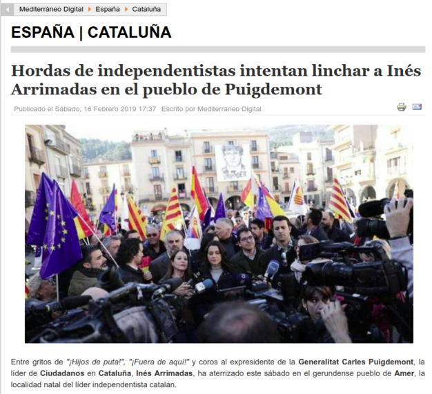

---
title:  'Acción Pública y Cambio Social'
author:
- name: Juan Muñoz
  affiliation: Universitat Autònoma de Barcelona
tags: [Conductas colectivas]
tema: "Concepto y campos de estudio"
url: "http:/juan.psicologiasocial.eu"
bibliography: diapos.bib
csl: apa.csl
lateral-menu: 'True'
...

# Elementos de definición {.center data-background="imagenes-APCS-1/Concept.png" data-background-transition=zoom data-state=opacidad}

## Colectivos

>Una agrupación o grupo de individuos relativamente grande que muestran similitudes en acciones y perspectivas (actitudes, opiniones).\
@forsyth_group_2010 [p, 503]

::: notes
- No necesita estar en un mismo espacio, sino que lo que lo caracteriza es en responder a algo de una forma similar.
- En cuanto a la uniformidad, aunque podemos apreciar cierta similitud en la conducta, eso no significa que no existan también diferencias entre los miembros.
- También se suele utilizar como elemento de definición la falta de estructura, lo cual no es sinónimo de caos o desorden, sino que son agrupaciones sin una organización formal.
:::

## Comportamiento colectivo
> Las acciones de un grupo de personas que responden de manera similar a un evento o situación, incluyendo personas que ocupan el mismo lugar (una multitud), así como fenómenos de masas en los que los individuos están dispersos en una amplia área (Movimientos colectivos).\
@forsyth_group_2010 [, p. 502]

## Elementos de la definición

::: nonincremental
- Tamaño
- Espacio
- Uniformidad
- Estructura
- Duración
:::

## Clasificación{#clasificacion .medio}

Multitud ocasional (casual)
: temporal, poco organizada, y mínima emocionalidad. Si comparten algún interés este es menor y temporal.

Multitud convencional
: tiene un propósito específico y sigue las normas de conducta. Hay poca interacción entre sus miembros.

Multitudes expresivas
: no tienen un propósito significativo o a largo plazo más allá del de dar rienda suelta a las emociones.

Multitudes activas
: realizan alguna acción hacia un objetivo. Se concentra intensamente en algún objetivo y se involucra en un comportamiento activo para lograrlo.

#### @blumer_collective_1939 {.autor}

## Clasificación (Forsyth, 2010) {#clasificacion-forsyth}

{height="600px" .noshadow}

::: notes
- Callejeras: Se forman en lugares públicos y están compuestas por personas que suelen ser desconocidas entre sí (aunque también puede haber grupos de conocidos). Las caracteriza el hecho de compartir una misma experiencia.
- Audiencia: (Convencional de Blumer) Una reunión de espectadores que observan alguna actuación, evento o actividad. La diferencia con el anterior es que no es una reunión casual, sino que todos tienen el mismo objetivo, es una actuación deliberada.
- Cola: Una línea, fila o conjunto de personas que están esperando algún servicio, producto u oportunidad. Al igual que la audiencia es una reunión deliberada y también está regida por normas sociales.
- Masa (Mob): (Que actúa Blumer) Una muchedumbre desordenada, emocionalmente cargada; las multitudes tienden a formarse cuando algún evento, como un crimen, una catástrofe o una acción polémica, evoca el mismo tipo de afecto y acción en un número sustancial de personas.
- Movimiento colectivo:: Una gran agregación de individuos, ampliamente dispersos en el espacio y el tiempo, que se esfuerzan por alcanzar objetivos, intereses o aspiraciones comunes o que reaccionan de formas similares y a menudo atípicas.
- Modas pasajeras: son cambios inesperados y de corta duración en las opiniones, actitudes o formas de vida de un gran número de personas (dispersas en el espacio).
- Manías (crazes): son similares pero más irracionales (costosas y extendidas).
- Rumor: Los rumores proporcionan a las personas un medio para intercambiar información sobre situaciones amenazantes y, en muchos casos, tienen un efecto tranquilizante en grupos y comunidades.
- Ilusiones/delirios de masa (mass delusion): El brote espontáneo de pensamientos atípicos, sentimientos o acciones en un grupo o agregado, alucinaciones comunes y acciones extrañas.
- Psychogenic illness: Un conjunto de síntomas de enfermedad en un grupo de personas cuando no hay evidencia de una base orgánica para la enfermedad y ninguna causa ambiental identificable.
- Movimiento social: Un movimiento colectivo que hace un intento deliberado y organizado para lograr un cambio o resistir un cambio en un sistema social.
:::

<!--
## Conducta colectiva
> [definimos] la conducta colectiva como una acción voluntaria, dirigida a una meta, que se produce en una situación relativamente desorganizada, en la que las normas y valores predominantes de la sociedad dejan de actuar sobre la conducta individual. La conducta colectiva consiste en la reacción de un grupo a alguna situación.\
@appelbaum_sociology:_1997 [, p. 422]
-->

<!--
## Son un fenómeno... {#son data-state=opacidad}
- Colectivo
- Unitario
- Sin organización
- Transitorio
- Indiferenciado
- Anómico
-->

## Concepto paraguas {data-background="imagenes-APCS-1/Umbrella.jpg" data-background-transition=zoom data-state=opacidad}

#### Fenómenos que caen fuera de la estructura social u orden establecido {.fondoblanco}

::: notes
Generalmente, se las ha caracterizado como aquellas conductas sociales que "caen fuera de lo habitual", en las que no rigen las convenciones sociales habituales y en las que las personas, de una forma colectiva, se alejan o incluso subvierten las estructuras institucionales#. (Turner, 2000, p. 348)

Son situaciones en las que si existe algún tipo de norma conductual son emergentes y efímeras, y en las que podemos definir las conductas que se realizan como “extraordinarias”, en el sentido de que su ocurrencia nos indica que “algo está pasando” (Snow & Paulsen, 2000, p. 554)

Es decir, podemos plantear a las "conductas colectivas" como un "concepto paraguas" que se utiliza para referirse a todo aquello que cae fuera de lo habitual, que es extraordinario.
:::

##

##

##

##

##

##

##

##

##

{target="_blank"}

<!--
## Mapa conceptual {data-state=img-completa}

-->

<!--
## Movimientos sociales
>Una **colectividad** que actúa con cierta **continuidad** para **promover un cambio** en la sociedad o grupo de la que forma parte.\
[Turner & Killian, 1987 en @miller_introduction_2013, p. 469]
-->

# Los inicios { .center}

## Primavera de los pueblos

{target="_blank"}

::: notes
Durante el siglo XVIII se inicia en Inglaterra la Revolución Industrial, que supone uno de los momentos históricos que según algunos da origen a la era de las masas, debido a los cambios que se producen en la sociedad: de una sociedad rural con una rígida división social entre clases, la fuerte migración a las ciudades da lugar a la aparición de nuevas clases sociales (industriales y comerciantes). Se producen también cambios en las formas de conflicto; se pasa de conflictos y protestas por las necesidades cotidianas a conflictos y protestas de tipo ideológico. Las masas empiezan a tener posturas políticas y quieren tomar parte en las decisiones.

Por otra parte, durante el S. XIX se producen toda una serie de insurrecciones populares. Sobre todo en 1848 se producen en prácticamente toda Europa lo que se conoce como "La primavera de los pueblos".
:::

## {data-background="imagenes-APCS-1/ComunaBarricadas.jpg" data-background-transition=fade data-state=fondo}

. . .

:::::: {.columns}
::: {.column width="50%"}

:::
::: {.column width="50%"}

:::
::::::

::: notes
Por ejemplo, en Francia, en 1848 (22 a 25 de febrero), la revolución que pone fin al reinado de Luis Felipe de Orleans y proclama la II República.

O, en junio (23 a 26) de ese mismo año la revuelta protagonizada por miles de trabajadores que termina con la muerte de unos 4000 (de los aproximadamente 100000 obreros amotinados) a manos de la Guardia Nacional.
:::

## La comuna {data-background="imagenes-APCS-1/ComunaBarricadas.jpg" data-background-transition=fade data-state=fondo}

:::::: {.columns}
::: {.column width=Ç"50%"}

:::
::: {.column width=Ç"50%"}

:::
::::::

<audio width="100"  class="stretch"  controls data-autoplay>
<source src="multimedia/ElTempsDeLesCireres.mp3">
</audio>

#### @gine_temps_1978 {.autor}

<!-- `El temps de les cireres`{.autor} -->

::: notes
Y, sobre todo, del 18 de marzo al 28 de mayo de 1871, nos encontramos con la Comuna de París, que durante unos meses instauró un gobierno alternativo promulgando toda una serie de leyes progresistas y que terminó tras la “semana sangrienta” (21 a 28 de mayo# durante la que murieron unas 30000 personas en el asalto por parte del ejército del gobierno presidido por Adolphe Thiers.

  En suma, podemos decir (…) que la psicología colectiva, que surgió a finales del siglo pasado [S. XIX], no era sino la consecuencia natural de los acontecimientos históricos, sociales, políticos y económicos de los dos siglos anteriores; ello, unido, obviamente, al surgimiento de la psicología, por un lado, y al de las ciencias sociales por otro, cosas ambas que tuvieron lugar a lo largo de la segundo mitad del siglo XIX. (Ovejero, 1997, p. 16)

:::

## Preguntas

* ¿Quiénes eran los participantes en las acciones de masas?
* ¿Cómo se explicaba que ciudadanos habitualmente respetuosos de las leyes se involucren en actos perturbadores del orden social?
* ¿Cómo se podían prevenir las explosiones violentas de las masas cuando se dan las condiciones para que éstas actúen colectivamente?

## Respuestas: Los fenómenos de masas... {#respuestas}

* Son amenazas para el orden social
* Son manifestaciones patológicas de la naturaleza humana
* Son irracionales

##
> Los senadores son todos hombres de bien, el Senado romano es una mala bestia.\
[Citado por @moscovici_era_1985, p. 26]

. . .

Es decir,

> considerado aisladamente, cada uno de nosotros es en definitiva razonable; juntos, en una multitud, con ocasión de una reunión política e incluso en el seno de un grupo de amigos, estamos todos dispuestos a cometer las mayores locuras.\
[@moscovici_era_1985, p. 26]

# Referencias {.center}

## {.scrollable}
