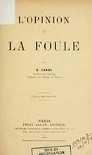

---
title:  'Acción Pública y Cambio Social'
author:
- name: Juan Muñoz
  affiliation: Universitat Autònoma de Barcelona
tags: [Conductas colectivas]
tema: "Concepto y campos de estudio. Teorías irracionalistas"
url: "http:/juan.psicologiasocial.eu"
bibliography: diapos.bib
csl: apa.csl
lateral-menu: 'True'
...

# Elementos de definición {.center data-background="imagenes-APCS-1/Concept.png" data-background-transition=zoom data-state=opacidad}

<!-- ## Colectivos

>Una agrupación o grupo de individuos relativamente grande que muestran similitudes en acciones y perspectivas (actitudes, opiniones).\
@forsyth-Groupdynamics-2010 [p, 503]

::: notes
- No necesita estar en un mismo espacio, sino que lo que lo caracteriza es en responder a algo de una forma similar.
- En cuanto a la uniformidad, aunque podemos apreciar cierta similitud en la conducta, eso no significa que no existan también diferencias entre los miembros.
- También se suele utilizar como elemento de definición la falta de estructura, lo cual no es sinónimo de caos o desorden, sino que son agrupaciones sin una organización formal.
::: -->

## Comportamiento colectivo
> Las acciones de un grupo de personas que responden de manera similar a un evento o situación, incluyendo personas que ocupan el mismo lugar (una multitud), así como fenómenos de masas en los que los individuos están dispersos en una amplia área (Movimientos colectivos).\
@forsyth-Groupdynamics-2010 [, p. 502]

## Elementos de la definición

::: nonincremental
- Tamaño
- Espacio
- Uniformidad
- Estructura
- Duración
:::

## Clasificación{#clasificacion .medio}

Multitud ocasional (casual)
: temporal, poco organizada, y mínima emocionalidad. Si comparten algún interés este es menor y temporal.

Multitud convencional
: tiene un propósito específico y sigue las normas de conducta. Hay poca interacción entre sus miembros.

Multitudes expresivas
: no tienen un propósito significativo o a largo plazo más allá del de dar rienda suelta a las emociones.

Multitudes activas
: realizan alguna acción hacia un objetivo. Se concentra intensamente en algún objetivo y se involucra en un comportamiento activo para lograrlo.

#### @blumer-CollectiveBehavior-1939 {.autor}

## Clasificación (Forsyth, 2010) {#clasificacion-forsyth}

{height="600px" .noshadow}

::: notes
- Callejeras: Se forman en lugares públicos y están compuestas por personas que suelen ser desconocidas entre sí (aunque también puede haber grupos de conocidos). Las caracteriza el hecho de compartir una misma experiencia.
- Audiencia: (Convencional de Blumer) Una reunión de espectadores que observan alguna actuación, evento o actividad. La diferencia con el anterior es que no es una reunión casual, sino que todos tienen el mismo objetivo, es una actuación deliberada.
- Cola: Una línea, fila o conjunto de personas que están esperando algún servicio, producto u oportunidad. Al igual que la audiencia es una reunión deliberada y también está regida por normas sociales.
- Masa (Mob): (Que actúa Blumer) Una muchedumbre desordenada, emocionalmente cargada; las multitudes tienden a formarse cuando algún evento, como un crimen, una catástrofe o una acción polémica, evoca el mismo tipo de afecto y acción en un número sustancial de personas.
- Movimiento colectivo:: Una gran agregación de individuos, ampliamente dispersos en el espacio y el tiempo, que se esfuerzan por alcanzar objetivos, intereses o aspiraciones comunes o que reaccionan de formas similares y a menudo atípicas.
- Modas pasajeras: son cambios inesperados y de corta duración en las opiniones, actitudes o formas de vida de un gran número de personas (dispersas en el espacio).
- Manías (crazes): son similares pero más irracionales (costosas y extendidas).
- Rumor: Los rumores proporcionan a las personas un medio para intercambiar información sobre situaciones amenazantes y, en muchos casos, tienen un efecto tranquilizante en grupos y comunidades.
- Ilusiones/delirios de masa (mass delusion): El brote espontáneo de pensamientos atípicos, sentimientos o acciones en un grupo o agregado, alucinaciones comunes y acciones extrañas.
- Psychogenic illness: Un conjunto de síntomas de enfermedad en un grupo de personas cuando no hay evidencia de una base orgánica para la enfermedad y ninguna causa ambiental identificable.
- Movimiento social: Un movimiento colectivo que hace un intento deliberado y organizado para lograr un cambio o resistir un cambio en un sistema social.
:::

<!--
## Conducta colectiva
> [definimos] la conducta colectiva como una acción voluntaria, dirigida a una meta, que se produce en una situación relativamente desorganizada, en la que las normas y valores predominantes de la sociedad dejan de actuar sobre la conducta individual. La conducta colectiva consiste en la reacción de un grupo a alguna situación.\
@appelbaum_sociology:_1997 [, p. 422]
-->

<!--
## Son un fenómeno... {#son data-state=opacidad}
- Colectivo
- Unitario
- Sin organización
- Transitorio
- Indiferenciado
- Anómico
-->

## Concepto paraguas {data-background="imagenes-APCS-1/Umbrella.jpg" data-background-transition=zoom data-state=opacidad}

#### Fenómenos que caen fuera de la estructura social u orden establecido {.fondoblanco}

>Conviene recordar que en inglés la expresión _collective behaviour_ designa esos _residuos_ que una sociología esencialmente preocupada por el orden social no llega a asimilar: comportamiento de masas, modas, agitaciones o desórdenes sociales, fenómenos de contagio, motines, histeria de masas, etc.\
@dupuy-Panico-1999 [32]

::: notes
Generalmente, se las ha caracterizado como aquellas conductas sociales que "caen fuera de lo habitual", en las que no rigen las convenciones sociales habituales y en las que las personas, de una forma colectiva, se alejan o incluso subvierten las estructuras institucionales#. (Turner, 2000, p. 348)

Son situaciones en las que si existe algún tipo de norma conductual son emergentes y efímeras, y en las que podemos definir las conductas que se realizan como “extraordinarias”, en el sentido de que su ocurrencia nos indica que “algo está pasando” (Snow & Paulsen, 2000, p. 554)

Es decir, podemos plantear a las "conductas colectivas" como un "concepto paraguas" que se utiliza para referirse a todo aquello que cae fuera de lo habitual, que es extraordinario.
:::

##

##

##

##

{width=600}

##

##

##

##

##

{target="_blank"}

<!--
## Mapa conceptual {data-state=img-completa}

-->

## Movimientos sociales
>Una **colectividad** que actúa con cierta **continuidad** para **promover un cambio** en la sociedad o grupo de la que forma parte.\
[Turner & Killian, 1987 en @miller-IntroductionCollective-2013, p. 469]

(el cambio se realiza "desde fuera" de las instituciones)

# Los inicios { .center}

## Primavera de los pueblos

{target="_blank"}

::: notes
Durante el siglo XVIII se inicia en Inglaterra la Revolución Industrial, que supone uno de los momentos históricos que según algunos da origen a la era de las masas, debido a los cambios que se producen en la sociedad: de una sociedad rural con una rígida división social entre clases, la fuerte migración a las ciudades da lugar a la aparición de nuevas clases sociales (industriales y comerciantes). Se producen también cambios en las formas de conflicto; se pasa de conflictos y protestas por las necesidades cotidianas a conflictos y protestas de tipo ideológico. Las masas empiezan a tener posturas políticas y quieren tomar parte en las decisiones.

Por otra parte, durante el S. XIX se producen toda una serie de insurrecciones populares. Sobre todo en 1848 se producen en prácticamente toda Europa lo que se conoce como "La primavera de los pueblos".
:::

## {data-background="imagenes-APCS-1/ComunaBarricadas.jpg" data-background-transition=fade data-state=fondo}

. . .

:::::: {.columns}
::: {.column width="50%"}

:::
::: {.column width="50%"}

:::
::::::

::: notes
Por ejemplo, en Francia, en 1848 (22 a 25 de febrero), la revolución que pone fin al reinado de Luis Felipe de Orleans y proclama la II República.

O, en junio (23 a 26) de ese mismo año la revuelta protagonizada por miles de trabajadores que termina con la muerte de unos 4000 (de los aproximadamente 100000 obreros amotinados) a manos de la Guardia Nacional.
:::

## La comuna {data-background="imagenes-APCS-1/ComunaBarricadas.jpg" data-background-transition=fade data-state=fondo}

:::::: {.columns}
::: {.column width="50%"}

:::
::: {.column width="50%"}
{width=300}
:::
::::::

[El temp de les cireres](https://www.youtube.com/watch?v=wlnaQue7Fhg){.peque target="_blank"}
<!-- <audio width="100"  class="stretch"  controls data-autoplay>
<source src="multimedia/ElTempsDeLesCireres.mp3">
</audio> -->

#### @gine_temps_1978 {.autor}

<!-- `El temps de les cireres`{.autor} -->

::: notes
Y, sobre todo, del 18 de marzo al 28 de mayo de 1871, nos encontramos con la Comuna de París, que durante unos meses instauró un gobierno alternativo promulgando toda una serie de leyes progresistas y que terminó tras la “semana sangrienta” (21 a 28 de mayo# durante la que murieron unas 30000 personas en el asalto por parte del ejército del gobierno presidido por Adolphe Thiers.

  En suma, podemos decir (…) que la psicología colectiva, que surgió a finales del siglo pasado [S. XIX], no era sino la consecuencia natural de los acontecimientos históricos, sociales, políticos y económicos de los dos siglos anteriores; ello, unido, obviamente, al surgimiento de la psicología, por un lado, y al de las ciencias sociales por otro, cosas ambas que tuvieron lugar a lo largo de la segundo mitad del siglo XIX. (Ovejero, 1997, p. 16)

:::

## Preguntas

* ¿Quiénes eran los participantes en las acciones de masas?
* ¿Cómo se explicaba que ciudadanos habitualmente respetuosos de las leyes se involucren en actos perturbadores del orden social?
* ¿Cómo se podían prevenir las explosiones violentas de las masas cuando se dan las condiciones para que éstas actúen colectivamente?

## Respuestas: Los fenómenos de masas... {#respuestas}

* Son amenazas para el orden social
* Son manifestaciones patológicas de la naturaleza humana
* Son irracionales

##
> Los senadores son todos hombres de bien, el Senado romano es una mala bestia.\
Citado por @moscovici-Eramultitudes-1985 [, p. 26]

. . .

Es decir,

> considerado aisladamente, cada uno de nosotros es en definitiva razonable; juntos, en una multitud, con ocasión de una reunión política e incluso en el seno de un grupo de amigos, estamos todos dispuestos a cometer las mayores locuras.\
@moscovici-Eramultitudes-1985 [, p. 26]

## Las teorías irracionalistas

* Teorías del contagio
* Teorías de la convergencia

::: notes
Los orígenes del término “conducta colectiva” se remontan a finales del S. XIX, a través de la obras de autores que en su estudio de las masas resaltaban el aspecto de excitación que se producía en las masas, y la irracionalidad y amoralidad que las caracterizaba (teorías del contagio), y a inicios del S. XX, con las teorías que defencían igualmente la irracionalidad y violencia de las masas debido a que están compuestas por personas con unas características determinadas (toerías de la convergencia).
:::

<!--
##

<video width="800"  class="stretch" controls>
<source src="imagenes-APCS-2/csi3x09-turba.mp4">
</video>
-->
<!-- `CSI Las Vegas 03x09 Sed deSangre`{.figcaption} -->

# Las teorías: Contagio  {#teorias-contagio .center data-background="imagenes-APCS-2/Virus.jpg" data-background-transition=zoom data-state=opacidad}

## Algunos representantes

:::::: {.columns}
::: {.column width="25%"}
{.noshadow}
:::
::: {.column width="25%"}
{.noshadow}
:::
::: {.column width="25%"}
{.noshadow}
:::
::: {.column width="25%"}
{.noshadow}
:::
::::::

{.noshadow}

::: notes
Una gran parte de estos autores, si no todos, podemos etiquetarlos no sólo como “del contagio”, sino también como “irracionalistas”, puesto que defienden que ese contagio lleva a que las masas se caractericen por la irracionalidad.
:::

## Teorías del contagio {#teoria-contagio  data-background="imagenes-APCS-2/Zombis.jpg" data-background-transition=fade data-state=fondo}

. . .

> (...) difusión del afecto o de la conducta de un participante de la multitud a otro; una persona sirve como estímulo para las acciones imitativas de otra.\
@milgram-CollectiveBehavior-1969 [, p. 550]

::: notes
Explican el comportamiento colectivo y la homogeneidad de la multitud en base a procesos de interacción e influencia interpersonal: la sugestión y el contagio.

Básicamente se plantea que entre los miembros de la multitud se produce una difusión de unos a otros de las conductas, actitudes y emociones.

Según Moscovici (1985), desde esta perspectiva se equipara a las multitudes con *animales salvajes, en las que ha desaparecido el freno de la moral y que están carentes de capacidad de raciocinio*. En la multitud se exteriorizan sueños y pasiones, generalmente de forma violenta, aunque su irracionalidad permite que sean capaces tanto de actos brutales y de destrucción como de conductas heróicas
:::

## Irracionales y malvadas

>(...) doce hombres de buen sentido y de inteligencia pueden dar un veredicto estúpido y absurdo. Una reunión de individuos puede, por tanto, dar un resultado opuesto al que habría dado cada uno de ellos (p. 17)

. . .

> La muchedumbre es un terreno en el que se desarrolla muy fácilmente el microbio del mal, y en donde el microbio del bien casi siempre muere, por no encontrar las adecuadas condiciones de vida (p. 64) \
@sighele-FouleCriminelle-1892 [pp. 17 y 64]

::: notes
En su obra *La masa delincuente* (1892), Sighele desarrolla algunos de los principios que también aparecerán después en la obra de Le Bon: la importancia de las masas en la vida moderna la **inferioridad en cuanto a inteligencia** de las masas o colectividades frente a los individuos, el principio de la **imitación y sugestión** en la conducta de las masas, y la **predisposición a la violencia** por parte de las masas.
:::

## Sighele: Leyes

* Ley de la unidad o uniformidad
* Ley del número
* Ley de la predisposición al mal
* Ley del guía o instigador
* Ley de la composición de la multitud
* Ley de la no deducibilidad del carácter de la multitud a partir de sus miembros

::: notes
**Ley de la no deducibilidad del carácter de la multitud a partir del de sus miembros** el resultado de una unión de una personas en una multitud **no es la suma** de sus características, sino un producto impredecible.

Esta "ley" va en la línea de una concepción de los grupos en la que se considera que estos son por completo diferentes a la suma de sus componentes, en la que se plantea “(...) la existencia de una entidad (la masa, el grupo) poseedora de propiedades y características propias (características supra-individuales) que se alzan como responsables de las acciones que realiza; hay una serie de leyes psicológicas […] de acuerdo con las cuales parece razonable pensar que las acciones de los grupos o de las masas difieren de aquellas que realizan los individuos aislados.” (Blanco, 1988, p. 86)
:::

## Contra la civilización {#contra-civilizacion}

> Por su poder exclusivamente destructivo, actúan como aquellos microbios que activan la disolución de los cuerpos debilitados o de los cadáveres. Cuando el edificio de una civilización está carcomido, las masas provocan su derrumbamiento. Se pone entonces de manifiesto su papel. Durante un instante, la fuerza ciega del número se convierte en la única filosofía de la historia.\
@lebon-Psychologiefoules-1895 [, p. 22]

::: notes
Aunque una parte importante de los planteamientos de Le Bon fueron avanzados previamente por Sighele, Le Bon es probablemente el autor más reconocido dentro de esta orientación, y uno de los que han ejercido una mayor influencia tanto en psicología como en política.

El origen de la preocupación de Le Bon por la conducta de las multitudes, tiene que ver con los cambios de su época. Los acontecimientos revolucionarios que ha vivido hacen que se preocupe por lo que considera que puede llevar a la desaparición de la civilización europea tal y como se había conocido hasta la época, y se preocupa, especialmente, por la desaparición de los valores tradicionales, la pérdida de las creencias religiosas..., y responsabiliza de todo ello al auge de las masas, al ascenso del proletariado al poder.

Así, parece que el **único papel que se le otorga a las masas es el de generar desorden y destrucción**, mientras que sus características básicas son la inconsciencia, la brutalidad, la barbarie.
:::

## Alma colectiva{.medio}

>En determinadas circunstancias, y tan sólo en ellas, una aglomeración de seres humanos posee características nuevas y muy diferentes de las de cada uno de los individuos que la componen. La personalidad consciente se esfuma, los sentimientos y las ideas de todas las unidades se orientan en una misma dirección. Se forma un alma colectiva, indudablemente transitoria, pero que presenta características muy definidas. La colectividad se convierte entonces en aquello que, a falta de otra expresión mejor, designaré como masa organizada o, si se prefiere, masa psicológica. Forma un solo ser y está sometida a la ley de la unidad mental de las masas.\
@lebon-Psychologiefoules-1895 [, p. 27]

::: notes
Le Bon también plantea que independientemente de las características de las personas que la forman, la masa tiene una especie de *alma colectiva* que hace que sus miembros piensen y actúen de forma diferente a como lo harían si actuaran por separado.

Por lo tanto, una de las característica más importantes de la masa es la desaparición de las individualidades (desindividuación) y la aparición de un nuevo ser, la masa, con características completamente diferentes a las de los individuos que la forman..
:::

## Mecanismos y resultados

| Mecanismo      | Fenomenología                               | Conducta                           |
|:---------------|:--------------------------------------------|:-----------------------------------|
| Anonimato      | Invencibilidad, irresponsabilidad           |                                    |
| Contagio       | Cambios de conducta rápidos e impredecibles | Violenta, antisocial, incivilizada |
| Sugestibilidad | Afloran los instintos primitivos, salvajes  |                                    |

::: notes
El anonimato se ve favorecido por formar parte de una multitud (simplemente por una cuestión numérica), hace disminuir/desaparecer el sentido de responsabilidad individual, lo que a su vez lleva a un sentimiento de poder invencible y a ceder a sus instintos.

El contagio mental funciona de forma similar al contagio de una enfermedad infecciosa. El resultado será que todo sentimiento, todo acto, se contagia de un individuo a otro de una forma similar a como funciona la hipnosis.

El tercer y más importante mecanismo que da lugar al comportamiento de la muchedumbre, es la susceptibilidad, la aceptación acrítica de una persona de las exigencias que se le solicitan, lo que le lleva a realizar conductas que no realizaría de no ser miembro de la masa. El contagio no sería sino un efecto de la sugestibilidad.
:::

<!-- ## Rajoy-plasma -->

## El "filósofo español" {#ortega data-background="imagenes-APCS-2/Ortega-ElSol-1922-2-4.jpg" data-background-transition=zoom data-state=opacidad .medio}

. . .

>Resulta completamente ocioso discutir si una sociedad debe ser o no debe ser constituida con la intervención de una aristocracia. La cuestión está resuelta desde el primer día de la historia humana; una sociedad sin aristocracia, sin minoría egregia, no es una sociedad.

> ¿Cuál es, pues, la condición suma? El reconocimiento de que la misión de las masas no es otra que seguir a los mejores, en vez de pretender suplantarlos. Y esto en todo orden y porción de la vida.\
@ortegaygasset-Espanainvertebrada-1922

::: notes
Ortega, influenciado (igual que lo fuera antes Gustave Le Bon) por los acontecimientos políticos de su época, se plantea el papel que juegan las masas y las minorías, haciendo un *planteamiento elitista*, puesto que según el, mientras las masas son el conjunto de personas no especialmente cualificadas, la minoría son aquellos individuos o grupos de individuos especialmente cualificados.

El problema que se plantea es que las masas se “olvidan” que son masa por eso mismo, por su no cualificación, pero aún así pretenden imponer sus ideas cuando estas, por definición, no existen, ya que no están cualificados para tenerlas.

Esto les lleva a ser indóciles frente a las minorías que son las auténticas forjadoras de la sociedad, del progreso, ambos amenazados por las masas que pretenden alcanzar todo sin esforzarse para conseguirlo y que consideran que los logros (de unos pocos) es algo dado por naturaleza y que no hay que esforzarse para mantenerlo o mejorarlo.

Así, el hombre masa se caracteriza por “la libre expansión de sus deseos vitales” y por “la radical ingratitud hacia cuanto ha hecho posible la facilidad de su existencia”.
:::

## {data-background="imagenes-APCS-2/Ortega-ElSol-1929-10-24.jpg" data-background-transition=zoom data-state=opacidad}

. . .

>Cuando la masa actúa por sí misma, lo hace sólo de una manera, porque no tiene otra: lincha. (...) Ni mucho menos podrá extrañar que ahora, cuando las masas triunfan, triunfe la violencia y se haga de ella la única ratio, la única doctrina.\
@ortegaygasset-Rebelionmasas-1930 [, p. 118]

::: notes
La conclusión es lógica, el *único recurso* de esas masas sin ideas y sin capacidad para defender lo que pretenden es la *acción directa, la violencia*.

“Afortunadamente”, Ortega tiene la solución, dejar el gobierno en manos de la minoría excelente, puesto que la masa

“Ha venido al mundo para ser dirigida, influida, representada, organizada (...) Pero no ha venido al mundo para hacer todo eso por sí. Necesita referir su vida a la instancia superior, constituida por las minorías selectas.” (Ortega y Gasset, 2003/1930, p. 81)
:::

## Las mujeres{.peque}

>"Si en la masa el hombre es un lobo, la mujer es una hiena. La hiena es la violencia en femenino. Animal que se alimenta de carroña, es asocial e inmundo, como el sexo al que representa y al mismo tiempo puede ser un animal feroz."\
@gallini-ScipioSighele-1988 [,p. 118 [hablando de Sighele]]

## El gen rojo

::: notes
Antonio Vallejo-Nágera (1889-1960), jefe de los Servicios Psiquiátricos del Ejército de Franco, en su línea de investigación en búsqueda del "gen rojo" estudió mediante test psicológicos y mediciones antropomórficas a prisioneros de guerra, fundamentalmente procedentes de las Brigadas Internacionales, tomando como postulados de trabajo: la relación entre determinada personalidad biopsíquica y la predisposición constitucional al marxismo, la alta incidencia del fanatismo marxista en los inferiores mentales y la presencia de psicópatas antisociales en las masas marxistas.
:::

<!-- ## Maupassant: _Sur l'eau_ {.scrollable .peque}

El mismo fenómeno sorprendente se produce cada vez que un gran número de hombres se reúne. Todas esas personas, unas al lado de otras, distintas, con distintas mentalidades, inteligencia, pasiones, educación, creencias, prejuicios, forman de pronto, por el simple hecho de reunirse, un ser especial, dotado un alma propia, de una manera de pensar nueva, común, que es un resultado irreductible de la media de las opiniones individuales.

Es una masa, y esta masa es alguien, un vasto individuo colectivo, tan distinto de otra masa como dos hombres entre sí.

Un dicho popular afirma que "la masa no razona". ¿Pero por qué no razona la masa mientras que cada individuo de la masa razona? ¿Por qué una masa hará espontáneamente lo que ninguna de las individualidades de dicha masa habría hecho? ¿Por qué una masa tiene impulsos irresistibles, deseos feroces, reacciones estúpidas que nada puede detener y, llevada por esos impulsos irreflexivos, es capaz de acometer actos que ninguno de los individuos que la componen realizaría?

Un desconocido lanza un grito y de pronto una especie de frenesí se apodera de todos, y todos, con un mismo impulso al que nadie intenta resistirse, llevados por un mismo pensamiento que les resulta inmediatamente común, a pesar de los actos, las opiniones, las creencias, las distintas costumbres, se avalanzarán sobre un hombre, lo masacrarán, lo ahogarán sin razón, casi sin pretexto, mientras que cada cual, si hubiera estado solo, se habría apresurado aun arriesgando su vida, para salvar a aquél al que mata.

Y por la noche, cada cual de regreso a casa, se preguntará qué rabia o que locura se apoderó de él, lo expulsó bruscamente de su naturaleza y de su carácter, cómo pudo ceder a ese impulso feroz.

Porque había dejado de ser un hombre para ser parte de una masa. Su voluntad individual se mezcló con la voluntad común como una gota de agua se mezcla con un río.

Su personalidad había desaparecido, convirtiéndose en una ínfima partícula de una enorme y extraña personalidad, la de la masa. El pánico que se apodera de un ejército y esos huracanes de opiniones que arrastran a todo un pueblo, y la locura de las danzas macabras, ¿no son acaso otros tantos ejemplos del mismo fenómeno?

En resumen, no es más sorprendente ver a los individuos reunidos formar un todo que ver a las moléculas reunidas formar un cuerpo.

Maupassant, G. (1888). _Sur l'eau_. París: P. Ollendorff. Obtenido de http://archive.org/details/surleau00maupuoft (pp. 149-152) -->

# Referencias {.center}

## {.scrollable .peque}
