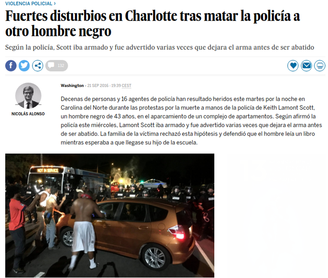

---
title:  'Acción Pública y Cambio Social'
author:
- name: Juan Muñoz
  affiliation: Universitat Autònoma de Barcelona
tags: [Conductas colectivas]
tema: "Concepto y campos de estudio"
url: "http:/juan.psicologiasocial.eu"
bibliography: diapos.bib
csl: apa.csl
lateral-menu: 'True'
...

# Elementos de definición {.center data-background="imagenes-APCS-1/Concept.png" data-background-transition=zoom data-state=opacidad}

## Colectivos

>Una agrupación o grupo de individuos relativamente grande que muestran similitudes en acciones y perspectivas (actitudes, opiniones).\
@forsyth_group_2010 [p, 503]

## Comportamiento colectivo
> Las acciones de un grupo de personas que responden de manera similar a un evento o situación, incluyendo personas que ocupan el mismo lugar (una multitud), así como fenómenos de masas en los que los individuos están dispersos en una amplia área (Movimientos colectivos).\
@forsyth_group_2010 [, p. 502]

## Clasificación

Multitud ocasional (casual)
: temporal, poco organizada, y mínima emocionalidad. Si comparten algún interés este es menor y temporal.

Multitud convencional
: tiene un propósito específico y sigue las normas de conducta. Hay poca interacción entre sus miembros.

Multitudes expresivas
: no tienen un propósito significativo o a largo plazo más allá del de dar rienda suelta a las emociones.

Multitudes activas
: realizan alguna acción hacia un objetivo. Se concentra intensamente en algún objetivo y se involucra en un comportamiento activo para lograrlo.

#### @blumer_collective_1939 {.autor}

## Clasificación (Forsyth, 2010)

{.noshadow}

<!--
##Conducta colectiva
> [definimos] la conducta colectiva como una acción voluntaria, dirigida a una meta, que se produce en una situación relativamente desorganizada, en la que las normas y valores predominantes de la sociedad dejan de actuar sobre la conducta individual. La conducta colectiva consiste en la reacción de un grupo a alguna situación.\
@appelbaum_sociology:_1997 [, p. 422]
-->

<!--
## Son un fenómeno... {data-state=opacidad}
- Colectivo
- Unitario
- Sin organización
- Transitorio
- Indiferenciado
- Anómico
-->

## Concepto paraguas {data-background="imagenes-APCS-1/Umbrella.jpg" data-background-transition=zoom data-state=opacidad}

#### Fenómenos que caen fuera de la estructura social u orden establecido {.fondoblanco}

##

##

##

##

##

##

##

##

<!--
## Mapa conceptual {data-state=img-completa}

-->

<!--
## Movimientos sociales
>Una **colectividad** que actúa con cierta **continuidad** para **promover un cambio** en la sociedad o grupo de la que forma parte.\
[Turner & Killian, 1987 en @miller_introduction_2013, p. 469]
-->

# Los inicios { .center}

## Primavera de los pueblos

## {data-background="imagenes-APCS-1/ComunaBarricadas.jpg" data-background-transition=fade data-state=fondo}

. . .

## La comuna {data-background="imagenes-APCS-1/ComunaBarricadas.jpg" data-background-transition=fade data-state=fondo}

<audio width="100"  class="stretch"  controls data-autoplay>
<source src="imagenes-APCS-1/ElTempsDeLesCireres.mp3">
</audio>

#### @gine_temps_1978 {.autor}

<!-- `El temps de les cireres`{.autor} -->

## Preguntas

* ¿Quiénes eran los participantes en las acciones de masas?
* ¿Cómo se explicaba que ciudadanos habitualmente respetuosos de las leyes se involucren en actos perturbadores del orden social?
* ¿Cómo se podían prevenir las explosiones violentas de las masas cuando se dan las condiciones para que éstas actúen colectivamente?

## Respuestas: Los fenómenos de masas...

* Son amenazas para el orden social
* Son manifestaciones patológicas de la naturaleza humana
* Son irracionales

##
> Los senadores son todos hombres de bien, el Senado romano es una mala bestia.\
[Citado por @moscovici_era_1985, p. 26]

. . .

Es decir,

> considerado aisladamente, cada uno de nosotros es en definitiva razonable; juntos, en una multitud, con ocasión de una reunión política e incluso en el seno de un grupo de amigos, estamos todos dispuestos a cometer las mayores locuras.\
[@moscovici_era_1985, p. 26]

## Las teorías irracionalistas

* Teorías del contagio
* Teorías de la convergencia

<!--
## Y para el próximo día...{.references}

Delgado, M. (2015). La redención de las multitudes: rescate y restauración del sujeto en los movimientos sociales de última generación. _Intersticios. Revista sociológica de pensamiento crítico_, _9_(2), 101-129. http://www.intersticios.es/article/view/15446
-->

# Referencias {.center}

## {.scrollable}
