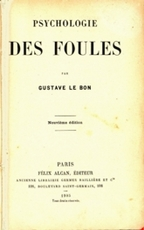

---
title:  'Acción Pública y Cambio Social'
author:
- name: Juan Muñoz
  affiliation: Universitat Autònoma de Barcelona
tags: [Conductas colectivas]
tema: "Campos de estudio"
url: "http:/juan.psicologiasocial.eu"
bibliography: diapos.bib
csl: apa.csl
lateral-menu: 'True'
...

#Elementos de definición { .center}

##Concepto paraguas

####Fenómenos que caen fuera de la estructura social u orden establecido

##
> [definimos] la conducta colectiva como una acción voluntaria, dirigida a una meta, que se produce en una situación relativamente desorganizada, en la que las normas y valores predominantes de la sociedad dejan de actuar sobre la conducta individual. La conducta colectiva consiste en la reacción de un grupo a alguna situación.\
@appelbaum_sociology_1997 [, p. 422]

##Son un fenómeno... {data-state=opacidad}
- Colectivo
- Unitario
- Sin organización
- Transitorio
- Indiferenciado
- Anómico

<!--
##Mapa conceptual {data-state=img-completa}

-->

##Movimientos sociales
>Una **colectividad** que actúa con cierta **continuidad** para **promover un cambio** en la sociedad o grupo de la que forma parte.\
[Turner & Killian, 1987 en @miller_introduction_2013, p. 469]

#Los inicios { .center}

## {data-background="imagenes/ComunaBarricadas.jpg" data-background-transition=fade data-state=fondo}

. . .

## La comuna {data-background="imagenes/ComunaBarricadas.jpg" data-background-transition=fade data-state=fondo}

<audio width="100"  class="stretch"  controls data-autoplay>
<source src="multimedia/ElTempsDeLesCireres.mp3">
</audio>

`El temps de les cireres`{.autor}

##Preguntas {data-state=opacidad}

* ¿Quiénes eran los participantes en las acciones de masas?
* ¿Cómo se explicaba que ciudadanos habitualmente respetuosos de las leyes se involucren en actos perturbadores del orden social?
* ¿Cómo se podían prevenir las explosiones violentas de las masas cuando se dan las condiciones para que éstas actúen colectivamente?

##Respuestas: Los fenómenos de masas...

* Son amenazas para el orden social
* Son manifestaciones patológicas de la naturaleza humana
* Son irracionales

##
> Los senadores son todos hombres de bien, el Senado romano es una mala bestia.\
[Citado por @moscovici_era_1985]

#Las teorías: Contagio  { .center}

##Teorías del contagio {data-background="imagenes/zombis.jpg" data-background-transition=fade data-state=fondo}

. . .

> ... difusión del afecto o de la conducta de un participante de la multitud a otro; una persona sirve como estímulo para las acciones imitativas de otra.\
@milgram_collective_1969 [, p. 550]

##Algunos representantes

. . .

. . .

##Irracionales y malvadas

>...una docena de hombres inteligentes, sensatos y buenos, son capaces de emitir juicios y veredictos perfectamente estúpidos y carentes de toda lógica.

. . .

>La masa es un terreno donde el microbio del mal se desarrolla muy fácilmente, mientras que el microbio del bien muere casi siempre.\
@sighele_foule_1892

##Contra la civilización

> Por su poder exclusivamente destructivo, actúan como aquellos microbios que activan la disolución de los cuerpos debilitados o de los cadáveres. Cuando el edificio de una civilización está carcomido, las masas provocan su derrumbamiento. Se pone entonces de manifiesto su papel. Durante un instante, la fuerza ciega del número se convierte en la única filosofía de la historia.\
@lebon_psychologie_1895 [, p. 22]

##Mecanismos y resultados

| Mecanismo      | Fenomenología                               | Conducta                           |
|:---------------|:--------------------------------------------|:-----------------------------------|
| Anonimato      | Invencibilidad, irresponsabilidad           | Violenta, antisocial, incivilizada |
| Contagio       | Cambios de conducta rápidos e impredecibles |                                    |
| Sugestibilidad | Afloran los instintos primitivos, salvajes  |                                    |

##El "filósofo español" {data-background="imagenes/Ortega-ElSol-1922-2-4.jpg" data-background-transition=zoom data-state=opacidad}

. . .

>Resulta completamente ocioso discutir si una sociedad debe ser o no debe ser constituida con la intervención de una aristocracia. La cuestión está resuelta desde el primer día de la historia humana; una sociedad sin aristocracia, sin minoría egregia, no es una sociedad.\

> ¿Cuál es, pues, la condición suma? El reconocimiento de que la misión de las masas no es otra que seguir a los mejores, en vez de pretender suplantarlos. Y esto en todo orden y porción de la vida.\
@ortegaygasset_espana_2007

## {data-background="imagenes/Ortega-ElSol-1929-10-24.jpg" data-background-transition=zoom data-state=opacidad}

. . .

>Cuando la masa actúa por sí misma, lo hace sólo de una manera, porque no tiene otra: lincha. (...) Ni mucho menos podrá extrañar que ahora, cuando las masas triunfan, triunfe la violencia y se haga de ella la única ratio, la única doctrina.\
@ortegaygasset_rebelion_2003 [, p. 118]

##  {data-background="imagenes/ClaudeNeal.jpg" data-background-transition=zoom data-state=opacidad}

. . .

<video width="800"  class="stretch" controls>
<source src="multimedia/StrangeFruit-BillieHoliday-sub.mp4">
</video>

##

#Convergencia {  data-background="imagenes/Convergence.jpg" data-background-transition=zoom data-state=opacidad}

##Individualismo

>No hay psicología de los grupos que no sea esencialmente y por completo una psicología de los individuos.

>El individuo en la masa se comporta simplemente como lo haría solo, pero más.\
@allport_social_1924 [, pp. 4 y 295]

##
>In reality crowd psychology owed less to psychology than to conservative politics. Le Bon's images of the mob (like Taine's before them) inverted Marxist images of a heroic working class. Crowd psychology denied to working people the dignity, autonomy and revolutionary creativity that Marx and other thinkers of the Left conferred on them. Hypnotic explanations stigmatized crowds; they turned motives into impulses and politics into pathology.\
@leach_mental_1992 [p. 13]

##

>By reducing the explanation of collective conflict to the inherent pathology of just one of the parties involved -the crowd- one not only removes all meaning from crowd action, but one also removes all responsibility from the social order and justifies increased repression as the only possible way of treating crowds. In other words, conflict occurs where crowds gather because it is in the very nature of crowds to be conflictual. There is nothing more to be said. Such questions as whether social conditions cause crowd protest or whether police action precipitated violence do not even arise. To study them would simply be a waste of time.\
@stott_crowd_1998 [p. 511]

##Disturbios en Fergurson

`Disturbios en Ferguson, noviembre 2014`{.figcaption}

#Referencias {.center}

## {.scrollable}
