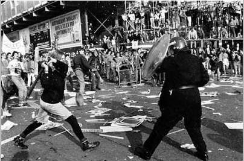

---
title:  'Acción Pública y Cambio Social'
author:
- name: Juan Muñoz
  affiliation: Universitat Autònoma de Barcelona
tags: [Conductas colectivas]
tema: "Normas e identidades"
url: "http:/juan.psicologiasocial.eu"
bibliography: Diapos.bib
csl: apa.csl
lateral-menu: 'True'
...

#Normas e Identidades {.mitit .center}

##Norma emergente: Principios

* Una apuesta por la diferenciación interna de las multitudes, que invalida las teorías del contagio y de la convergencia
* La conducta de masa no es asocial ni irracional, está regulada por normas que emergen en la propia situación
* La multitud es un espacio de interacción social en el que se desarrollan normas sociales

##Norma emergente: Idea central

>...la conducta de las multitudes (…) está regulada por normas que no vienen de fuera, que no están institucionalizadas, sino que surgen precisamente al hilo del desarrollo de la propia dinámica del comportamiento de la multitud (...); emergen de la propia situación y son vinculantes para los individuos participantes (...) cuando la situación es inicialmente ambigua, surgen definiciones nuevas durante el discurso de la interacción social.\
@ovejerobernal_individuo_1997 [, p. 218]

<!--
##Proceso

* La actuación de las persona depende de la percepción sobre las normas que rigen la situación
* En una situación ambigua, las normas son creadas en el transcurso de la interacción
* La homogeneidad no obedece al contagio, sino a conformidad normativa
* Las normas derivan de la conducta de personas prominentes (líderes)
* La conducta colectiva no es especialmente irracional
-->

##El proceso {data-state=fondo}

#Identidad Social {.mitit .center}

##Teoría de la Identidad Social

##Los disturbios de St. Pauls {data-background="imagenes/SaintPauls-back.jpg" data-background-transition=fade data-state=fondo}

<video width="400"  class="stretch" controls data-autoplay>
<source src="multimedia/St_Pauls_Uprising_Bristol_1980.mp4">
</video>
######<https://www.youtube.com/watch?v=Wdyo16VMhIQ>{.figcaption}

##Críticas a la teoría de la norma emergente

* Su explicación de cómo emergen las normas es inadecuada para explicar las situaciones en las que la masa actúa y cambia rápidamente.
* Énfasis que ponen en el papel de los individuos prominentes en la emergencia de la norma.

##Bases

Teoría de la Identidad, categorización y comparación social

Teoría de la autocategorización

##Teoría de la autocategorización del yo

Hipótesis 1
:	Tiende a darse una relación inversa entre la saliencia de los niveles personal y social de categorización del yo

Hipótesis 2
:	Cuando nos vemos como miembros intercambiables de una categoría social, nos despersonalizamos

Hipótesis 3
:	La despersonalización de la percepción del yo es el proceso básico que subyace a los fenómenos de grupo

##La propuesta de Steve Reicher

>Si se deja de lado el exogrupo, no puede comprenderse que la violencia surja de un proceso de conflicto intergrupal. En su lugar se atribuye a la masa misma.\
@reicher_conducta_1987 [, p. 240]

##Propuestas

* Los miembros de la masa actúan en términos de una identidad social común.
* El contenido de la conducta de la masa estará limitado por la naturaleza de la categoría a la que pertenecen.

##Modelo elaborado de identidad social

#####La identidad social de los miembros de la masa, y por lo tanto sus actuaciones, dependen de las dinámicas intergrupales.

##

|    |          |                                   |                                                            |
|:---|:---------|:----------------------------------|:-----------------------------------------------------------|
| T1 | Multitud | Contexto comparativo              | Impuesto injusto                                           |
| T1 | Multitud | Conducta prototípica              | Actividad legítima de protesta                             |
| T1 | Policía  | Contexto comparativo              | La multitud supone una amenaza                             |
| T1 | Policía  | Conducta                          | Utilización de la fuerza                                   |
| T2 | Multitud | Cambio en el contexto comparativo | De "impuesto injusto", a actuación ilegítima de la policía |
| T2 | Multitud | Cambios en identidad y poder      | El conflicto hacia la policía es legítimo                  |
| T2 | Multitud | Cambios en las normas             | Conflicto con la policía                                   |
| T3 | Policía  | Contexto comparativo              | Incremento de la amenaza de la multitud                    |

:Cambios en las relaciones intergrupales y consecuencias para la conducta prototípica. Adaptado de @stott_crowds_2000

T1, T2 y T3 = Fases temporales de la relación intergrupal

###### @stott_crowds_2000

##La visión de la policía

## La batalla de Westminster {data-background="imagenes/BattleOfWestminster.jpg" data-background-transition=fade data-state=fondo}

. . .

<video width="400"  class="stretch" controls data-autoplay>
<source src="multimedia/PollTaxRiot1990.mp4">
</video>

###### <https://www.youtube.com/watch?v=R3nYGoppmoA>`{.figcaption}

##Domingo Sangriento {data-background="imagenes/BloodySunday-bac.jpg" data-background-transition=fade data-state=fondo}

<video width="400"   controls>
<source src="multimedia/BloodySunday.mp4">
</video>
###### <https://www.youtube.com/watch?v=vkOpgr1ElXg>

#Referencias

## {.scrollable}
