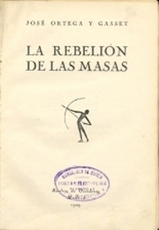
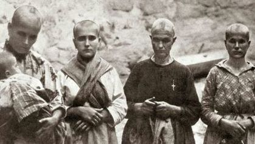

---
title:  'Acción Pública y Cambio Social'
author:
- name: Juan Muñoz
  affiliation: Universitat Autònoma de Barcelona
tags: [Conductas colectivas]
tema: "Teorías: Irracionalistas"
url: "http:/juan.psicologiasocial.eu"
bibliography: diapos.bib
csl: apa.csl
lateral-menu: 'True'
...

##

<video width="800"  class="stretch" controls>
<source src="imagenes-APCS-2/csi3x09-turba.mp4">
</video>

<!-- `CSI Las Vegas 03x09 Sed deSangre`{.figcaption} -->

# Las teorías: Contagio  {data-background="imagenes-APCS-2/Virus.jpg" data-background-transition=zoom data-state=opacidad}

## Teorías del contagio {data-background="imagenes-APCS-2/Zombis.jpg" data-background-transition=fade data-state=fondo}

. . .

> ... difusión del afecto o de la conducta de un participante de la multitud a otro; una persona sirve como estímulo para las acciones imitativas de otra.\
@milgram_collective_1969 [, p. 550]

## Algunos representantes

. . .

. . .

## Irracionales y malvadas

>(...) doce hombres de buen sentido y de inteligencia pueden dar un veredicto estúpido y absurdo. Una reunión de individuos puede, por tanto, dar un resultado opuesto al que habría dado cada uno de ellos (p. 17)

. . .

> La muchedumbre es un terreno en el que se desarrolla muy fácilmente el microbio del mal, y en donde el microbio del bien casi siempre muere, por no encontrar las adecuadas condiciones de vida (p. 64) \
@sighele_foule_1892 [pp. 17 y 64]

## Sighele: Leyes

* Ley de la unidad o uniformidad
* Ley del número
* Ley de la predisposición al mal
* Ley del guía o instigador
* Ley de la composición de la multitud
* Ley de la no deducibilidad del carácter de la multitud a partir de sus miembros

## Contra la civilización

> Por su poder exclusivamente destructivo, actúan como aquellos microbios que activan la disolución de los cuerpos debilitados o de los cadáveres. Cuando el edificio de una civilización está carcomido, las masas provocan su derrumbamiento. Se pone entonces de manifiesto su papel. Durante un instante, la fuerza ciega del número se convierte en la única filosofía de la historia.\
@le_bon_psychologie_1895 [, p. 22]

## Alma colectiva

>En determinadas circunstancias, y tan sólo en ellas, una aglomeración de seres humanos posee características nuevas y muy diferentes de las de cada uno de los individuos que la componen. La personalidad consciente se esfuma, los sentimientos y las ideas de todas las unidades se orientan en una misma dirección. Se forma un alma colectiva, indudablemente transitoria, pero que presenta características muy definidas. La colectividad se convierte entonces en aquello que, a falta de otra expresión mejor, designaré como masa organizada o, si se prefiere, masa psicológica. Forma un solo ser y está sometida a la ley de la unidad mental de las masas.\
@le_bon_psychologie_1895 [, p. 27]

## Mecanismos y resultados

| Mecanismo      | Fenomenología                               | Conducta                           |
|:---------------|:--------------------------------------------|:-----------------------------------|
| Anonimato      | Invencibilidad, irresponsabilidad           |                                    |
| Contagio       | Cambios de conducta rápidos e impredecibles | Violenta, antisocial, incivilizada |
| Sugestibilidad | Afloran los instintos primitivos, salvajes  |                                    |

## El "filósofo español" {data-background="imagenes-APCS-2/Ortega-ElSol-1922-2-4.jpg" data-background-transition=zoom data-state=opacidad}

. . .

>Resulta completamente ocioso discutir si una sociedad debe ser o no debe ser constituida con la intervención de una aristocracia. La cuestión está resuelta desde el primer día de la historia humana; una sociedad sin aristocracia, sin minoría egregia, no es una sociedad.\

> ¿Cuál es, pues, la condición suma? El reconocimiento de que la misión de las masas no es otra que seguir a los mejores, en vez de pretender suplantarlos. Y esto en todo orden y porción de la vida.\
@ortega_y_gasset_espaninvertebrada:_1922

## {data-background="imagenes-APCS-2/Ortega-ElSol-1929-10-24.jpg" data-background-transition=zoom data-state=opacidad}

. . .

>Cuando la masa actúa por sí misma, lo hace sólo de una manera, porque no tiene otra: lincha. (...) Ni mucho menos podrá extrañar que ahora, cuando las masas triunfan, triunfe la violencia y se haga de ella la única ratio, la única doctrina.\
@ortega_y_gasset_rebelion_1930 [, p. 118]

## Las mujeres{.peque}

>"Si en la masa el hombre es un lobo, la mujer es una hiena. La hiena es la violencia en femenino. Animal que se alimenta de carroña, es asocial e inmundo, como el sexo al que representa y al mismo tiempo puede ser un animal feroz."\
@gallini_scipio_1988 [,p. 118 [hablando de Sighele]]

## El gen rojo

## Maupassant: _Sur l'eau_ {.scrollable .peque}

El mismo fenómeno sorprendente se produce cada vez que un gran número de hombres se reúne. Todas esas personas, unas al lado de otras, distintas, con distintas mentalidades, inteligencia, pasiones, educación, creencias, prejuicios, forman de pronto, por el simple hecho de reunirse, un ser especial, dotado un alma propia, de una manera de pensar nueva, común, que es un resultado irreductible de la media de las opiniones individuales.

Es una masa, y esta masa es alguien, un vasto individuo colectivo, tan distinto de otra masa como dos hombres entre sí.

Un dicho popular afirma que "la masa no razona". ¿Pero por qué no razona la masa mientras que cada individuo de la masa razona? ¿Por qué una masa hará espontáneamente lo que ninguna de las individualidades de dicha masa habría hecho? ¿Por qué una masa tiene impulsos irresistibles, deseos feroces, reacciones estúpidas que nada puede detener y, llevada por esos impulsos irreflexivos, es capaz de acometer actos que ninguno de los individuos que la componen realizaría?

Un desconocido lanza un grito y de pronto una especie de frenesí se apodera de todos, y todos, con un mismo impulso al que nadie intenta resistirse, llevados por un mismo pensamiento que les resulta inmediatamente común, a pesar de los actos, las opiniones, las creencias, las distintas costumbres, se avalanzarán sobre un hombre, lo masacrarán, lo ahogarán sin razón, casi sin pretexto, mientras que cada cual, si hubiera estado solo, se habría apresurado aun arriesgando su vida, para salvar a aquél al que mata.

Y por la noche, cada cual de regreso a casa, se preguntará qué rabia o que locura se apoderó de él, lo expulsó bruscamente de su naturaleza y de su carácter, cómo pudo ceder a ese impulso feroz.

Porque había dejado de ser un hombre para ser parte de una masa. Su voluntad individual se mezcló con la voluntad común como una gota de agua se mezcla con un río.

Su personalidad había desaparecido, convirtiéndose en una ínfima partícula de una enorme y extraña personalidad, la de la masa. El pánico que se apodera de un ejército y esos huracanes de opiniones que arrastran a todo un pueblo, y la locura de las danzas macabras, ¿no son acaso otros tantos ejemplos del mismo fenómeno?

En resumen, no es más sorprendente ver a los individuos reunidos formar un todo que ver a las moléculas reunidas formar un cuerpo.

Maupassant, G. (1888). _Sur l'eau_. París: P. Ollendorff. Obtenido de http://archive.org/details/surleau00maupuoft (pp. 149-152)

# Convergencia {  data-background="imagenes-APCS-2/Crowd.jpg" data-background-transition=zoom data-state=opacidad}

## Individualismo

>No hay psicología de los grupos que no sea esencialmente y por completo una psicología de los individuos.

. . .

>Nada nuevo o diferente es añadido por la situación de multitud excepto una intensificación de los sentimientos [y respuestas] ya presentes y la posibilidad de acción concertada. El individuo en la masa se comporta de la misma manera que lo haría solo, pero más todavía.\
@allport_social_1924 [, pp. 4 y 295]

##  {data-background="imagenes-APCS-2/ClaudeNeal.jpg" data-background-transition=zoom data-state=opacidad}

. . .

<video width="800"  class="stretch" controls>
<source src="imagenes-APCS-2/StrangeFruit-BillieHoliday-sub.mp4">
</video>

## Linchamientos

{.noshadow}

## ¿Por qué?

Milgram i Toch (1969), estudian episodios de linchamientos en pequeñas ciudades de EEUU. La respuesta al porqué no participan en ellos toda la población es que quienes lo hacen son personas propensas a la violencia.

##

{.noshadow}

##

{.noshadow}

# Críticas

##

>En realidad, la psicología de las masas debía menos a la psicología que a la política conservadora. Las imágenes de Le Bon de la masa (...) invirtieron las imágenes marxistas de una heroica clase obrera. La psicología de las multitudes negaba a los trabajadores la dignidad, la autonomía y la creatividad revolucionaria que Marx y otros pensadores de la izquierda les conferían. Las explicaciones hipnóticas estigmatizaban a las multitudes; convirtieron los motivos en impulsos y la política en patología.\
@leach_mental_1992 [p. 13]

<!--
>In reality crowd psychology owed less to psychology than to conservative politics. Le Bon's images of the mob (like Taine's before them) inverted Marxist images of a heroic working class. Crowd psychology denied to working people the dignity, autonomy and revolutionary creativity that Marx and other thinkers of the Left conferred on them. Hypnotic explanations stigmatized crowds; they turned motives into impulses and politics into pathology.\
@leach_mental_1992 [p. 13]
-->

##

>Al reducir la explicación del conflicto colectivo a la patología inherente a una sola de las partes involucradas -la multitud- no sólo se elimina todo significado de la acción de la multitud, sino que también elimina toda responsabilidad del orden social y justifica una represión creciente como la única posibilidad de tratar a las multitudes.\
@stott_crowd_1998 [p. 511]

<!--
>By reducing the explanation of collective conflict to the inherent pathology of just one of the parties involved -the crowd- one not only removes all meaning from crowd action, but one also removes all responsibility from the social order and justifies increased repression as the only possible way of treating crowds. In other words, conflict occurs where crowds gather because it is in the very nature of crowds to be conflictual. There is nothing more to be said. Such questions as whether social conditions cause crowd protest or whether police action precipitated violence do not even arise. To study them would simply be a waste of time.\
@stott_crowd_1998 [p. 511]
-->

## Disturbios{.peque}

<!-- Thousands of Counter-Protesters March Against White Nationalism in Boston a Week After Charlottesville -->

## Disturbios en Fergurson

`Disturbios en Ferguson, noviembre 2014`{.figcaption}

# Teorías de la Crisis {data-background="imagenes-APCS-2/Crisis.jpg" data-background-transition=zoom data-state=opacidad}

## Privación relativa

>Cuando van creciendo a la par la satisfacción real de necesidades y la satisfacción esperada, no se produce violencia (aun cuando exista un ligero desnivel entre ambas que genera una insatisfacción tolerable), pero cuando la satisfacción real queda bloqueada y las expectativas continúan creciendo, el desnivel entre lo que se tiene realmente y lo que se esperaba tener puede hacerse muy grande, convirtiéndose en intolerable, produciéndose entonces la situación de curva J característica de las revoluciones.\
@javaloy_comportamiento_2003 [, p. 180]

## La Teoría de la "Curva en J"

## Teoría del Valor Añadido

## Determinantes

* Conductividad estructural
* Tensión estructural
* Creencia generalizada
* Suceso precipitador
* Movilización activa
* Control social

## Un ejemplo: Universidad de Kent

<video width="800"  class="stretch" controls>
<source src="imagenes-APCS-2/KentState-sub.mp4">
</video>

@lewis_study_1972

# Referencias {.center}

## {.scrollable}
