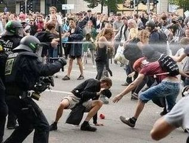

---
title:  'Acción Pública y Cambio Social'
author:
- name: Juan Muñoz
  affiliation: Universitat Autònoma de Barcelona
tags: [Conductas colectivas]
tema: "Teorías Irracionalistas y Teorías de la Crisis"
url: "http:/juan.psicologiasocial.eu"
bibliography: diapos.bib
csl: apa.csl
lateral-menu: 'True'
...

## Las teorías irracionalistas

* Teorías del contagio
* Teorías de la convergencia

::: notes
Los orígenes del término “conducta colectiva” se remontan a finales del S. XIX, a través de la obras de autores que en su estudio de las masas resaltaban el aspecto de excitación que se producía en las masas, y la irracionalidad y amoralidad que las caracterizaba (teorías del contagio), y a inicios del S. XX, con las teorías que defencían igualmente la irracionalidad y violencia de las masas debido a que están compuestas por personas con unas características determinadas (toerías de la convergencia).
:::

<!--
##

<video width="800"  class="stretch" controls>
<source src="imagenes-APCS-2/csi3x09-turba.mp4">
</video>
-->
<!-- `CSI Las Vegas 03x09 Sed deSangre`{.figcaption} -->

# Las teorías: Contagio  {#teorias-contagio .center data-background="imagenes-APCS-2/Virus.jpg" data-background-transition=zoom data-state=opacidad}

## Algunos representantes

:::::: {.columns}
::: {.column width="25%"}
{.noshadow}
:::
::: {.column width="25%"}
{.noshadow}
:::
::: {.column width="25%"}
{.noshadow}
:::
::: {.column width="25%"}
{.noshadow}
:::
::::::

{.noshadow}

::: notes
Una gran parte de estos autores, si no todos, podemos etiquetarlos no sólo como “del contagio”, sino también como “irracionalistas”, puesto que defienden que ese contagio lleva a que las masas se caractericen por la irracionalidad.
:::

## Teorías del contagio {#teoria-contagio  data-background="imagenes-APCS-2/Zombis.jpg" data-background-transition=fade data-state=fondo}

. . .

> (...) difusión del afecto o de la conducta de un participante de la multitud a otro; una persona sirve como estímulo para las acciones imitativas de otra.\
@milgram_collective_1969 [, p. 550]

::: notes
Explican el comportamiento colectivo y la homogeneidad de la multitud en base a procesos de interacción e influencia interpersonal: la sugestión y el contagio.

Básicamente se plantea que entre los miembros de la multitud se produce una difusión de unos a otros de las conductas, actitudes y emociones.

Según Moscovici (1985), desde esta perspectiva se equipara a las multitudes con *animales salvajes, en las que ha desaparecido el freno de la moral y que están carentes de capacidad de raciocinio*. En la multitud se exteriorizan sueños y pasiones, generalmente de forma violenta, aunque su irracionalidad permite que sean capaces tanto de actos brutales y de destrucción como de conductas heróicas
:::

## Irracionales y malvadas

>(...) doce hombres de buen sentido y de inteligencia pueden dar un veredicto estúpido y absurdo. Una reunión de individuos puede, por tanto, dar un resultado opuesto al que habría dado cada uno de ellos (p. 17)

. . .

> La muchedumbre es un terreno en el que se desarrolla muy fácilmente el microbio del mal, y en donde el microbio del bien casi siempre muere, por no encontrar las adecuadas condiciones de vida (p. 64) \
@sighele_foule_1892 [pp. 17 y 64]

::: notes
En su obra *La masa delincuente* (1892), Sighele desarrolla algunos de los principios que también aparecerán después en la obra de Le Bon: la importancia de las masas en la vida moderna la **inferioridad en cuanto a inteligencia** de las masas o colectividades frente a los individuos, el principio de la **imitación y sugestión** en la conducta de las masas, y la **predisposición a la violencia** por parte de las masas.
:::

## Sighele: Leyes

* Ley de la unidad o uniformidad
* Ley del número
* Ley de la predisposición al mal
* Ley del guía o instigador
* Ley de la composición de la multitud
* Ley de la no deducibilidad del carácter de la multitud a partir de sus miembros

::: notes
**Ley de la no deducibilidad del carácter de la multitud a partir del de sus miembros** el resultado de una unión de una personas en una multitud **no es la suma** de sus características, sino un producto impredecible.

Esta "ley" va en la línea de una concepción de los grupos en la que se considera que estos son por completo diferentes a la suma de sus componentes, en la que se plantea “(...) la existencia de una entidad (la masa, el grupo) poseedora de propiedades y características propias (características supra-individuales) que se alzan como responsables de las acciones que realiza; hay una serie de leyes psicológicas […] de acuerdo con las cuales parece razonable pensar que las acciones de los grupos o de las masas difieren de aquellas que realizan los individuos aislados.” (Blanco, 1988, p. 86)
:::

## Contra la civilización {#contra-civilizacion}

> Por su poder exclusivamente destructivo, actúan como aquellos microbios que activan la disolución de los cuerpos debilitados o de los cadáveres. Cuando el edificio de una civilización está carcomido, las masas provocan su derrumbamiento. Se pone entonces de manifiesto su papel. Durante un instante, la fuerza ciega del número se convierte en la única filosofía de la historia.\
@le_bon_psychologie_1895 [, p. 22]

::: notes
Aunque una parte importante de los planteamientos de Le Bon fueron avanzados previamente por Sighele, Le Bon es probablemente el autor más reconocido dentro de esta orientación, y uno de los que han ejercido una mayor influencia tanto en psicología como en política.

El origen de la preocupación de Le Bon por la conducta de las multitudes, tiene que ver con los cambios de su época. Los acontecimientos revolucionarios que ha vivido hacen que se preocupe por lo que considera que puede llevar a la desaparición de la civilización europea tal y como se había conocido hasta la época, y se preocupa, especialmente, por la desaparición de los valores tradicionales, la pérdida de las creencias religiosas..., y responsabiliza de todo ello al auge de las masas, al ascenso del proletariado al poder.

Así, parece que el **único papel que se le otorga a las masas es el de generar desorden y destrucción**, mientras que sus características básicas son la inconsciencia, la brutalidad, la barbarie.
:::

## Alma colectiva{.medio}

>En determinadas circunstancias, y tan sólo en ellas, una aglomeración de seres humanos posee características nuevas y muy diferentes de las de cada uno de los individuos que la componen. La personalidad consciente se esfuma, los sentimientos y las ideas de todas las unidades se orientan en una misma dirección. Se forma un alma colectiva, indudablemente transitoria, pero que presenta características muy definidas. La colectividad se convierte entonces en aquello que, a falta de otra expresión mejor, designaré como masa organizada o, si se prefiere, masa psicológica. Forma un solo ser y está sometida a la ley de la unidad mental de las masas.\
@le_bon_psychologie_1895 [, p. 27]

::: notes
Le Bon también plantea que independientemente de las características de las personas que la forman, la masa tiene una especie de *alma colectiva* que hace que sus miembros piensen y actúen de forma diferente a como lo harían si actuaran por separado.

Por lo tanto, una de las característica más importantes de la masa es la desaparición de las individualidades (desindividuación) y la aparición de un nuevo ser, la masa, con características completamente diferentes a las de los individuos que la forman..
:::

## Mecanismos y resultados

| Mecanismo      | Fenomenología                               | Conducta                           |
|:---------------|:--------------------------------------------|:-----------------------------------|
| Anonimato      | Invencibilidad, irresponsabilidad           |                                    |
| Contagio       | Cambios de conducta rápidos e impredecibles | Violenta, antisocial, incivilizada |
| Sugestibilidad | Afloran los instintos primitivos, salvajes  |                                    |

::: notes
El anonimato se ve favorecido por formar parte de una multitud (simplemente por una cuestión numérica), hace disminuir/desaparecer el sentido de responsabilidad individual, lo que a su vez lleva a un sentimiento de poder invencible y a ceder a sus instintos.

El contagio mental funciona de forma similar al contagio de una enfermedad infecciosa. El resultado será que todo sentimiento, todo acto, se contagia de un individuo a otro de una forma similar a como funciona la hipnosis.

El tercer y más importante mecanismo que da lugar al comportamiento de la muchedumbre, es la susceptibilidad, la aceptación acrítica de una persona de las exigencias que se le solicitan, lo que le lleva a realizar conductas que no realizaría de no ser miembro de la masa. El contagio no sería sino un efecto de la sugestibilidad.
:::

## El "filósofo español" {#ortega data-background="imagenes-APCS-2/Ortega-ElSol-1922-2-4.jpg" data-background-transition=zoom data-state=opacidad .medio}

. . .

>Resulta completamente ocioso discutir si una sociedad debe ser o no debe ser constituida con la intervención de una aristocracia. La cuestión está resuelta desde el primer día de la historia humana; una sociedad sin aristocracia, sin minoría egregia, no es una sociedad.

> ¿Cuál es, pues, la condición suma? El reconocimiento de que la misión de las masas no es otra que seguir a los mejores, en vez de pretender suplantarlos. Y esto en todo orden y porción de la vida.\
@ortega_y_gasset_espaninvertebrada:_1922

::: notes
Ortega, influenciado (igual que lo fuera antes Gustave Le Bon) por los acontecimientos políticos de su época, se plantea el papel que juegan las masas y las minorías, haciendo un *planteamiento elitista*, puesto que según el, mientras las masas son el conjunto de personas no especialmente cualificadas, la minoría son aquellos individuos o grupos de individuos especialmente cualificados.

El problema que se plantea es que las masas se “olvidan” que son masa por eso mismo, por su no cualificación, pero aún así pretenden imponer sus ideas cuando estas, por definición, no existen, ya que no están cualificados para tenerlas.

Esto les lleva a ser indóciles frente a las minorías que son las auténticas forjadoras de la sociedad, del progreso, ambos amenazados por las masas que pretenden alcanzar todo sin esforzarse para conseguirlo y que consideran que los logros (de unos pocos) es algo dado por naturaleza y que no hay que esforzarse para mantenerlo o mejorarlo.

Así, el hombre masa se caracteriza por “la libre expansión de sus deseos vitales” y por “la radical ingratitud hacia cuanto ha hecho posible la facilidad de su existencia”.
:::

## {data-background="imagenes-APCS-2/Ortega-ElSol-1929-10-24.jpg" data-background-transition=zoom data-state=opacidad}

. . .

>Cuando la masa actúa por sí misma, lo hace sólo de una manera, porque no tiene otra: lincha. (...) Ni mucho menos podrá extrañar que ahora, cuando las masas triunfan, triunfe la violencia y se haga de ella la única ratio, la única doctrina.\
@ortega_y_gasset_rebelion_1930 [, p. 118]

::: notes
La conclusión es lógica, el *único recurso* de esas masas sin ideas y sin capacidad para defender lo que pretenden es la *acción directa, la violencia*.

“Afortunadamente”, Ortega tiene la solución, dejar el gobierno en manos de la minoría excelente, puesto que la masa

“Ha venido al mundo para ser dirigida, influida, representada, organizada (...) Pero no ha venido al mundo para hacer todo eso por sí. Necesita referir su vida a la instancia superior, constituida por las minorías selectas.” (Ortega y Gasset, 2003/1930, p. 81)
:::

## Las mujeres{.peque}

>"Si en la masa el hombre es un lobo, la mujer es una hiena. La hiena es la violencia en femenino. Animal que se alimenta de carroña, es asocial e inmundo, como el sexo al que representa y al mismo tiempo puede ser un animal feroz."\
@gallini_scipio_1988 [,p. 118 [hablando de Sighele]]

## El gen rojo

::: notes
Antonio Vallejo-Nágera (1889-1960), jefe de los Servicios Psiquiátricos del Ejército de Franco, en su línea de investigación en búsqueda del "gen rojo" estudió mediante test psicológicos y mediciones antropomórficas a prisioneros de guerra, fundamentalmente procedentes de las Brigadas Internacionales, tomando como postulados de trabajo: la relación entre determinada personalidad biopsíquica y la predisposición constitucional al marxismo, la alta incidencia del fanatismo marxista en los inferiores mentales y la presencia de psicópatas antisociales en las masas marxistas.
:::

## Maupassant: _Sur l'eau_ {.scrollable .peque}

El mismo fenómeno sorprendente se produce cada vez que un gran número de hombres se reúne. Todas esas personas, unas al lado de otras, distintas, con distintas mentalidades, inteligencia, pasiones, educación, creencias, prejuicios, forman de pronto, por el simple hecho de reunirse, un ser especial, dotado un alma propia, de una manera de pensar nueva, común, que es un resultado irreductible de la media de las opiniones individuales.

Es una masa, y esta masa es alguien, un vasto individuo colectivo, tan distinto de otra masa como dos hombres entre sí.

Un dicho popular afirma que "la masa no razona". ¿Pero por qué no razona la masa mientras que cada individuo de la masa razona? ¿Por qué una masa hará espontáneamente lo que ninguna de las individualidades de dicha masa habría hecho? ¿Por qué una masa tiene impulsos irresistibles, deseos feroces, reacciones estúpidas que nada puede detener y, llevada por esos impulsos irreflexivos, es capaz de acometer actos que ninguno de los individuos que la componen realizaría?

Un desconocido lanza un grito y de pronto una especie de frenesí se apodera de todos, y todos, con un mismo impulso al que nadie intenta resistirse, llevados por un mismo pensamiento que les resulta inmediatamente común, a pesar de los actos, las opiniones, las creencias, las distintas costumbres, se avalanzarán sobre un hombre, lo masacrarán, lo ahogarán sin razón, casi sin pretexto, mientras que cada cual, si hubiera estado solo, se habría apresurado aun arriesgando su vida, para salvar a aquél al que mata.

Y por la noche, cada cual de regreso a casa, se preguntará qué rabia o que locura se apoderó de él, lo expulsó bruscamente de su naturaleza y de su carácter, cómo pudo ceder a ese impulso feroz.

Porque había dejado de ser un hombre para ser parte de una masa. Su voluntad individual se mezcló con la voluntad común como una gota de agua se mezcla con un río.

Su personalidad había desaparecido, convirtiéndose en una ínfima partícula de una enorme y extraña personalidad, la de la masa. El pánico que se apodera de un ejército y esos huracanes de opiniones que arrastran a todo un pueblo, y la locura de las danzas macabras, ¿no son acaso otros tantos ejemplos del mismo fenómeno?

En resumen, no es más sorprendente ver a los individuos reunidos formar un todo que ver a las moléculas reunidas formar un cuerpo.

Maupassant, G. (1888). _Sur l'eau_. París: P. Ollendorff. Obtenido de http://archive.org/details/surleau00maupuoft (pp. 149-152)

# Convergencia {.center   data-background="imagenes-APCS-2/Crowd.jpg" data-background-transition=zoom data-state=opacidad}

## Individualismo

>No hay psicología de los grupos que no sea esencialmente y por completo una psicología de los individuos.

. . .

>Nada nuevo o diferente es añadido por la situación de multitud excepto una intensificación de los sentimientos [y respuestas] ya presentes y la posibilidad de acción concertada. El individuo en la masa se comporta de la misma manera que lo haría solo, pero más todavía.\
@allport_social_1924 [, pp. 4 y 295]

::: notes
Para las teorías de la convergencia, el aspecto central es que la homogeneidad percibida en los miembros de una masa no tiene que ver con el tipo de interacción que se da en ella, sino con las características de las personas que la componen. La homogeneidad es preexistente. Una masa violenta, hostil, estará formada por personas con predisposiciones agresivas, que se unen a la masa como una excusa para poderlas manifestar.

Lo que se produce en la masa es un fenómeno de interestimulación recíproca, etiquetado por Allport como *facilitación social*: se trata de un 'aumento de la respuesta debido al simple hecho de ver o escuchar que los demás realizan los mismos movimientos.
:::

<!--
##

{.noshadow}

##

{.noshadow} -->

##  {data-background="imagenes-APCS-2/ClaudeNeal.jpg" data-background-transition=zoom data-state=opacidad}

. . .

<video width="800"  class="stretch" controls>
<source src="imagenes-APCS-2/StrangeFruit-BillieHoliday-sub.mp4">
</video>

###### [http://bit.ly/2FTXcSc](http://bit.ly/2FTXcSc){.fondoblanco}

## Linchamientos

{.noshadow height="500"}

## Linchamientos

## ¿Por qué? {#por-que}

Milgram i Toch (1969), estudian episodios de linchamientos en pequeñas ciudades de EEUU. La respuesta al porqué no participan en ellos toda la población es que quienes lo hacen son personas propensas a la violencia.

:::notes
Frente a las perspectivas anteriores también nos encontramos con otra según la cual, cualquier fenómeno, incluso grupal, debe explicarse en función de las características de los individuos que están implicados.

Si la difusión de una enfermedad infecciosa puede ser utilizada como analogía para ilustrar los planteamientos de las teorías del contagio, para caracterizar a las teorías de la convergencia se podría utilizar la analogía de las personas de un pabellón hospitalario dedicado al tratamiento de alguna enfermedad no infecciosa. Aunque comparten algo, aunque tienen similitudes entre sí, no obedecen al contagio. Convergen en el pabellón por el hecho de tener previamente similitudes (Milgram & Toch, 1969)
:::

# Críticas {#criticas .center }

##

>En realidad, la psicología de las masas debía menos a la psicología que a la política conservadora. Las imágenes de Le Bon de la masa (...) invirtieron las imágenes marxistas de una heroica clase obrera. La psicología de las multitudes negaba a los trabajadores la dignidad, la autonomía y la creatividad revolucionaria que Marx y otros pensadores de la izquierda les conferían. Las explicaciones hipnóticas estigmatizaban a las multitudes; convirtieron los motivos en impulsos y la política en patología.\
@leach_mental_1992 [p. 13]

<!--
>In reality crowd psychology owed less to psychology than to conservative politics. Le Bon's images of the mob (like Taine's before them) inverted Marxist images of a heroic working class. Crowd psychology denied to working people the dignity, autonomy and revolutionary creativity that Marx and other thinkers of the Left conferred on them. Hypnotic explanations stigmatized crowds; they turned motives into impulses and politics into pathology.\
@leach_mental_1992 [p. 13]
-->

::: notes
Tanto las perspectivas de Le Bon como la individualista de Allport comparten un modelo de la masa en el que su conducta obedece a sus características patológicas (ya sea porque la gente normal actúa de forma diferente por la influencia de la masa, o porque la componen personas con características patológicas). (Stott & Reicher, 1998)

Esta perspectiva, evidentemente, ha recibido críticas, principalmente de tipo ideológico, puesto que se equipara la conducta colectiva con los estratos más bajos de la sociedad. Se trata a las masas de una forma negativa y si se le ha prestado atención a las masas, no ha sido para solucionar sus problemas sino justo para lo contrario.
:::

##

>Al reducir la explicación del conflicto colectivo a la patología inherente a una sola de las partes involucradas -la multitud- no sólo se elimina todo significado de la acción de la multitud, sino que también elimina toda responsabilidad del orden social y justifica una represión creciente como la única posibilidad de tratar a las multitudes.\
@stott_crowd_1998 [p. 511]

<!--
>By reducing the explanation of collective conflict to the inherent pathology of just one of the parties involved -the crowd- one not only removes all meaning from crowd action, but one also removes all responsibility from the social order and justifies increased repression as the only possible way of treating crowds. In other words, conflict occurs where crowds gather because it is in the very nature of crowds to be conflictual. There is nothing more to be said. Such questions as whether social conditions cause crowd protest or whether police action precipitated violence do not even arise. To study them would simply be a waste of time.\
@stott_crowd_1998 [p. 511]
-->

## Disturbios{.peque}

:::::: {.columns}
::: {.column width="50%"}
{.noshadow}
:::
::: {.column width="50%"}
{.noshadow}

<!-- Thousands of Counter-Protesters March Against White Nationalism in Boston a Week After Charlottesville. En respuesta a “Unite the Right” rally of white nationalists opposing the removal of a Confederate general Robert E. Lee statue.-->
:::
::::::

:::::: {.columns}
::: {.column width="50%"}
{.noshadow}

<!-- La Unión Europea (UE) se negó a comentar el uso desproporcionado de la fuerza policial contra los chalecos amarillos en Francia. -->
:::
::: {.column width="50%"}
{.noshadow}

<!-- Disturbios en Argelia: miles de personas protestaron contra el Gobierno y chocaron con la policía
Reclaman la caída de Abdelaziz Buteflika, quien está en el poder desde 1999 y aspira a un quinto mandato. Hay decenas de heridos y detenidos

En Argel se registró una violenta represión a los manifestantes en las proximidades del Palacio de gobierno, donde la policía utilizó bombas de gas lacrimógeno y chorros de agua para dispersar a la multitud. -->
:::
::::::

## Disturbios en Fergurson (noviembre 2014) {.peque}

:::::: {.columns}
::: {.column width="50%"}

<video  height="237" data-autoplay controls="1" src="imagenes-APCS-2/Ferguson-2014.mp4"></video>

<!-- https://www.youtube.com/watch?v=-NZ0NQh9y30 -->

:::
::: {.column width="50%"}
{.noborder}
:::
::::::

:::::: {.columns}
::: {.column width="50%"}
{.noborder}
:::
::: {.column width="50%"}
{.noborder}
:::
::::::

::: notes
¿Cómo podemos explicar desde estas teorías "irracionalistas" los disturbios como los de Ferguson en 2014?

http://internacional.elpais.com/internacional/2014/08/12/actualidad/1407812545_405305.html
:::

# Teorías de la Crisis {#teorias-crisis .center data-background="imagenes-APCS-2/Crisis.jpg" data-background-transition=zoom data-state=opacidad}

<!-- ## Privación relativa

>Cuando van creciendo a la par la satisfacción real de necesidades y la satisfacción esperada, no se produce violencia (aun cuando exista un ligero desnivel entre ambas que genera una insatisfacción tolerable), pero cuando la satisfacción real queda bloqueada y las expectativas continúan creciendo, el desnivel entre lo que se tiene realmente y lo que se esperaba tener puede hacerse muy grande, convirtiéndose en intolerable, produciéndose entonces la situación de curva J característica de las revoluciones.\
@javaloy_comportamiento_2003 [, p. 180]

::: notes
A partir de los años 60 se inició el desarrollo de teorías en las que se centró el interés en el papel jugado por un tipo especial de tensión en el desencadenamiento de actos de protesta y el desarrollo de movimientos sociales: la privación relativa. -->
:::

## La Teoría de la "Curva en J" {#teoria-curva-j}

###### @davies_toward_1962

::: notes
James Davies plantea su hipótesis de la “curva en J”, en la que plantea que es más probable que se produzcan revoluciones cuando tras periodos de crecimiento económico y social prolongado y objetivo siguen periodos cortos de retrocesos agudos causados, por ejemplo, por descenso en la producción, incremento de impuestos...

La pobreza severa y la impotencia extrema conducirían a la apatía y la desesperanza, no a la movilización.
:::

## Teoría del Valor Añadido {#teoria-valor-anadido}

:::::: {.columns}
::: {.column width="50%"}

:::
::: {.column width="50%"}

:::
::::::

## Determinantes

>* Conductividad estructural
* Tensión estructural
* Creencia generalizada
* Suceso precipitador
* Movilización activa
* Control social

## Un ejemplo: Universidad de Kent

<video width="800"  class="stretch" controls>
<source src="imagenes-APCS-2/KentState-sub.mp4">
</video>

@lewis_study_1972 y @rudwick_kent_1972

# Referencias {.center}

## {.peque .scrollable }
