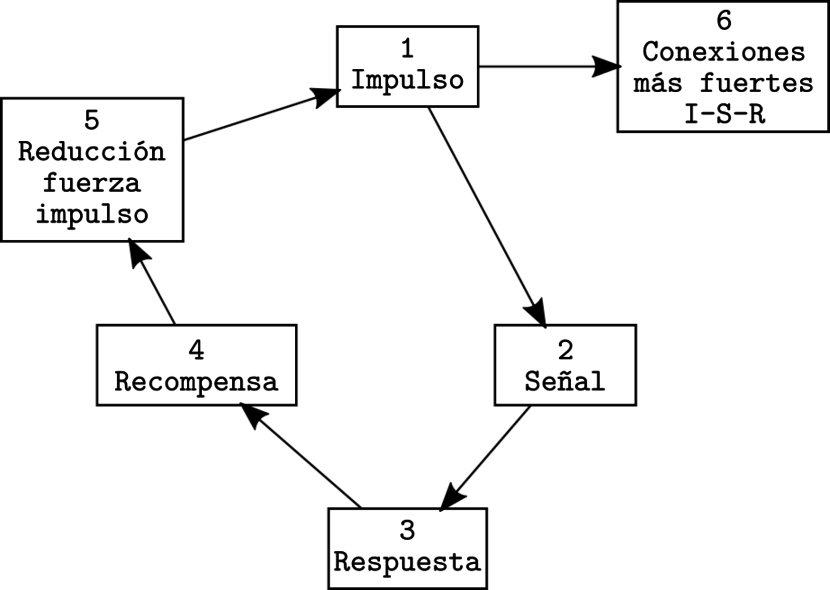
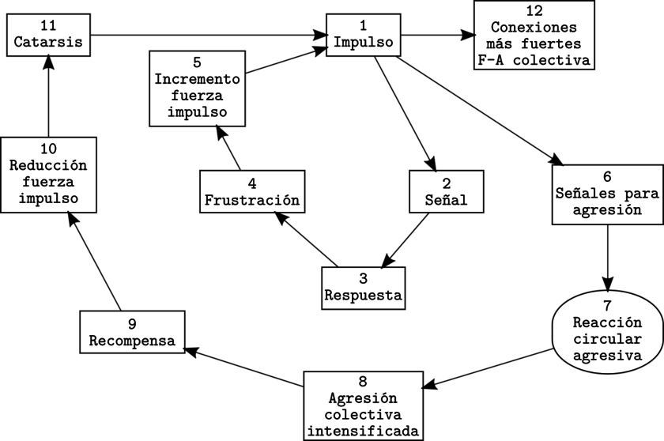

---
title:  'Acción Pública y Cambio Social'
author:
- name: Juan Muñoz
  affiliation: Universitat Autònoma de Barcelona
tags: [Conductas colectivas]
tema: "Teorías Irracionalistas y Teorías de la Crisis"
url: "http:/juan.psicologiasocial.eu"
bibliography: diapos.bib
csl: apa.csl
lateral-menu: 'True'
...

# Convergencia {.center   data-background="imagenes-APCS-2/Crowd.jpg" data-background-transition=zoom data-state=opacidad}

## Individualismo

>No hay psicología de los grupos que no sea esencialmente y por completo una psicología de los individuos.

. . .

>Nada nuevo o diferente es añadido por la situación de multitud excepto una intensificación de los sentimientos [y respuestas] ya presentes y la posibilidad de acción concertada. El individuo en la masa se comporta de la misma manera que lo haría solo, pero más todavía.\
@allport-SocialPsychology-1924 [, pp. 4 y 295]

::: notes
Para las teorías de la convergencia, el aspecto central es que la homogeneidad percibida en los miembros de una masa no tiene que ver con el tipo de interacción que se da en ella, sino con las características de las personas que la componen. La homogeneidad es preexistente. Una masa violenta, hostil, estará formada por personas con predisposiciones agresivas, que se unen a la masa como una excusa para poderlas manifestar.

Lo que se produce en la masa es un fenómeno de interestimulación recíproca, etiquetado por Allport como *facilitación social*: se trata de un 'aumento de la respuesta debido al simple hecho de ver o escuchar que los demás realizan los mismos movimientos.
:::

<!--
##

{.noshadow}

##

{.noshadow} -->

##  {data-background="imagenes-APCS-2/ClaudeNeal.jpg" data-background-transition=zoom data-state=opacidad}

. . .

<!-- <video width="800"  class="stretch" controls>
<source src="imagenes-APCS-2/StrangeFruit-BillieHoliday-sub.mp4">
</video> -->
<!-- ###### [Billie Holiday - Strange fruit](https://www.youtube.com/watch?v=-_R8xxeMFEU){.fondoblanco target="_blank"} -->

<iframe width="560" height="315" src="https://www.youtube.com/embed/-_R8xxeMFEU" frameborder="0" allow="accelerometer; autoplay; encrypted-media; gyroscope; picture-in-picture" allowfullscreen></iframe>

#### Billie Holiday - Strange fruit

<!--## Linchamientos

{.noshadow height="500"}-->

## Linchamientos

## ¿Por qué? {#por-que}

Milgram i Toch (1969), estudian episodios de linchamientos en pequeñas ciudades de EEUU. La respuesta al porqué no participan en ellos toda la población es que quienes lo hacen son personas propensas a la violencia.

:::notes
Frente a las perspectivas anteriores también nos encontramos con otra según la cual, cualquier fenómeno, incluso grupal, debe explicarse en función de las características de los individuos que están implicados.

Si la difusión de una enfermedad infecciosa puede ser utilizada como analogía para ilustrar los planteamientos de las teorías del contagio, para caracterizar a las teorías de la convergencia se podría utilizar la analogía de las personas de un pabellón hospitalario dedicado al tratamiento de alguna enfermedad no infecciosa. Aunque comparten algo, aunque tienen similitudes entre sí, no obedecen al contagio. Convergen en el pabellón por el hecho de tener previamente similitudes (Milgram & Toch, 1969)
:::

# Críticas {#criticas .center }

##

>En realidad, la psicología de las masas debía menos a la psicología que a la política conservadora. Las imágenes de Le Bon de la masa (...) invirtieron las imágenes marxistas de una heroica clase obrera. La psicología de las multitudes negaba a los trabajadores la dignidad, la autonomía y la creatividad revolucionaria que Marx y otros pensadores de la izquierda les conferían. Las explicaciones hipnóticas estigmatizaban a las multitudes; convirtieron los motivos en impulsos y la política en patología.\
@leach-MentalEpidemics-1992 [p. 13]

<!--
>In reality crowd psychology owed less to psychology than to conservative politics. Le Bon's images of the mob (like Taine's before them) inverted Marxist images of a heroic working class. Crowd psychology denied to working people the dignity, autonomy and revolutionary creativity that Marx and other thinkers of the Left conferred on them. Hypnotic explanations stigmatized crowds; they turned motives into impulses and politics into pathology.\
@leach_mental_1992 [p. 13]
-->

::: notes
Tanto las perspectivas de Le Bon como la individualista de Allport comparten un modelo de la masa en el que su conducta obedece a sus características patológicas (ya sea porque la gente normal actúa de forma diferente por la influencia de la masa, o porque la componen personas con características patológicas). (Stott & Reicher, 1998)

Esta perspectiva, evidentemente, ha recibido críticas, principalmente de tipo ideológico, puesto que se equipara la conducta colectiva con los estratos más bajos de la sociedad. Se trata a las masas de una forma negativa y si se le ha prestado atención a las masas, no ha sido para solucionar sus problemas sino justo para lo contrario.
:::

##

>Al reducir la explicación del conflicto colectivo a la patología inherente a una sola de las partes involucradas -la multitud- no sólo se elimina todo significado de la acción de la multitud, sino que también elimina toda responsabilidad del orden social y justifica una represión creciente como la única posibilidad de tratar a las multitudes.\
@stott-Crowdaction-1998 [p. 511]

<!--
>By reducing the explanation of collective conflict to the inherent pathology of just one of the parties involved -the crowd- one not only removes all meaning from crowd action, but one also removes all responsibility from the social order and justifies increased repression as the only possible way of treating crowds. In other words, conflict occurs where crowds gather because it is in the very nature of crowds to be conflictual. There is nothing more to be said. Such questions as whether social conditions cause crowd protest or whether police action precipitated violence do not even arise. To study them would simply be a waste of time.\
@stott-Crowdaction-1998 [p. 511]
-->

## Disturbios{.peque}

:::::: {.columns}
::: {.column width="50%"}
{.noshadow}
:::
::: {.column width="50%"}
{.noshadow}

<!-- Thousands of Counter-Protesters March Against White Nationalism in Boston a Week After Charlottesville. En respuesta a “Unite the Right” rally of white nationalists opposing the removal of a Confederate general Robert E. Lee statue.-->
:::
::::::

:::::: {.columns}
::: {.column width="50%"}
{.noshadow}

<!-- La Unión Europea (UE) se negó a comentar el uso desproporcionado de la fuerza policial contra los chalecos amarillos en Francia. -->
:::
::: {.column width="50%"}
{.noshadow}

<!-- Disturbios en Argelia: miles de personas protestaron contra el Gobierno y chocaron con la policía
Reclaman la caída de Abdelaziz Buteflika, quien está en el poder desde 1999 y aspira a un quinto mandato. Hay decenas de heridos y detenidos

En Argel se registró una violenta represión a los manifestantes en las proximidades del Palacio de gobierno, donde la policía utilizó bombas de gas lacrimógeno y chorros de agua para dispersar a la multitud. -->
:::
::::::

## Disturbios en Fergurson (noviembre 2014) {.peque}

:::::: {.columns}
::: {.column width="50%"}

<video  height="237" data-autoplay controls="1" src="imagenes-APCS-2/Ferguson-2014.mp4"></video>

<!-- https://www.youtube.com/watch?v=-NZ0NQh9y30 -->

:::
::: {.column width="50%"}
{.noborder}
:::
::::::

:::::: {.columns}
::: {.column width="50%"}
{.noborder}
:::
::: {.column width="50%"}
{.noborder}
:::
::::::

::: notes
¿Cómo podemos explicar desde estas teorías "irracionalistas" los disturbios como los de Ferguson en 2014?

http://internacional.elpais.com/internacional/2014/08/12/actualidad/1407812545_405305.html
:::

# Teorías de la Crisis {#teorias-crisis .center data-background="imagenes-APCS-2/Crisis.jpg" data-background-transition=zoom data-state=opacidad}

<!-- ## Privación relativa

>Cuando van creciendo a la par la satisfacción real de necesidades y la satisfacción esperada, no se produce violencia (aun cuando exista un ligero desnivel entre ambas que genera una insatisfacción tolerable), pero cuando la satisfacción real queda bloqueada y las expectativas continúan creciendo, el desnivel entre lo que se tiene realmente y lo que se esperaba tener puede hacerse muy grande, convirtiéndose en intolerable, produciéndose entonces la situación de curva J característica de las revoluciones.\
@javaloy_comportamiento_2003 [, p. 180]

::: notes
A partir de los años 60 se inició el desarrollo de teorías en las que se centró el interés en el papel jugado por un tipo especial de tensión en el desencadenamiento de actos de protesta y el desarrollo de movimientos sociales: la privación relativa. -->
:::

## La Teoría de la "Curva en J" {#teoria-curva-j}

###### @davies-TheoryRevolution-1962

::: notes
James Davies plantea su hipótesis de la “curva en J”, en la que plantea que es más probable que se produzcan revoluciones cuando tras periodos de crecimiento económico y social prolongado y objetivo siguen periodos cortos de retrocesos agudos causados, por ejemplo, por descenso en la producción, incremento de impuestos...

La pobreza severa y la impotencia extrema conducirían a la apatía y la desesperanza, no a la movilización.
:::

## Teoría del Valor Añadido {#teoria-valor-anadido}

:::::: {.columns}
::: {.column width="50%"}

:::
::: {.column width="50%"}

:::
::::::

## Determinantes

>* Conductividad estructural
* Tensión estructural
* Creencia generalizada
* Suceso precipitador
* Movilización activa
* Control social

::: notes
**Conductividad estructural**: la cualidad de las condiciones de todo tipo en que tiene lugar la conducta colectiva.

**Tensión estructural**: El conjunto de conflictos, malestar social, etc., que se encuentran dentro del campo establecido por la condición anterior.

Desarrollo y extensión de una **creencia generalizada** que identifica la fuente de malestar y especifica respuestas posibles ante la situación.

**Evento o suceso precipitador** de los acontecimientos, ocurrido en el contexto de los anteriores determinantes.

**Movilización activa** de los individuos, en donde las comunicaciones mutuas y el papel del líder son fundamentales.

Operación de **control social** que previenen la ocurrencia del episodio o, si este ya ha ocurrido, actúan sobre él.
:::

## Un ejemplo: Universidad de Kent

<iframe width="560" height="315" src="https://www.youtube.com/embed/9Pwro3vCUdU" frameborder="0" allow="accelerometer; autoplay; encrypted-media; gyroscope; picture-in-picture" allowfullscreen></iframe>

 <!-- <video width="800"  class="stretch" controls>
<source src="imagenes-APCS-2/KentState-sub.mp4">
</video> -->

@lewis-StudyKent-1972 y @rudwick-KentState-1972

# Referencias {.center}

## {.peque .scrollable }
