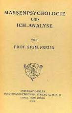

---
title:  'Acción Pública y Cambio Social'
author:
- name: Juan Muñoz
  affiliation: Universitat Autònoma de Barcelona
tags: [Conductas colectivas]
tema: "Teorías"
url: "http:/juan.psicologiasocial.eu"
bibliography: diapos.bib
csl: apa.csl
lateral-menu: 'True'
...

#Las teorías: Contagio  {data-background="imagenes/virus.jpg" data-background-transition=zoom data-state=opacidad}

##Teorías del contagio {data-background="imagenes/zombis.jpg" data-background-transition=fade data-state=fondo}

. . .

> ... difusión del afecto o de la conducta de un participante de la multitud a otro; una persona sirve como estímulo para las acciones imitativas de otra.\
@milgram_collective_1969 [, p. 550]

##Algunos representantes

. . .

. . .

##Irracionales y malvadas

>(...) doce hombres de buen sentido y de inteligencia pueden dar un veredicto estúpido y absurdo. Una reunión de individuos puede, por tanto, dar un resultado opuesto al que habría dado cada uno de ellos (p. 17)

. . .

> La muchedumbre es un terreno en el que se desarrolla muy fácilmente el microbio del mal, y en donde el microbio del bien casi siempre muere, por no encontrar las adecuadas condiciones de vida (p. 64) \
@sighele_foule_1892

##Contra la civilización

> Por su poder exclusivamente destructivo, actúan como aquellos microbios que activan la disolución de los cuerpos debilitados o de los cadáveres. Cuando el edificio de una civilización está carcomido, las masas provocan su derrumbamiento. Se pone entonces de manifiesto su papel. Durante un instante, la fuerza ciega del número se convierte en la única filosofía de la historia.\
@le_bon_psychologie_1895 [, p. 22]

##Mecanismos y resultados

| Mecanismo      | Fenomenología                               | Conducta                           |
|:---------------|:--------------------------------------------|:-----------------------------------|
| Anonimato      | Invencibilidad, irresponsabilidad           | Violenta, antisocial, incivilizada |
| Contagio       | Cambios de conducta rápidos e impredecibles |                                    |
| Sugestibilidad | Afloran los instintos primitivos, salvajes  |                                    |

##El "filósofo español" {data-background="imagenes/Ortega-ElSol-1922-2-4.jpg" data-background-transition=zoom data-state=opacidad}

. . .

>Resulta completamente ocioso discutir si una sociedad debe ser o no debe ser constituida con la intervención de una aristocracia. La cuestión está resuelta desde el primer día de la historia humana; una sociedad sin aristocracia, sin minoría egregia, no es una sociedad.\

> ¿Cuál es, pues, la condición suma? El reconocimiento de que la misión de las masas no es otra que seguir a los mejores, en vez de pretender suplantarlos. Y esto en todo orden y porción de la vida.\
@ortega_y_gasset_espaninvertebrada:_2007

## {data-background="imagenes/Ortega-ElSol-1929-10-24.jpg" data-background-transition=zoom data-state=opacidad}

. . .

>Cuando la masa actúa por sí misma, lo hace sólo de una manera, porque no tiene otra: lincha. (...) Ni mucho menos podrá extrañar que ahora, cuando las masas triunfan, triunfe la violencia y se haga de ella la única ratio, la única doctrina.\
@ortega_y_gasset_rebelion_1930 [, p. 118]

#Convergencia {  data-background="imagenes/crowd.jpg" data-background-transition=zoom data-state=opacidad}

##  {data-background="imagenes/ClaudeNeal.jpg" data-background-transition=zoom data-state=opacidad}

. . .

<video width="800"  class="stretch" controls>
<source src="multimedia/StrangeFruit-BillieHoliday-sub.mp4">
</video>

##

## ¿Por qué?

Milgram i Toch (1969), estudian episodios de linchamientos en pequeñas ciudades de EEUU. La respuesta al porqué no participan en ellos toda la población es que quienes lo hacen son personas propensas a la violencia.

##Individualismo

>No hay psicología de los grupos que no sea esencialmente y por completo una psicología de los individuos.

>El individuo en la masa se comporta simplemente como lo haría solo, pero más.\
@allport_social_1924 [, pp. 4 y 295]

# Críticas

##
>In reality crowd psychology owed less to psychology than to conservative politics. Le Bon's images of the mob (like Taine's before them) inverted Marxist images of a heroic working class. Crowd psychology denied to working people the dignity, autonomy and revolutionary creativity that Marx and other thinkers of the Left conferred on them. Hypnotic explanations stigmatized crowds; they turned motives into impulses and politics into pathology.\
@leach_mental_1992 [p. 13]

##

>By reducing the explanation of collective conflict to the inherent pathology of just one of the parties involved -the crowd- one not only removes all meaning from crowd action, but one also removes all responsibility from the social order and justifies increased repression as the only possible way of treating crowds. In other words, conflict occurs where crowds gather because it is in the very nature of crowds to be conflictual. There is nothing more to be said. Such questions as whether social conditions cause crowd protest or whether police action precipitated violence do not even arise. To study them would simply be a waste of time.\
@stott_crowd_1998 [p. 511]

##Disturbios en Fergurson

`Disturbios en Ferguson, noviembre 2014`{.figcaption}

#Referencias {.center}

## {.scrollable}
