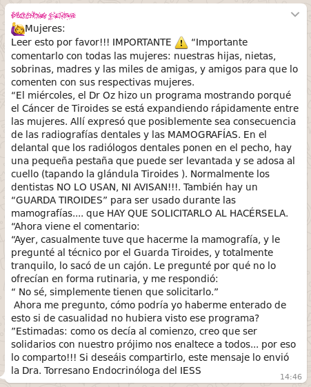

---
title:  'Acción Pública y Cambio Social'
author:
- name: Juan Muñoz
  affiliation: Universitat Autònoma de Barcelona
tags: [Conductas colectivas]
tema: "xxx"
url: "http:/juan.psicologiasocial.eu"
bibliography: diapos.bib
csl: apa.csl
lateral-menu: 'True'
...

# Campos de estudio { .center}

## El rumor

>Mensajero del error y del mal tanto como de la verdad, el rumor, la más rápida de todas las plagas, va desencadenando el terror y se fortifica difundiéndose.\

###Virgilio, La Eneida {.autor}

##

##

##

##

##

## Pánico

## La Guerra de los Mundos

## Violencia fútbol

## Violencia fútbol

## Violencia fútbol

¿Vídeos?
¿Hillsbourgh?
