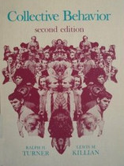
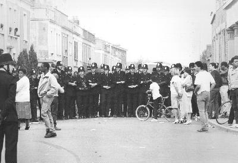
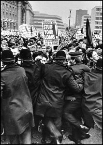
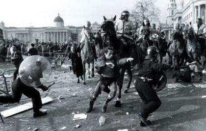

---
title:  'Acción Pública y Cambio Social'
author:
- name: Juan Muñoz
  affiliation: Universitat Autònoma de Barcelona
tags: [Conductas colectivas]
tema: "Normas e identidades"
url: "http:/juan.psicologiasocial.eu"
bibliography: diapos.bib
csl: apa.csl
lateral-menu: 'True'
...

# ¿Quién es irracional? {data-background="imagenes/BloodySunday-bac.jpg" data-background-transition=fade data-state=fondo}

## Domingo Sangriento {data-background="imagenes/BloodySunday-bac.jpg" data-background-transition=fade data-state=fondo}

  <video width="600"   controls>
    <source src="multimedia/SundayBloodySunday.mp4">
  </video>

`https://www.youtube.com/watch?v=vkOpgr1ElXg`{.fondoblanco}

  

#### Ver: @o_dochartaigh_bloody_2010{.fondoblanco}

# Teoría de la Norma Emergente {data-background="imagenes/group-talking.jpg" data-background-transition=fade data-state=fondo}

<!--
## Influencias: Interaccionismo simbólico

* El ser humano orienta sus actos hacia las cosas en función de lo que significan para él.
* El significado de estas cosas es consecuencia de la interacción social.
* Los significados se manipulan y modifican mediante la interpretación que la persona realiza al enfrentarse con el mundo.
-->

<!--
## Influencias: Park y Blumer

Reacción circular

“Milling”

Excitación colectiva

-->

<!--
## Excitación colectiva

>Cuando entra en relación con otros miembros de la masa, un individuo pierde su habitual comprensión crítica y auto-control y queda afectado por la excitación colectiva que la domina. Responde de forma inmediata y directa a los comentarios y conductas de los otros en vez de interpretarlos, como haría en su conducta ordinaria.\
Blumer, 1939, p. 180

-->

<!--
## Modelo de "inquietud social" de Blumer

Colapso del orden social normativo
Inquietud social
Milling: Comportamiento errático y sin objetivo preciso

-->

<!--
## El comportamiento colectivo...

* No es una patología, sino un componente funcional de la sociedad: favorece el cambio
* Es una situación no-estructurada (no normativizada)

-->

<!--
## Cambio

> Para que un individuo pueda efectuar nuevos ajustes y establecer nuevos hábitos, es inevitable que los viejos hábitos sean liquidados, y para que la sociedad pueda reformar el orden social existente, un cierto grado de desorganización es inevitable. El desasosiego social puede ser, por lo tanto, un síntoma saludable. Es sólo cuando el proceso de desorganización tiene lugar rápidamente y cobra una dimensión tal que la estructura social existente se deteriora, y cuando la sociedad se muestra incapaz por esta razón de reajustarse a sí misma, que la inquietud social se convierte en un síntoma patológico. \
Park y Burges, 1921, p. 865

-->

## Norma emergente: Principios

<!--
* Una apuesta por la diferenciación interna de las multitudes, que invalida las teorías del contagio y de la convergencia
-->

. . .

* La conducta de masa no es asocial ni irracional, está regulada por normas que emergen en la propia situación.
* La multitud es un espacio de interacción social en el que se desarrollan normas sociales.

<!--
##Norma emergente: Idea central

>...la conducta de las multitudes (…) está regulada por normas que no vienen de fuera, que no están institucionalizadas, sino que surgen precisamente al hilo del desarrollo de la propia dinámica del comportamiento de la multitud (...); emergen de la propia situación y son vinculantes para los individuos participantes (...) cuando la situación es inicialmente ambigua, surgen definiciones nuevas durante el discurso de la interacción social.\
@ovejero_bernal_individuo_1997 [, p. 218]
-->

<!--
##Proceso

* La actuación de las persona depende de la percepción sobre las normas que rigen la situación.
* En una situación ambigua, las normas son creadas en el transcurso de la interacción.
* La homogeneidad no obedece al contagio, sino a conformidad normativa.
* Las normas derivan de la conducta de personas prominentes (líderes).
* La conducta colectiva no es especialmente irracional.
-->

## El proceso

{.noshadow}

# Identidad Social {data-background="imagenes/group.jpg" data-background-transition=fade data-state=fondo}

##Teoría de la Identidad Social

##La propuesta de Steve Reicher

>Si se deja de lado el exogrupo, no puede comprenderse que la violencia surja de un proceso de conflicto intergrupal. En su lugar se atribuye a la masa misma.\
@reicher_conducta_1987 [, p. 240]

. . .

* Los miembros de la masa actúan en términos de una identidad social común.
* El contenido de la conducta de la masa estará limitado por la naturaleza de la categoría a la que pertenecen.

## Los disturbios de St. Pauls {data-background="imagenes/SaintPauls-back.jpg" data-background-transition=fade data-state=fondo}

<video   class="stretch" controls data-autoplay>
  <source src="multimedia/St_Pauls_Uprising_Bristol_1980.mp4">
</video>

###### <https://www.youtube.com/watch?v=Wdyo16VMhIQ>{.fondoblanco}

@reicher_disturbios_1989

<!--
##Los disturbios de St. Pauls {data-background="imagenes/SaintPauls-back.jpg" data-background-transition=fade data-state=fondo}

  <video   class="stretch" controls data-autoplay>
    <source src="multimedia/St_Pauls_Uprising_Bristol_1980.mp4">
  </video>

###### <https://www.youtube.com/watch?v=Wdyo16VMhIQ>{.figcaption}

  

-->

## Despersonalización

>La despersonalización se refiere a los procesos de autoestereotipación por los que las personas se perciben a sí mismas más como casos intercambiables de una categoría social que como personalidades únicas definidas por sus diferencias individuales respecto a los demás.\
@turner_rediscovering_1987 [, p. 50]

##Críticas a la teoría de la norma emergente

* Su explicación de cómo emergen las normas es inadecuada para explicar las situaciones en las que la masa actúa y cambia rápidamente.
* Énfasis que ponen en el papel de los individuos prominentes en la emergencia de la norma.

<!--
##Bases

Teoría de la Identidad, categorización y comparación social

Teoría de la autocategorización

-->

##Teoría de la autocategorización del yo

Hipótesis 1
:	Tiende a darse una relación inversa entre la saliencia de los niveles personal y social de categorización del yo

Hipótesis 2
:	Cuando nos vemos como miembros intercambiables de una categoría social, nos despersonalizamos

Hipótesis 3
:	La despersonalización de la percepción del yo es el proceso básico que subyace a los fenómenos de grupo

<!--
## Construcción de identidad
>El proceso de construcción de la identidad puede resumirse del siguiente modo: se da una identificación inmediata con una categoría supraordenada que define un campo de posibles identidades; los miembros de la masa tienen que construir entonces una identidad situacional específica que determine las normas de conducta adecuadas, y los medios a través de los cuales lo hacen son el aspecto inductivo de la categorización del yo.\
@reicher_conducta_1987 [, p. 250]
-->

## Diferencias con Norma Emergente

* Las normas se obtienen observando cómo actúan otros, pero esos otros tienen que ser miembros de la categoría.
* No se trata de un proceso de creación, sino de inferencia, lo que permite explicar que las normas “surjan” rápidamente.
* De una multitud no puede surgir cualquier tipo de norma, sólo aquellas que están delimitadas por el contenido categorial.

# Modelo elaborado de identidad social

## Reformulación

>* La identidad social de los miembros de la masa, y por lo tanto sus actuaciones, dependen de las dinámicas intergrupales.

. . .

>* Cuando una multitud hetereogénea es tratada de forma homogénea como una totalidad, se produce un cambio, una reconceptualización de los miembros redefiniéndose como una categoría común.

## La batalla de Westminster (24-11-1998) {data-background="imagenes/BattleOfWestminster.jpg" data-background-transition=fade data-state=opacidad}

. . .

<video width="350"  class="stretch" controls>
<source src="multimedia/Westminster-Student-Demonstration-1988.mp4">
</video>

###### <https://www.youtube.com/watch?v=S1hOoM_93Bo>{.figcaption}

## ¿Responsabilidad?
>las teorías de la multitud que explican la acción colectiva y la conducta colectiva en términos de patología de la masa, sirven para eliminar cualquier responsabilidad posible del Estado y sus fuerzas. Igualmente, en los relatos de nuestros entrevistados no hay lugar para abordar el papel de la policía en la producción de conflicto. La naturaleza de la multitud y sus dinámicas internas son en sí mismas explicaciones suficientes. En ningún momento en las entrevistas, ninguno de los oficiales sugieren que deben mirarse a sí mis mos para una explicación de la violencia.\
@stott_crowd_1998 [, p. 519]

## La visión de la policía

<!--
##

|    |          |                                                                                                   |
|:--:|:---------|:--------------------------------------------------------------------------------------------------|
| T1 | Multitud | Contexto comparativo: Impuesto injusto                                                            |
| T1 | Multitud | Conducta prototípica: Actividad legítima de protesta                                              |
| T1 | Policía  | Contexto comparativo: La multitud supone una amenaza                                              |
| T1 | Policía  | Conducta: Utilización de la fuerza                                                                |
| T2 | Multitud | Cambio en el contexto comparativo: De "impuesto injusto",  a actuación ilegítima de la policía |
| T2 | Multitud | Cambios en identidad y poder: El conflicto hacia  la policía es legítimo                       |
| T2 | Multitud | Cambios en las normas: Conflicto con la policía                                                   |
| T3 | Policía  | Contexto comparativo: Incremento de la amenaza  de la multitud                                 |

:Cambios en las relaciones intergrupales y\
 consecuencias para la conducta prototípica.

###### T1, T2 y T3 = Fases temporales de la relación intergrupal

###### Adaptado de @stott_crowds_2000

-->

## Poll Tax Riots (31-3-1990)

<video width="400"  class="stretch" controls>
<source src="multimedia/PollTaxRiot1990.mp4">
</video>

###### <https://www.youtube.com/watch?v=R3nYGoppmoA>{.figcaption}

## ¿Y qué pasa con los hooligans?

## Violencia fútbol

##Port Said (1-2-2012)

<video  class="stretch" controls>
<source src="multimedia/PortSaid.mp4">
</video>

######<https://www.youtube.com/watch?v=1mUd9vW4NnU>{.figcaption}

## Hillsborough (15-4-1989)

<video  class="stretch" controls>
<source src="multimedia/FiebreMaldiniLaTragediaDeHillsborough.mp4">
</video>

###### <https://www.youtube.com/watch?v=iORjkuClnMo>{.figcaption}

#Referencias {.center}

## {.scrollable .peque}
