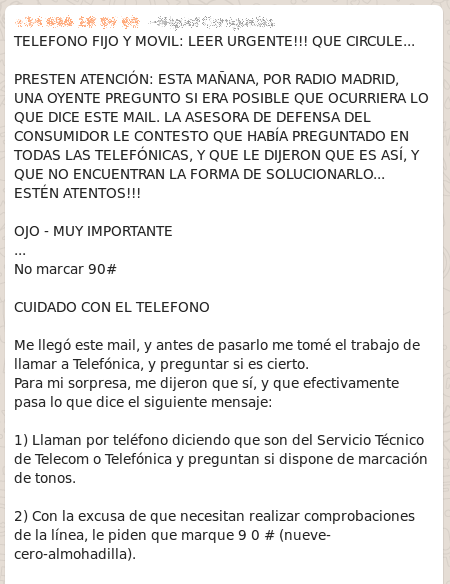
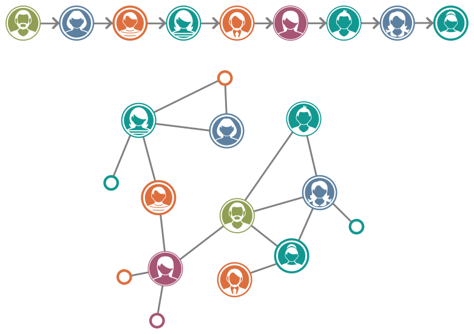
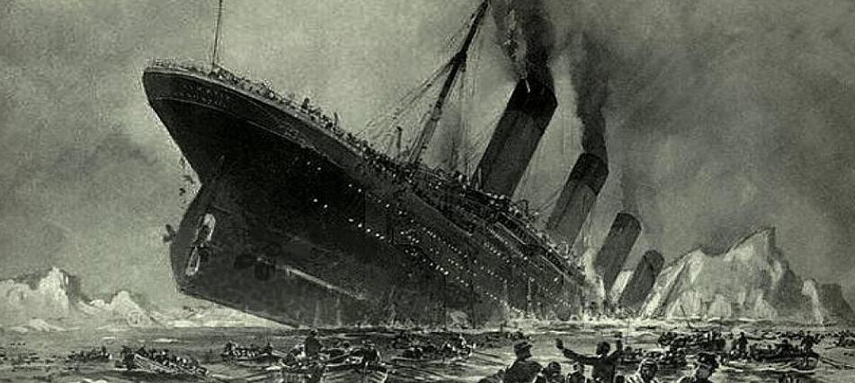

---
title:  'Acción Pública y Cambio Social'
author:
- name: Juan Muñoz
  affiliation: Universitat Autònoma de Barcelona
  email: juan.munoz@uab.cat
tags: [Conductas colectivas]
tema: "Rumores y Pánico"
url: "http:/juan.psicologiasocial.eu"
bibliography: diapos.bib
csl: apa.csl
lateral-menu: 'True'
...

# El rumor{.center data-background="imagenes-APCS-4/Rumor-01.jpg" data-background-transition=fade data-state=opacidad}

## "Definición"

>Mensajero del error y del mal tanto como de la verdad, el rumor, la más rápida de todas las plagas, va desencadenando el terror y se fortifica difundiéndose.\
`Virgilio, La Eneida`{.autor}

<!--
## Ejemplos

##

-->

## Tipos de rumor

>* Expresan deseos o "sueños imposibles"
* Pesimistas o de miedo
* De contenido agresivo
* Sobre productos
* Sobre desastres
* De atrocidades
* De conspiraciones

@knapp_psychology_1944

## Procter & Gamble

## Panfleto de Villejuif

## Allport y Postman: Transmisión serial

##

>El enfoque de Allport y Postman es diferente del que trata el rumor como una forma de opinión pública y a la opinión pública como un complejo proceso colectivo. Asumen que el contexto social en el que se producen los rumores puede reducirse a una simple cadena de sujetos; que, por implicación, la amplia circulación del rumor no es nada más que la adición de tales cadenas; y que el rumor puede ser explicado, al menos en parte, por referencia a mecanismos psicológicos uniformes y omnipresentes como 'el proceso economizador de memoria'.\
@peterson_rumor_1951 [, p. 161]

## Allport y Postman: Tranformación

>* **Nivelación o reducción**: Según va circulando, el rumor se reduce, se acorta, se hace más conciso y por lo tanto más fácil de recordar y transmitir.
* **Acentuación**: Percepción, retención y narración selectiva de un limitado número de pormenores de un contexto mayor.
* **Asimilación**: Distorsión de la información por asimilación a los marcos de referencia de la persona.

@allport_psicologirumor_1947

## Transmisión: Serie vs. red

## Contra los rumores

[http://stoprumores.com/rumores/](http://stoprumores.com/rumores/)

# Pánico {.center data-background="imagenes-APCS-4/Panic.jpg" data-background-transition=fade data-state=opacidad}

. . .

##¿Qué es el pánico?

>Miedo colectivo intenso, experimentado simultáneamente por todos los miembros de una población, caracterizado por la regresión de las conciencias a un nivel arcaico, impulsivo y gregario, y que se traduce en reacciones primitivas de huida, de agitación desordenada, de violencia o de suicidio colectivo.”\
[Crocq et al., 1987. Citado por @dupuy_panico_1991, pág. 25]

## La Guerra de los Mundos

# Referencias{.center data-background="imagenes/Books.jpg" data-background-transition=zoom data-state=opacidad}

## {.scrollable .peque}
