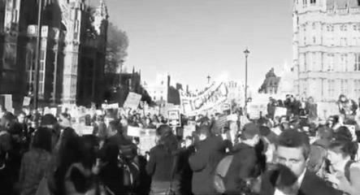

---
title:  'Acción Pública y Cambio Social'
author:
- name: Juan Muñoz
  affiliation: Universitat Autònoma de Barcelona
tags: [Conductas colectivas]
tema: "Normas e identidades"
url: "http:/juan.psicologiasocial.eu"
bibliography: diapos.bib
csl: apa.csl
lateral-menu: 'True'
...

<video   class="stretch" controls data-autoplay>
  <source src="imagenes-APCS-4/WhiteRiot.mp4">
</video>

# Teoría de la Norma Emergente {.center data-background="imagenes-APCS-4/Confused.jpg" data-background-transition=fade data-state=fondo}

## Influencias: Interaccionismo simbólico {#influencias}

>* El ser humano orienta sus actos hacia las cosas en función de lo que significan para él.
* El significado de estas cosas es consecuencia de la interacción social.
* Los significados se manipulan y modifican mediante la interpretación que la persona realiza al enfrentarse con el mundo.

###### @blumer_interaccionismo_1969 [p, 2] {.autor}

<!--
## Influencias: Park y Blumer

:::::: {.columns}
::: {.column width="30%"}

:::
::: {.column width="30%"}
Reacción circular

“Milling”

Excitación colectiva
:::
::: {.column width="35%"}

:::
::::::

-->

## Excitación colectiva {#excitacion-colectiva}

>Cuando entra en relación con otros miembros de la masa, un individuo pierde su habitual comprensión crítica y auto-control y queda afectado por la excitación colectiva que la domina. Responde de forma inmediata y directa a los comentarios y conductas de los otros en vez de interpretarlos, como haría en su conducta ordinaria.\
@blumer_collective_1939[, p. 180]

## Interacción no interpretativa {#reaccion-circular}

::: notes
Para la explicación de las conductas colectivas, Park y Blumer diferencian entre dos tipos de interacciones:

La **“interacción interpretativa”**, típica de la conducta rutinaria, en el que la interacción está guiada por los significados y expectativas compartidos, en los que la respuestas ante la actuación de los otros dependen de la interpretación que se realiza de dichas conductas, más que de la conducta en sí misma.

La **interacción no interpretativa, no simbólica** puede producirse cuando ocurren condiciones de *malestar social* como las que se dan cuando hay cambios significativos en las formas de vida, «cuando la gente tiene impulsos, deseos o disposiciones que no se pueden satisfacer». En esas condiciones, el tipo de interacción es no interpretativa, no simbólica, una forma de interacción que designa como

*reacción circular*: «un tipo de interestimulación de la conducta en la que la respuesta de un individuo reproduce el estímulo que le llega de otro y, al dirigirse otra vez a dicho individuo, refuerza el estímulo anterior» (1939: 224). Esta forma de interacción se denomina circular porque la acción de un individuo tiene un efecto reflejo sobre él, sin que sea mediada por otros elementos de carácter simbólico o cultural. Cada individuo refleja sobre el otro sus sentimientos de pánico, agresividad o irritación, y al hacerlo retornan a él intensificados. (Laraña, 1996, p. 29)
:::

<!--
## Modelo de "inquietud social" de Blumer

Colapso del orden social normativo
Inquietud social
Milling: Comportamiento errático y sin objetivo preciso

-->

<!--
## El comportamiento colectivo...

* No es una patología, sino un componente funcional de la sociedad: favorece el cambio
* Es una situación no-estructurada (no normativizada)

-->

<!--
## Cambio

> Para que un individuo pueda efectuar nuevos ajustes y establecer nuevos hábitos, es inevitable que los viejos hábitos sean liquidados, y para que la sociedad pueda reformar el orden social existente, un cierto grado de desorganización es inevitable. El desasosiego social puede ser, por lo tanto, un síntoma saludable. Es sólo cuando el proceso de desorganización tiene lugar rápidamente y cobra una dimensión tal que la estructura social existente se deteriora, y cuando la sociedad se muestra incapaz por esta razón de reajustarse a sí misma, que la inquietud social se convierte en un síntoma patológico. \
Park y Burges, 1921, p. 865

-->

## Norma emergente: Principios

:::::: {.columns}
::: {.column width="35%"}

:::
::: {.column width="35%"}
@turner_collective_1957
:::
::: {.column width="30%"}
:::
::::::

<!--
* Una apuesta por la diferenciación interna de las multitudes, que invalida las teorías del contagio y de la convergencia
-->

. . .

>* La conducta de masa no es asocial ni irracional, está regulada por normas que emergen en la propia situación.
* La multitud es un espacio de interacción social en el que se desarrollan normas sociales.

<!--
## Norma emergente: Idea central

>...la conducta de las multitudes (…) está regulada por normas que no vienen de fuera, que no están institucionalizadas, sino que surgen precisamente al hilo del desarrollo de la propia dinámica del comportamiento de la multitud (...); emergen de la propia situación y son vinculantes para los individuos participantes (...) cuando la situación es inicialmente ambigua, surgen definiciones nuevas durante el discurso de la interacción social.\
@ovejero_bernal_individuo_1997 [, p. 218]
-->

<!--
## Proceso

* La actuación de las persona depende de la percepción sobre las normas que rigen la situación.
* En una situación ambigua, las normas son creadas en el transcurso de la interacción.
* La homogeneidad no obedece al contagio, sino a conformidad normativa.
* Las normas derivan de la conducta de personas prominentes (líderes).
* La conducta colectiva no es especialmente irracional.
-->

## El proceso

{.noshadow}

# Identidad Social {.center data-background="imagenes-APCS-4/Group.jpg" data-background-transition=fade data-state=fondo}

## Teoría de la Identidad Social {#teoria-identidad-social}

:::::: {.columns}
::: {.column width="50%"}

:::
::: {.column width="50%"}

:::
::::::

## La propuesta de Steve Reicher

>Si se deja de lado el exogrupo, no puede comprenderse que la violencia surja de un proceso de conflicto intergrupal. En su lugar se atribuye a la masa misma.\
@reicher_conducta_1987 [, p. 240]

* Los miembros de la masa actúan en términos de una identidad social común.
* El contenido de la conducta de la masa estará limitado por la naturaleza de la categoría a la que pertenecen.

::: notes
Reicher señala que una de las limitaciones de las teorías clásicas es que no tiene en cuenta el carácter social de la misma, algo que queda patente si se tiene en cuenta que la conducta de masas no puede reducirse a un tipo de conductas concretas (destructivas y violentas) y que incluso cuando se produce tal violencia los acontecimientos son selectivos y muestran un patrón que toma sentido cuando se analiza en términos de las ideologías asociadas con los colectivos implicados.
:::

## Los disturbios de St. Pauls {data-background="imagenes-APCS-4/SaintPauls-back.jpg" data-background-transition=fade data-state=fondo}

<video   class="stretch" controls data-autoplay>
  <source src="imagenes-APCS-4/St_Pauls_Uprising_Bristol_1980.mp4">
</video>

[https://www.youtube.com/watch?v=Wdyo16VMhIQ](https://www.youtube.com/watch?v=Wdyo16VMhIQ){.peque .fondoblanco target="_blank"}

#### Ver: @reicher_st._1984 {.autor .fondoblanco}

::: notes
En su estudio de los disturbios de St. Pauls, se muestran los límites de la acción tanto geográficamente como hacia quién va dirigida.
:::

## Despersonalización {#despersonalizacion}

>La despersonalización se refiere a los procesos de autoestereotipación por los que las personas se perciben a sí mismas más como casos intercambiables de una categoría social que como personalidades únicas definidas por sus diferencias individuales respecto a los demás.\
@turner_rediscovering_1987 [, p. 50]

::: notes
Hay que entenderla de una forma totalmente diferente al concpeto de desindividuación de teorías anteriores, puesto que no se trata de una inmersión del yo en el grupo, y tampoco una regresión a una forma de identidad más primitiva o inconsciente, sino que lo que realmente implica es el paso del funcionamiento en términos de una identidad personal a hacerlo en función de una identidad social.

Al sentirse miembros de un grupo, se incrementa entre ellos la atracción y la empatía, y como resultado de ello, aumenta la cohesión, entendida como atracción mutua entre el conjunto de miembros del grupo, la cual a su vez tiende a producir unidad de creencias y cooperación.

:::

## Críticas a la teoría de la norma emergente {#critica-norma-emergente}

* Su explicación de cómo emergen las normas es inadecuada para explicar las situaciones en las que la masa actúa y cambia rápidamente.
* Énfasis que ponen en el papel de los individuos prominentes en la emergencia de la norma.

## Diferencias con Norma Emergente

* Las normas se obtienen observando cómo actúan otros, pero esos otros tienen que ser miembros de la categoría.
* No se trata de un proceso de creación, sino de inferencia, lo que permite explicar que las normas “surjan” rápidamente.
* De una multitud no puede surgir cualquier tipo de norma, sólo aquellas que están delimitadas por el contenido categorial.

<!--
## Bases

:::::: {.columns}
::: {.column width="50%"}
Teoría de la Identidad, categorización y comparación social

:::
::: {.column width="50%"}
Teoría de la autocategorización

:::
::::::

-->

## Teoría de la autocategorización del yo {#teoria-autocategorizacion}

- Tiende a darse una relación inversa entre la saliencia de los niveles personal y social de categorización del yo
- Cuando nos vemos como miembros intercambiables de una categoría social, nos despersonalizamos
- La despersonalización de la percepción del yo es el proceso básico que subyace a los fenómenos de grupo

<!--
## Construcción de identidad {#construccion-identidad}
>El proceso de construcción de la identidad puede resumirse del siguiente modo: se da una identificación inmediata con una categoría supraordenada que define un campo de posibles identidades; los miembros de la masa tienen que construir entonces una identidad situacional específica que determine las normas de conducta adecuadas, y los medios a través de los cuales lo hacen son el aspecto inductivo de la categorización del yo.\
@reicher_conducta_1987 [, p. 250]
-->

# Modelo elaborado de identidad social {.center}

## Reformulación {#reformulacion}

>* La identidad social de los miembros de la masa, y por lo tanto sus actuaciones, dependen de las dinámicas intergrupales.

. . .

>* Cuando una multitud hetereogénea es tratada de forma homogénea como una totalidad, se produce un cambio, una reconceptualización de los miembros redefiniéndose como una categoría común.

::: notes
El Modelo Elaborado de la Identidad Social se formula para tener en cuenta el contexto, entendido como constituido para un grupo por las acciones del otro y viceversa. Esta reformulación también intenta responder cómo la actuación en términos de una posición determinada (como miembro de una categoría) puede llevar a cambios en esa posición y a cambios en la autocomprensión (autoconcepto).
:::

## Protesta ambiental

## La batalla de Westminster (24-11-1998) {data-background="imagenes-APCS-4/BattleOfWestminster.jpg" data-background-transition=fade data-state=opacidad}

. . .

<!-- :::::: {.columns}
::: {.column width="50%"}

:::
:::::: -->

:::::: {.columns}
::: {.column width="70%"}
 <video data-autoplay width="450"  class="stretch" controls>
   <source src="imagenes-APCS-4/Westminster-Student-Demonstration-1988.mkv">
 </video>
 [https://www.youtube.com/watch?v=S1hOoM_93Bo](https://www.youtube.com/watch?v=S1hOoM_93Bo){.peque .fondoblanco target="_blank"}
:::
::: {.column width="30%"}
 
:::
::::::

::: notes
La "creación de identidades" se relaciona con datos que sugieren que las autoridades tienden a considerar las grandes multitudes, por su número, como una amenaza potencial al orden público. La policía, que tiene esa concepción, también tiene el poder de actuar en función de ella utilizando su poder coercitivo, pero lo hacen de forma indiscriminada sobre el colectivo como algo único. Esas tácticas provocan, por lo tanto, que todos los manifestantes compartan la misma experiencia, lo que favorece la formación de grupo y explica cómo una masa fragmentada puede llegar a convertirse en una homogénea.
:::

## Poll Tax Riots (31-3-1990)

<!-- :::::: {.columns}
::: {.column width="50%"}

:::
::: {.column width="50%"}

:::
:::::: -->

:::::: {.columns}
::: {.column width="50%"}

:::
::: {.column width="50%"}
 <video data-autoplay width="400"  class="stretch" controls>
  <source src="imagenes-APCS-4/PollTaxRiot1990.mkv">
 </video>

[https://www.youtube.com/watch?v=R3nYGoppmoA](https://www.youtube.com/watch?v=R3nYGoppmoA){.peque target="_blank"}
:::
::::::

## ¿Responsabilidad?

>Las teorías de la multitud que explican la acción colectiva y la conducta colectiva en términos de patología de la masa, sirven para eliminar cualquier responsabilidad posible del Estado y sus fuerzas. Igualmente, en los relatos de nuestros entrevistados no hay lugar para abordar el papel de la policía en la producción de conflicto. La naturaleza de la multitud y sus dinámicas internas son en sí mismas explicaciones suficientes. En ningún momento en las entrevistas, ninguno de los oficiales sugieren que deben mirarse a sí mismos para una explicación de la violencia.\
@stott_crowd_1998 [, p. 519]

<!--
## La visión de la policía {#vision-policia}

 -->

<!--

##

|    |          |                                                                                                   |
|:--:|:---------|:--------------------------------------------------------------------------------------------------|
| T1 | Multitud | Contexto comparativo: Impuesto injusto                                                            |
| T1 | Multitud | Conducta prototípica: Actividad legítima de protesta                                              |
| T1 | Policía  | Contexto comparativo: La multitud supone una amenaza                                              |
| T1 | Policía  | Conducta: Utilización de la fuerza                                                                |
| T2 | Multitud | Cambio en el contexto comparativo: De "impuesto injusto",  a actuación ilegítima de la policía |
| T2 | Multitud | Cambios en identidad y poder: El conflicto hacia  la policía es legítimo                       |
| T2 | Multitud | Cambios en las normas: Conflicto con la policía                                                   |
| T3 | Policía  | Contexto comparativo: Incremento de la amenaza  de la multitud                                 |

:Cambios en las relaciones intergrupales y\
 consecuencias para la conducta prototípica.

###### T1, T2 y T3 = Fases temporales de la relación intergrupal

###### Adaptado de @stott_crowds_2000

-->

## ¿Y qué pasa con los hooligans? {#que-pasa-hooligans}

## Violencia fútbol {#violencia-futbol}

{target="_blank"}

[Tragedia de Heysel - 29 de mayo de 1985](https://www.youtube.com/watch?v=3AD9XBdV7c4){target="_blank"}

## Port Said (1-2-2012)

<video  data-autoplay class="stretch" controls>
<source src="imagenes-APCS-4/EgyptPortSaid.mp4">
</video>

[https://www.youtube.com/watch?v=1mUd9vW4NnU](https://www.youtube.com/watch?v=1mUd9vW4NnU){.peque target="_blank"}

## Hillsborough (15-4-1989)

<video  class="stretch" controls>
<source src="imagenes-APCS-4/FiebreMaldiniLaTragediaDeHillsborough.mp4">
</video>

[https://www.youtube.com/watch?v=iORjkuClnMo](https://www.youtube.com/watch?v=iORjkuClnMo){.peque target="_blank"}

## Crowd action

# Referencias {.center}

## {.scrollable .peque}
