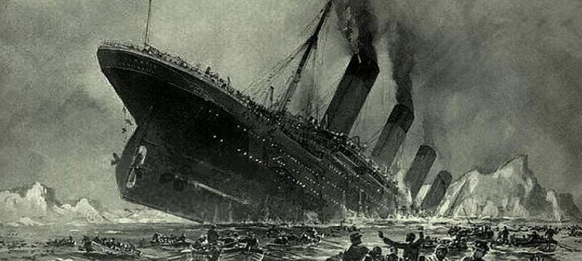
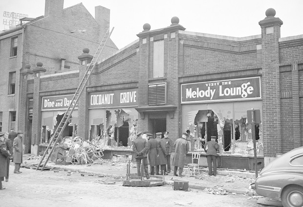
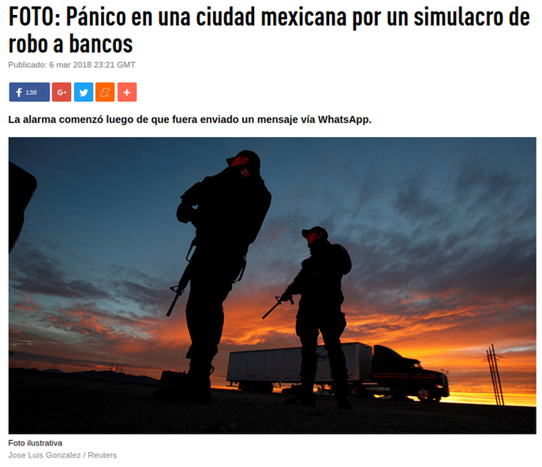

---
title:  'Acción Pública y Cambio Social'
author:
- name: Juan Muñoz
  affiliation: Universitat Autònoma de Barcelona
  email: juan.munoz@uab.cat
tags: [Conductas colectivas]
tema: "El Pánico"
url: "http:/juan.psicologiasocial.eu"
bibliography: diapos.bib
csl: apa.csl
lateral-menu: 'True'
...

## Desastres

<!--  -->

:::::: {.columns}
::: {.column width="50%"}

:::
::: {.column width="50%"}

:::
::::::

::: notes
Entre los "acontecimientos extraordinarios" característicos de las conductas colectivas, se encuentran desastres: accidentes, incendios, tragedias naturales, terrorismo...

Como por ejemplo el incendio en la sala de fiestas *Cocoanut Grove* (Boston, 28 nov. 1942) que provocó 492 muertes (32 más que el aforo del local) o el ciclón tropical *Bhola* (Bangladés y Bengala 12 de nov. de 1970), que provocó 500000 víctimas aproximadamente.

Ante casos como estos, estamos acostumbrados a escuchar relatos sobre el "pánico" que sufren sus víctimas.

Pero ¿qué es el pánico?
:::

## ¿Qué es el pánico? {#que-es-panico}

>Miedo colectivo intenso, experimentado simultáneamente por todos los miembros de una población, caracterizado por la [regresión de las conciencias a un nivel arcaico, impulsivo y gregario]{.fosforito}, y que se traduce en [reacciones primitivas]{.fosforito} de huida, de agitación desordenada, de violencia o de suicidio colectivo.\
[Crocq et al., 1987. Citado por @dupuy_panico_1999, pág. 25]

::: notes
Miedo colectivo intenso, **desproporcionado** con respecto al peligro real. En el que las emociones superan al razonamiento y domina el terror, lo que lleva a actuar de forma *contraria a los valores* y normas civilizadas. Se traduce en reacciones de huida, de agitación desordenada, de violencia, puesto que dominan los instintos primitivos de luchar o huir. Frecuentemente el resultado será un *comportamiento no coordinado y competitivo*, una actuación egoísta, preocupándose sólo de su seguridad personal desatendiendo incluso a sus familiares más cercanos y por supuesto no cooperando con los que no lo son.

Evidentemente, esta definición podría ser suscrita por las *teorías irracionalistas*, pues caracteriza al ser humano no sólo como irracional (en la lína de Le Bon), sino también como egoista. Pero también, en parte, por la Teoría de la Norma Emergente, pues afirma que los contextos en los que es necesaria una redefinición de la situación, como en el caso de los desasteres, pueden darse en un contexto de existencia o no de relaciones sociales previas.

En los casos en que no existen relaciones sociales previas, en los que las personas implicadas son desconocidas entre sí o no tienen lazos fuertes, "El comportamiento puede entonces volverse altamente egoísta y agresivo, no como resultado del pánico irracional, sino de definiciones emergentes de la situación como una en la cual las normas de civilidad ya no se aplican, y competir por la ventaja individual es legítimo." (Johnson 1987:173)
:::

## Egoísmo: Tragedia de los comunes {#tragedia}

>Pero, ¿qué significa libertad? Cuando los hombres mutuamente acordaron instaurar leyes contra los robos, la humanidad se volvió más libre, no menos. Los individuos encerrados en la lógica de los recursos comunes son libres únicamente para traer la ruina universal; una vez que ven la necesidad de la coerción mutua, quedan libres para perseguir nuevas metas.\
`Hardin, 1968`{.autor}

::: notes
Una visión compartida desde otros campos de estudio. Por ejemplo Garret Hardin defiende, dado el egosimo humano, la necesidad de control de los bienes comunes por parte del Estado o su paso a propiedad privada.
:::

## ¿Egoísmo? {#apoyo-mutuo}

:::::: {.columns}
::: {.column width="20%"}

:::
::: {.column width="80%"}
>Afirmamos que la sociabilidad es la ventaja más grande en la lucha por la existencia en todas las circunstancias naturales, sean cuales fueran. Las especies que voluntaria o involuntariamente reniegan de ella, están condenadas a la extinción, mientras que los animales que saben unirse del mejor modo, tienen mayores oportunidades para subsistir y para un desarrollo máximo (…)  Los vertebrados superiores, y en especial el género humano, sirven como la mejor demostración de esta afirmación.\
@kropotkin_apoyo_1902
:::
::::::

## El mito

>50 años de evidencia sobre el pánico, y la conclusión es clara: la gente raramente entra en pánico, al menos en el sentido usual en que se usa esa palabra. Incluso cuando la gente siente un "miedo excesivo" -una sensación de abrumadora perdición- por lo general evitan los "esfuerzos imprudentes" y el "caos". En particular, es improbable que causen daño a los demás en su búsqueda de seguridad e incluso pueden poner sus propias vidas en peligro para ayudar a los demás.\
@clarke_panic:_2002 [p. 21]

::: notes
Pero contrario al mito, las víctimas de desastres generalmente no entran en pánico. Aunque es cierto que lo pueden experimentar algunas de las personas implicadas, y que efectivamente tras un desastre puede observarse conductas de pánico, la respuesta más generalizada es de calma y conductas de busca de solución de problemas. Hay numerosos ejemplos de que hay bastante compostura, casi frialdad y que las personas se ayudan unas a otras, con actos casi heróicos.
:::

## Pánico en la prensa {#panico-prensa1}

::: notes
Aún así, podemos ver que es cierto que se transmite esa imagen de irracionalidad simplemente analizando las informaciones en prensa sobre los desastres.
:::

## {#panico-prensa2}

## La Guerra de los Mundos

::: notes
Un ejemplo de informaciones de prensa en el que se destaca el pánico de la población, es el famoso caso de la emisión radiofónica (dirigida por Orson Wells) de la *Guerra de los mundos* (30 de octubre de 1938), que llevó a miles de personas a creer que efectivamente los marcianos habían invadido la prensa.

Las portadas de los diarios de los siguientes días enfatizaban el pánico sufrido por la población, aunque algunos análistas descartan que el pánico (que seguro que se produjo) fuera realmente tan generalizado como se pretendía.
:::

##

>Antes de que terminara el radiograma, en todo el territorio de la Unión la gente rezaba, lloraba y huía despavorida ante el avance de los marcianos. Algunos corrían para socorrer a sus seres queridos. otros de despedían o hacían advertencias por teléfono, se apresuraban a informar a los vecinos, buscaban informes en los diarios o en las estaciones de radio, y pedían ambulancias a los hospitales y automóviles a la Policía. Se calcula que unos seis millones de personas oyeron el radiodrama y que, por lo menos, un millón de ellas se asustaron o se inquietaron.\
@cantril_hadley_invasion_1942 [p. 63]

## Modelo de afiliación de A.R. Mawson {#modelo-mawson}

>- Frente a la amenaza, estamos motivados a buscar lo familiar en lugar de simplemente huir.
- La presencia de familiares o allegados tiene un efecto calmante.
- El peligro físico parece ser mucho menos perturbador o estresante que la separación de sus semejantes y su entorno.
- Los individuos se calman por la presencia de objetos de unión, mientras que lo contrario es cierto si están solos, con extraños, o en un entorno desconocido.

###### @mawson_understanding_2005 {.autor}

::: notes
El *modelo de afiliación* defiende que muchas de las conductas que en ocasiones son interpretadas como pánico, son básicamente conductas de tipo afiliativo, intentos de contactar con personas allegadas o incluso necesidad de acceder a "lugares familiares"
:::

## Identidad social y resiliencia

>Mientras que el modelo de afiliación pone su énfasis teórico en los lazos sociales preexistentes. Lo que se necesita es un modelo de socialidad emergente masiva, es decir, una explicación que permita entender el surgimiento de lazos sociales en una multitud de extraños. En resumen, si bien el enfoque del 'pánico masivo' enfatiza la disolución de los lazos sociales, y los enfoques normativos y de afiliación enfatizan su mantenimiento, también debemos considerar la posibilidad de la creación de tales vínculos.\
@drury_everyone_2009 [p, 488]

# Referencias{.center data-background="fondos/Books.jpg" data-background-transition=zoom data-state=opacidad}

## {.scrollable .peque}
