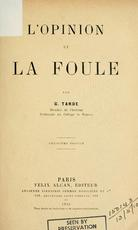
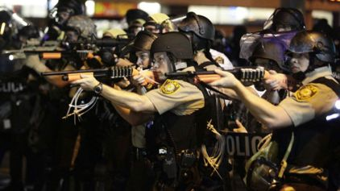
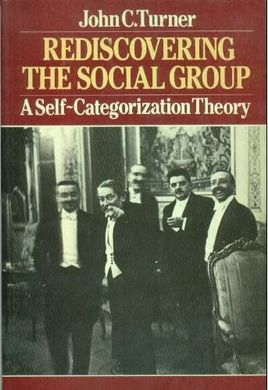
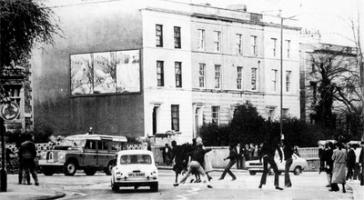
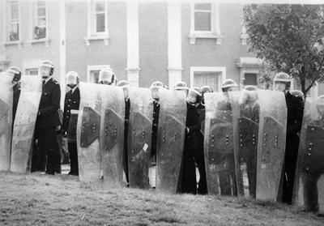

---
title:  'Acción Pública y Cambio Social'
author:
- name: Juan Muñoz
  affiliation: Universitat Autònoma de Barcelona
tags: [nothing, nothingness]
tema: "Teorías de la conducta colectiva"
url: "http:/juan.psicologiasocial.eu"
bibliography: diapos.bib
csl: apa.csl
...

##Índice

* Los inicios <!-- '>' hace que La lista se muestra en un solo paso-->
* Teorías del contagio
* Teoría de la convergencia
* Teorías de la crisis
* Teorías de la identidad social

#Los inicios {.mitit .center}

## {data-background="imagenes/ComunaBarricadas.jpg" data-background-transition=fade data-state=fondo}

. . .

## {data-background="imagenes/ComunaBarricadas.jpg" data-background-transition=fade data-state=fondo}

##Preguntas {data-state=opacidad}

* ¿Quiénes eran los participantes en las acciones de masas?
* ¿Cómo se explicaba que ciudadanos habitualmente respetuosos de las leyes se involucren en actos perturbadores del orden social?
* ¿Cómo se podían prevenir las explosiones violentas de las masas cuando se dan las condiciones para que éstas actúen colectivamente?

##Respuestas: Los fenómenos de masas...

* Son amenazas para el orden social
* Son manifestaciones patológicas de la naturaleza humana
* Son irracionales

##
> Los senadores son todos hombres de bien, el Senado romano es una mala bestia.\
[Citado por @moscovici_era_1985]

#Las teorías: Contagio  {.mitit .center}

##Teorías del contagio {data-background="imagenes/zombis.jpg" data-background-transition=fade data-state=fondo}

. . .

> ... difusión del afecto o de la conducta de un participante de la multitud a otro; una persona sirve como estímulo para las acciones imitativas de otra.\
@milgram_collective_1969 [, p. 550]

##Algunos representantes

. . .

. . .

##Irracionales y malvadas

>...una docena de hombres inteligentes, sensatos y buenos, son capaces de emitir juicios y veredictos perfectamente estúpidos y carentes de toda lógica.

. . .

>La masa es un terreno donde el microbio del mal se desarrolla muy fácilmente, mientras que el microbio del bien muere casi siempre.\
@sighele_foule_1901

##Contra la civilización

> Por su poder exclusivamente destructivo, actúan como aquellos microbios que activan la disolución de los cuerpos debilitados o de los cadáveres. Cuando el edificio de una civilización está carcomido, las masas provocan su derrumbamiento. Se pone entonces de manifiesto su papel. Durante un instante, la fuerza ciega del número se convierte en la única filosofía de la historia.\
@lebon_psychologie_1895 [, p. 22]

##Mecanismos y resultados

| Mecanismo      | Fenomenología                               | Conducta                           |
|:---------------|:--------------------------------------------|:-----------------------------------|
| Anonimato      | Invencibilidad, irresponsabilidad           | Violenta, antisocial, incivilizada |
| Contagio       | Cambios de conducta rápidos e impredecibles |                                    |
| Sugestibilidad | Afloran los instintos primitivos, salvajes  |                                    |

##Rajoy plasma {data-background="imagenes/RajoyPlasma.jpg" data-background-transition=fade data-state=fondo}

>En un discurso afirmar significa una negativa a discutir, porque el poder de un hombre o de una idea que se discute pierde toda credibilidad. Esto significa también una petición hecha al auditorio, a la multitud, de que acepte la idea sin deliberar, de que la recoja tal como es sin pesar el pro y el contra, de contestar sí sin reflexionar.\
@moscovici_era_1985 [, p. 185]

##Repetición

>Aquello que se repite concluye, en efecto, por incrustarse en las regiones profundas del inconsciente en donde se elaboran los motivos de nuestros actos. Al cabo de algún tiempo, olvidando cuál es el autor de la afirmación repetida, acabamos por creer en ella.\
@lebon_psychologie_1895 [, p. 94]

##

Frente a: "Las multitudes son la plebe, el populacho"
:   Cualquiera, independientemente de su capacidad intelectual, de sus características individuales, puede convertirse en miembro de la masa.

Frente a: "La masa es criminal (única y exclusivamente)"
:   La irracionalidad puede llevar tanto a conductas destructivas como altruistas.

##Las mujeres {data-background="imagenes/Mujeres.jpg" data-background-transition=fade data-state=fondo}

. . .

> A la mujer se le atrofia la inteligencia como las alas a las mariposas de la isla de Kerguelen, ya que su misión en el mundo no es la de luchar en la vida, sino acunar la descendencia de quien tiene que luchar por ella.\
@vallejonagera_psicologia_1944 [, p. 44]

##El "filósofo español"

>Cuando la masa actúa por sí misma, lo hace sólo de una manera, porque no tiene otra: lincha. (...) Ni mucho menos podrá extrañar que ahora, cuando las masas triunfan, triunfe la violencia y se haga de ella la única ratio, la única doctrina.\
@ortegaygasset_rebelion_2003 [, p. 118]

#Teorías de la Convergencia {.mitit .center}

##Individualismo

>No hay psicología de los grupos que no sea esencialmente y por completo una psicología de los individuos.

>El individuo en la masa se comporta simplemente como lo haría solo, pero más.\
@allport_social_1924 [, pp. 4 y 295]

##

#Teorías de la Crisis {.mitit .center}

##Privación relativa

>Cuando van creciendo a la par la satisfacción real de necesidades y la satisfacción esperada, no se produce violencia (aun cuando exista un ligero desnivel entre ambas que genera una insatisfacción tolerable), pero cuando la satisfacción real queda bloqueada y las expectativas continúan creciendo, el desnivel entre lo que se tiene realmente y lo que se esperaba tener puede hacerse muy grande, convirtiéndose en intolerable, produciéndose entonces la situación de curva J característica de las revoluciones.\
@javaloy_comportamiento_2003 [, p. 180]

##La Teoría de la "Curva en J"

##Teoría del Valor Añadido

##

>Según Semelser (1963), la conducta colectiva ocurre cuando las personas se preparan para actuar en base a una creencia que se centra en cambiar algún aspecto de la sociedad, pero surge sólo cuando no hay otros medios de conseguir la meta deseada mediante las instituciones normales de la sociedad. Es una conducta que ocurre, por lo tanto, fuera de las instituciones, y es una conducta que está propositivamente orientada hacia el cambio.\
@milgram_collective_1969 [, p. 555]

##Determinantes

* Conductividad estructural
* Tensión estructural
* Creencia generalizada
* Suceso precipitador
* Movilización activa
* Control social

##Disturbios en Fergurson

`Disturbios en Ferguson, noviembre 2014`{.figcaption}

##Un ejemplo: Universidad de Kent

<video width="400"  class="stretch" controls>
<source src="multimedia/KentState.mp4">
</video>

######<https://www.youtube.com/watch?v=DURww8TsAlA>{.figcaption}

@lewis_study_1972

#Teorías: Normas e Identidades {.mitit .center}

##Teoría de la Norma Emergente

##Influencias: Interaccionismo simbólico

* El ser humano orienta sus actos hacia las cosas en función de lo que significan para él
* El significado de estas cosas es consecuencia de la interacción social
* Los significados se manipulan y modifican mediante la interpretación que la persona realiza al enfrentarse con el mundo

##Influencias

#### Reacción circular
####“Milling”
####Excitación colectiva

##Excitación colectiva

>Cuando entra en relación con otros miembros de la masa, un individuo pierde su habitual comprensión crítica y auto-control y queda afectado por la excitación colectiva que la domina. Responde de forma inmediata y directa a los comentarios y conductas de los otros en vez de interpretarlos, como haría en su conducta ordinaria.\
@blumer_collective_1939 [, p. 180]

##Modelo de inquietud social de Blumer

##El comportamiento colectivo...

* No es una patología, sino un componente funcional de la sociedad: favorece el cambio
* Es una situación no-estructurada (no normativizada)

##Norma emergente: Principios

* Una apuesta por la diferenciación interna de las multitudes, que invalida las teorías del contagio y de la convergencia
* La conducta de masa no es asocial ni irracional, está regulada por normas que emergen en la propia situación
* La multitud es un espacio de interacción social en el que se desarrollan normas sociales

##Norma emergente: Idea central

>...la conducta de las multitudes (…) está regulada por normas que no vienen de fuera, que no están institucionalizadas, sino que surgen precisamente al hilo del desarrollo de la propia dinámica del comportamiento de la multitud (...); emergen de la propia situación y son vinculantes para los individuos participantes (...) cuando la situación es inicialmente ambigua, surgen definiciones nuevas durante el discurso de la interacción social.\
@ovejerobernal_individuo_1997 [, p. 218]

##Proceso

* La actuación de las persona depende de la percepción sobre las normas que rigen la situación
* En una situación ambigua, las normas son creadas en el transcurso de la interacción
* La homogeneidad no obedece al contagio, sino a conformidad normativa
* Las normas derivan de la conducta de personas prominentes (líderes)
* La conducta colectiva no es especialmente irracional

##El proceso {data-state=fondo}

#Identidad Social {.mitit .center}

##Teoría de la Identidad Social

##Los disturbios de St. Pauls {data-background="imagenes/SaintPauls-back.jpg" data-background-transition=fade data-state=fondo}

<video width="400"  class="stretch" controls>
<source src="multimedia/St_Pauls_Uprising_Bristol_1980.mp4">
</video>
######<https://www.youtube.com/watch?v=Wdyo16VMhIQ>{.figcaption}

##Críticas a la teoría de la norma emergente

* Su explicación de cómo emergen las normas es inadecuada para explicar las situaciones en las que la masa actúa y cambia rápidamente.
* Énfasis que ponen en el papel de los individuos prominentes en la emergencia de la norma.

##Bases

Teoría de la Identidad, categorización y comparación social

Teoría de la autocategorización

##Teoría de la autocategorización del yo

Hipótesis 1
:	Tiende a darse una relación inversa entre la saliencia de los niveles personal y social de categorización del yo

Hipótesis 2
:	Cuando nos vemos como miembros intercambiables de una categoría social, nos despersonalizamos

Hipótesis 3
:	La despersonalización de la percepción del yo es el proceso básico que subyace a los fenómenos de grupo

##La propuesta de Steve Reicher

>Si se deja de lado el exogrupo, no puede comprenderse que la violencia surja de un proceso de conflicto intergrupal. En su lugar se atribuye a la masa misma.\
@reicher_conducta_1987 [, p. 240]

##Propuestas

* Los miembros de la masa actúan en términos de una identidad social común.
* El contenido de la conducta de la masa estará limitado por la naturaleza de la categoría a la que pertenecen.

##Modelo elaborado de identidad social

#####La identidad social de los miembros de la masa, y por lo tanto sus actuaciones, dependen de las dinámicas intergrupales.

## La batalla de Westminster {data-background="imagenes/BattleOfWestminster.jpg" data-background-transition=fade data-state=fondo}

. . .

<video width="400"  class="stretch" controls>
<source src="multimedia/PollTaxRiot1990.mp4">
</video>

###### <https://www.youtube.com/watch?v=R3nYGoppmoA>`{.figcaption}

##Domingo Sangriento {data-background="imagenes/BloodySunday-bac.jpg" data-background-transition=fade data-state=fondo}

<video width="400"   controls>
<source src="multimedia/BloodySunday.mp4">
</video>
###### <https://www.youtube.com/watch?v=vkOpgr1ElXg>

## Referencias
