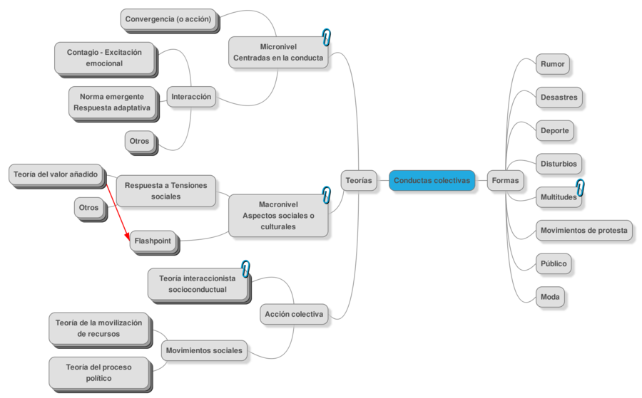

---
title:  'Acción Pública y Cambio Social'
author:
- name: Juan Muñoz
  affiliation: Universitat Autònoma de Barcelona
tags: [Conductas colectivas]
tema: "Perspectivas de la acción colectiva"
url: "http:/juan.psicologiasocial.eu"
bibliography: diapos.bib
csl: apa.csl
...

##Índice


#Elementos de definición {.mitit .center}

##Concepto paraguas

####Fenómenos que caen fuera de la estructura social u orden establecido

##
> [definimos] la conducta colectiva como una acción voluntaria, dirigida a una meta, que se produce en una situación relativamente desorganizada, en la que las normas y valores predominantes de la sociedad dejan de actuar sobre la conducta individual. La conducta colectiva consiste en la reacción de un grupo a alguna situación.\
@appelbaum_sociology_1997 [, p. 422]

##Son un fenómeno... {data-state=opacidad}
- Colectivo
- Unitario
- Sin organización
- Transitorio
- Indiferenciado
- Anómico

##Mapa conceptual {data-sate=img-completa}



##Movimientos sociales
>Una **colectividad** que actúa con cierta **continuidad** para **promover un cambio** en la sociedad o grupo de la que forma parte.\
[Turner & Killian, 1987 en @miller_introduction_2013, p. 469]

#El difícil camino de la Psicología colectiva {.mitit .center}


##Problemas de la Psicología colectiva

- Individualización de la Psicología
- Falta de métodos empíricos adecuados
- "Sujetos" de poco interés para la ciencia

#Campos de estudio  {.mitit .center}

##

- Rumores
- Histeria colectiva
- Deporte
- Desastres

##El rumor {data-background="imagenes/Rumor.jpg" data-background-transition=fade data-state=fondo}

> Mensajero del error y del mal tanto como de la verdad, el rumor, la más rápida de todas las plagas, va desencadenando el terror y se fortifica difundiéndose.\
`Virgilio, La Eneida`{.autor}

##El rumor {data-background="imagenes/rumor.jpg" data-background-transition=fade data-state=fondo}

<div id="column1" style="float:left; margin:0; width:50%;">


</div>

<div id="column1" style="float:left; margin:0; width:50%;">


</div>

<div id="column1" style="float:left; margin:0; width:100%;">


</div>

##Desastres

<div id="column1" style="float:left; margin:0; width:50%;">


</div>

<div id="column1" style="float:left; margin:0; width:50%;">


</div>

##Histeria Colectiva {data-background="imagenes/war-worlds-broadcast-1938.jpg" data-background-transition=fade data-state=fondo}

<div id="column1" style="float:left; margin:0; width:50%;">


</div>

<div id="column2" style="float:left; margin:0; width:50%;">


</div>

##Violencia en el deporte {data-background="imagenes/violencia-futbol.jpg" data-background-transition=fade data-state=fondo}

<video class="stretch" controls><source src="multimedia/HeyselStadium.mp4"></video>

```
Heysel Stadium Disaster (1985)
```

##Violencia en el deporte {data-background="imagenes/violencia-futbol.jpg" data-background-transition=fade data-state=fondo}

<video class="stretch"  controls><source src="multimedia/EgyptPortSaid.mp4"></video>
####Egypt football disaster - Port Said

##Violencia en el deporte {data-background="imagenes/violencia-futbol.jpg" data-background-transition=fade data-state=fondo}

<video class="stretch"  controls><source src="multimedia/EgyptAfter.mp4"></video>

####Deadly violence in Egypt after court issues death sentences for football hooligans

## Referencias
