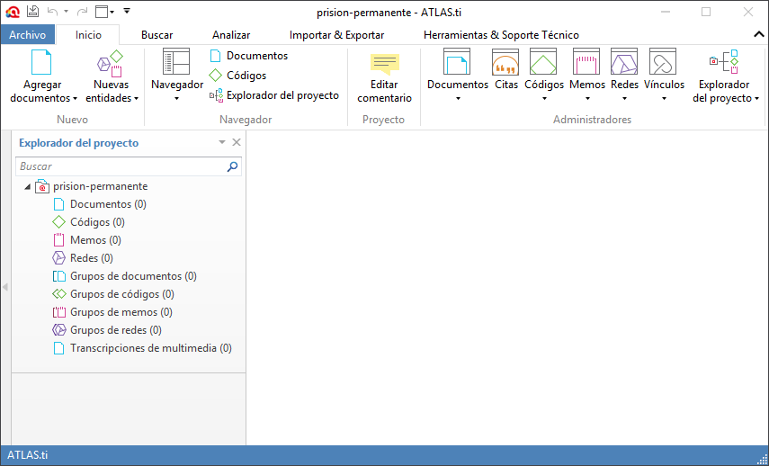
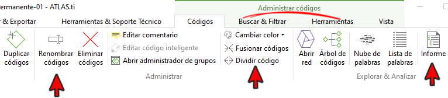

---
title:  'Análisis con Atlas.ti 8'
author:
- name: Juan Muñoz
  affiliation: Universitat Autònoma de Barcelona
  email: juan.munoz@uab.cat
tags: [Atlas.ti, Análisis temático]
url: "http:/juan.psicologiasocial.eu"
bibliography: diapos-at.bib
csl: apa.csl
lateral-menu: 'True'
...

## CAQDAS

>Programas para el análisis cualitativo de datos [ASISTIDO]{.fosforito} por ordenador.

**Unos enlaces:**

[CAQDAS Networking Project](https://www.surrey.ac.uk/computer-assisted-qualitative-data-analysis/ "CAQDAS Networking Project"){target=_"blank"}

[Online QDA](http://onlineqda.hud.ac.uk/ "Online QDA"){target=_"blank"}

<!-- [Text Analysis Info – QDA Software](http://www.textanalysis.info/ "Text Analysis Info – QDA Software"){target=_"blank"}

[UK Data Archive](http://www.data-archive.ac.uk/ "UK Data Archive"){target=_"blank"} -->

::: notes
Atlas.ti es un programa informático para el análisis cualitativo de datos textuales. En los enlaces, puedes encontrar más información sobre software y análisis cualitativo.
:::

## Análisis temático {#analisis-tematico data-background="imagenes-cuali/AnalisisCotidiano.png" data-background-transition=zoom data-state=opacidad}
 >El análisis temático es un método para identificar, analizar y reportar patrones (temas) dentro de los datos. Como mínimo [organiza y describe]{.fosforito} en detalle el conjunto de datos. Sin embargo, con frecuencia, va más allá e [interpreta]{.fosforito} diversos aspectos del tema de investigación.\
@braun_using_2006 [p. 79]

::: notes
Aunque el software CAQDAS se ha relacionado frecuentemente con la "Teoría fundamentada", por lo general suelen ser lo suficientemente flexibles como para permitir cualquier tipo de análisis. Entre ellos, el análisis temático como el que proponen Virginia Braun y Victoria Clarke (Braun & Clarke, 2006).
:::

##

::: notes
En este esquema podemos ver cómo, el proceso de análisis temático implica una continua reducción-agrupación de datos. La primera es la que realizamos con la codificación de los fragmentos de texto significativos (citas) para, a continuación, agrupar los códigos en categorías (y subcategorías) que a su vez formarán temas que son los que, finalmente, nos permitirán formular una teoría sobre nuestros datos.
:::

## Fases del análisis (Atlas.ti) {#fases-analisis-atlas}
{.noshadow}

::: notes
La realización de un análisis utilizando Atlas.ti implicará seguir aproximadamente este esquema, en el que podemos ver una serie de fases más o menos secuenciales, que van desde la creación de un "Proyecto" hasta la representación gráfica mediante las "Vistas de red" pasando por la segmentación y codificación de los datos. Junto a estas, realizaremos otra serie de actividades "transversales" como la documentación mediante "Memos", o la generación de "Informes" de resultados.
:::

## Gestión de los datos: Enlaces {#gestion-datos-enlaces}

Ver: [Processing Qualitative Data Files](http://www.fsd.uta.fi/aineistonhallinta/en/processing-qualitative-data-files.html){target=_"blank"}\
`http://www.fsd.uta.fi/aineistonhallinta/en/processing-qualitative-data-files.html`{.figcaption}

Ver: [UK · Data Archive: Create & Manage Data](http://www.data-archive.ac.uk/create-manage){target=_"blank"}\
`http://www.data-archive.ac.uk/create-manage`{.figcaption}

::: notes
Aunque no es algo particular de Atlas.ti, debemos recordar que cualquier investigación que incluya datos debería tener presente la necesidad de una buena gestión de los mismos.
:::

## Descargar programa

[Aquí](https://atlasti.com/free-trial-version/){target="_blank"} puedes descargar una versión "demo" del programa.

También existe una [versión gratuita "en la nube"](https://atlasti.com/cloud/){target="_blank"}, aunque mucho más limitada.

::: notes

Con la versión "demo" puedes utilizar todas las funciones del programa, aunque con permite guardar un máximo de: 10 documentos, 50 códigos, 100 citas, 30 memos, 10 vistas de red.

Por defecto, cada vez que se ejecuta, el programa comprueba si hay actualizaciones. Acepta la actualización si quieres "estar a la última"

:::

## Crear proyecto

::: notes
Las primeras opciones que nos ofrece el programa tienen que ver con la gestión de proyectos.

Un "proyecto" es el equivalente a un análisis, y en él quedará almacenado todo el trabajo que realicemos (documentos, citas, códigos, memos, vistas de red...). Es importante tener presente que todo el trabajo que realicemos quedará guardado "internamente", y que si queremos tener una copia de nuestro proyecto (por ejemplo para trabajar en otro ordenador), no es suficiente con guardarlo, sino que tenemos que utilizar la opción "Exportar" (disponible en el menú principal) para crear un archivo con extensión ".altproj".

Podemos crear un nuevo proyecto o importar alguno existente. Por el momento crearemos uno, aunque si quieres, también puedes empezar explorando alguno de los proyectos de ejemplo disponibles en [https://atlasti.com/manuals-docs/](https://atlasti.com/manuals-docs/){target="_blank"}. En ese caso, después de descargar el archivo con extensión ".atlproj", utiliza la opción "Importar proyecto".
:::

## Interfaz

<video width="800"  class="stretch" controls>
<source src="imagenes-atlas-8/proyecto.mp4">
</video>

::: notes
En este vídeo puedes ver los pasos necesarios para la creación de un proyecto y una breve explicación de la interfaz de usuario.
:::
<!-- 

::: notes
Al crear un proyecto, se nos mostrará la pantalla principal del programa, en la que podemos ver:

- Pestañas con las diferentes opciones de trabajo: Inicio, Buscar, Analizar, Importar & Exportar, Herramientas y soporte técnico.
- Explorador del proyecto: que permitirá la visualización de los componentes que iremos creando durante nuestro análisis (documentos, citas, códigos...).
- Zona de visualización (en blanco en la imagen): donde se visualizarán los diferentes componentes.
::: -->

## Añadir documentos {#anadir-documentos}

:::::: {.columns}
::: {.column width="50%"}
{.border .noshadow}
:::
::: {.column width="50%"}
{.noshadow}
:::
::::::

:::::: {.columns}
::: {.column width="100%"}

Descargar y descomprimir [https://bit.ly/2tboqvO](https://bit.ly/2tboqvO){.fosforito .medium target="_blank"}

>- Inicio > Agregar documentos > Agregar archivos
- Gestor de documentos > Crear comentarios de documentos
:::
::::::

::: notes
Ahora ya podemos añadir los datos al proyecto. Podemos hacerlo añadiendo uno o varios documentos o añadiendo todo el contenido de un directorio. En ambos casos, lo haremos clicando en el icono "Agregar documentos".

En el enlace puedes descargar unos datos de ejemplo. Se trata de artículos de opinión en la prensa española sobre la "Prisión permanente revisable".

Descarga el archivo ".zip" y [descomprímelo]{.fosforito} en tu ordenador para poder añadir los documentos a un proyecto.

:::

## Memoing
>Mediante el uso de memorandos, el investigador es capaz de sumergirse en los datos, explorar los significados que estos datos tienen, mantener la continuidad y mantener el impulso en la realización de la investigación. Como [crónica de un viaje de investigación]{.fosforito}, los memorandos permanecen como un registro, indeleble pero flexible, para retención personal o para difundir a otros.\
@BirksMemoingqualitativeresearch2008 [p. 69]

::: notes
Si una de las actividades imprescindibles de cualquier investigación es la documentación de la misma, esto probablemente todavía es más cierto en el caso de la investigación cualitativa, en la que es fundamental poder "dar cuenta" del qué, cómo y porqué de lo que hagamos. Esta documentación la realizamos mediante la escritura de "memos", es decir, anotaciones, comentarios... en los que, según Saldaña, podemos describir:

* Relación con participantes y/o fenómeno
* Preguntas de investigación
* Elección de códigos y sus definiciones
* Categorías, temas y conceptos emergentes
* Posibles conexiones entre elementos
* Teoría emergente
* Problemas de cualquier tipo de nuestra investigación
* Problemas o dilemas éticos
* Informe final

@saldana_coding_2009 [pp. 34-40]
:::

## Documentación

<video width="800"  class="stretch" controls>
<source src="imagenes-atlas-8/documentacion.mp4">
</video>

## Crear memos-anotaciones

>* Crear un memo "Proceso"
>     * Describir los pasos dados hasta el momento
* Crear un memo "Objetivos", p. ej.:
>     * "Objetivo general: Caracterización del discurso de la prensa española sobre la PPR"
>     * "Objetivos específicos: ...."

::: notes
En la pestaña "memos" tenemos un icono que nos permitirá la creación de memos "libres", es decir, no relacionadas (por el momento) con ningún otro de los componentes del análisis.

Utilizando esta función, crearemos un mínimo de dos memos, una a la que podemos etiquetar como "Proceso" en la que iremos anotando los pasos realizados hasta ahora en Atlas.ti (creación proyecto, carga de documentos...), y que iremos actualizando a medida que vaya actualizando nuestro trabajo.

La otra memo, "objetivos", será una de las que debería incluirse en todo proyecto, y evidentemente nos servirá para redactar los objetivos de la investigación. Aunque en una investigación real es muy probable que los tengamos redactados previamente, aún así no está de mal tener esta memo como una forma de tenerlos fácilmente accesibles y, también como una forma de que nuestro proyecto "Atlas.ti" sea lo más "autoexplicativo" posible (alguien que acceda al proyecto podrá saber los objetivos del mismo)

:::

## Codificación {#codificacion}

>La indexación (o codificación) es la actividad en la que el investigador aplica significado a los datos en bruto mediante la asignación de palabras clave o frases. Estas palabras clave actúan como indicadores de temas en los datos. La indexación es una actividad por la que los datos se descomponen, conceptualizan y posteriormente son reformulados.\
@BloorKeywordsqualitativemethods2006 [p.201]

## Estrategias de codificación {#estrategias-codificacion }

::: notes
Si la estrategia de trabajo es de tipo deductivo, se creará una lista de códigos que se intentará "aplicar" sobre los datos creando citas.

Si la estrategia es inductiva, los códigos surgirán de la lectura de los datos y por lo tanto primero crearemos citas que se vincularán con códigos.
:::

## Comentarios de códigos {#comentarios-codigos .peque}

| Código              | MARGPROB                                                                                                                                                                                                                                                        |
|:--------------------|:----------------------------------------------------------------------------------------------------------------------------------------------------------------------------------------------------------------------------------------------------------------|
| Definición breve    | Problemas propios de comunidades marginales                                                                                                                                                                                                                     |
| Definición completa | Situaciones sociales que son vividas exclusivamente por aquellas personas que llevan un estilo de vida marginal, con carencia fundamentalmente de bienes y servicios que sí están presentes en personas con nivel socioeconómico medio.                         |
| Cuándo se usa       | Cuando las personas señalan alguna dificultad que denote un problema social instrumental, como falta de alimento, abrigo, techo, salud, servicios sanitarios. Debe tener carácter grave o impedir el desarrollo adecuado de su vida familiar, social o laboral. |
| Cuándo no se usa    | No se aplica a problemas propios de una conducta condicionada por cultura marginal, como violencia doméstica, alcoholismo, abandono de hogar, delincuencia, prostitución                                                                                        |
| Ejemplo             | “Como aquí no hay agua ni alcantarillado, la suciedad que hay aquí en las calles es terrible, ahí se puede ver... ¿se fija?, los niños se enferman a cada rato.”                                                                                                |

###### @MacQueenCodebookdevelopmentteambased1998{.autor}

::: notes
Mientras vamos creando los códigos, es conveniente dedicar un tiempo a su descripción, es decir, a crear comentarios. Si los comentarios son elementos importantes de los componentes que hemos visto hasta el momento, lo son mucho más en el caso de los códigos, sobre todo cuando el trabajo de codificación es compartido por varios analistas. Es fundamental que el significado de los códigos, tanto conceptual como operativamente, alcance cierto grado de estabilidad durante el análisis, de forma que un mismo codificador interprete y aplique de la misma forma un código en diferentes momentos del proceso de análisis o que varios codificadores interpreten de la misma forma un mismo código. En algunos casos la simple etiqueta puede parecer lo suficientemente descriptiva como para que no haga falta escribir un comentario. Sin embargo, conforme progresa el análisis o cuando intervienen distintos analistas, esa aparente claridad puede no serlo del todo en la práctica.

Una posible forma de sistematizar los contenidos a añadir a los comentarios de códigos es seguir el modelo que proponen @MacQueenCodebookdevelopmentteambased1998
:::

## Segmentación y codificación{#segmentacion-codificacion}

<video width="800"  class="stretch" controls>
<source src="imagenes-atlas-8/segmentacion.mp4">
</video>

## Ejercicio: Segmentación y codificación {#ejercicio-segmentacion-codificacion}

{.noshadow  .border}

>* Crear citas "libres" en varios documentos.
* Eliminar citas.
* Modificar tamaño de citas.
* Codificar con las opciones "Codificación abierta" y "Codificación por lista".
* Añadir comentarios de códigos.
* Explorar citas y códigos con los respectivos [administradores]{.resaltar} y [navegadores]{.resaltar}.

## Ejercicio: Guardar {#ejercicio-guardar}

:::::: {.columns}
::: {.column width="50%"}
{.border height=400px}
:::
::: {.column width="50%"}
{.border height=400px}
:::
:::::

::: notes
Evidentemente, cuando utilizamos la opción "Guardar proyecto", estamos guardando el estado de nuestro trabajo, pero a diferencia de otros programas, esto no nos permite acceder a ningún archivo que podamos copiar, cambiar el nombre, crear una versión diferente... para ello tendremos que utilizar otras opciones del programa.

Si queremos crear una copia para conservar el estado de nuestro trabajo en un momento determinado, utilizaremos la opción "Instantánea", que nos permitirá crear una versión de nuestro análisis de forma que si con posterioridad hacemos cambios que no son satisfactorios, podamos recuperar esa versión previa.

Aunque hayamos creado instantáneas, seguiremos sin tener la posibilidad de acceder en nuestro ordenador a ningún archivo con el análisis. La única posibilidad que tenemos para acceder a nuestro proyecto es través del programa, y única y exclusivamente en el ordenador en que lo hemos creado.

Para disponer de una copia del proyecto que podamos "transportar" entre diferentes ordenadores (o simplemente como un sistema de copia de seguridad), tenemos que utilizar la opción "Exportar > Paquete de proyecto", que creará un archivo (con extensión .atlproj) que podremos abrir en otros ordenadores con la opción "Importar proyecto" que habíamos visto en la pantalla inicial.
:::

## Codificación: "Depuración" {#codificacion-depuracion}

>Durante el desarrollo de un sistema de códigos y eventualmente temas, el investigador va en constante ir y venir entre la lectura de los datos, la relectura de los segmentos codificados, la organización de los códigos, el cambio de nombre y el reordenamiento de los códigos y la recodificación de los segmentos de datos.\
@friese-Carryingout-2018 [p. 17]

## Comparación constante {#comparacion-constante}
{.noshadow}

::: notes
La depuración implica, entre otras cosas, comprobar la consistencia de nuestro sistema de codificación, tanto intra-código como inter-códigos. Es decir, tenemos que asegurarnos que todas las citas de un código son casos representativos de ese cógico (comparación intra) y que los contenidos de diferentes códigos son efectivamente diferentes (comparación inter).

Este proceso puede implicar la creación de códigos nuevos o la desaparición o agrupación de algunos de los existentes.

En las pantallas siguientes puedes ver un ejemplo hipotético de depuración que lleva a una transformación importante de la codificación original.
:::

## {transition=none}

{.noshadow }

::: notes
Imaginemos que partimos de una situación como la de la imagen, en la que tenemos seis códigos con sus correspondientes citas. Lo que haremos, será depurar empezando por los códigos que tienen un mayor número de citas, en este caso los códigos "C1" y "C2".
:::

## {transition=none}

{.noshadow}

::: notes
Puede ocurrir que el gran número de citas que incluye "C1" obedezca a que hemos asignado fragmentos que en realidad tienen significados diferentes, por lo que la "comparación intra" puede llevarnos a decidir que en realidad este conjunto de citas lo tenemos que asignar a tres códigos diferentes, por lo que crearemos tres nuevos códigos.
:::

## {transition=none}

{.noshadow}

::: notes
Lo mismo nos puede ocurrir con "C2", aunque en este caso no sólo lo hemos dividido en dos códigos, sino que además esos dos códigos los consideramos subcategorías de un nuevo código (ver más adelante la creación de relaciones entre códigos).
:::

## {transition=none}

{.noshadow}

::: notes
En el caso de los códigos "C3" y "C4", la "comparación intra" no nos lleva a ningún cambio, pero la "comparación inter" nos hace ver que en realidad hemos creado dos códigos para un mismo concepto, por lo que uniremos todas las citas en un único código (con la función "unir códigos").
:::

## {transition=none}

{.noshadow}

::: notes
La comparación "inter" del código "C6" nos puede llevar a darnos cuenta de que es equivalente a uno de los códigos que habíamos creado durante la depuración, por lo que de los uniremos.
:::

## {transition=none}

{.noshadow}

::: notes
Finalmente, el análisis del código "C5" nos lleva a relacionarlo con la categoría "CAT1".

Como vemos, el resultado final puede ser una importante reorganización de nuestro sistema de codificación. Esto es algo habitual, y no debemos preocuparnos si durante el análisis nos vemos en la necesidad de realizar cambios (aunque sería importante que siempre los documentemos).

:::

###### @friese_using_2011 {.autor}

## Ejercicio: Depurar códigos {#depurar-codigos}

Descargar/Importar [https://bit.ly/2EHBgbD](https://bit.ly/2EHBgbD){.fosforito .medium target="_blank"}

{.border}

>* Generar [Informe]{.resaltar} de todas las citas de un código.
* Generar informe de un conjunto de códigos.
* [Dividir]{.resaltar} un código en dos.
* [Fusionar]{.resaltar} varios códigos.

::: notes
Para la depuración de los códigos nos pueden ser útiles algunas de las funcionalidades a las que tenemos acceso desde la pestaña "Códigos" (la podremos ver si tenemos activo el "Administrador de códigos").

- Podemos "Duplicar", "Renombrar" o "Eliminar" códigos.
- Con los "Informes" podremos generar listados de las citas de uno o más códigos, lo que nos permitirá tomar decisiones sobre su ideoneidad o no para el código.
- Y a partir de las decisiones anteriores podemos utilizar la herramienta "Fusionar códigos" cuando, por ejemplo, pensamos que es conveniente unir varios de los códigos iniciales en un único código. Si por el contrario decidimos que parte de las citas de un código en realidad tienen un "significado" diferente, podemos utilizar la herramienta "Dividir código", que nos facilitará de una forma considerable el proceso.

Si quieres probar la unión y división de códigos, puedes descargar el proyecto del enlace que aparece en la pantalla (e importarlo en Atlas.ti). Encontrarás dos códigos: "críticas" y "opinion-publica". Puedes intentar dividir el primero en diferentes códigos para diferentes tipos de críticas y con el segundo crear un código específico para aquellas citas que hagan referencia a encuestas a la población.

:::

## Agrupar{#agrupar}

::: notes
Una de las opciones que nos ofrece el programa, es la de crear agrupaciones de elementos (documentos, códigos, memos y redes).

En el siguiente vídeo puedes ver cómo hacerlo.
:::

## Agrupar{#agrupar-2}

<video width="800"  class="stretch" controls>
<source src="imagenes-atlas-8/agrupar.mp4">
</video>

::: notes
En el minuto 5 del vídeo, cuando se dice "grupos de documentos" debería decir "grupos de códigos"
:::

## Ejercicio: grupos de códigos {#ejercicio-grupos-codigos}

<!--  -->

::: nonincremental
- Descargar [https://bit.ly/2WOWX0V](https://bit.ly/2WOWX0V){target="_blank"}
- Crear grupos de documentos.
- Crear grupos de códigos.
:::

::: notes
Descarga e importa el proyecto _Prision-Permanente-01a.atlproj_ y, siguiendo las instrucciones del vídeo anterior, crea grupos de documentos (por diario y por fecha) y grupos de códigos (actores y secciones).
:::

## Analizar

##### ¿Qué "actores" aparecen en las secciones utilizadas para captar la atención (títulos...)?

::: notes
Con los datos de que disponemos, ya podemos realizar alguna "pregunta" al programa. Por ejemplo, dado que tenemos códigos de "actores" y "códigos" de secciones, nos podría interesar saber cómo aparecen los "actores" en las diferentes secciones de los artículos. Por ejemplo "¿quienes aparecen más en las imágenes?" "¿qué actores son mencionados prioritariamente en los titulares?"

Para contestar esta pregunta, utilizaremos una de las herramientas de la pestaña "Analizar", la ["Tabla de co-ocurrencias"]{.fosforito}, que nos permitirá identificar las citas que co-ocurren en dos códigos.
:::

## Co-ocurrencias {#coocurrencias-0 transition=none}

{.border width=75%}

::: notes
Las coocurrencias son las citas (codificadas) que presentan algún grado de solapamiento entre sí, por lo tanto, las coocurrencias de códigos nos indican los códigos con los que están codificados esas citas. Cuando dos códigos presentan coocurrencias, significa que un significado (código) está en cierta forma relacionado con otro.
:::

## Co-ocurrencias {#coocurrencias-1 transition=none}

{.border width=75%}

## Co-ocurrencias {#coocurrencias-2 transition=none}

{.border width=75%}

## Analizar: Tabla de coocurrencias

<video width="800"  class="stretch" controls>
<source src="imagenes-atlas-8/co-ocurrencias.mp4">
</video>

## Documentar Análisis

_Research question memos_

:::nonincremental
- PI#: Descripción de la pregunta:
- Descripción de los pasos que se han dado con Atlas para su respuesta:
- Respuesta:
- Captura de pantalla (si es necesario/conveniente)
- Desarrollo (elaboración para informe):
- Vincular con este memo citas ilustrativas que apoyen los argumentos dados
:::

@friese-QualitativeData-2014 [pp. 167 y ss.]

::: notes
A medida que vamos realizando nuestro análisis y "formulando preguntas" al programa, debemos documentar este trabajo mediante la escritura de lo que Susan Friese denomina _Research question memos_, "Research question memos are analytic memos. I describe them as places where you develop the interpretation of your data step by step" @friese-QualitativeData-2014 [p. 167].

En la "diapositiva" puedes ver un ejemplo de los contenidos que debería incluir una memo de este tipo. En el proyecto que has descargado, también encontrarás un memo describiendo la pregunta sobre co-ocurrencias y una "plantilla" para reutilizar en otras preguntas (utilizando la opción "Duplicar memos").

:::

## Pregunta 1

##### ¿Qué "actores" aparecen en las secciones utilizadas para captar la atención (títulos...)?

>* Escribir Memo
* Identificar secciones.
* Identificar "actores".
* [Buscar co-ocurrencias.]{.resaltar}.

## Pregunta 2

##### 1 - ¿Qué "actores" aparecen en las secciones utilizadas para captar la atención (títulos...)?

#### 2 - ¿Cómo presentan esa información los diferentes diarios?

::: notes
Ahora puedes intentar contestar una nueva pregunta "¿Cómo presentan esa información los diferentes diarios?". Tendremos que volver a utilizar la _Tabla de co-ocurrencias_, pero realizando el análisis para cada uno de los diarios por separado. Para ello, tendrás que utilizar la opción [_Activar filtro global_]{.resaltar} sobre cada uno de los grupos antes de realizar el análisis de co-ocurrencias.
:::

## Relaciones

::: notes
Otra forma de organización de los datos es mediante la creación de relaciones entre elementos. Como vemos en la imagen, podemos crear relaciones entre citas, entre códigos, entre memos, entre citas y códigos (codificación)...

:::

## Estructura: Grupos de códigos... {#estructura-grupos-codigos-1}

::: notes
Veamos un ejemplo de relaciones entre códigos.

Imaginemos que tenemos cuatro códigos: amor, gratitud, ira y odio. Dado que todos ellos hacen referencia a sentimientos, podríamos crear grupos de códigos del tipo "Sentimientos positivos", "Sentimientos negativos", o un grupo "SENTIMIENTOS" que los englobara a todos.

Pasa a la siguiente diapositiva

:::

## Estructura: Grupos de códigos {#estructura-grupos-codigos-2 transition=none}

::: notes
La estrategia de crear grupos es correcta, pero imaginemos que además de esos códigos tenemos un código "EMOCIONES" y otro "Relaciones sociales". Podemos suponer que existe alguna relación entre esos códigos y los "SENTIMIENTOS", por ejemplo que las "Emociones" _causan_ "Sentimientos" y que los "Sentimientos" _causan_ (afectan, influyen...) las "Relaciones-sociales".

Dado que "SENTIMIENTOS" es un grupo, la única forma que tenemos de relacionarlo con los códigos sería haciendo que formaran parte de ese grupo, algo que no reflejaría el tipo de relación que queríamos crear.

Pasa a la siguiente diapositiva
:::

## Estructura: Relaciones entre códigos... {#estructura-relaciones-codigos-2 transition=none}

::: notes
Necesitamos por lo tanto una estrategia diferente que implica crear nuevos códigos y crear relaciones entre códigos.

En primer lugar, crearemos los códigos (no grupos) "Sentimiento positivo", "Sentimiento negativo" y "SENTIMIENTOS", es decir, utilizaremos códigos para poder crear relaciones. A continuación crearemos relaciones de tipo "es un" entre los diferentes tipos de sentimientos y sus códigos correspondientes. Esta relación sería conceptualmente equivalente a decir "amor" forma parte del grupo "Sentimiento positivo", pero en este caso en vez de una asignación a un grupo, establecemos una relación. De la misma forma, creamos las relaciones entre "Sentimiento positivo" y "Sentimiento negativo" con "SENTIMIENTOS", puesto que ambos "son" tipos de sentimientos. De esta forma hemos creado una "jerarquía" de códigos relacionados con los sentimientos. Finalmente ya podemos crear las relaciones EMOCIONES > SENTIMIENTOS > Relaciones sociales.

En el próximo vídeo puedes ver todo el proceso.
:::

## Relaciones y redes{#relaciones-redes}

<video width="800"  class="stretch" controls>
<source src="imagenes-atlas-8/relaciones-redes.mp4">
</video>

## Ejercicio: Relaciones entre códigos

Reproduce la estructura de relaciones "sentimientos"

## Redes temáticas

>Aplicar redes temáticas es simplemente una forma de organizar un análisis temático de datos cualitativos. Los análisis temáticos intentan descubrir los temas más destacados en un texto a diferentes niveles, y las redes temáticas tienen como objetivo [facilitar la estructuración y representación]{.fosforito} de esos temas.\
@attride_stirling2001 [p. 387]

## Redes temáticas {#redes-tematicas}

## Redes {#relaciones-codigos-donacion}

{ width=85% }

# Referencias{.center data-background="imagenes-cuali/books.jpg" data-background-transition=zoom data-state=opacidad}

## {.scrollable .peque}

<!-- ##

Descargar/Importar [https://bit.ly/2WWDY3T](https://bit.ly/2WWDY3T){.fosforito .medium target="_blank"}
 -->
