---
title:  'Análisis con Atlas.ti 8'
author:
- name: Juan Muñoz
  affiliation: Universitat Autònoma de Barcelona
  email: juan.munoz@uab.cat
tags: [Atlas.ti, Análisis temático]
url: "http:/juan.psicologiasocial.eu"
bibliography: diapos.bib
csl: apa.csl
lateral-menu: 'True'
...

## Memoing
>Vemos la toma de notas como [crucial]{.fosforito} para todos los tipos y enfoques de análisis. Otras funciones, como la codificación, la búsqueda de texto, la codificación automática y la modelización pueden ser utilizadas por enfoques concretos, pero la anotación de los datos, documentos y material de apoyo es [indivisible del análisis general]{.fosforito}.\
@lewins_using_2007 [p. 59]

## Memoing = Reflexionar sobre...

>* Relación con participantes y/o fenómeno
* Preguntas de investigación
* Elección de códigos y sus definiciones
* Categorías, temas y conceptos emergentes
* Posibles conexiones entre elementos
* Teoría emergente
* Problemas de cualquier tipo de nuestra investigación
* Problemas o dilemas éticos
* Informe final

###### @saldana_coding_2009 [pp. 34-40]{.autor}

## Crear memos-anotaciones

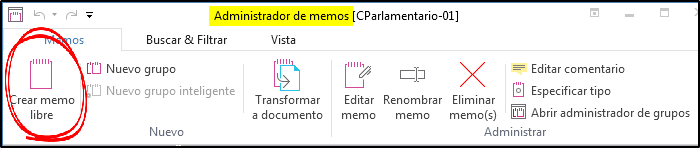

* Crear una memo "Objetivos"
* "Duplicar" (copiar y pegar) el memo "Pregunta de investigación"

## Codificación: "Depuración" {#codificacion-depuracion}

>Durante el desarrollo de un sistema de códigos y eventualmente temas, el investigador va en constante ir y venir entre la lectura de los datos, la relectura de los segmentos codificados, la organización de los códigos, el cambio de nombre y el reordenamiento de los códigos y la recodificación de los segmentos de datos.\
@friese_carrying_2018 [p. 17]

## Comparación constante {#comparacion-constante}
{.noshadow}

## {transition=none}

{.noshadow }

## {transition=none}

{.noshadow}

## {transition=none}

{.noshadow}

## {transition=none}

{.noshadow}

## {transition=none}

{.noshadow}

## {transition=none}

{.noshadow}

###### @friese_using_2011 {.autor}

## Ejercicio: Depurar códigos {#depurar-codigos}

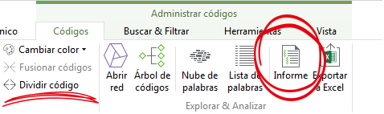{.border}

>* Generar [Informe]{.resaltar} de todas las citas de un código.
* Generar informe de un conjunto de códigos.
* [Dividir]{.resaltar} un código en dos.
* [Fusionar]{.resaltar} varios códigos.

## Pregunta 1a

#### ¿Qué "actores" aparecen en las secciones utilizadas para captar la atención (títulos...)?

. . .

>* [Escribir Memo]{.resaltar}.
* Identificar secciones.
* Identificar "actores".
* ...

##

##### ¿Qué "actores" aparecen en las secciones utilizadas para captar la atención (títulos...)?

>* Escribir Memo
* Identificar secciones.
* Identificar "actores".
* [Buscar co-ocurrencias.]{.resaltar}.

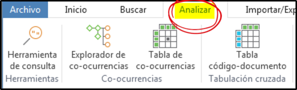

## Co-ocurrencias {#coocurrencias-0 transition=none}

{.border width=75%}

::: notes
Las coocurrencias son las citas (codificadas) que presentan algún grado de solapamiento entre sí, por lo tanto, las coocurrencias de códigos nos indican los códigos con los que están codificados esas citas. Cuando dos códigos presentan coocurrencias, significa que un significado (código) está en cierta forma relacionado con otro.
:::

## Co-ocurrencias {#coocurrencias-1 transition=none}

{.border width=75%}

## Co-ocurrencias {#coocurrencias-2 transition=none}

{.border width=75%}

## Tabla de co-coocurrencias

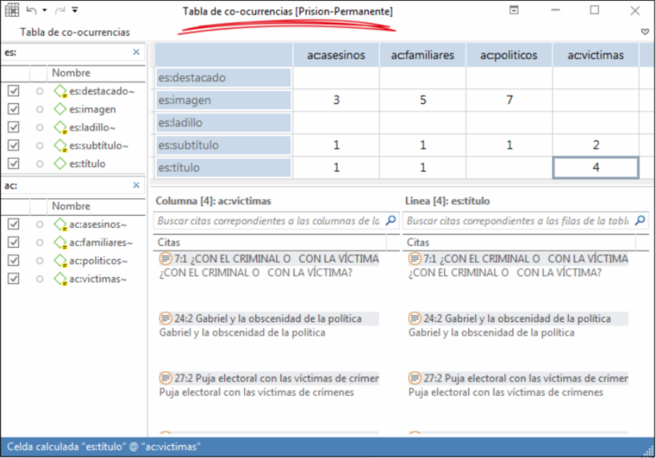{.border .noshadow}

::: notes
Para llegar al resultado de la imagen, en primer lugar se ha añadido un identificador a las etiquetas de códigos, "es:" para los códigos "estructurales", y "ac:" a los códigos que identifican a los diferentes "actores". De esta forma, aparecerán juntos en el Administrador de códigos. Además, al acceder a la herramienta "Tabla de co-ocurrencias", podemos filtrar fácilmente "es:" en filas y "ac:" en columnas.
:::

## Agrupar

## Ejercicio: grupos de códigos {#ejercicio-grupos-codigos}

>* Crear grupos de códigos.
>   - Desde el [Administrador de códigos]{.resaltar}.
>   - Con el [Administrador de grupos de códigos]{.resaltar}.
* Activar filtro
* Rehacer Tabla de coocurrencias

## Pregunta 1b

#### ¿Cómo presentan esa información los diferentes diarios?

::: incremental
* Escribir Memo.
* [Grupos de documentos]{.resaltar} (por diario).
* Grupos inteligentes de documentos.
:::

. . .

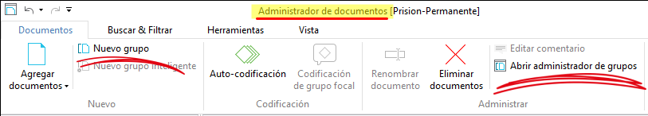

## Grupos "inteligentes"

|                | + Derechas | - Derechas |
|:---------------|:----------:|:----------:|
| Pre (15 marzo) |            |            |
| Post           |            |            |

. . .

{.noshadow}

<!-- # Estructurar {.center data-state=opacidad data-background="imagenes-cuali/hanging-files.jpg" data-background-transition=zoom} -->

## Pregunta 2

#### ¿En qué contextos aparecen las víctimas?

. . .

>* [Autocodificar]{.resaltar} Cruz, Quer...

## Autocodificación {#autocodificacion}

{.noshadow}

## Pregunta 3

#### ¿Qué características tienen los contenidos que son citas textuales?

>* Codificar todos los fragmentos entre cualquier tipo de comillas.
* Tabla de co-coocurrencias.
* Ver memo "co:Citas literales".
* Autocodificar.

[(Puedes hacer pruebas en https://regex101.com/)]{.peque}

## Codificación de grupo focal {#codificacion-grupo-focal}

::: notes

Se pueden introducir expresiones GREP. La etiqueta de código será lo que esté definido en la expresión. Si el primer carácter es @ o el último es ":", no se incluirán en la etiqueta de código.

Por ejemplo:

`@\S+:` creará etiquetas de código de cualquier carácter que no sea espacio `\S`, de cualquier longitud `+`, seguido de `:`

`Ent-\d+:` Creará etiquetas con la raíz "Ent-" seguido de uno o más dígitos
:::

# Relaciones {.center data-background="imagenes-cuali/network.jpg" data-background-transition=zoom data-state=opacidad}

## Tipos de relaciones

::: notes
Existen pocas limitaciones en cuanto a cómo crear citas libres, pueden ser de cualquier extensión, pueden solaparse entre ellas... pero sí que tenemos la limitación de que una cita no puede ser "discontínua", es decir, no puede tener una primera parte, p.ej. de la línea 3 a 5, y una segunda parte de la 8 a la 10 sin que estén incluidas las líneas 6 y 7.
Esto podría provocar que se pierda el significado si no se tiene en cuenta la primera parte, por lo que tendríamos que incluir todas las líneas. Pero si eso implica tener una cita excesivamente larga, otra opción sería crear dos citas y una relación entre ambas.
:::

## Ejercicio: Relaciones entre citas

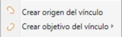{.border}

>* Crear relaciones entre citas del mismo/diferente documento.
* "Navegar" entre citas.
* Explorar relaciones con el [Administrador de vínculos]{.resaltar}.

## Estructura: Grupos de códigos... {#estructura-grupos-codigos-1}

## Estructura: Grupos de códigos {#estructura-grupos-codigos-2 transition=none}

## Estructura: Relaciones entre códigos... {#estructura-relaciones-codigos-1 transition=none}
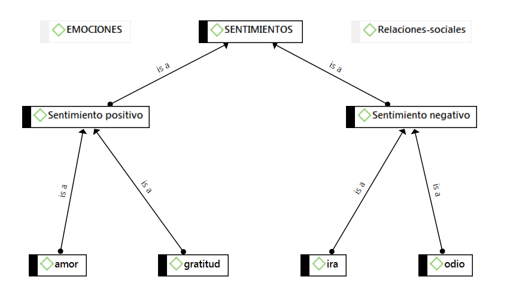

## Estructura: Relaciones entre códigos... {#estructura-relaciones-codigos-2 transition=none}

<!-- ## Estructura: Relaciones entre códigos {#estructura-relaciones-codigos}

## Jerarquías de códigos {#jerarquias-codigos-2}

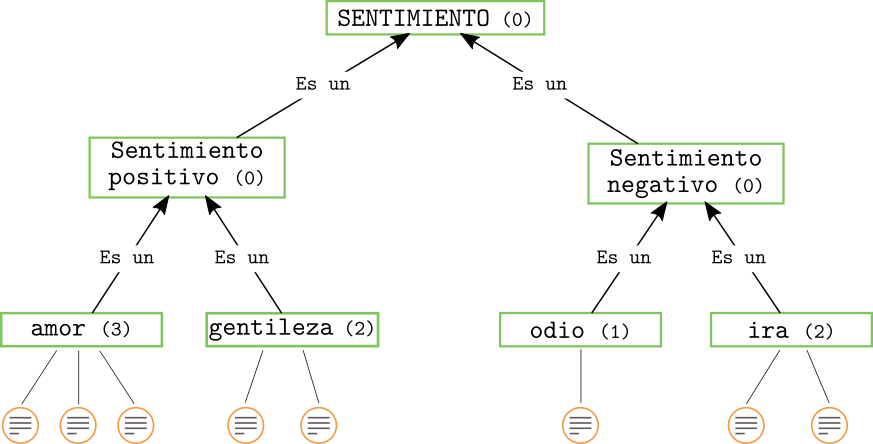 -->

## Ejercicio: Relaciones entre códigos

>* Crear relaciones "es una" entre códigos.
* Crear otros tipos de relaciones.
* Definir un nuevo tipo de relación.

# Vistas de red{.center data-background="imagenes-cuali/neurons.jpg" data-background-transition=zoom data-state=opacidad}

##

>Aplicar redes temáticas es simplemente una forma de organizar un análisis temático de datos cualitativos. Los análisis temáticos intentan descubrir los temas más destacados en un texto a diferentes niveles, y las redes temáticas tienen como objetivo [facilitar la estructuración y representación]{.fosforito} de esos temas.\
@attride-stirling_thematic_2001 [p. 387]

## Redes temáticas {#redes-tematicas}

## Redes {#relaciones-codigos-donacion}

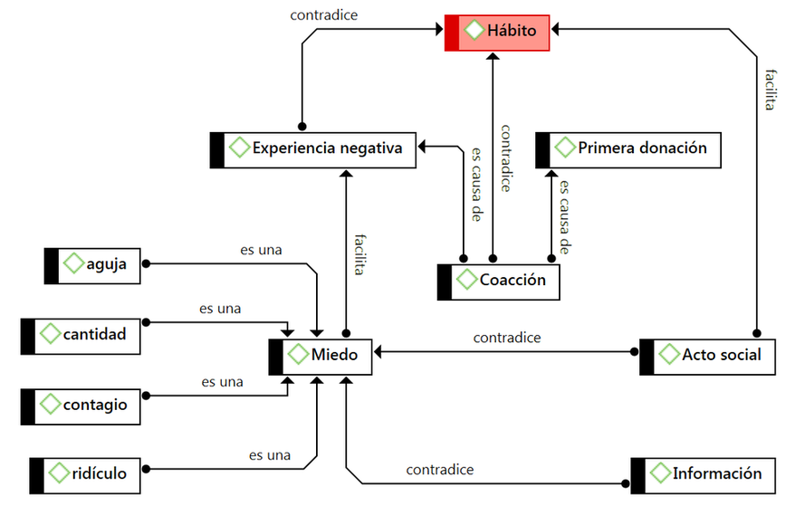{ width=85% }

## Redes {#relaciones-codigos-iter}

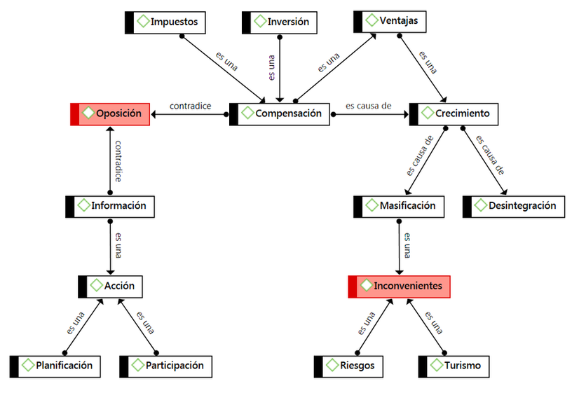{ width=80% }

<!--
##Editar Relaciones

 -->

# Consultas {.center data-background="imagenes-cuali/query.jpg" data-background-transition=zoom data-state=opacidad}

## Consultas

## Consultas: Operadores Booleanos

## Operadores Booleanos

## Construcción de una consulta {#construccion-booleana-1}

Todas las citas codificadas como C1 **Y** C2 **O** como C1 y C3

:::::: {.columns}
::: {.column width="40%"}
{ width="300px"}
:::
::: {.column width="60%"}
{ width="450px"}
:::
:::::

### https://bit.ly/2SD7368

## Construcción de una consulta {#construccion-booleana-2 transition=none}

Todas las citas codificadas como C1 **O** C2 pero **NO** como C3

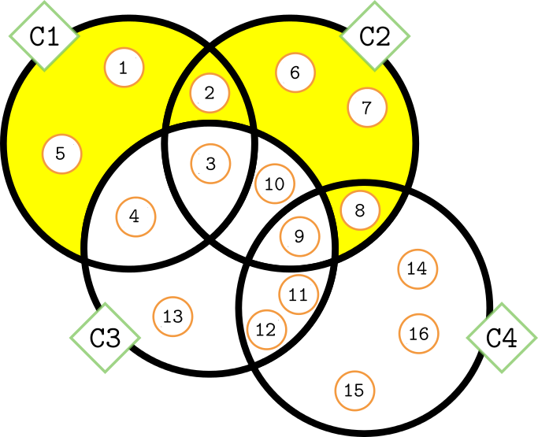{ width="300px"}

. . .

{ width="450px"}

## Construcción de una consulta {#construccion-booleana-3 transition=none}

Todas las citas codificadas como C1 **O** C2 **O** como C3 **Y** C4 **Y** **NO** como C1 **Y** C3

{ width="300px"}

. . .

{ width="450px"}

## Operadores Semánticos {#operadores-semanticos}

## Operadores Semánticos {#ejemplo-operadores-semanticos}

## Operadores de Proximidad

##

<!-- ## Ejemplo consulta

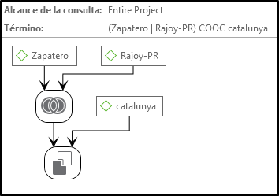

## Ejemplo consulta

### https://bit.ly/2JoJhCg

<!--
## Consultas: Alcance

-->

## Buscar texto

  <!--
 Conjunto de términos
   : `Jorquera|Pérez-Bouza`

 Categoría
   : `BNG:=Jorquera|Pérez-Bouza`

 Múltiples categorías
   : `AUTONOMICO:= $AMAIUR|$BNG|$CC|$CiU`

 ## GREP

   |  Operador   | Función                                                                        |
   |:-----------:|:-------------------------------------------------------------------------------|
   | ^*término*  | Limita la expresión de búsqueda que sigue al marcador al principio de la línea |
   | *término*$  | Limita la expresión de búsqueda precedente al final de la línea                |
   | \<*término* | Limita la expresión de búsqueda siguiente al inicio de una palabra             |
   | *término*\> | Limita la expresión de búsqueda precedente al inicio de una palabra            |
   |     \\B     | Limita la expresión de búsqueda siguiente a NO incio de palabra                |
   |      .      | Localiza cualquier carácter                                                    |
   |     \\w     | Localiza cualquier carácter alfanumérico                                       |
   |      *      | Localiza cualquier cantidad (o su ausencia) de la expresión precedente         |
   |      +      | Localiza al menos una ocurrencia de la expresión precedente                    |

 -->

# Referencias{.center data-background="imagenes-cuali/books.jpg" data-background-transition=zoom data-state=opacidad}

## {.scrollable .peque}

<!--

# Organización Datos {.center data-state=opacidad data-background="imagenes-cuali/hanging-files.jpg" data-background-transition=zoom }

# Informes {.center data-background="imagenes-cuali/reports.jpg" data-background-transition=zoom data-state=opacidad}

-->
