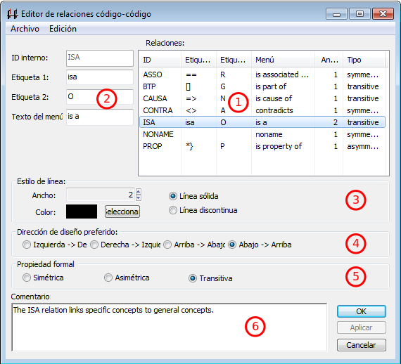

---
title:  'Análisis con Atlas.ti 8'
author:
- name: Juan Muñoz
  affiliation: Universitat Autònoma de Barcelona
  email: juan.munoz@uab.cat
tags: [Atlas.ti, Análisis temático]
url: "http:/juan.psicologiasocial.eu"
bibliography: diapos.bib
csl: apa.csl
lateral-menu: 'True'
...

# Introducción {.center data-background="imagenes-cuali/introduction-2.jpg" data-background-transition=zoom data-state=opacidad }

## CAQDAS

>Programas para el análisis cualitativo de datos [ASISTIDO]{.fosforito} por ordenador

. . .

**Unos enlaces**

[CAQDAS Networking Project](http://www.surrey.ac.uk/sociology/research/researchcentres/caqdas/)

[Online QDA](http://onlineqda.hud.ac.uk/)

[Text Analysis Info – QDA Software](http://www.textanalysis.info/)

[UK Data Archive](http://www.data-archive.ac.uk/)

## Una advertencia
>Recuerde siempre que un ordenador es sólo una máquina, [no pensará por usted]{.fosforito}, y puede incluso dificultarle progresar con su análisis. No olvide apagar el ordenador de vez en cuando. Lleve sus datos, resultados de búsquedas, esquemas de codificación, etc, a un lugar tranquilo, y luego [léalos y piense en ellos]{.fosforito}. Dé un largo paseo y despeje su mente. Será entonces cuando probablemente obtenga las mejores ideas.\
`Friese,  1998`{.autor}

## ¿Qué permite? {#permite}

:::::::::::::: {.columns}
::: {.column width="35%"}
{.noshadow}
:::

::: {.column width="65%"}

::: nonincremental
* Organización e integración
* Datos multimedia
* Búsqueda y recuperación
* Vinculación
* Representación gráfica
* Trabajo en equipo
:::

:::
::::::::::::::

# Definiciones {.center data-background="imagenes-cuali/Definicion.jpg" data-background-transition=zoom data-state=fondo}

## La investigación cualitativa {#investigacion-cualitativa data-background="imagenes-cuali/AnalisisCotidiano.png" data-background-transition=zoom data-state=opacidad}

>Un enfoque cualitativo es uno en el que hay necesidad de interpretar los datos a través de la identificación y, posiblemente, la codificación de temas, conceptos, procesos, contextos, etc., con el fin de construir explicaciones o teorías o para probar o ampliar una teoría.\
@lewins_using_2007 [, p. 7]

## Análisis temático {#analisis-tematico data-background="imagenes-cuali/AnalisisCotidiano.png" data-background-transition=zoom data-state=opacidad}
 >El análisis temático es un método para identificar, analizar y reportar patrones (temas) dentro de los datos. Como mínimo [organiza y describe]{.fosforito} en detalle el conjunto de datos. Sin embargo, con frecuencia, va más allá e [interpreta]{.fosforito} diversos aspectos del tema de investigación.\
@braun_using_2006 [p. 79]

## Tema

>Un tema es un patrón que se encuentra en la información que, como mínimo, describe y organiza posibles observaciones o, como máximo, interpreta aspectos del fenómeno. Un tema puede identificarse a nivel [manifiesto]{.fosforito} (directamente observable en la información) o a nivel [latente]{.fosforito} (subyacente al fenómeno). Los temas pueden generarse inicialmente [inductivamente]{.fosforito} a partir de la información bruta o generarse [deductivamente]{.fosforito} a partir de la teoría y la investigación previa.\
@boyatzis_transforming_1998 [p. vii]

## Temas
> Un tema capta algo importante sobre los datos en relación con la pregunta de investigación, y representa un cierto nivel de pauta de respuesta o significado en el conjunto de los datos.\
@braun_using_2006 [p. 82]

##

::: notes
En este esquema podemos ver cómo, el proceso de análisis temático implica una continua reducción-agrupación de datos. La primera es la que realizamos con la codificación de los fragmentos de texto significativos (citas) para, a continuación, agrupar los códigos en categorías (y subcategorías) que a su vez formarán temas que son los que, finalmente, nos permitirán formular una teoría sobre nuestros datos.
:::

## Ejemplo: códigos-categorías-temas {#ejemplo-c-c-t}

@graneheim_qualitative_2004 [p. 108]\
`Narrativas sobre hipoglucemia`{.figcaption}

## ¿Cómo? {#como}

## Proceso de análisis {#proceso-analisis}

![Adaptado de @seidel_qualitative_1998 [p. 2]](imagenes-cuali/Seidel-NCT.png)

## Fases del análisis {#fases-analisis}

>0. Gestión de datos
1. Familiarizarse con los datos
2. Generar códigos iniciales
3. Buscar temas
4. Revisar temas
5. Definir y etiquetar temas
6. Producir informe

###### @braun_using_2006 [p. 87]{.autor}

## Fases del análisis (Atlas.ti) {#fases-analisis-atlas}
{.noshadow}

# Preparación de datos {#preparacion-datos .center data-background="imagenes-cuali/preparacion-1.jpg" data-background-transition=zoom data-state=opacidad}

## Fases preparación datos {#fases-preparacion-datos}

* Transcripción (literal de los datos)
* Convenciones ("jeffersonianas")
* Gestión (archivado, formato, control)

## Transcripción {#transcripcion}

. . .

>(…) La producción y el uso de transcripciones son ['actividades de investigación']{.fosforito} y no deben ser enfocadas como simplemente 'detalles técnicos' que preceden el análisis.\
@mclellan_beyond_2003 [p. 64]

## Transcribir: herramientas

:::::: {.columns}
::: {.column width="50%"}

:::
::: {.column width="50%"}

:::
::::::

**Software**

Soundscriber:
[http://www-personal.umich.edu/~ebreck/sscriber.html](http://www-personal.umich.edu/~ebreck/sscriber.html)

F4:
[http://www.audiotranskription.de/english](http://www.audiotranskription.de/english)

## Pero...

<iframe width="800" height="600" data-src="http://research.baidu.com/introducing-swiftscribe-breakthrough-ai-powered-transcription-software/"></iframe>

## Convenciones
>En una conversación lo más significativo es lo que no se dice entre lo que se está diciendo, como por ejemplo las pausas y silencios, las entonaciones y los gestos, porque ahí radican los dobles significados, los ánimos y el objetivo mismo de la comunicación.\
@fernandez_christlieb_espiritu_2004 [p. 46]

## Convenciones "jeffersonianas"

@lerner_glossary_2004 [p. 15]

## Gestión de los datos {#gestion-datos-1}
>La inadecuada documentación y monitorización de las actividades relacionadas con los datos pueden [amenazar su integridad]{.fosforito}. Además, las prácticas inadecuadas de seguimiento pueden dificultar el análisis y aumentar la probabilidad de un [pandemónium]{.fosforito} de investigación.\
@mclellan_beyond_2003 [p. 69]

Ver: [UK · Data Archive: Create & Manage Data](http://www.data-archive.ac.uk/create-manage)\
`http://www.data-archive.ac.uk/create-manage`{.figcaption}

## Gestión de los datos {#gestion-datos-2}
>Una buena gestión de los datos es la base para una buena investigación. Si los datos están debidamente organizados, preservados y bien documentados, y su exactitud, vigencia e integridad es controlada en todo momento, el resultado es de datos de alta calidad, investigación eficiente, resultados basados en pruebas sólidas y ahorro de tiempo y recursos. (...) La gestión de datos debe planificarse desde el inicio de la investigación. Si se convierte en parte de la práctica de investigación estándar, entonces no implicará necesariamente mucho tiempo ni costos adicionales.\
@uk_data_archive_managing_2009 [p. 2]

## Control de versiones

## Y luego...

. . .

{.noshadow}

. . .

{.noshadow}

# Proyecto {.center data-background="imagenes-cuali/escriba.jpg" data-background-transition=zoom data-state=opacidad}

<!--
## Pantalla inicial

 

   
   
 

 <!-- -->
-->

<!--
## Pantalla principal

 

   
   
   
   
   

-->

<!--
 
-->

## Estrategias trabajo en equipo

{.noshadow}

::: notes
Dos formas básicas de trabajo en equipo:

- Todos los analistas trabajando con el conjunto de los documentos.
- Diferentes analistas trabajan con diferentes documentos.

En ambos casos, el resultado final es la unión de los diferentes proyectos
:::

## Unir proyectos

## Añadir documentos {#anadir-documentos}

:::::: {.columns}
::: {.column width="50%"}

:::
::: {.column width="50%"}
{.noshadow}
:::
::::::

:::::: {.columns}
::: {.column width="100%"}
Descargar y descomprimir [http://bit.ly/2oJUWCm]{.fosforito}

>- Inicio > Agregar documentos > Agregar archivos
- Gestor de documentos > Crear comentarios de documentos
:::
::::::

<!--
## Pantalla principal con documentos

 

## Gestor de documentos

 

## Comentarios de documentos

 

 -->

# Memoing {.center data-background="imagenes-cuali/Memoing-01.jpg" data-background-transition=zoom data-state=opacidad}

## Memoing
>Mediante el uso de memorandos, el investigador es capaz de sumergirse en los datos, explorar los significados que estos datos tienen, mantener la continuidad y mantener el impulso en la realización de la investigación. Como [crónica de un viaje de investigación]{.fosforito}, los memorandos permanecen como un registro, indeleble pero flexible, para retención personal o para difundir a otros.\
@birks_memoing_2008 [p. 69]

## Memoing
>Vemos la toma de notas como [crucial]{.fosforito} para todos los tipos y enfoques de análisis. Otras funciones, como la codificación, la búsqueda de texto, la codificación automática y la modelización pueden ser utilizadas por enfoques concretos, pero la anotación de los datos, documentos y material de apoyo es [indivisible del análisis general]{.fosforito}.\
@lewins_using_2007 [p. 59]

## Memoing = Reflexionar sobre...

* Relación con participantes y/o fenómeno
* Preguntas de investigación
* Elección de códigos y sus definiciones
* Categorías, temas y conceptos emergentes
* Posibles conexiones entre elementos
* Teoría emergente
* Problemas de cualquier tipo de nuestra investigación
* Problemas o dilemas éticos
* Informe final

. . .

###### @saldana_coding_2009 [pp. 34-40]{.autor}

<!--
## Crear Memos

  
  

 -->

<!--
## Gestor de memos {data-transition="fade-in none-out"}

## Crear memos {data-transition="none-in fade-out"}

 -->

## Crear memos-anotaciones

 >* Crear una memo
 >     * Etiquetarla como "Proceso"
 >     * Describir los pasos dados hasta el momento
 >     * Guardar
 * Crear una memo "Objetivos"

# Segmentar y codificar {.center data-background="imagenes-cuali/Coding.jpg" data-background-transition=zoom data-state=opacidad}

## Reducción {#reduccion}
>[En la investigación cualitativa] el reto es dar sentido a una cantidad masiva de datos, reducir el volumen de información, identificar pautas significativas, y construir un marco para comunicar la esencia de lo que revelan los datos.\
@patton_qualitative_1990 [pp. 371-372]

. . .

{ width="370px"}

## Codificación {#codificacion}

>La indexación (o codificación) es la actividad en la que el investigador aplica significado a los datos en bruto mediante la asignación de palabras clave o frases. Estas palabras clave actúan como indicadores de temas en los datos. La indexación es una actividad por la que los datos se descomponen, conceptualizan y posteriormente son reformulados.\
@bloor_keywords_2006 [p.201]

## Estrategias de codificación {#estrategias-codificacion }

::: notes
Si la estrategia de trabajo es de tipo deductivo, se creará una lista de códigos que se intentará "aplicar" sobre los datos creando citas.

Si la estrategia es inductiva, los códigos surgirán de la lectura de los datos y por lo tanto primero crearemos citas que se vincularán con códigos.
:::

## Categorización {#categorizacion}
>Los animales se clasifican en a) pertenecientes al emperador, b) embalsamados, c) amaestrados, d) lechones, e) sirenas, f) fabulosos, g) perros sueltos, h) incluidos en esta clasificación, i) que se agitan como locos, j) innumerables, k) dibujados con un pincel finísimo de pelo de camello, l) etcétera, m) que acaban de romper el jarrón, n) que de lejos parecen moscas.\
`J.L.Borges (1952). El idioma analítico de John Wilkins.`{.autor}

## Literatura definicional

| Origen            | El gato ha bebido la leche                                                                                                                                                                                                                                                                                                               |
|:------------------|:-----------------------------------------------------------------------------------------------------------------------------------------------------------------------------------------------------------------------------------------------------------------------------------------------------------------------------------------|
| 1ª Transformación | El mamífero carnívoro digitígrado doméstico ha tragado un líquido blanco, de sabor dulce producido por las hembras de los mamíferos.                                                                                                                                                                                               |
| 2ª Transformación | Quien tiene tetas, come carne, camina sobre la extremidad de sus dedos y pertenece a la casa ha hecho descender por el gaznate al estómago un estado de la materia sin forma propia, del color de la leche, de impresión agradable al órgano del gusto y procurado por los animales de sexo femenino que tienen tetas. |

`Raymond Queneau`{.autor}

## "El gato"

{.border}

::: notes
Podemos pensar en la codificación como una forma de literatura definicional a la inversa, en la que nuestros datos (y citas) son la última transformación y los pasos previos son códigos.

La duda que se nos puede plantear es sobre el nivel de codificación que realizaremos (Mamífero, Carnívoro... frente a Gato, Bebe...).

Tenemos dos posibles respuestas (no incompatibles entre sí):

- El nivel adecuado viene definido por los objetivos
- Podemos utilizar diferentes niveles (códigos, categorías...)
:::

## Comentarios de códigos {#comentarios-codigos .medio}

| Código              | MARGPROB                                                                                                                                                                                                                                                        |
|:--------------------|:----------------------------------------------------------------------------------------------------------------------------------------------------------------------------------------------------------------------------------------------------------------|
| Definición breve    | Problemas propios de comunidades marginales                                                                                                                                                                                                                     |
| Definición completa | Situaciones sociales que son vividas exclusivamente por aquellas personas que llevan un estilo de vida marginal, con carencia fundamentalmente de bienes y servicios que sí están presentes en personas con nivel socioeconómico medio.                         |
| Cuándo se usa       | Cuando las personas señalan alguna dificultad que denote un problema social instrumental, como falta de alimento, abrigo, techo, salud, servicios sanitarios. Debe tener carácter grave o impedir el desarrollo adecuado de su vida familiar, social o laboral. |
| Cuándo no se usa    | No se aplica a problemas propios de una conducta condicionada por cultura marginal, como violencia doméstica, alcoholismo, abandono de hogar, delincuencia, prostitución                                                                                        |
| Ejemplo             | “Como aquí no hay agua ni alcantarillado, la suciedad que hay aquí en las calles es terrible, ahí se puede ver... ¿se fija?, los niños se enferman a cada rato.”                                                                                                |

###### @macqueen_codebook_1998{.autor}

## Ejercicio: Segmentación / Codificación

{.noshadow}

>* Crear citas libres
* Crear códigos libres
* Utilizar otras opciones de codificación

<!--
## Gestor de códigos {#gestor-codigos}

 -->

<!--
## Codificación Top-Down: Códigos libres {#codificacion-top-down}

. . .

 -->

<!--
## Codificación Bottom-Up: Citas libres {#codificacion-bottom-up}

{.border}

. . .

{.border}

<!--
##

-->

<!--
## Explorar Citas

-->

<!--
## Codificación "mixta" {#codificacion-mixta}

 -->

## Comparación constante {#comparacion-constante}
{.noshadow}

## {transition=none}

{.noshadow }

###### @friese_using_2011 {.autor}

## {transition=none}

{.noshadow}

## {transition=none}

{.noshadow}

## {transition=none}

{.noshadow}

## {transition=none}

{.noshadow}

## {transition=none}

{.noshadow}

<!--
## Visualización: Informes {#informes}

. . .

 -->

# "Transportar" UH{.center data-background="imagenes/luggage.png"}

<!--
##1: Crear paquete de copia

##2: Abrir paquete de copia

 -->

## Ejercicio: Crear/abrir copia

{.noshadow}

>* Crear una copia de la UH
* Importat la copia (de un/a compañero/a)

# Estructurar {.center data-state=opacidad data-background="imagenes-cuali/hanging-files.jpg" data-background-transition=zoom}

## Autocodificación {#autocodificacion}

<!--
Volver a informes. Queremos obtener informes de...
(cuidado si antes se han visto las agrupaciones de códigos)
-->

## Ejercicio autocodificación {#ejercicio-autocodificacion}

:::::: {.columns}
::: {.column width="75%"}

:::
::: {.column width="25%"}
{.noshadow}
:::
::::::

:::::: {.columns}
::: {.column width="75%"}
>* Autocodificar participantes
>     * Autocodificar Rajoy-LO (líder de la oposición)
>     * Autocodificar Rajoy-PR (presidente)
:::
::::::

## Agrupar

## Ejercicio: Grupos de documentos

| Grupo    | Contenido        |
|:---------|:-----------------|
| Congreso | Control-Congreso |
| Senado   | Control-Senado   |
| IX LEG.  | -2011            |
| X LEG.   | -2012            |

## Grupos "inteligentes"

{.noshadow}

|         |       CONGRESO        |       SENADO        |
|:--------|:---------------------:|:-------------------:|
| IX LEG. | Control-Congreso-2011 | Control-Senado-2011 |
| X LEG.  | Control-Congreso-2012 | Control-Senado-2012 |

<!--
## Gestor de grupos de códigos {#gestor-grupos-codigos}
 

## Grupos de códigos {#grupos-codigos}
 

## Grupos "inteligentes"

 

## Editar grupos "inteligentes"

 
 -->

## Agrupación de códigos{ #agrupacion-codigos .peque}

{.noshadow}

|           |    NACIONALES     |           AUTONÓMICOS           |
|:----------|:-----------------:|:-------------------------------:|
| IZQUIERDA | IU PCE PSOE | Amaiur BNG ERC ICV PSC |
| DERECHA   |     PP UPD     |        CC CiU PNV         |

>* Crear grupos de códigos
* Crear "grupos "inteligentes"

##

## Ejemplo: códigos-categorías-temas {#ejemplo-c-c-t-2}

@graneheim_qualitative_2004 [p. 108]\
`Narrativas sobre hipoglucemia`{.figcaption}

# Relaciones {.center data-background="imagenes-cuali/network.jpg" data-background-transition=zoom data-state=opacidad}

## Tipos de Relaciones

 <!--
|         | CITAS        | CÓDIGOS      | MEMOS    |
|:--------|:-------------|:-------------|:---------|
| CITAS   | Hypervínculo | Codificación | Relación |
| CÓDIGOS |              | Relación     | Relación |
| MEMOS   |              |              | Relación |

. . . -->

## Jerarquías de códigos {#jerarquias-codigos-1}

## Jerarquías de códigos {#jerarquias-codigos-2}

# Vistas de red{.center data-background="imagenes-cuali/neurons.jpg" data-background-transition=zoom data-state=opacidad}

##

>Aplicar redes temáticas es simplemente una forma de organizar un análisis temático de datos cualitativos. Los análisis temáticos intentan descubrir los temas más destacados en un texto a diferentes niveles, y las redes temáticas tienen como objetivo [facilitar la estructuración y representación]{.fosforito} de esos temas.\
@attride-stirling_thematic_2001 [p. 387]

## Redes temáticas {#redes-tematicas}

## Relaciones entre códigos {#relaciones-codigos-1}

## Relaciones entre códigos {#relaciones-codigos-2}

<!--
##Editar Relaciones

 -->

# Herramientas de consulta{.center data-background="imagenes-cuali/query.jpg" data-background-transition=zoom data-state=opacidad}

## Buscar texto

 <!--
Conjunto de términos
  : `Jorquera|Pérez-Bouza`

Categoría
  : `BNG:=Jorquera|Pérez-Bouza`

Múltiples categorías
  : `AUTONOMICO:= $AMAIUR|$BNG|$CC|$CiU`

## GREP

  |  Operador   | Función                                                                        |
  |:-----------:|:-------------------------------------------------------------------------------|
  | ^*término*  | Limita la expresión de búsqueda que sigue al marcador al principio de la línea |
  | *término*$  | Limita la expresión de búsqueda precedente al final de la línea                |
  | \<*término* | Limita la expresión de búsqueda siguiente al inicio de una palabra             |
  | *término*\> | Limita la expresión de búsqueda precedente al inicio de una palabra            |
  |     \\B     | Limita la expresión de búsqueda siguiente a NO incio de palabra                |
  |      .      | Localiza cualquier carácter                                                    |
  |     \\w     | Localiza cualquier carácter alfanumérico                                       |
  |      *      | Localiza cualquier cantidad (o su ausencia) de la expresión precedente         |
  |      +      | Localiza al menos una ocurrencia de la expresión precedente                    |

-->

## Consultas

## Consultas: Operadores Booleanos

## Construcción de una consulta {#construccion-consulta}

"Todas las citas codificadas como 'Economía', realizadas por Rajoy o por Zapatero"

{ width="350px"}

. . .

{ height="150px"}

## Operadores Booleanos

## Operadores Semánticos {#operadores-semanticos}

##

## Operadores de Proximidad

##

## Ejemplo consulta

## Ejemplo consulta

### https://bit.ly/2JoJhCg

<!--
## Consultas: Alcance

 -->

# Otras herramientas

## Analizar

<!--
## Concurrencias

-->

# Referencias{.center data-background="imagenes-cuali/books.jpg" data-background-transition=zoom data-state=opacidad}

## {.scrollable .peque}

<!--

# Organización Datos {.center data-state=opacidad data-background="imagenes-cuali/hanging-files.jpg" data-background-transition=zoom }

# Informes {.center data-background="imagenes-cuali/reports.jpg" data-background-transition=zoom data-state=opacidad}

-->
