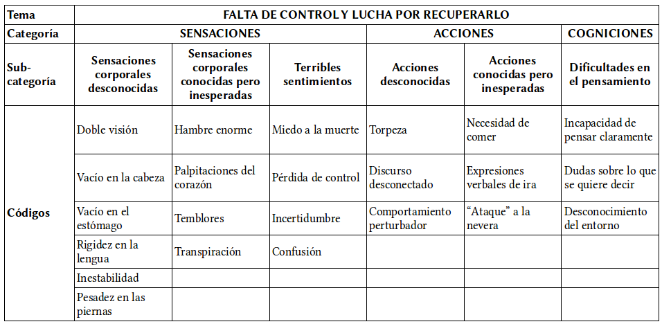
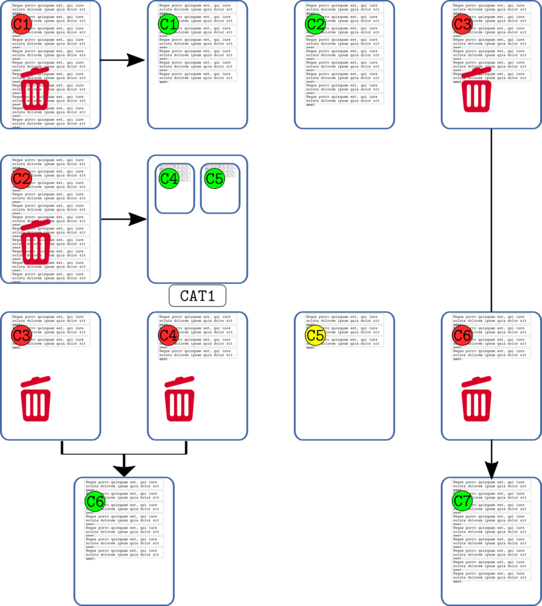
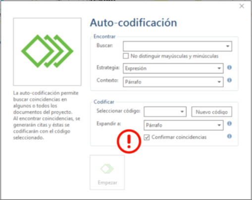

---
title:  'Análisis con Atlas.ti 8'
author:
- name: Juan Muñoz
  affiliation: Universitat Autònoma de Barcelona
  email: juan.munoz@uab.cat
tags: [Atlas.ti, Análisis temático]
url: "http:/juan.psicologiasocial.eu"
bibliography: diapos.bib
csl: apa.csl
lateral-menu: 'True'
...

# Introducción {.center data-background="imagenes-cuali/introduction-2.jpg" data-background-transition=zoom data-state=opacidad }

## CAQDAS

>Programas para el análisis cualitativo de datos [ASISTIDO]{.fosforito} por ordenador

. . .

**Unos enlaces**

[CAQDAS Networking Project](http://www.surrey.ac.uk/sociology/research/researchcentres/caqdas/)

[Online QDA](http://onlineqda.hud.ac.uk/)

[Text Analysis Info – QDA Software](http://www.textanalysis.info/)

[UK Data Archive](http://www.data-archive.ac.uk/)

## Una advertencia
>Recuerde siempre que un ordenador es sólo una máquina, [no pensará por usted]{.fosforito}, y puede incluso dificultarle progresar con su análisis. No olvide apagar el ordenador de vez en cuando. Lleve sus datos, resultados de búsquedas, esquemas de codificación, etc, a un lugar tranquilo, y luego [léalos y piense en ellos]{.fosforito}. Dé un largo paseo y despeje su mente. Será entonces cuando probablemente obtenga las mejores ideas.\
`Friese,  1998`{.autor}

## ¿Qué permite? {#permite}

::::: {.columns}
::: {.column width="35%"}
{.noshadow}
:::

::: {.column width="65%"}

::: nonincremental
* Organización e integración
* Datos multimedia
* Búsqueda y recuperación
* Vinculación
* Representación gráfica
* Trabajo en equipo
:::

:::
::::::::::::::

# Definiciones {.center data-background="imagenes-cuali/Definicion.jpg" data-background-transition=zoom data-state=fondo}

## La investigación cualitativa {#investigacion-cualitativa data-background="imagenes-cuali/AnalisisCotidiano.png" data-background-transition=zoom data-state=opacidad}

>Un enfoque cualitativo es uno en el que hay necesidad de [interpretar los datos]{.fosforito} a través de la identificación y, posiblemente, la [codificación]{.fosforito} de temas, conceptos, procesos, contextos, etc., con el fin de construir [explicaciones]{.fosforito} o teorías o para probar o ampliar una teoría.\
@lewins_using_2007 [, p. 7]

## Análisis temático {#analisis-tematico data-background="imagenes-cuali/AnalisisCotidiano.png" data-background-transition=zoom data-state=opacidad}
 >El análisis temático es un método para identificar, analizar y reportar patrones (temas) dentro de los datos. Como mínimo [organiza y describe]{.fosforito} en detalle el conjunto de datos. Sin embargo, con frecuencia, va más allá e [interpreta]{.fosforito} diversos aspectos del tema de investigación.\
@braun_using_2006 [p. 79]

## Tema

>Un tema es un patrón que se encuentra en la información que, como mínimo, describe y organiza posibles observaciones o, como máximo, interpreta aspectos del fenómeno. Un tema puede identificarse a nivel [manifiesto]{.fosforito} (directamente observable en la información) o a nivel [latente]{.fosforito} (subyacente al fenómeno). Los temas pueden generarse inicialmente [inductivamente]{.fosforito} a partir de la información bruta o generarse [deductivamente]{.fosforito} a partir de la teoría y la investigación previa.\
@boyatzis_transforming_1998 [p. vii]

## Manifiesto vs. latente {#manifiesto-latente}

{.noshadow}

::: notes
Reunión del G7 en Canadá 9 junio 2018
Angel Merkel
Donald Trump
Justin Trudeau
Emmanuel Macron
Shinzō Abe
:::

## ¿Realidad? {#realidad}

:::::: {.columns}
::: {.column width="50%"}
{width="375px" .noshadow}
:::
::: {.column width="50%"}
{width="375px" .noshadow}
:::
::: {.column width="50%"}
{ width="375px" .noshadow}
:::
::: {.column width="50%"}
{ width="375px" .noshadow}
:::
::::::

<!-- <video width="850"   controls>
 <source src="imagenes-cuali/TheCodes.mp4">
</video>

`The Codes of Gender`{.figcaption}

`https://www.youtube.com/watch?v=Zxxvr0ex8MI`{.figcaption} -->

## Temas
> Un tema capta algo importante sobre los datos en relación con la pregunta de investigación, y representa un cierto nivel de pauta de respuesta o significado en el conjunto de los datos.\
@braun_using_2006 [p. 82]

##

::: notes
En este esquema podemos ver cómo, el proceso de análisis temático implica una continua reducción-agrupación de datos. La primera es la que realizamos con la codificación de los fragmentos de texto significativos (citas) para, a continuación, agrupar los códigos en categorías (y subcategorías) que a su vez formarán temas que son los que, finalmente, nos permitirán formular una teoría sobre nuestros datos.
:::

## Ejemplo: códigos-categorías-temas {#ejemplo-c-c-t}

@graneheim_qualitative_2004 [p. 108]\
`Narrativas sobre hipoglucemia`{.figcaption}

## ¿Cómo? {#como}

## Proceso de análisis {#proceso-analisis}

![Adaptado de @seidel_qualitative_1998 [p. 2]](imagenes-cuali/Seidel-NCT.png)

## Fases del análisis {#fases-analisis}

>0. Gestión de datos
1. Familiarizarse con los datos
2. Generar códigos iniciales
3. Buscar temas
4. Revisar temas
5. Definir y etiquetar temas
6. Producir informe

###### @braun_using_2006 [p. 87]{.autor}

## Fases del análisis (Atlas.ti) {#fases-analisis-atlas}
{.noshadow}

# Preparación de datos {#preparacion-datos .center data-background="imagenes-cuali/preparacion-1.jpg" data-background-transition=zoom data-state=opacidad}

## Fases preparación datos {#fases-preparacion-datos}

* Transcripción (literal de los datos)
* Convenciones ("jeffersonianas")
* Gestión (archivado, formato, control)

## Transcripción {#transcripcion}

. . .

>(…) La producción y el uso de transcripciones son ['actividades de investigación']{.fosforito} y no deben ser enfocadas como simplemente 'detalles técnicos' que preceden el análisis.\
@mclellan_beyond_2003 [p. 64]

## Transcribir: herramientas

:::::: {.columns}
::: {.column width="50%"}

:::
::: {.column width="50%"}

:::
::::::

**Software**

Soundscriber:
[http://www-personal.umich.edu/~ebreck/sscriber.html](http://www-personal.umich.edu/~ebreck/sscriber.html)

F4:
[http://www.audiotranskription.de/english](http://www.audiotranskription.de/english)

## Pero...
<iframe width="800" height="400" data-src="http://swiftscribe.ai"></iframe>

[http://swiftscribe.ai/](http://swiftscribe.ai/)

## Convenciones
>En una conversación [lo más significativo es lo que no se dice entre lo que se está diciendo]{.fosforito}, como por ejemplo las pausas y silencios, las entonaciones y los gestos, porque ahí radican los dobles significados, los ánimos y el objetivo mismo de la comunicación.\
@fernandez_christlieb_espiritu_2004 [p. 46]

## Convenciones "jeffersonianas"

@lerner_glossary_2004 [p. 15]

## Gestión de los datos {#gestion-datos-1}
>La inadecuada documentación y monitorización de las actividades relacionadas con los datos pueden [amenazar su integridad]{.fosforito}. Además, las prácticas inadecuadas de seguimiento pueden dificultar el análisis y aumentar la probabilidad de un [pandemónium]{.fosforito} de investigación.\
@mclellan_beyond_2003 [p. 69]

Ver: [Processing Qualitative Data Files](http://www.fsd.uta.fi/aineistonhallinta/en/processing-qualitative-data-files.html)\
`http://www.fsd.uta.fi/aineistonhallinta/en/processing-qualitative-data-files.html`{.figcaption}

Ver: [UK · Data Archive: Create & Manage Data](http://www.data-archive.ac.uk/create-manage)\
`http://www.data-archive.ac.uk/create-manage`{.figcaption}

<!--

##

<section data-background-iframe="https://slides.com/news/make-better-presentations/embed?style=hidden&autoSlide=4000">
</section>

<!-- ## Gestión de los datos {#gestion-datos-2}
>Una buena gestión de los datos es la base para una buena investigación. Si los datos están debidamente organizados, preservados y bien documentados, y su exactitud, vigencia e integridad es controlada en todo momento, el resultado es de datos de alta calidad, investigación eficiente, resultados basados en pruebas sólidas y ahorro de tiempo y recursos. (...) La gestión de datos debe planificarse desde el inicio de la investigación. Si se convierte en parte de la práctica de investigación estándar, entonces no implicará necesariamente mucho tiempo ni costos adicionales.\
@uk_data_archive_managing_2009 [p. 2]
-->

<!--

## Control {.medio}

--------      -------------------------------------------
   Title      Vission screening tests in Exxex nurseries

File name     VisionScreenResults_00_05

Description   Results data of 120 Vision Screen Tests carried out in 5 nurseries in Essex during June 2007

Created by    Chris Wilkinson

Maintained by Sally Wastley

Created       04/07/2007

Last modified 25/11/2007

Based on      VisionScreenDataaseDesign_02_00
--------      -------------------------------------------

-------  ------------  --------------------------------------------   ----------
Version  Responsable   Notes                                          Changed
-------  ------------  --------------------------------------------   ----------
00_05    Sally Wastley Version 00_03 and 00_04 compared and merged    25/11/2007

00_04    Vani Yussu    Entries checked by VY, independent from SK     17/10/2007

00_03    Karin Mills    Entries checked by SK                         17/10/2007
-------  ---------------------------------------------------------    ----------
-->

## Control de versiones

## Y luego...

. . .

{.noshadow}

. . .

{.noshadow}

# Proyecto {.center data-background="imagenes-cuali/escriba.jpg" data-background-transition=zoom data-state=opacidad}

## Estrategias trabajo en equipo

{.noshadow}

::: notes
Dos formas básicas de trabajo en equipo:

- Todos los analistas trabajando con el conjunto de los documentos.
- Diferentes analistas trabajan con diferentes documentos.

En ambos casos, el resultado final es la unión de los diferentes proyectos
:::

## Unir proyectos

## Añadir documentos {#anadir-documentos}

:::::: {.columns}
::: {.column width="50%"}
{.border .noshadow}
:::
::: {.column width="50%"}
{.noshadow}
:::
::::::

:::::: {.columns}
::: {.column width="100%"}

Descargar y descomprimir [https://bit.ly/2tboqvO]{.fosforito}

>- Inicio > Agregar documentos > Agregar archivos
- Gestor de documentos > Crear comentarios de documentos
:::
::::::

# Memoing {.center data-background="imagenes-cuali/Memoing-01.jpg" data-background-transition=zoom data-state=opacidad}

## Memoing
>Mediante el uso de memorandos, el investigador es capaz de sumergirse en los datos, explorar los significados que estos datos tienen, mantener la continuidad y mantener el impulso en la realización de la investigación. Como [crónica de un viaje de investigación]{.fosforito}, los memorandos permanecen como un registro, indeleble pero flexible, para retención personal o para difundir a otros.\
@birks_memoing_2008 [p. 69]

## Memoing
>Vemos la toma de notas como [crucial]{.fosforito} para todos los tipos y enfoques de análisis. Otras funciones, como la codificación, la búsqueda de texto, la codificación automática y la modelización pueden ser utilizadas por enfoques concretos, pero la anotación de los datos, documentos y material de apoyo es [indivisible del análisis general]{.fosforito}.\
@lewins_using_2007 [p. 59]

## Memoing = Reflexionar sobre...

* Relación con participantes y/o fenómeno
* Preguntas de investigación
* Elección de códigos y sus definiciones
* Categorías, temas y conceptos emergentes
* Posibles conexiones entre elementos
* Teoría emergente
* Problemas de cualquier tipo de nuestra investigación
* Problemas o dilemas éticos
* Informe final

. . .

###### @saldana_coding_2009 [pp. 34-40]{.autor}

## Crear memos-anotaciones

 >* Crear una memo
 >     * Etiquetarla como "Proceso"
 >     * Describir los pasos dados hasta el momento
 >     * Guardar
 * Crear una memo "Objetivos"

# Segmentar y codificar {.center data-background="imagenes-cuali/Coding.jpg" data-background-transition=zoom data-state=opacidad}

## Reducción {#reduccion}
>[En la investigación cualitativa] el reto es dar sentido a una cantidad masiva de datos, reducir el volumen de información, identificar pautas significativas, y construir un marco para comunicar la esencia de lo que revelan los datos.\
@patton_qualitative_1990 [pp. 371-372]

. . .

{ width="370px"}

## Codificación {#codificacion}

>La indexación (o codificación) es la actividad en la que el investigador aplica significado a los datos en bruto mediante la asignación de palabras clave o frases. Estas palabras clave actúan como indicadores de temas en los datos. La indexación es una actividad por la que los datos se descomponen, conceptualizan y posteriormente son reformulados.\
@bloor_keywords_2006 [p.201]

## Estrategias de codificación {#estrategias-codificacion }

::: notes
Si la estrategia de trabajo es de tipo deductivo, se creará una lista de códigos que se intentará "aplicar" sobre los datos creando citas.

Si la estrategia es inductiva, los códigos surgirán de la lectura de los datos y por lo tanto primero crearemos citas que se vincularán con códigos.
:::

## Ejercicio: Segmentación {#ejercicio-segmentacion}

{.noshadow  .border}

>* Crear citas "libres" en varios documentos.
* Eliminar citas.
* Modificar tamaño de citas.
* Explorar citas con el [Administrador de citas]{.resaltar} y con el [Navegador de citas]{.resaltar}.

## Relaciones

::: notes
Existen pocas limitaciones en cuanto a cómo crear citas libres, pueden ser de cualquier extensión, pueden solaparse entre ellas... pero sí que tenemos la limitación de que una cita no puede ser "discontínua", es decir, no puede tener una primera parte, p.ej. de la línea 3 a 5, y una segunda parte de la 8 a la 10 sin que estén incluidas las líneas 6 y 7.
Esto podría provocar que se pierda el significado si no se tiene en cuenta la primera parte, por lo que tendríamos que incluir todas las líneas. Pero si eso implica tener una cita excesivamente larga, otra opción sería crear dos citas y una relación entre ambas.
:::

## Ejercicio: Relaciones entre citas

{.border}

>* Crear relaciones entre citas del mismo/diferente documento.
* "Navegar" entre citas.
* Explorar relaciones con el [Administrador de vínculos]{.resaltar}.

## Categorización {#categorizacion}
>Los animales se clasifican en a) pertenecientes al emperador, b) embalsamados, c) amaestrados, d) lechones, e) sirenas, f) fabulosos, g) perros sueltos, h) incluidos en esta clasificación, i) que se agitan como locos, j) innumerables, k) dibujados con un pincel finísimo de pelo de camello, l) etcétera, m) que acaban de romper el jarrón, n) que de lejos parecen moscas.\
`J.L.Borges (1952). El idioma analítico de John Wilkins.`{.autor}

## Literatura definicional

| Origen            | El gato ha bebido la leche                                                                                                                                                                                                                                                                                                               |
|:------------------|:-----------------------------------------------------------------------------------------------------------------------------------------------------------------------------------------------------------------------------------------------------------------------------------------------------------------------------------------|
| 1ª Transformación | El mamífero carnívoro digitígrado doméstico ha tragado un líquido blanco, de sabor dulce producido por las hembras de los mamíferos.                                                                                                                                                                                               |
| 2ª Transformación | Quien tiene tetas, come carne, camina sobre la extremidad de sus dedos y pertenece a la casa ha hecho descender por el gaznate al estómago un estado de la materia sin forma propia, del color de la leche, de impresión agradable al órgano del gusto y procurado por los animales de sexo femenino que tienen tetas. |

`Raymond Queneau`{.autor}

## "El gato"

{.border}

::: notes
Podemos pensar en la codificación como una forma de literatura definicional a la inversa, en la que nuestros datos (y citas) son la última transformación y los pasos previos son códigos.

La duda que se nos puede plantear es sobre el nivel de codificación que realizaremos (Mamífero, Carnívoro... frente a Gato, Bebe...).

Tenemos dos posibles respuestas (no incompatibles entre sí):

- El nivel adecuado viene definido por los objetivos
- Podemos utilizar diferentes niveles (códigos, categorías...)
:::

## Comentarios de códigos {#comentarios-codigos .medio}

| Código              | MARGPROB                                                                                                                                                                                                                                                        |
|:--------------------|:----------------------------------------------------------------------------------------------------------------------------------------------------------------------------------------------------------------------------------------------------------------|
| Definición breve    | Problemas propios de comunidades marginales                                                                                                                                                                                                                     |
| Definición completa | Situaciones sociales que son vividas exclusivamente por aquellas personas que llevan un estilo de vida marginal, con carencia fundamentalmente de bienes y servicios que sí están presentes en personas con nivel socioeconómico medio.                         |
| Cuándo se usa       | Cuando las personas señalan alguna dificultad que denote un problema social instrumental, como falta de alimento, abrigo, techo, salud, servicios sanitarios. Debe tener carácter grave o impedir el desarrollo adecuado de su vida familiar, social o laboral. |
| Cuándo no se usa    | No se aplica a problemas propios de una conducta condicionada por cultura marginal, como violencia doméstica, alcoholismo, abandono de hogar, delincuencia, prostitución                                                                                        |
| Ejemplo             | “Como aquí no hay agua ni alcantarillado, la suciedad que hay aquí en las calles es terrible, ahí se puede ver... ¿se fija?, los niños se enferman a cada rato.”                                                                                                |

###### @macqueen_codebook_1998{.autor}

## Ejercicio: Codificación {#ejercicio-codificacion}

{.noshadow  .border}

>* Crear códigos libres con [Nuevas entidades]{.resaltar} (y comentarios de códigos.
* Relacionar códigos libres con citas existentes utilizando el [Navegador de códigos]{.resaltar}.
* Utilizar la opción de [Codificación abierta]{.resaltar}.
* Desvincular código de cita.
* Explorar códigos con el [Administrador de códigos]{.resaltar}.

## Comparación constante {#comparacion-constante}
{.noshadow}

## Codificación: "Depuración" {#codificacion-depuracion}

>Durante el desarrollo de un sistema de códigos y eventualmente temas, el investigador va en constante ir y venir entre la lectura de los datos, la relectura de los segmentos codificados, la organización de los códigos, el cambio de nombre y el reordenamiento de los códigos y la recodificación de los segmentos de datos.\
@friese_carrying_2018 [p. 17]

## {transition=none}

{.noshadow }

## {transition=none}

{.noshadow}

## {transition=none}

{.noshadow}

## {transition=none}

{.noshadow}

## {transition=none}

{.noshadow}

## {transition=none}

{.noshadow}

###### @friese_using_2011 {.autor}

## Ejercicio: Depurar códigos {#depurar-codigos}

{.border}

>* Generar [Informe]{.resaltar} de todas las citas de un código.
* Generar informe de un conjunto de códigos.
* [Fusionar]{.resaltar} varios códigos.
* [Dividir]{.resaltar} un código en dos.

## Agrupar

## Ejercicio: grupos de códigos {#ejercicio-grupos-codigos}

{.noshadow .border}

>* Crear grupos de códigos.
>   - Desde el [Administrador de códigos]{.resaltar}.
>   - Con el [Administrador de grupos de códigos]{.resaltar}.

# "Transportar" UH{.center data-background="imagenes/luggage.png"}

## Ejercicio: Crear/abrir copia

:::::: {.columns}
::: {.column width="50%"}
{.border}
:::
::: {.column width="50%"}
{.border}
:::
:::::

# Preguntas {.center data-state=opacidad data-background="fondos/Research.jpg" data-background-transition=zoom}

## Analizar

## Pregunta 1a

#### ¿Qué "actores" aparecen en las secciones utilizadas para captar la atención (títulos...)?

>* [Escribir Memo]{.resaltar}.
* Identificar secciones.
* Identificar "actores".
* Buscar co-ocurrencias.

## Co-ocurrencias {#coocurrencias-0 transition=none}

{.border}

::: notes
Las coocurrencias son las citas (codificadas) que presentan algún grado de solapamiento entre sí, por lo tanto, las coocurrencias de códigos nos indican los códigos con los que están codificados esas citas. Cuando dos códigos presentan coocurrencias, significa que un significado (código) está en cierta forma relacionado con otro.
:::

## Co-ocurrencias {#coocurrencias-1 transition=none}

{.border}

## Co-ocurrencias {#coocurrencias-2 transition=none}

{.border}

## Tabla de co-coocurrencias

{.border .noshadow}

::: notes
Para llegar al resultado de la imagen, en primer lugar se ha añadido un identificador a las etiquetas de códigos, "es:" para los códigos "estructurales", y "ac:" a los códigos que identifican a los diferentes "actores". De esta forma, aparecerán juntos en el Administrador de códigos. Además, al acceder a la herramienta "Tabla de co-ocurrencias", podemos filtrar fácilmente "es:" en filas y "ac:" en columnas.
:::

## Pregunta 1b

#### ¿Cómo presentan esa información los diferentes diarios?

>* Grupos de documentos.
* [Grupos inteligentes]{.resaltar} de documentos.
* [Activar filtro global]{.resaltar}.

## Grupos "inteligentes"

|                | + Derechas | - Derechas |
|:---------------|:----------:|:----------:|
| Pre (15 marzo) |            |            |
| Post           |            |            |

. . .

{.noshadow}

<!-- # Estructurar {.center data-state=opacidad data-background="imagenes-cuali/hanging-files.jpg" data-background-transition=zoom} -->

#

## Pregunta 2

#### ¿Qué características tienen los contenidos que son citas textuales?

>* Codificar todos los fragmentos entre cualquier tipo de comillas.
* Tabla de co-coocurrencias.
* Ver memo "co:Citas literales".
* Y... [Codificación de grupo focal]{.resaltar}.

## Autocodificación {#autocodificacion}

>* Autocodificar siguiendo las instrucciones del memo.
* Hacer codificación de grupo focal.

# Relaciones {.center data-background="imagenes-cuali/network.jpg" data-background-transition=zoom data-state=opacidad}

## Estructura: Grupos de códigos {#estructura-grupos-codigos}

## Estructura: Relaciones entre códigos {#estructura-relaciones-codigos}

## Jerarquías de códigos {#jerarquias-codigos-2}

## Ejercicio: Relaciones entre códigos

>* Crear relaciones "es una" entre códigos.
* Crear otros tipos de relaciones.
* Definir un nuevo tipo de relación.

# Vistas de red{.center data-background="imagenes-cuali/neurons.jpg" data-background-transition=zoom data-state=opacidad}

##

>Aplicar redes temáticas es simplemente una forma de organizar un análisis temático de datos cualitativos. Los análisis temáticos intentan descubrir los temas más destacados en un texto a diferentes niveles, y las redes temáticas tienen como objetivo [facilitar la estructuración y representación]{.fosforito} de esos temas.\
@attride-stirling_thematic_2001 [p. 387]

## Redes temáticas {#redes-tematicas}

## Redes {#relaciones-codigos-donacion}

## Redes {#relaciones-codigos-iter}

<!--
##Editar Relaciones

 -->

# Consultas {.center data-background="imagenes-cuali/query.jpg" data-background-transition=zoom data-state=opacidad}

## Consultas

## Consultas: Operadores Booleanos

## Operadores Booleanos

## Construcción de una consulta {#construccion-booleana-1}

Todas las citas codificadas como C1 **Y** C2 **O** como C1 y C3

:::::: {.columns}
::: {.column width="40%"}
{ width="300px"}
:::
::: {.column width="60%"}
{ width="450px"}
:::
:::::

## Construcción de una consulta {#construccion-booleana-2}

Todas las citas codificadas como C1 **O** C2 pero **NO** como C3

:::::: {.columns}
::: {.column width="40%"}
{ width="300px"}
:::
::: {.column width="60%"}
{ width="450px"}
:::
:::::

## Construcción de una consulta {#construccion-booleana-3}

Todas las citas codificadas como C1 **O** C2 **O** como C3 **Y** C4 **Y** **NO** como C1 **Y** C3

:::::: {.columns}
::: {.column width="40%"}
{ width="300px"}
:::
::: {.column width="60%"}
{ width="450px"}
:::
:::::

## Operadores Semánticos {#operadores-semanticos}

## Operadores Semánticos {#ejemplo-operadores-semanticos}

## Operadores de Proximidad

##

<!-- ## Ejemplo consulta

## Ejemplo consulta

### https://bit.ly/2JoJhCg

<!--
## Consultas: Alcance

--> -->

## Buscar texto

  <!--
 Conjunto de términos
   : `Jorquera|Pérez-Bouza`

 Categoría
   : `BNG:=Jorquera|Pérez-Bouza`

 Múltiples categorías
   : `AUTONOMICO:= $AMAIUR|$BNG|$CC|$CiU`

 ## GREP

   |  Operador   | Función                                                                        |
   |:-----------:|:-------------------------------------------------------------------------------|
   | ^*término*  | Limita la expresión de búsqueda que sigue al marcador al principio de la línea |
   | *término*$  | Limita la expresión de búsqueda precedente al final de la línea                |
   | \<*término* | Limita la expresión de búsqueda siguiente al inicio de una palabra             |
   | *término*\> | Limita la expresión de búsqueda precedente al inicio de una palabra            |
   |     \\B     | Limita la expresión de búsqueda siguiente a NO incio de palabra                |
   |      .      | Localiza cualquier carácter                                                    |
   |     \\w     | Localiza cualquier carácter alfanumérico                                       |
   |      *      | Localiza cualquier cantidad (o su ausencia) de la expresión precedente         |
   |      +      | Localiza al menos una ocurrencia de la expresión precedente                    |

 -->

# Otras herramientas

# Referencias{.center data-background="imagenes-cuali/books.jpg" data-background-transition=zoom data-state=opacidad}

## {.scrollable .peque}

<!--

# Organización Datos {.center data-state=opacidad data-background="imagenes-cuali/hanging-files.jpg" data-background-transition=zoom }

# Informes {.center data-background="imagenes-cuali/reports.jpg" data-background-transition=zoom data-state=opacidad}

-->
