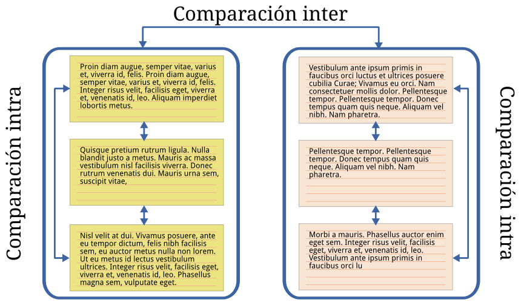
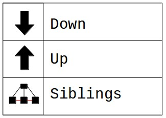
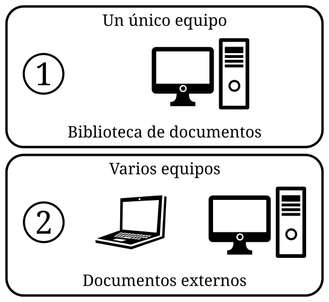

---
title:  'Análisis con Atlas.ti'
author:
- name: Juan Muñoz
  affiliation: Universitat Autònoma de Barcelona
  email: juan.munoz@uab.cat
tags: [Atlas.ti, Análisis temático]
url: "http:/juan.psicologiasocial.eu"
bibliography: diapos.bib
csl: apa.csl
lateral-menu: 'True'
...

#Introducción {.center data-background="imagenes-cuali/introduction-2.jpg" data-background-transition=zoom data-state=opacidad}

##CAQDAS

>Programas para el análisis cualitativo de datos ASISTIDO por ordenador

. . .

**Unos enlaces**

[CAQDAS Networking Project](http://www.surrey.ac.uk/sociology/research/researchcentres/caqdas/)

[Online QDA](http://onlineqda.hud.ac.uk/)

[Text Analysis Info – QDA Software](http://www.textanalysis.info/)

[UK Data Archive](http://www.data-archive.ac.uk/)

##¿Qué permite?

<div style="float:left; margin:0; width:35%;">
{.noshadow}
</div>

<div style="float:left; margin:0; width:65%;">
>* Organización e integración
* Datos multimedia
* Búsqueda y recuperación
* Vinculación
* Representación gráfica
* Trabajo en equipo
</div>

##Análisis temático{data-background="imagenes-cuali/AnalisisCotidiano.png" data-background-transition=zoom data-state=opacidad}
>El análisis temático es un método para identificar, analizar y reportar patrones (temas) dentro de los datos. Como mínimo organiza y describe en detalle el conjunto de datos. Sin embargo, con frecuencia, va más allá e interpreta diversos aspectos del tema de investigación.\
@braun_using_2006 [p. 79]

##¿Cómo?


##


## Ejemplo: códigos-categorías-temas


@graneheim_qualitative_2004 [p. 108]\
`Narrativas sobre hipoglucemia`{.figcaption}

##Fases del análisis
{.noshadow}

#Preparación de datos {.center data-background="imagenes-cuali/preparacion-1.jpg" data-background-transition=zoom data-state=opacidad}

## Fases preparación datos

* Transcripción (literal de los datos)
* Convenciones ("jeffersonianas")
* Gestión (archivado, formato, control)


##Gestión de los datos
>La inadecuada documentación y monitorización de las actividades relacionadas con los datos pueden amenazar su integridad. Además, las prácticas inadecuadas de seguimiento pueden dificultar el análisis y aumentar la probabilidad de un pandemónium de investigación.\
@mclellan_beyond_2003 [p. 69]

Ver: [UK · Data Archive: Create & Manage Data](http://www.data-archive.ac.uk/create-manage)\
`http://www.data-archive.ac.uk/create-manage` {.figcaption}

##Control de versiones


##Y luego...

. . .

{.noshadow}

. . .

{.noshadow}

# Proyecto {.center data-background="imagenes-cuali/escriba.jpg" data-background-transition=zoom data-state=opacidad}


##Añadir documentos

## Ejercicio: Comentarios de documentos

 {.noshadow}

>* Abrir el gestor de documentos
>* Crear comentarios de documentos
>     + Desde el gestor
>     + Con el editor de comentarios

#Memoing {.center data-background="imagenes-cuali/Memoing-01.jpg" data-background-transition=zoom data-state=opacidad}

##Memoing
>Mediante el uso de memorandos, el investigador es capaz de sumergirse en los datos, explorar los significados que estos datos tienen, mantener la continuidad y mantener el impulso en la realización de la investigación. Como crónica de un viaje de investigación, los memorandos permanecen como un registro, indeleble pero flexible, para retención personal o para difundir a otros.\
@birks_memoing_2008 [p. 69]

##Memoing
>Vemos la toma de notas como crucial para todos los tipos y enfoques de análisis. Otras funciones, como la codificación, la búsqueda de texto, la codificación automática y la modelización pueden ser utilizadas por enfoques concretos, pero la anotación de los datos, documentos y material de apoyo es indivisible del análisis general.\
@lewins_using_2007 [p. 59]


##Memoing = Reflexionar sobre... {.peque}

* Relación con participantes y/o fenómeno
* Preguntas de investigación
* Elección de códigos y sus definiciones
* Categorías, temas y conceptos emergentes
* Posibles conexiones entre elementos
* Teoría emergente
* Problemas de cualquier tipo de nuestra investigación
* Problemas o dilemas éticos
* Informe final

. . .

@saldana_coding_2009 [pp. 34-40]

##Ejercicio memos-anotaciones

{.noshadow}

>* Crear una memo
>     * Etiquetarla como "Proceso"
>     * Describir los pasos dados hasta el momento
>     * Guardar
>* Crear una memo "Objetivos"


#Segmentar y codificar {.center data-background="imagenes-cuali/Coding.jpg" data-background-transition=zoom data-state=opacidad}

##Reducción
>[...] el reto es dar sentido a una cantidad masiva de datos, reducir el volumen de información, identificar pautas significativas, y construir un marco para comunicar la esencia de lo que revelan los datos.\
@patton_qualitative_1990 [pp. 371-372]

. . .

{.noshadow}


##Codificación

>La indexación (o codificación) es la actividad en la que el investigador aplica significado a los datos en bruto mediante la asignación de palabras clave o frases. Estas palabras clave actúan como indicadores de temas en los datos. La indexación es una actividad por la que los datos se descomponen, conceptualizan y posteriormente son reformulados.\
@bloor_keywords_2006 [p.201]

##Estrategias de codificación


## Ejercicio: Segmentación / Codificación

{.noshadow}

>* Crear citas libres
* Crear códigos libres
* Utilizar otras opciones de codificación


##Comentarios de códigos

Código
: MARGPROB

Definición breve
: Problemas propios de comunidades marginales

Definición completa
: Situaciones sociales que son vividas exclusivamente por aquellas personas que llevan un estilo de vida marginal, con carencia fundamentalmente de bienes y servicios que sí están presentes en personas con nivel socioeconómico medio

##

Cuándo se usa
: Cuando las personas señalan alguna dificultad que denote un problema social instrumental, como falta de alimento, abrigo, techo, salud, servicios sanitarios. Debe tener carácter grave o impedir el desarrollo adecuado de su vida familiar, social o laboral.

Cuándo no se usa
: No se aplica a problemas propios de una conducta condicionada por cultura marginal, como violencia doméstica, alcoholismo, abandono de hogar, delincuencia, prostitución

Ejemplo
:  “Como aquí no hay agua ni alcantarillado, la suciedad que hay aquí en las calles es terrible, ahí se puede ver... ¿se fija?, los niños se enferman a cada rato.”

@macqueen_codebook_1998

##Comentarios de códigos

{.noshadow}

>* Crear comentarios de códigos

Ver:

@macqueen_codebook_1998


## Literatura definicional

<div id="column1" style="float:left; margin:0;">
 {.border}
</div>

. . .

<div id="column1" style="float:left; margin:0;">
 {.border}
</div>

. . .

<div id="column1" style="float:left; margin:0;">
 {.border}
</div>


##Comparación constante
{.noshadow}

# Estructurar {.center data-state=opacidad data-background="imagenes-cuali/hanging-files.jpg" data-background-transition=zoom}

## Autocodificación

<!--
Volver a informes. Queremos obtener informes de...
(cuidado si antes se han visto las agrupaciones de códigos)


-->

## Agrupar


##Ejercicio: Grupos de documentos

{.noshadow}

| Grupo    | Contenido        |
|:---------|:-----------------|
| Congreso | Control-Congreso |
| Senado   | Control-Senado   |
| IX LEG.  | -2011            |
| X LEG.   | -2012            |

## Grupos "inteligentes"

{.noshadow}

|         |       CONGRESO        |       SENADO        |
|:--------|:---------------------:|:-------------------:|
| IX LEG. | Control-Congreso-2011 | Control-Senado-2011 |
| X LEG.  | Control-Congreso-2012 | Control-Senado-2012 |


## Agrupación de códigos

{.noshadow}

|           |    NACIONALES     |           AUTONÓMICOS           |
|:----------|:-----------------:|:-------------------------------:|
| IZQUIERDA | IU<br>PCE<br>PSOE | Amaiur<br>BNG<br>ERC<br>ICV PSC |
| DERECHA   |     PP<br>UPD     |        CC<br>CiU<br>PNV         |


>* Crear grupos de códigos
* Crear "grupos "inteligentes"

# Relaciones {.center data-background="imagenes-cuali/network.jpg" data-background-transition=zoom data-state=opacidad}

##Tipos de Relaciones

|         | CITAS        | CÓDIGOS      | MEMOS    |
|:--------|:-------------|:-------------|:---------|
| CITAS   | Hypervínculo | Codificación | Relación |
| CÓDIGOS |              | Relación     | Relación |
| MEMOS   |              |              | Relación |

. . .


##Relaciones entre códigos


##Relaciones entre códigos


# Vistas de red{.center data-background="imagenes-cuali/neurons.jpg" data-background-transition=zoom data-state=opacidad}

##

>Aplicar redes temáticas es simplemente una forma de organizar un análisis temático de datos cualitativos. Los análisis temáticos intentan descubrir los temas más destacados en un texto a diferentes niveles, y las redes temáticas tienen como objetivo facilitar la estructuración y representación de esos temas.\
@attride-stirling_thematic_2001 [p. 387]

##Redes temáticas


<!--
##Editar Relaciones


 -->

# Herramientas de consulta{.center data-background="imagenes-cuali/query.jpg" data-background-transition=zoom data-state=opacidad}

##Buscar texto

<!--

 -->

Conjunto de términos
  : `Jorquera|Pérez-Bouza`

Categoría
  : `BNG:=Jorquera|Pérez-Bouza`

Múltiples categorías
  : `AUTONOMICO:= $AMAIUR|$BNG|$CC|$CiU`

## GREP

  |  Operador   | Función                                                                        |
  |:-----------:|:-------------------------------------------------------------------------------|
  | ^*término*  | Limita la expresión de búsqueda que sigue al marcador al principio de la línea |
  | *término*$  | Limita la expresión de búsqueda precedente al final de la línea                |
  | \<*término* | Limita la expresión de búsqueda siguiente al inicio de una palabra             |
  | *término*\> | Limita la expresión de búsqueda precedente al inicio de una palabra            |
  |     \\B     | Limita la expresión de búsqueda siguiente a NO incio de palabra                |
  |      .      | Localiza cualquier carácter                                                    |
  |     \\w     | Localiza cualquier carácter alfanumérico                                       |
  |      *      | Localiza cualquier cantidad (o su ausencia) de la expresión precedente         |
  |      +      | Localiza al menos una ocurrencia de la expresión precedente                    |

<!--

##Consultas

<div id="column1" style="float:left; margin:0; width:65%;">

</div>

<div id="column1" style="float:left; margin:0; width:35%;">

``` {.peque .left}
1.- Códigos-Familias de Códigos
2.- Condiciones (Operandos)
3/4.- Expresiones formuladas
5.- Resultados
6.- Distancia máxima
7.- Selección de doumentos
8.- Crear super-código
9.- Borrar / Imprimir
10.- Edición expresiones
```
</div>
 -->

##Consultas: Operadores Booleanos


##Construcción de una consulta

"Todas las citas codificadas como 'Evasión', realizadas por Rajoy o por Zapatero"


. . .


##Operadores Booleanos


##Operadores Semánticos



##


##Operadores de Proximidad


##


<!--
##Consultas: Alcance


 -->

<!--
##Concurrencias


-->


#Otras herramientas


#Referencias{.center data-background="imagenes-cuali/books.jpg" data-background-transition=zoom data-state=opacidad}

## {.scrollable .peque}


<!--

# Organización Datos {.center data-state=opacidad data-background="imagenes-cuali/hanging-files.jpg" data-background-transition=zoom }

##Agregar datos

{.noshadow}

. . .

```
1. Documentos > Nuevo > Agregar documentos (a biblioteca)
2. Documentos > Nuevo > Asignar documentos externos
```

##Ejercicio: Agregar datos

{.noshadow}

Desde la carpeta "ControlParlamentario"

>* Agregar a biblioteca
>* Asignar documentos externos

##"Transportar" UH

<div id="column1" style="float:left; margin:0; width:35%;">
{.noshadow}

</div>

<div id="column1" style="float:left; margin:0; width:65%;">

Copiar y restaurar

```
Proyecto > Guardar paquete de copia
```

```
Proyecto > Desempaquetar la copia
```

O
```
Documentos > Administrador de fuente de datos
   * Abrir Administrador de biblioteca
       * Fuentes de datos > Exportar
   * Exportar documentos seleccionados   
```

</div>

. . .

<hr />

<div id="column1" style="float:left; margin:0; width:35%;">
{.noshadow}

</div>

Copiar carpeta donde estén UH y documentos

#Informes {.center data-background="imagenes-cuali/reports.jpg" data-background-transition=zoom data-state=opacidad}

##Menús informes

 `Componentes con opciones de impresión`{.figcaption}

 

 . . .

 `Destino del informe`{.figcaption}

 

##Ejercicio: Informes

{.noshadow}

>* Explorar diferentes tipos de informes: Documentos, Códigos, Memos...
-->
