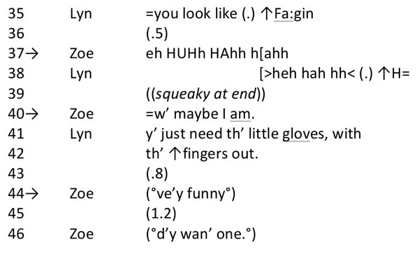
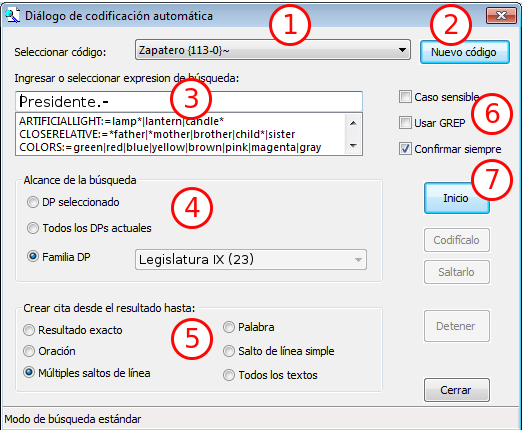
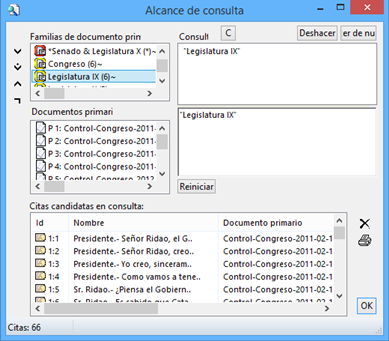

---
title:  'Análisis con Atlas.ti'
author:
- name: Juan Muñoz
  affiliation: Universitat Autònoma de Barcelona
tags: [Atlas.ti, Análisis temático]
url: "http:/juan.psicologiasocial.eu"
bibliography: diapos.bib
csl: apa.csl
lateral-menu: 'True'
...

#Introducción {.center}

##CAQDAS

>Programas para el análisis cualitativo de datos ASISTIDO por ordenador

##Unos enlaces

[CAQDAS Networking Project](http://www.surrey.ac.uk/sociology/research/researchcentres/caqdas/)

[Online QDA](http://onlineqda.hud.ac.uk/)

[Text Analysis Info – QDA Software](http://www.textanalysis.info/)

[UK Data Archive](http://www.data-archive.ac.uk/)

<!--

##Los elogios

>In my graduate student days, there were no tape recorders for making an interviewer’s life easier; these arrived after World War II, passing first through the wide recorder stage. These were ponderous machines, only gradually slimming down to today’s light models. Many years later, following our dreams of computers that would ease our lives as qualitative social researchers, software was devised for us.

-->

##Una crítica

>(…) qualitative data are derived from language and allow for the detailed exploration of feelings, drives, emotions ant the subjective understanding a respondent had of a certain social situation at a particular time. They are indexical and context bound. The data are fuzzy, with slippery boundaries between meanings, and not ideally suited to categorization and classification using digitally based software. Employing a digital tool of this type on qualitative data has the potential to distort any understanding arrived at.\
@roberts_ict_2002

##Una advertencia
>Always remember that a computer is just a machine, it won’t do the thinking for you, and it might even hinder you in progressing with your analysis. Don’t forget to turn the computer off once in a while. Take your data, search outputs, coding schemes, etc., to a quite place, and then read through them and think about them. Go far a walk and rest your mind. You probably will get the best ideas then.\

Friese,  1998

##¿Qué permite?

<div style="float:left; margin:0; width:20%;">

</div>

<div style="float:left; margin:0; width:80%;">
>* Organización e integración
* Datos multimedia
* Búsqueda y recuperación
* Vinculación
* Representación gráfica
* Trabajo en equipo
</div>

##La investigación cualitativa

>Un enfoque cualitativo es uno en el que hay necesidad de interpretar los datos a través de la identificación y, posiblemente, la codificación de temas, conceptos, procesos, contextos, etc., con el fin de construir explicaciones o teorías o para probar o ampliar una teoría.\
@lewins_using_2007

##Análisis de contenido
>Una técnica de investigación para la descripción objetiva, sistemática y cuantitativa del contenido manifiesto de las comunicaciones con el fin de interpretarlas.\
@berelson_content_1952 [p. 18]

##Análisis cualitativo de contenido
>(…) un enfoque de análisis empírico, metodológicamente controlado, de textos en su contexto de comunicación, siguiendo reglas de análisis de contenido y modelos paso a paso, sin una cuantificación precipitada.\
@mayring_qualitative_2000 [para. 5]

<!--
##Análisis cualitativo de contenido
>El análisis de contenido moderno, ya no se dirige únicamente al contenido del material verbal. Pueden ser objeto de estudio tanto los aspectos formales como el significado latente. La idea básica de un análisis de contenido cualitativo, pues, consiste en mantener el carácter sistemático del análisis de contenido durante las distintas etapas del análisis cualitativo, sin realizar cuantificaciones apresuradas.\
@mayring_qualitative_2004 [p. 266]
-->

##Análisis temático
>El análisis temático es un método para identificar, analizar y reportar patrones (temas) dentro de los datos. Como mínimo organiza y describe en detalle el conjunto de datos. Sin embargo, con frecuencia, va más allá e interpreta diversos aspectos del tema de investigación.\
@braun_using_2006 [p. 79]

##Cuantitativo vs. cualitativo


##¿Cómo?


##Fases del análisis


#Gestión de datos { .center}


##Transcripción

. . .

>(…) La producción y el uso de transcripciones son 'actividades de investigación' y no deben ser enfocadas como simplemente 'detalles técnicos' que preceden el análisis.\
@mclellan_qualitative_2003 [p. 64]

. . .

>“(…) el examen de la grabación como una práctica perturba el tratamiento aproblemático de la cinta como "datos" inmutables. De repente, la cinta es tan "insegura" y "poco fiable" como todos los demás objetos, más obviamente artesanales.\
@ashmore_innocence_2000 [para. 31]


##Transcribir: herramientas

<div id="column2" style="float:left; margin:0; width:50%;">


</div>

<div id="column1" style="float:left; margin:0; width:50%;">


</div>

**Software**

Soundscriber:
[http://www-personal.umich.edu/~ebreck/sscriber.html](http://www-personal.umich.edu/~ebreck/sscriber.html)

F4:
[http://www.audiotranskription.de/english](http://www.audiotranskription.de/english)

##Convenciones
>En una conversación lo más significativo es lo que no se dice entre lo que se está diciendo, como por ejemplo las pausas y silencios, las entonaciones y los gestos, porque ahí radican los dobles significados, los ánimos y el objetivo mismo de la comunicación.\
@fernandezchristlieb_espiritu_2004 [p. 46]

##Convenciones "jeffersonianas"


@jefferson_glossary_2004 [p. 15]

<!--
##Ejercicio: transcripción con convenciones
-->

##Gestión de los datos
>La inadecuada documentación y monitorización de las actividades relacionadas con los datos pueden amenazar su integridad. Además, las prácticas inadecuadas de seguimiento pueden dificultar el análisis y aumentar la probabilidad de un pandemónium de investigación.\
@mclellan_qualitative_2003 [p. 69]

[UK · Data Archive: Create & Manage Data](http://www.data-archive.ac.uk/create-manage)

##Gestión de los datos
>Una buena gestión de los datos es la base para una buena investigación. Si los datos están debidamente organizados, preservados y bien documentados, y su exactitud, vigencia e integridad es controlada en todo momento, el resultado es de datos de alta calidad, investigación eficiente, resultados basados en pruebas sólidas y ahorro de tiempo y recursos. (...) La gestión de datos debe planificarse desde el inicio de la investigación. Si se convierte en parte de la práctica de investigación estándar, entonces no implicará necesariamente mucho tiempo ni costos adicionales.\
@ukdataarchive_managing_2009 [p. 2]

##Ejercicio: documentación datos

* Formato documentos
* Etiquetado archivos
* Sistema de control

##Y luego...

. . .


. . .


<!--  -->

#Unidad Hermenéutica {data-background="imagenes-cuali/Proceso-fondo.png" data-background-transition=zoom data-state=opacidad}

##


#Memoing {data-background="imagenes-cuali/Proceso-fondo.png" data-background-transition=zoom data-state=opacidad}

##Memoing
>Mediante el uso de memorandos, el investigador es capaz de sumergirse en los datos, explorar los significados que estos datos tienen, mantener la continuidad y mantener el impulso en la realización de la investigación. Como crónica de un viaje de investigación, los memorandos permanecen como un registro, indeleble pero flexible, para retención personal o para difundir a otros.\
@birks_memoing_2008 [p. 69]

##Memoing
>Vemos la toma de notas como crucial para todos los tipos y enfoques de análisis. Otras funciones, como la codificación, la búsqueda de texto, la codificación automática y la modelización pueden ser utilizadas por enfoques concretos, pero la anotación de los datos, documentos y material de apoyo es indivisible del análisis general.\
@lewins_using_2007 [p. 59]


##Memoing = Reflexionar sobre... {.peque}

* Relación con participantes y/o fenómeno
* Preguntas de investigación
* Elección de códigos y sus definiciones
* Categorías, temas y conceptos emergentes
* Posibles conexiones entre elementos
* Teoría emergente
* Problemas de cualquier tipo de nuestra investigación
* Problemas o dilemas éticos
* Informe final

@saldana_coding_2009 [pp. 34-40]

##Ejercicio memos-anotaciones

>* Crear una memo
>     * Etiquetarla como "Proceso"
>     * Describir los pasos dados hasta el momento
>     * Guardar
* Crear una memo "Objetivos"


##Ejercicio memos: insertar PDF
>* Crear memo: Reglamento
>     * Insertar PDF desde carpeta "Documentos"
* Crear memo: Participantes
>      * Insertar PDF desde carpeta "Documentos"
* Guardar UH

# Organización Datos {data-background="imagenes-cuali/Proceso-fondo.png" data-background-transition=zoom data-state=opacidad}

##Agregar datos


. . .

```
Documentos > Nuevo
  1. Agregar documentos a biblioteca
  2. Asignar documentos externos
```

##Ejercicio: Agregar datos

Desde la carpeta "ControlParlamentario"

>* Agregar a biblioteca
>* Asignar documentos externos

##"Transportar" UH

Si 1:

Copiar y restaurar

```
Proyecto > Guardar paquete de copia
```

```
Proyecto > Desempaquetar la copia
```

. . .

O
```
Documentos > Administrador de fuente de datos
   * Abrir Aaministrador de biblioteca
       * Fuentes de datos > Exportar
   * Exportar documentos seleccionados   
```

. . .

Si 2:

Copiar carpeta donde estén UH y documentos

##Familias


##Ejercicio: Crear familias de documentos


|         |                       CONGRESO                        |   SENADO   |
|:--------|:-----------------------------------------------------:|:----------:|
| IX LEG. | 2001-02-16 <br>2011-02-03<br>2011-03-09<br>2011-03-16 | 2011-02-08 |
| X LEG.  |               2012-02-08 <br>2012-02-15               | 2012-03-06 |

: Estructura familias de documentos

##Ejercicio: Superfamilias

>* Congreso **Y** IX legislatura
* Congreso **Y** X legislatura
* Senado **Y** IX legislatura
* Senado **Y** X legislatura

##Codificación estructural

. . .



##Ejercicio autocodificación

```
Códigos > Codificar > Codificación automática
```

>* Autocodificar participantes
>     * Autocodficar Presidente-Zapatero
     * Autocoficiar Presidente-Rajoy
>     * Otros políticos

. . .

¿Qué familias podemos crear?

. . .

>* Partidos políticos (Convergència, PP, PSOE)
* Agrupar partidos políticos

##

|           |    NACIONALES     |           AUTONÓMICOS           |
|:----------|:-----------------:|:-------------------------------:|
| IZQUIERDA | IU<br>PCE<br>PSOE | Amaiur<br>BNG<br>ERC<br>ICV PSC |
| DERECHA   |     PP<br>UPD     |        CC<br>CiU<br>PNV         |

##Más codificación estructural

>* Codificar:
>     * Pregunta
     * Respuesta
     * Réplica
     * Contrarréplica

. . .
¿Qué hacemos con todos los códigos "estructurales"?

#Informes {data-background="imagenes-cuali/Proceso-fondo.png" data-background-transition=zoom data-state=opacidad}

##Ejercicio: Informes

>* Explorar diferentes tipos de informes: Documentos, Códigos, Memos...

#Segmentar y codificar {data-background="imagenes-cuali/Proceso-fondo.png" data-background-transition=zoom data-state=opacidad}


##Reducción
>[En la investigación cualitativa] el reto es dar sentido a una cantidad masiva de datos, reducir el volumen de información, identificar pautas significativas, y construir un marco para comunicar la esencia de lo que revelan los datos.\
@patton_qualitative_1990 [pp. 371-372]

##Reducción: Citas y códigos


##Codificación

>La indexación (o codificación) es la actividad en la que el investigador aplica significado a los datos en bruto mediante la asignación de palabras clave o frases. Estas palabras clave actúan como indicadores de temas en los datos. La indexación es una actividad por la que los datos se descomponen, conceptualizan y posteriormente son reformulados.\
@bloor_keywords_2006 [p.201]

<!--
##Codificación

>Coding proceeds by means of the tentative development and labelling of concepts in the text that the researcher considers to be of potential relevance to the problem being studied.\
Pidgeon & Henwood, 1996, p. 92

-->

##Literatura definicional

| Origen           | El gato ha bebido la leche                                                                                                                                                                                                                                                                                                               |
|:-----------------|:-----------------------------------------------------------------------------------------------------------------------------------------------------------------------------------------------------------------------------------------------------------------------------------------------------------------------------------------|
| Transformación 1 | El mamífero carnívoro digitígrado doméstico<br>ha tragado un líquido blanco, de sabor dulce producido<br>por las hembras de los mamíferos.                                                                                                                                                                                               |
| Transformación 2 | Quien tiene tetas, come carne, camina sobre<br>la extremidad de sus dedos y pertenece a la casa<br>ha hecho descender por el gaznate al estómago<br>un estado de la materia sin forma propia,<br>del color de la leche, de impresión<br>agradable al órgano del gusto y procurado por<br>los animales de sexo femenino que tienen tetas. |

##El gato

<div id="column1" style="float:left; margin:0;">

</div>

. . .

<div id="column1" style="float:left; margin:0;">

</div>

. . .

<div id="column1" style="float:left; margin:0;">

</div>

##Otra crítica

>The ease with which CAQDAS permits multiple codification can rapidly entice the user into exploring and creating masses of nodes (code themes) and being further tempted to codify each segment into many nodes. Researchers need to exhibit both restraint and ingenuity when coding within a CAQDAS context, as the time constraints do not permit the luxury of exploring all possible avenues of thought that the user discerns.\
@blismas_computer-aided_2003

##Ejercicio: Codificación
Por grupos, categorizar el aula

* Identificar y etiquetar elementos
* Agrupar elementos por categorías
* Comparar con otros grupos


<!--
##Categorización
>Los animales se clasifican en a) pertenecientes al emperador, b) embalsamados, c) amaestrados, d) lechones, e) sirenas, f) fabulosos, g) perros sueltos, h) incluidos en esta clasificación, i) que se agitan como locos, j) innumerables, k) dibujados con un pincel finísimo de pelo de camello, l) etcétera, m) que acaban de romper el jarrón, n) que de lejos parecen moscas.

`J.L.Borges (1952). El idioma analítico de John Wilkins.` {.figcaption}
-->


##Comentarios de códigos

Código
: MARGPROB

Definición breve
: Problemas propios de comunidades marginales

Definición completa
: Situaciones sociales que son vividas exclusivamente por aquellas personas que llevan un estilo de vida marginal, con carencia fundamentalmente de bienes y servicios que sí están presentes en personas con nivel socioeconómico medio

##

Cuándo se usa
: Cuando las personas señalan alguna dificultad que denote un problema social instrumental, como falta de alimento, abrigo, techo, salud, servicios sanitarios. Debe tener carácter grave o impedir el desarrollo adecuado de su vida familiar, social o laboral.

Cuándo no se usa
: No se aplica a problemas propios de una conducta condicionada por cultura marginal, como violencia doméstica, alcoholismo, abandono de hogar, delincuencia, prostitución

Ejemplo
:  “Como aquí no hay agua ni alcantarillado, la suciedad que hay aquí en las calles es terrible, ahí se puede ver... ¿se fija?, los niños se enferman a cada rato.”

@macqueen_codebook_1998

<!--

##Comentarios de códigos {.peque}

| Código              | MARGPROB                                                                                                                                                                                                                                                        |
|:--------------------|:----------------------------------------------------------------------------------------------------------------------------------------------------------------------------------------------------------------------------------------------------------------|
| Definición breve    | Problemas propios de comunidades marginales                                                                                                                                                                                                                     |
| Definición completa | Situaciones sociales que son vividas exclusivamente por aquellas personas que llevan un estilo de vida marginal, con carencia fundamentalmente de bienes y servicios que sí están presentes en personas con nivel socioeconómico medio.                         |
| Cuándo se usa       | Cuando las personas señalan alguna dificultad que denote un problema social instrumental, como falta de alimento, abrigo, techo, salud, servicios sanitarios. Debe tener carácter grave o impedir el desarrollo adecuado de su vida familiar, social o laboral. |
| Cuándo no se usa    | No se aplica a problemas propios de una conducta condicionada por cultura marginal, como violencia doméstica, alcoholismo, abandono de hogar, delincuencia, prostitución                                                                                        |
| Ejemplo             | “Como aquí no hay agua ni alcantarillado, la suciedad que hay aquí en las calles es terrible, ahí se puede ver... ¿se fija?, los niños se enferman a cada rato.”                                                                                                |

@macqueen_codebook_1998

-->

##Estrategias de codificación


##Codificación deductiva

>* Q Y/N
* Q Why
* Q Disjunctive
* A Direct
* A Indirect
* A Intermediate
* Ev Full
* Ev Substantial
* Ev Medium
* Ev Subtle

@rasiah_framework_2010

##Ejercicio

* Crear códigos libres
* Crear citas libres
* Codificar: Pregunta, Respuesta, Réplica, Contrarréplica

##Comparación constante


##Estrategias trabajo en equipo


##Familias de códigos

. . .

* Crear familias de códigos de participantes por pertenencia a partido político (Convergència, PP, PSOE)
* Crear familias de partidos políticos


#Relaciones {data-background="imagenes-cuali/Proceso-fondo.png" data-background-transition=zoom data-state=opacidad}


##


##Temas
> Un tema capta algo importante sobre los datos en relación con la pregunta de investigación, y representa un cierto nivel de pauta de respuesta o significado en el conjunto de los datos.\
@braun_using_2006 [p. 82]

##Tipos de Relaciones

|         | CITAS        | CÓDIGOS      | MEMOS    |
|:--------|:-------------|:-------------|:---------|
| CITAS   | Hypervínculo | Codificación | Relación |
| CÓDIGOS |              | Relación     | Relación |
| MEMOS   |              |              | Relación |

. . .


<!--
##Jerarquías de códigos


-->

##Relaciones entre códigos


# Vistas de red {data-background="imagenes-cuali/Proceso-fondo.png" data-background-transition=zoom data-state=opacidad}

>Aplicar redes temáticas es simplemente una forma de organizar un análisis temático de datos cualitativos. Los análisis temáticos intentan descubrir los temas más destacados en un texto a diferentes niveles, y las redes temáticas tienen como objetivo facilitar la estructuración y representación de esos temas.\
@attride-stirling_thematic_2001 [p. 387]

##Redes temáticas


##Editar Relaciones


#Herramientas de consulta {data-background="imagenes-cuali/Proceso-fondo.png" data-background-transition=zoom data-state=opacidad}

##Buscar texto


Conjunto de términos
  : `Jorquera|Pérez-Bouza`

Categoría
  : `BNG:=Jorquera|Pérez-Bouza`

Múltiples categorías
  : `AUTONOMICO:= $AMAIUR|$BNG|$CC|$CiU`

##GREP

  |  Operador   | Función                                                                        |
  |:-----------:|:-------------------------------------------------------------------------------|
  | ^*término*  | Limita la expresión de búsqueda que sigue al marcador al principio de la línea |
  | *término*$  | Limita la expresión de búsqueda precedente al final de la línea                |
  | \<*término* | Limita la expresión de búsqueda siguiente al inicio de una palabra             |
  | *término*\> | Limita la expresión de búsqueda precedente al inicio de una palabra            |
  |     \\B     | Limita la expresión de búsqueda siguiente a NO incio de palabra                |
  |      .      | Localiza cualquier carácter                                                    |
  |     \\w     | Localiza cualquier carácter alfanumérico                                       |
  |      *      | Localiza cualquier cantidad (o su ausencia) de la expresión precedente         |
  |      +      | Localiza al menos una ocurrencia de la expresión precedente                    |

##Consultas

<div id="column1" style="float:left; margin:0; width:65%;">

</div>

<div id="column1" style="float:left; margin:0; width:35%;">

``` {.peque .left}
1.- Códigos-Familias de Códigos
2.- Condiciones (Operandos)
3/4.- Expresiones formuladas
5.- Resultados
6.- Distancia máxima
7.- Selección de doumentos
8.- Crear super-código
9.- Borrar / Imprimir
10.- Edición expresiones
```
</div>

##Operadores Booleanos


##Construcción de una consulta

"Todas las citas codificadas como 'Evasión', realizadas por Rajoy o por Zapatero"


. . .


##Operadores Booleanos


##Operadores Semánticos


##


##Operadores de Proximidad


##


##Consultas: Alcance



##Concurrencias


#Otras herramientas

##Copiar/Restaurar UH

##Unir UHs


#Referencias {.center}

## {.scrollable}
