---
title:  'Análisis temático'
author:
- name: Juan Muñoz
  affiliation: Universitat Autònoma de Barcelona
tags: [nothing, nothingness]
tema: "Perspectivas discursivas en la Investigación Social"
url: "http:/juan.psicologiasocial.eu"
bibliography: diapos.bib
csl: apa.csl
lateral-menu: 'True'
...

## Contenidos

* Qué es
* Gestión de datos
* Memoing
* Codificación

# Definiciones {.center data-background="imagenes-cuali/Definicion.jpg" data-background-transition=zoom data-state=fondo}

## La investigación cualitativa

>Un enfoque cualitativo es uno en el que hay necesidad de interpretar los datos a través de la identificación y, posiblemente, la codificación de temas, conceptos, procesos, contextos, etc., con el fin de construir explicaciones o teorías o para probar o ampliar una teoría.\
@lewins_using_2007

## Análisis de contenido
>Una técnica de investigación para la descripción objetiva, sistemática y cuantitativa del contenido manifiesto de las comunicaciones con el fin de interpretarlas.\
@berelson_content_1952 [p. 18]

## Análisis cualitativo de contenido
>(…) un enfoque de análisis empírico, metodológicamente controlado, de textos en su contexto de comunicación, siguiendo reglas de análisis de contenido y modelos paso a paso, sin una cuantificación precipitada.\
@mayring_qualitative_2000 [para. 5]

<!--
## Análisis cualitativo de contenido
>El análisis de contenido moderno, ya no se dirige únicamente al contenido del material verbal. Pueden ser objeto de estudio tanto los aspectos formales como el significado latente. La idea básica de un análisis de contenido cualitativo, pues, consiste en mantener el carácter sistemático del análisis de contenido durante las distintas etapas del análisis cualitativo, sin realizar cuantificaciones apresuradas.\
@mayring_qualitative_2004 [p. 266]
-->

## Análisis temático
>El análisis temático es un método para identificar, analizar y reportar patrones (temas) dentro de los datos. Como mínimo organiza y describe en detalle el conjunto de datos. Sin embargo, con frecuencia, va más allá e interpreta diversos aspectos del tema de investigación.\
@braun_using_2006 [p. 79]

## Contenido - Temático

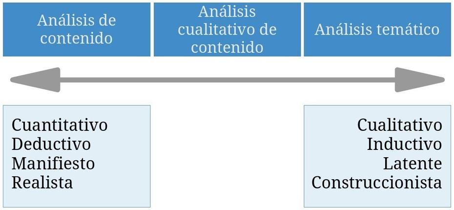

## Manifiesto vs. latente {# manifiesto-latente}

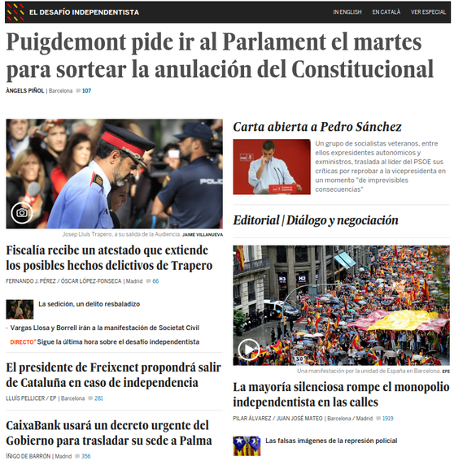

## ¿Cómo?

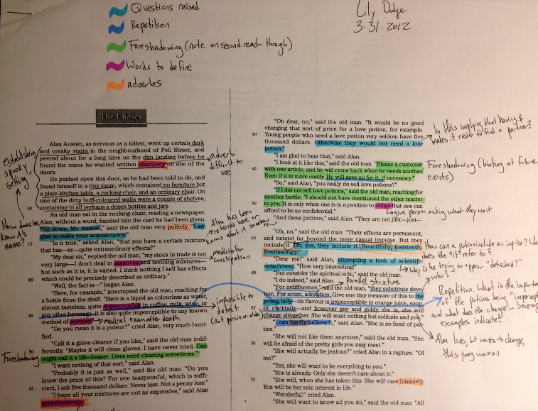

##
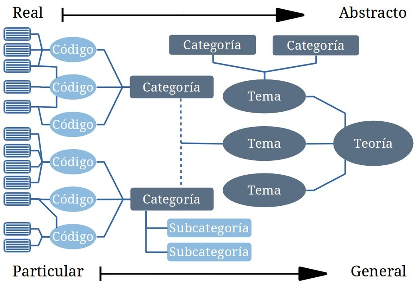

## Ejemplo: códigos-categorías-temas

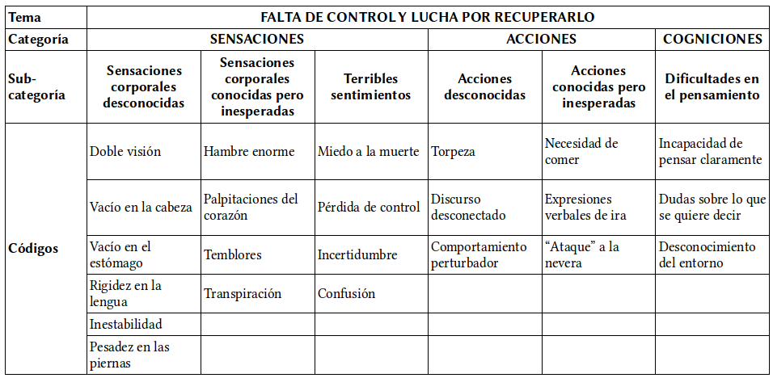
@graneheim_qualitative_2004 [p. 108]\
`Narrativas sobre hipoglucemia`{.figcaption}

## Fases del análisis
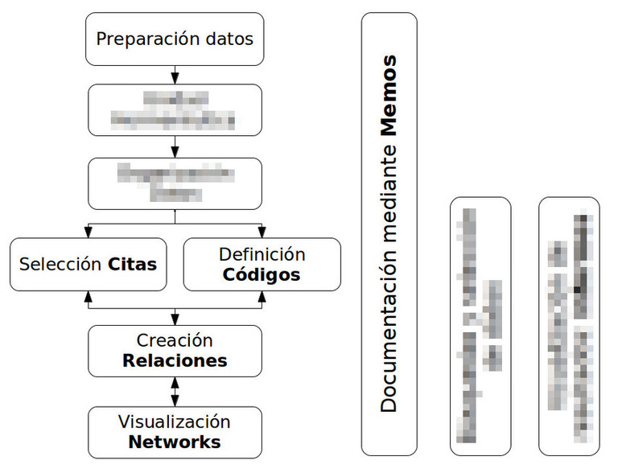

# Preparación de datos {.center data-background="imagenes-cuali/preparacion-1.jpg" data-background-transition=zoom data-state=opacidad}

## Transcripción

. . .

>(…) La producción y el uso de transcripciones son 'actividades de investigación' y no deben ser enfocadas como simplemente 'detalles técnicos' que preceden el análisis.\
@mclellan_beyond_2003 [p. 64]

<!--
. . .

>“(…) el examen de la grabación como una práctica perturba el tratamiento aproblemático de la cinta como "datos" inmutables. De repente, la cinta es tan "insegura" y "poco fiable" como todos los demás objetos, más obviamente artesanales.\
@ashmore_innocence_2000 [para. 31]

-->

## Transcripción

>Cualquier persona que transcriba o trabaje con transcripciones debería ser consciente de que una transcripción nunca podrá representar una situación de entrevista en su totalidad. En la comunicación intervienen demasiados elementos y es imposible transcribirlos todos. Incluso una transcripción fonética ignora aspectos no verbales como el olor, configuración de espacio y tiempo, aspectos visuales, expresiones faciales y gestos.\
@dresing_manual_2015 [p. 22]

## Transcribir: herramientas

## Transcribir: Software

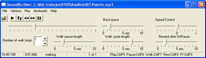

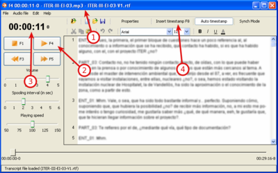

`http://juan.psicologiasocial.eu/texto-adudio-f4/` {.figcaption}

<!--
## Ejercicio: transcripción de audio
-->

## Convenciones
>En una conversación lo más significativo es lo que no se dice entre lo que se está diciendo, como por ejemplo las pausas y silencios, las entonaciones y los gestos, porque ahí radican los dobles significados, los ánimos y el objetivo mismo de la comunicación.\
@fernandez_christlieb_espiritu_2004 [p. 46]

## Convenciones "jeffersonianas"
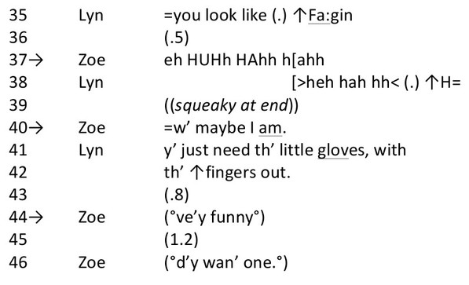

@lerner_glossary_2004 [p. 15]

Ver también: @bassi_follari_codigo_2015

<!--
## Ejercicio: transcripción con convenciones
-->

## Gestión de los datos
>La inadecuada documentación y monitorización de las actividades relacionadas con los datos pueden amenazar su integridad. Además, las prácticas inadecuadas de seguimiento pueden dificultar el análisis y aumentar la probabilidad de un pandemónium de investigación.\
@mclellan_beyond_2003 [p. 69]

Ver: [UK · Data Archive: Create & Manage Data](http://www.data-archive.ac.uk/create-manage)\
`http://www.data-archive.ac.uk/create-manage` {.figcaption}

## Gestión de los datos
>Una buena gestión de los datos es la base para una buena investigación. Si los datos están debidamente organizados, preservados y bien documentados, y su exactitud, vigencia e integridad es controlada en todo momento, el resultado es de datos de alta calidad, investigación eficiente, resultados basados en pruebas sólidas y ahorro de tiempo y recursos. (...) La gestión de datos debe planificarse desde el inicio de la investigación. Si se convierte en parte de la práctica de investigación estándar, entonces no implicará necesariamente mucho tiempo ni costos adicionales.\
@uk_data_archive_managing_2009 [p. 2]

## Plan de Gestión de Datos

[A Model Data Management Plan](http://bit.ly/2hQW1IN)\
`http://bit.ly/2hQW1IN` {.figcaption}

<!-- `http://www.fsd.uta.fi/aineistonhallinta/en/documents/data-management-plan-models.html# model-data-management-plan-for-research-collecting-qualitative-interviews-detailed` {.figcaption} -->

## Control de versiones

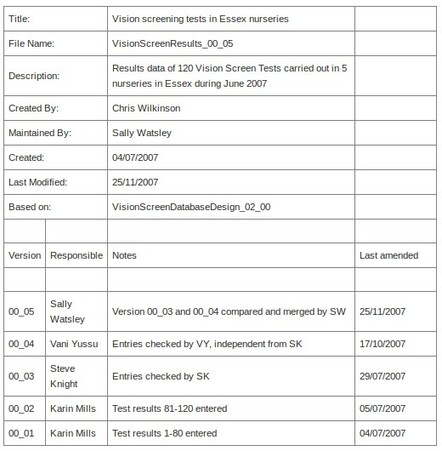

## Ejercicio: Gestión de datos

La donació de sang a Catalunya

Procediment de la recerca

* Formato documentos
* Etiquetado archivos
* Sistema de control

## Lo primero...

. . .

. . .

<!--  -->

# Memoing {.center data-background="imagenes-cuali/Memoing-01.jpg" data-background-transition=zoom data-state=opacidad}

## Memoing
>Mediante el uso de memorandos, el investigador es capaz de sumergirse en los datos, explorar los significados que estos datos tienen, mantener la continuidad y mantener el impulso en la realización de la investigación. Como crónica de un viaje de investigación, los memorandos permanecen como un registro, indeleble pero flexible, para retención personal o para difundir a otros.\
@birks_memoing_2008 [p. 69]

<!--
## Memoing
>Vemos la toma de notas como crucial para todos los tipos y enfoques de análisis. Otras funciones, como la codificación, la búsqueda de texto, la codificación automática y la modelización pueden ser utilizadas por enfoques concretos, pero la anotación de los datos, documentos y material de apoyo es indivisible del análisis general.\
@lewins_using_2007 [p. 59]
-->

## Memoing = Reflexionar sobre... {.peque}

* Relación con participantes y/o fenómeno
* Preguntas de investigación
* Elección de códigos y sus definiciones
* Categorías, temas y conceptos emergentes
* Posibles conexiones entre elementos
* Teoría emergente
* Problemas de cualquier tipo de nuestra investigación
* Problemas o dilemas éticos
* Informe final\
\
@saldana_coding_2009 [pp. 34-40]

# Codificación {.center data-background="imagenes-cuali/Coding.jpg" data-background-transition=zoom data-state=fondo}

<!--
## Análisis temático
>El análisis temático debe ser visto como un método fundamental para el análisis cualitativo. Es el primer método cualitativo de análisis que los investigadores deberían aprender, ya que proporciona las habilidades básicas que serán de utilidad para la realización de muchas otras formas de análisis cualitativo.\
@braun_using_2006 [p. 78]
-->

## Reducción
>[En la investigación cualitativa] el reto es dar sentido a una cantidad masiva de datos, reducir el volumen de información, identificar pautas significativas, y construir un marco para comunicar la esencia de lo que revelan los datos.\
@patton_qualitative_1990 [pp. 371-372]

. . .

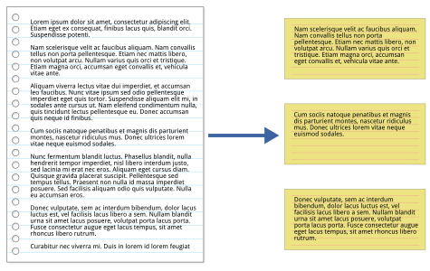{.noshadow}

<!--
## Reducción de la información
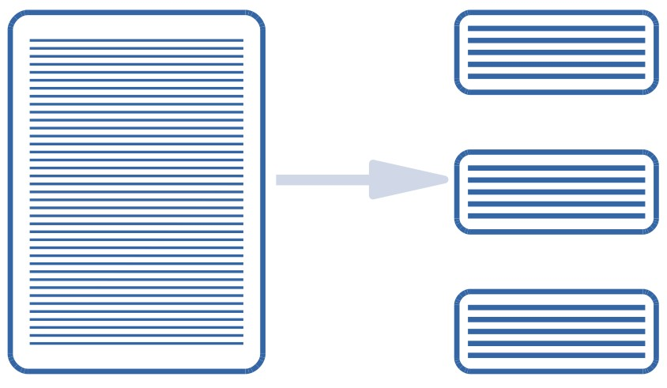
-->

## Codificación
>La indexación (o codificación) es la actividad en la que un investigador aplica significado a los datos en bruto mediante la asignación de palabras o frases clave. Estas palabras clave actúan como indicadores de temas en los datos. La indexación es una actividad por la que los datos se descomponen, conceptualizan y posteriormente son reformulados.\
@bloor_keywords_2006 [p. 101]

. . .

>* Codificiación de primer nivel
* Codificación de segundo nivel

##

## Ejemplo: códigos-categorías-temas

@graneheim_qualitative_2004 [p. 108]\
`Narrativas sobre hipoglucemia`{.figcaption}

<!--
##

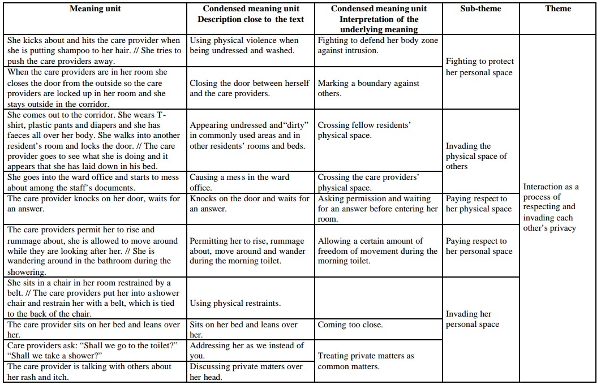

-->

## Codificación de primer nivel

. . .

## # “If it moves, code it” {.center}

## Categorización
>Los animales se clasifican en a) pertenecientes al emperador, b) embalsamados, c) amaestrados, d) lechones, e) sirenas, f) fabulosos, g) perros sueltos, h) incluidos en esta clasificación, i) que se agitan como locos, j) innumerables, k) dibujados con un pincel finísimo de pelo de camello, l) etcétera, m) que acaban de romper el jarrón, n) que de lejos parecen moscas.

`J.L.Borges (1952). El idioma analítico de John Wilkins.` {.figcaption}

## Ejercicio: Codificación

Codificar el aula

* Identificar y etiquetar elementos
* Agrupar elementos por categorías
* Comparar con otros grupos

## Comentarios de códigos
| Código              | MARGPROB                                                                                                                                                                                                                                                        |
|:--------------------|:----------------------------------------------------------------------------------------------------------------------------------------------------------------------------------------------------------------------------------------------------------------|
| Definición breve    | Problemas propios de comunidades marginales                                                                                                                                                                                                                     |
| Definición completa | Situaciones sociales que son vividas exclusivamente por aquellas personas que llevan un estilo de vida marginal, con carencia fundamentalmente de bienes y servicios que sí están presentes en personas con nivel socioeconómico medio.                         |
| Cuándo se usa       | Cuando las personas señalan alguna dificultad que denote un problema social instrumental, como falta de alimento, abrigo, techo, salud, servicios sanitarios. Debe tener carácter grave o impedir el desarrollo adecuado de su vida familiar, social o laboral. |
| Cuándo no se usa    | No se aplica a problemas propios de una conducta condicionada por cultura marginal, como violencia doméstica, alcoholismo, abandono de hogar, delincuencia, prostitución                                                                                        |
| Ejemplo             | “Como aquí no hay agua ni alcantarillado, la suciedad que hay aquí en las calles es terrible, ahí se puede ver... ¿se fija?, los niños se enferman a cada rato.”                                                                                                |

@macqueen_codebook_1998

## Comparación constante
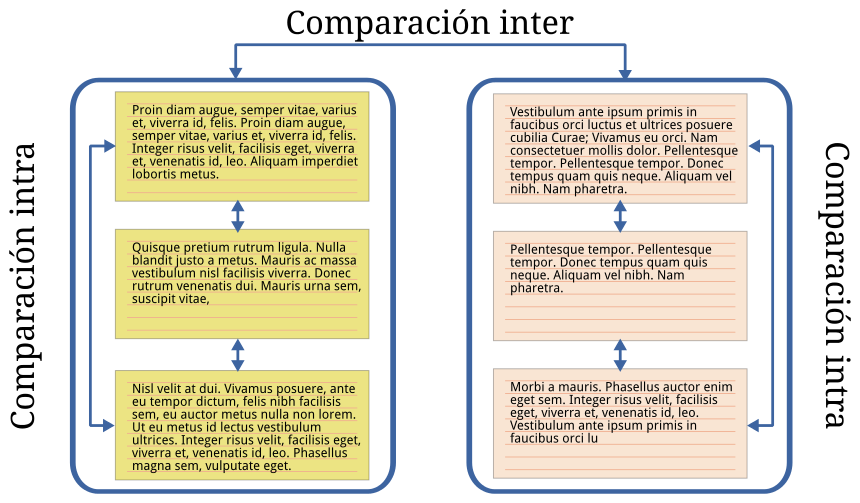{.noshadow}

## Categorizar
>Categorizar es tratar objetos diferentes como si fueran equivalentes, agrupar en clases los objetos, los acontecimientos y las personas que nos rodean, y responder hacia ellos en función de su clase de pertenencia más que de su unicidad.\
@bruner_study_1956 [p. 1]

## Jerarquías códigos
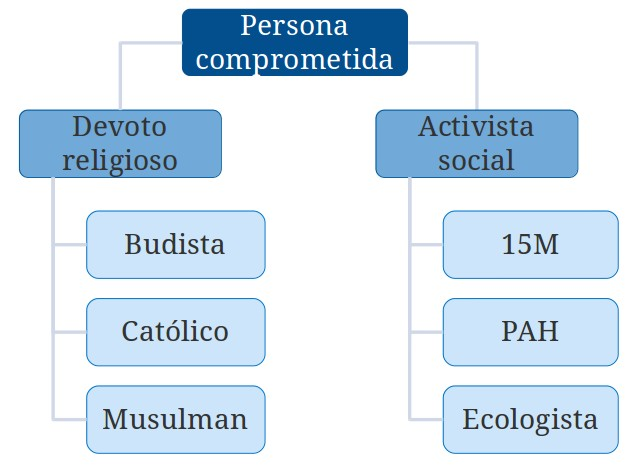

## Codificación de segundo nivel

## Temas
> Un tema capta algo importante sobre los datos en relación con la pregunta de investigación, y representa un cierto nivel de pauta de respuesta o significado en el conjunto de los datos.\
@braun_using_2006 [p. 82]

## Agrupar y relacionar: Redes temáticas
>Aplicar redes temáticas es simplemente una forma de organizar un análisis temático de datos cualitativos. Los análisis temáticos intentan descubrir los temas más destacados en un texto a diferentes niveles, y las redes temáticas tienen como objetivo facilitar la estructuración y representación de esos temas.\
@attride-stirling_thematic_2001 [p. 387]

## Redes temáticas
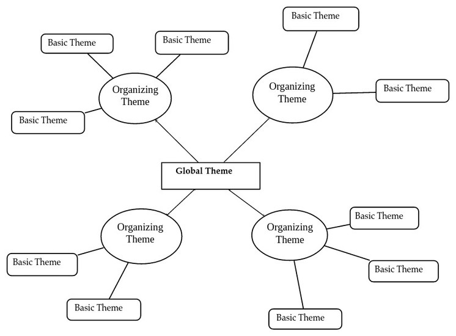

# Referencias

## {.scrollable}
