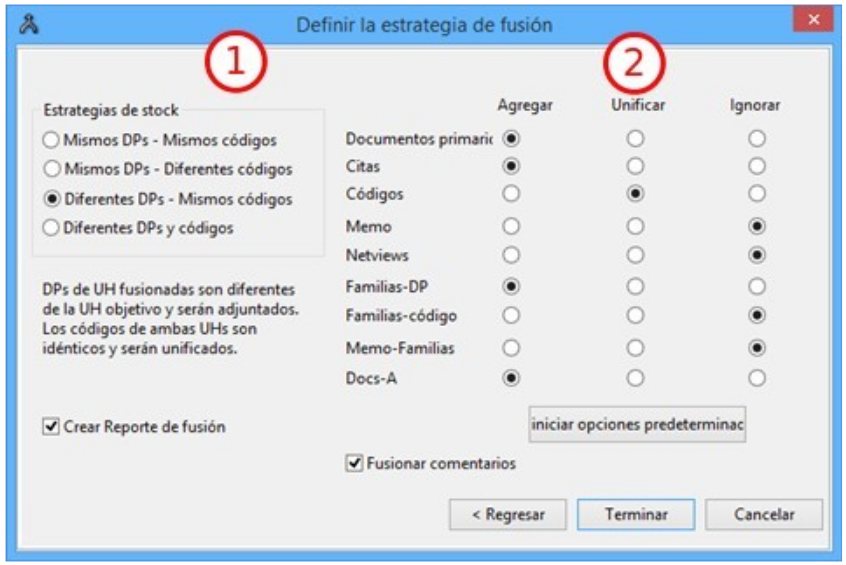

---
title:  'Análisis con Atlas.ti'
author:
- name: Juan Muñoz
  affiliation: Universitat Autònoma de Barcelona
tags: [CAQDAS, Qualitative Research, Atlas.ti]
url: "http:/juan.psicologiasocial.eu"
bibliography: diapos.bib
csl: apa.csl
lateral-menu: 'True'
...

#Introducción{.center data-background="imagenes-cuali/introduction-2.jpg" data-background-transition=zoom data-state=opacidad}

##CAQDAS

>Programas para el análisis cualitativo de datos ASISTIDO por ordenador

**Unos enlaces**

[CAQDAS Networking Project](http://www.surrey.ac.uk/sociology/research/researchcentres/caqdas/)

[Online QDA](http://onlineqda.hud.ac.uk/)

[Text Analysis Info – QDA Software](http://www.textanalysis.info/)

[UK Data Archive](http://www.data-archive.ac.uk/)

<!--

##Los elogios

>In my graduate student days, there were no tape recorders for making an interviewer’s life easier; these arrived after World War II, passing first through the wide recorder stage. These were ponderous machines, only gradually slimming down to today’s light models. Many years later, following our dreams of computers that would ease our lives as qualitative social researchers, software was devised for us.

-->

##Una crítica

>(…) qualitative data are derived from language and allow for the detailed exploration of feelings, drives, emotions ant the subjective understanding a respondent had of a certain social situation at a particular time. They are indexical and context bound. The data are fuzzy, with slippery boundaries between meanings, and not ideally suited to categorization and classification using digitally based software. Employing a digital tool of this type on qualitative data has the potential to distort any understanding arrived at.\
@roberts_ict_2002

##Una advertencia

>Recuerda siempre que un ordenador es sólo una máquina, no pensará por ti, y puede incluso dificultarte el progreso con tu análisis. No olvides apagarlo de vez en cuando. Llevate tus datos, salidas de búsqueda, esquemas de codificación, etc, a un lugar tranquilo, y luego lee a través de ellos y piensa en ellos. Da un largo paseo y descansa tu mente. Probablemente obtendrás entonces las mejores ideas.

###Friese,  1998{.autor}

##¿Qué permite?

<div style="float:left; margin:0; width:35%;">
{.noshadow}
</div>

<div style="float:left; margin:0; width:65%;">
>* Organización e integración
* Datos multimedia
* Búsqueda y recuperación
* Vinculación
* Representación gráfica
* Trabajo en equipo
</div>

##La investigación cualitativa{data-background="imagenes-cuali/AnalisisCotidiano.png" data-background-transition=zoom data-state=opacidad}

>Un enfoque cualitativo es uno en el que hay necesidad de interpretar los datos a través de la identificación y, posiblemente, la codificación de temas, conceptos, procesos, contextos, etc., con el fin de construir explicaciones o teorías o para probar o ampliar una teoría.\
@lewins_using_2007

##Análisis temático{data-background="imagenes-cuali/AnalisisCotidiano.png" data-background-transition=zoom data-state=opacidad}
>El análisis temático es un método para identificar, analizar y reportar patrones (temas) dentro de los datos. Como mínimo organiza y describe en detalle el conjunto de datos. Sin embargo, con frecuencia, va más allá e interpreta diversos aspectos del tema de investigación.\
@braun_using_2006 [p. 79]

##¿Cómo?


##


##Fases del análisis


#Preparación de datos {.center data-background="imagenes-cuali/preparacion-1.jpg" data-background-transition=zoom data-state=opacidad}

## Fases preparación datos

* Transcripción (literal de los datos)
* Convenciones ("jeffersonianas")
* Gestión (archivado, formato, control)

##Y luego...

. . .

{.noshadow}

. . .

{.noshadow}

#Unidad Hermenéutica {.center data-background="imagenes-cuali/escriba.jpg" data-background-transition=zoom data-state=opacidad}

##Estrategias trabajo en equipo

{.noshadow}

##Unir UHs



## Pantalla principal


#Memoing {.center data-background="imagenes-cuali/Memoing-01.jpg" data-background-transition=zoom data-state=opacidad}

##Memoing
>Mediante el uso de memorandos, el investigador es capaz de sumergirse en los datos, explorar los significados que estos datos tienen, mantener la continuidad y mantener el impulso en la realización de la investigación. Como crónica de un viaje de investigación, los memorandos permanecen como un registro, indeleble pero flexible, para retención personal o para difundir a otros.\
@birks_memoing_2008 [p. 69]

##Memoing
>Vemos la toma de notas como crucial para todos los tipos y enfoques de análisis. Otras funciones, como la codificación, la búsqueda de texto, la codificación automática y la modelización pueden ser utilizadas por enfoques concretos, pero la anotación de los datos, documentos y material de apoyo es indivisible del análisis general.\
@lewins_using_2007 [p. 59]

##Memoing = Reflexionar sobre... {.peque}

* Relación con participantes y/o fenómeno
* Preguntas de investigación
* Elección de códigos y sus definiciones
* Categorías, temas y conceptos emergentes
* Posibles conexiones entre elementos
* Teoría emergente
* Problemas de cualquier tipo de nuestra investigación
* Problemas o dilemas éticos
* Informe final

. . .

@saldana_coding_2009 [pp. 34-40]

##Ejercicio: memos

{.noshadow}

>* Crear memo: Objetivos
* Crear memo: Muestra/participantes


# Organización Datos {.center data-state=opacidad data-background="imagenes-cuali/hanging-files.jpg" data-background-transition=zoom }

##Agregar datos

{.noshadow}

. . .

```
1. Documentos > Nuevo > Agregar documentos (a biblioteca)
2. Documentos > Nuevo > Asignar documentos externos
```

##Ejercicio: Agregar datos

{.noshadow}

Desde la carpeta "PROHABIT"

>* Agregar a biblioteca
>     * `Documentos > Administrador de fuentes de datos > Abrir administrador de biblioteca`
>* Asignar documentos externos


##"Transportar" UH

<div id="column1" style="float:left; margin:0; width:35%;">
{.noshadow}

</div>

<div id="column1" style="float:left; margin:0; width:65%;">

Copiar y restaurar

```
Proyecto > Guardar paquete de copia
```

```
Proyecto > Desempaquetar la copia
```

O
```
Documentos > Administrador de fuente de datos
   * Abrir Administrador de biblioteca
       * Fuentes de datos > Exportar
   * Exportar documentos seleccionados   
```

</div>

. . .

<hr />

<div id="column1" style="float:left; margin:0; width:35%;">
{.noshadow}

</div>

Copiar carpeta donde estén UH y documentos


##Familias


##Ejercicio: Crear familias de documentos


{.noshadow}

|               |           |               |                |
|:--------------|:---------:|:-------------:|:--------------:|
|               | Afectados | No residentes | Informantes C. |
| Plus Ultra    |           |               |                |
| Trinitat Nova |           |               |                |
| Vallcarca     |           |               |                |

: Estructura familias de documentos

##Codificación estructural

. . .


##Ejercicio autocodificación

{.noshadow}

```
Códigos > Codificar > Codificación automática
```

>* Autocodificar participantes

. . .

* ¿Qué familias podemos crear?
* ¿Otras posibilidades de autocodificación?


#Informes {.center data-background="imagenes-cuali/reports.jpg" data-background-transition=zoom data-state=opacidad}

##Menús informes

`Componentes con opciones de impresión`{.figcaption}


. . .

`Destino del informe`{.figcaption}


##Ejercicio: Informes

{.noshadow}

>* Explorar diferentes tipos de informes: Documentos, Códigos, Memos...

#Segmentar y codificar {.center data-background="imagenes-cuali/Coding.jpg" data-background-transition=zoom data-state=opacidad}


##Reducción
>[...] el reto es dar sentido a una cantidad masiva de datos, reducir el volumen de información, identificar pautas significativas, y construir un marco para comunicar la esencia de lo que revelan los datos.\
@patton_qualitative_1990 [pp. 371-372]

. . .

{.noshadow}

##Codificación

>La indexación (o codificación) es la actividad en la que el investigador aplica significado a los datos en bruto mediante la asignación de palabras clave o frases. Estas palabras clave actúan como indicadores de temas en los datos. La indexación es una actividad por la que los datos se descomponen, conceptualizan y posteriormente son reformulados.\
@bloor_keywords_2006 [p.201]

##Estrategias de codificación


##Literatura definicional

| Origen           | El gato ha bebido la leche                                                                                                                                                                                                                                                                                                               |
|:-----------------|:-----------------------------------------------------------------------------------------------------------------------------------------------------------------------------------------------------------------------------------------------------------------------------------------------------------------------------------------|
| Transformación 1 | El mamífero carnívoro digitígrado doméstico<br>ha tragado un líquido blanco, de sabor dulce producido<br>por las hembras de los mamíferos.                                                                                                                                                                                               |
| Transformación 2 | Quien tiene tetas, come carne, camina sobre<br>la extremidad de sus dedos y pertenece a la casa<br>ha hecho descender por el gaznate al estómago<br>un estado de la materia sin forma propia,<br>del color de la leche, de impresión<br>agradable al órgano del gusto y procurado por<br>los animales de sexo femenino que tienen tetas. |

##El gato

<div id="column1" style="float:left; margin:0;">
{.border}
</div>

. . .

<div id="column1" style="float:left; margin:0;">
{.border}
</div>

. . .

<div id="column1" style="float:left; margin:0;">
{.border}
</div>


##Comentarios de códigos

Ver:

@macqueen_codebook_1998

##Ejercicio: Segmentación / Codificación

{.noshadow}

* Crear citas libres
* Crear códigos libres
* Utilizar otras opciones de codificación

##Comparación constante
{.noshadow}


#Relaciones {.center data-background="imagenes-cuali/network.jpg" data-background-transition=zoom data-state=opacidad}

##Tipos de Relaciones

|         | CITAS     | CÓDIGOS      | MEMOS    |
|:--------|:----------|:-------------|:---------|
| CITAS   | Hyperlink | Codificación | Relación |
| CÓDIGOS |           | Relación     | Relación |
| MEMOS   |           |              | Relación |

{.noshadow}

##Jerarquías de códigos


##


##Temas
> Un tema capta algo importante sobre los datos en relación con la pregunta de investigación, y representa un cierto nivel de pauta de respuesta o significado en el conjunto de los datos.\
@braun_using_2006 [p. 82]

## Ejemplo: códigos-categorías-temas


@graneheim_qualitative_2004 [p. 108]\
`Narrativas sobre hipoglucemia`{.figcaption}


# Vistas de red{.center data-background="imagenes-cuali/neurons.jpg" data-background-transition=zoom data-state=opacidad}

>Aplicar redes temáticas es simplemente una forma de organizar un análisis temático de datos cualitativos. Los análisis temáticos intentan descubrir los temas más destacados en un texto a diferentes niveles, y las redes temáticas tienen como objetivo facilitar la estructuración y representación de esos temas.\
@attride-stirling_thematic_2001 [p. 387]

##Redes temáticas


##Editar Relaciones


#Herramientas de consulta{.center data-background="imagenes-cuali/query.jpg" data-background-transition=zoom data-state=opacidad}

##Query tool

<div id="column1" style="float:left; margin:0; width:65%;">

</div>

<div id="column1" style="float:left; margin:0; width:35%;">

``` {.peque .left}
1.- Códigos-Familias de Códigos
2.- Condiciones (Operandos)
3/4.- Expresiones formuladas
5.- Resultados
6.- Distancia máxima
7.- Selección de doumentos
8.- Crear super-código
9.- Borrar / Imprimir
10.- Edición expresiones
```
</div>

##Operadores Booleanos


##Construcción de una consulta

"Todas las citas codificadas como 'Evasión', realizadas por Rajoy o por Zapatero"

. . .


##Operadores Semánticos


##


##Operadores de Proximidad


##


##GREP

|  Operador   | Función                                                                        |
|:-----------:|:-------------------------------------------------------------------------------|
| ^*término*  | Limita la expresión de búsqueda que sigue al marcador al principio de la línea |
| *término*$  | Limita la expresión de búsqueda precedente al final de la línea                |
| \<*término* | Limita la expresión de búsqueda siguiente al inicio de una palabra             |
| *término*\> | Limita la expresión de búsqueda precedente al inicio de una palabra            |
|     \\B     | Limita la expresión de búsqueda siguiente a NO incio de palabra                |
|      .      | Localiza cualquier carácter                                                    |
|     \\w     | Localiza cualquier carácter alfanumérico                                       |
|      *      | Localiza cualquier cantidad (o su ausencia) de la expresión precedente         |
|      +      | Localiza al menos una ocurrencia de la expresión precedente                    |

#Referencias{.center data-background="imagenes-cuali/books.jpg" data-background-transition=zoom data-state=opacidad}

## {.scrollable}
