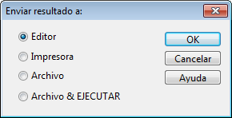
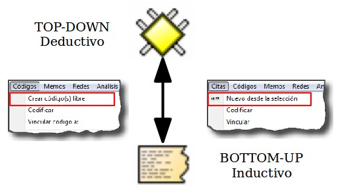
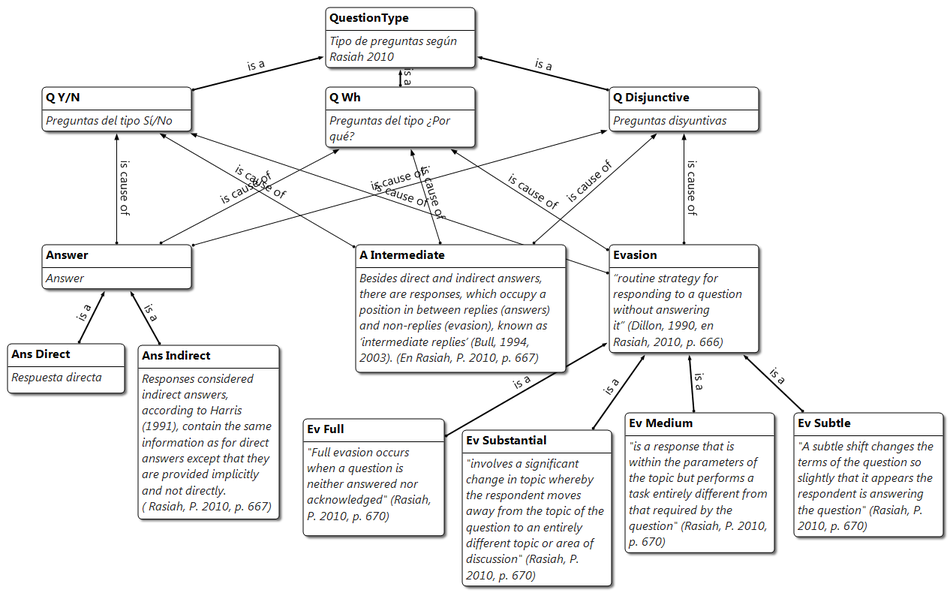
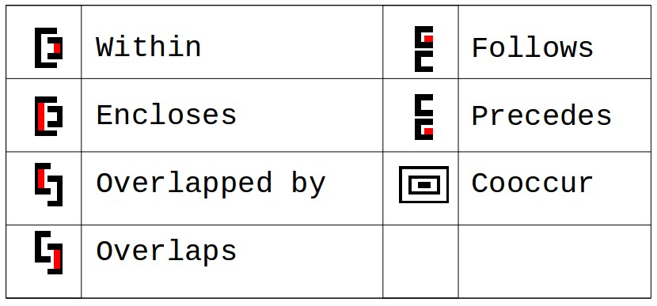

---
title:  'Análisis con Atlas.ti'
author:
- name: Juan Muñoz
  affiliation: Universitat Autònoma de Barcelona
tags: [Atlas.ti, Análisis temático]
tema: "http://manualatlas.psicologiasocial.eu/"
url: "http:/juan.psicologiasocial.eu"
bibliography: diapos.bib
csl: apa.csl
lateral-menu: 'True'
...

#Definiciones {.center data-background="imagenes-cuali/Definicion.jpg" data-background-transition=zoom data-state=fondo}

##La investigación cualitativa{data-background="imagenes-cuali/AnalisisCotidiano.png" data-background-transition=zoom data-state=opacidad}

>Un enfoque cualitativo es uno en el que hay necesidad de interpretar los datos a través de la identificación y, posiblemente, la codificación de temas, conceptos, procesos, contextos, etc., con el fin de construir explicaciones o teorías o para probar o ampliar una teoría.\
@lewins_using_2007


##Análisis temático{data-background="imagenes-cuali/AnalisisCotidiano.png" data-background-transition=zoom data-state=opacidad}
>El análisis temático es un método para identificar, analizar y reportar patrones (temas) dentro de los datos. Como mínimo organiza y describe en detalle el conjunto de datos. Sin embargo, con frecuencia, va más allá e interpreta diversos aspectos del tema de investigación.\
@braun_using_2006 [p. 79]


##¿Cómo?


##Reducción
>[...] el reto es dar sentido a una cantidad masiva de datos, reducir el volumen de información, identificar pautas significativas, y construir un marco para comunicar la esencia de lo que revelan los datos.\
@patton_qualitative_1990 [pp. 371-372]

. . .

{.noshadow}


##Codificación

>La indexación (o codificación) es la actividad en la que el investigador aplica significado a los datos en bruto mediante la asignación de palabras clave o frases. Estas palabras clave actúan como indicadores de temas en los datos. La indexación es una actividad por la que los datos se descomponen, conceptualizan y posteriormente son reformulados.\
@bloor_keywords_2006 [p.201]


##


## Ejemplo: códigos-categorías-temas


@graneheim_qualitative_2004 [p. 108]\
`Narrativas sobre hipoglucemia`{.figcaption}

##Fases del análisis
{.noshadow}


# Empezando a analizar: transcribir{.center}

##Transcribir: Software


`http://juan.psicologiasocial.eu/texto-adudio-f4/` {.figcaption}


## Pero...

<iframe width="900" height="500" data-src="http://research.baidu.com/introducing-swiftscribe-breakthrough-ai-powered-transcription-software/"></iframe>

`http://research.baidu.com/introducing-swiftscribe-breakthrough-ai-powered-transcription-software/`{.figcaption}

#Unidad Hermenéutica {.center data-background="imagenes-cuali/escriba.jpg" data-background-transition=zoom data-state=opacidad}

## Descargar

> * Descargar / descomprimir

https://www.dropbox.com/s/5hw8f921lwlj5s6/CursoAtlasCP.zip

. . .

> * Abrir UH

CursoAtlasCP/ControlParlamentario/ControlParlamentario-00.hpr7

##Agregar datos

{.noshadow}

. . .

```
1. Documentos > Nuevo > Agregar documentos (a biblioteca)
2. Documentos > Nuevo > Asignar documentos externos
```
##"Transportar" UH

<div id="column1" style="float:left; margin:0; width:35%;">
{.noshadow}

</div>

<div id="column1" style="float:left; margin:0; width:65%;">

Copiar y restaurar

```
Proyecto > Guardar paquete de copia
```

```
Proyecto > Desempaquetar la copia
```

O
```
Documentos > Administrador de fuente de datos
   * Abrir Administrador de biblioteca
       * Fuentes de datos > Exportar
   * Exportar documentos seleccionados   
```

</div>

. . .

<hr />

<div id="column1" style="float:left; margin:0; width:35%;">
{.noshadow}

</div>

Copiar carpeta donde estén UH y documentos

##Administrar usuarios

#Memoing {.center data-background="imagenes-cuali/Memoing-01.jpg" data-background-transition=zoom data-state=opacidad}

##Memoing = Reflexionar sobre... {.peque}

* Relación con participantes y/o fenómeno
* Preguntas de investigación
* Elección de códigos y sus definiciones
* Categorías, temas y conceptos emergentes
* Posibles conexiones entre elementos
* Teoría emergente
* Problemas de cualquier tipo de nuestra investigación
* Problemas o dilemas éticos
* Informe final

. . .

@saldana_coding_2009 [pp. 34-40]


##Ejercicio memos: insertar PDF

{.noshadow}

>* Crear memo: Reglamento
>     * Insertar PDF desde carpeta "Documentos"
* Crear memo: Participantes
>      * Insertar PDF desde carpeta "Documentos"
* Guardar UH

# Organización Datos {.center data-state=opacidad data-background="imagenes-cuali/hanging-files.jpg" data-background-transition=zoom }


##Familias


##Ejercicio: Familias de documentos

{.noshadow}


|         |                       CONGRESO                        |   SENADO   |
|:--------|:-----------------------------------------------------:|:----------:|
| IX LEG. | 2001-02-16 <br>2011-02-23<br>2011-03-09<br>2011-03-16 | 2011-02-08 |
| X LEG.  |               2012-02-08 <br>2012-02-15               | 2012-03-06 |

: Estructura familias de documentos

##Ejercicio: Superfamilias

>* Congreso **Y** IX legislatura
* Congreso **Y** X legislatura
* Senado **Y** IX legislatura
* Senado **Y** X legislatura


#Informes {.center data-background="imagenes-cuali/reports.jpg" data-background-transition=zoom data-state=opacidad}

##Menús informes

 `Componentes con opciones de impresión`{.figcaption}

 

 . . .

 `Destino del informe`{.figcaption}

 

##Ejercicio: Informes

{.noshadow}

>* Explorar diferentes tipos de informes: Documentos, Memos, imprimir con margen, frecuencia palabras...

#Codificación estructural{.center}


## Autocodificación


##Ejercicio autocodificación

{.noshadow}

```
Códigos > Codificar > Codificación automática
```

>* Autocodificar participantes
>     * Autocodficar Presidente-Zapatero
     * Autocodificar Presidente-Rajoy
>     * Otros políticos

. . .

* ¿Qué familias podemos crear?
* ¿Otras posibilidades de autocodificación?

## Superfamilias

|           |    NACIONALES     |           AUTONÓMICOS           |
|:----------|:-----------------:|:-------------------------------:|
| IZQUIERDA | IU<br>PCE<br>PSOE | Amaiur<br>BNG<br>ERC<br>ICV PSC |
| DERECHA   |     PP<br>UPD     |        CC<br>CiU<br>PNV         |


##Buscar texto


Conjunto de términos
  : `Jorquera|Pérez-Bouza`

Categoría
  : `BNG:=Jorquera|Pérez-Bouza`

Múltiples categorías
  : `AUTONOMICO:= $AMAIUR|$BNG|$CC|$CiU`

##GREP

  |  Operador   | Función                                                                        |
  |:-----------:|:-------------------------------------------------------------------------------|
  | ^*término*  | Limita la expresión de búsqueda que sigue al marcador al principio de la línea |
  | *término*$  | Limita la expresión de búsqueda precedente al final de la línea                |
  | \<*término* | Limita la expresión de búsqueda siguiente al inicio de una palabra             |
  | *término*\> | Limita la expresión de búsqueda precedente al inicio de una palabra            |
  |     \\B     | Limita la expresión de búsqueda siguiente a NO incio de palabra                |
  |      .      | Localiza cualquier carácter                                                    |
  |     \\w     | Localiza cualquier carácter alfanumérico                                       |
  |      *      | Localiza cualquier cantidad (o su ausencia) de la expresión precedente         |
  |      +      | Localiza al menos una ocurrencia de la expresión precedente                    |

#Segmentar y codificar {.center data-background="imagenes-cuali/Coding.jpg" data-background-transition=zoom data-state=opacidad}

##Estrategias trabajo en equipo

{.noshadow}


##Estrategias de codificación




##Pero primero...

. . .

{.noshadow}

. . .

{.noshadow}


##Convenciones "jeffersonianas"


@lerner_glossary_2004 [p. 15]

##Vincular texto con audio/vídeo

> * Abrir UH

ControlParlamentario-04.hpr7

##Ejercicio: trabajar con vídeo

{.noshadow}

Relacionar texto - vídeo


##Ejercicio: Codificación

{.noshadow}

Por equipos:

>* Crear códigos (temas en el texto)
* Codificar

##Comparación constante
{.noshadow}


##Familias de códigos

{.noshadow}

>* Crear familias (categorías) de códigos (temas)

#Relaciones {.center data-background="imagenes-cuali/network.jpg" data-background-transition=zoom data-state=opacidad}

##Tipos de Relaciones

|         | CITAS        | CÓDIGOS      | MEMOS    |
|:--------|:-------------|:-------------|:---------|
| CITAS   | Hypervínculo | Codificación | Relación |
| CÓDIGOS |              | Relación     | Relación |
| MEMOS   |              |              | Relación |

. . .


##Jerarquías de códigos


##Relaciones entre códigos



##Relaciones entre códigos


# Vistas de red{.center data-background="imagenes-cuali/neurons.jpg" data-background-transition=zoom data-state=opacidad}

##

>Aplicar redes temáticas es simplemente una forma de organizar un análisis temático de datos cualitativos. Los análisis temáticos intentan descubrir los temas más destacados en un texto a diferentes niveles, y las redes temáticas tienen como objetivo facilitar la estructuración y representación de esos temas.\
@attride_stirling2001 [p. 387]

##Redes temáticas


##Editar Relaciones


#Herramienta de consulta{.center data-background="imagenes-cuali/query.jpg" data-background-transition=zoom data-state=opacidad}

##Consultas

<div id="column1" style="float:left; margin:0; width:65%;">

</div>

<div id="column1" style="float:left; margin:0; width:35%;">

``` {.peque .left}
1.- Códigos-Familias de Códigos
2.- Condiciones (Operandos)
3/4.- Expresiones formuladas
5.- Resultados
6.- Distancia máxima
7.- Selección de doumentos
8.- Crear super-código
9.- Borrar / Imprimir
10.- Edición expresiones
```
</div>

##Operadores Booleanos


##Construcción de una consulta

"Todas las citas codificadas como 'Evasión', realizadas por Rajoy o por Zapatero"


. . .


##Operadores Booleanos


Abrir: **CursoAtlasCP/EjemploConsultas/Ejemplo_Query_Booleanos.hpr7**

##Operadores Semánticos


##


. . .

Abrir: **CursoAtlasCP/EjemploConsultas/Ejemplo_Query_Semanticos.hpr7**

##Operadores de Proximidad



##


. . .

Abrir: **CursoAtlasCP/EjemploConsultas/Ejemplo_Query_Proximidad.hpr7**

##Consultas: Alcance


##Concurrencias


#Otras herramientas

##Copiar/Restaurar UH

##Unir UHs


#Referencias{.center data-background="imagenes-cuali/books.jpg" data-background-transition=zoom data-state=opacidad}

## {.scrollable .peque}
