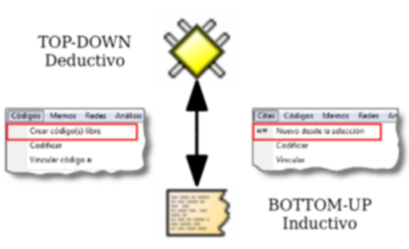

---
title:  'Análisis con Atlas.ti'
author:
- name: Juan Muñoz
  affiliation: Universitat Autònoma de Barcelona
tags: [nothing, nothingness]
tema: "Perspectivas discursivas en la Investigación Social"
url: "http:/juan.psicologiasocial.eu"
bibliography: diapos.bib
csl: apa.csl
lateral-menu: 'True'
...

#Introducción {.mitit .center}

##CAQDAS

>Programas para el análisis cualitativo de datos ASISTIDO por ordenador

##Unos enlaces

[CAQDAS Networking Project](http://www.surrey.ac.uk/sociology/research/researchcentres/caqdas/)

[Online QDA](http://onlineqda.hud.ac.uk/)

[Text Analysis Info – QDA Software](http://www.textanalysis.info/)

[UK Data Archive](http://www.data-archive.ac.uk/)

##Una crítica

>(…) qualitative data are derived from language and allow for the detailed exploration of feelings, drives, emotions ant the subjective understanding a respondent had of a certain social situation at a particular time. They are indexical and context bound. The data are fuzzy, with slippery boundaries between meanings, and not ideally suited to categorization and classification using digitally based software. Employing a digital tool of this type on qualitative data has the potential to distort any understanding arrived at.\
@roberts_ict_2002

##Una advertencia
>Always remember that a computer is just a machine, it won’t do the thinking for you, and it might even hinder you in progressing with your analysis. Don’t forget to turn the computer off once in a while. Take your data, search outputs, coding schemes, etc., to a quite place, and then read through them and think about them. Go far a walk and rest your mind. You probably will get the best ideas then.\

Friese,  1998

##¿Qué permite?

>* Organización e integración
* Datos multimedia
* Búsqueda y recuperación
* Vinculación
* Representación gráfica
* Trabajo en equipo

##Análisis temático
>El análisis temático es un método para identificar, analizar y reportar patrones (temas) dentro de los datos. Como mínimo organiza y describe en detalle el conjunto de datos. Sin embargo, con frecuencia, va más allá e interpreta diversos aspectos del tema de investigación.\
@braun_using_2006 [p. 79]

##¿Cómo?

##Fases del análisis

#Preparación de de datos {.mitit .center}

##

* Transcripción (literal de los datos)
* Convenciones ("jeffersonianas")
* Gestión (archivado, formato, control)

##Y luego...

. . .

. . .

<!--  -->

#Unidad Hermenéutica {data-background="imagenes-cuali/Proceso-fondo.png" data-background-transition=zoom data-state=opacidad}

##

#Memoing {data-background="imagenes-cuali/Proceso-fondo.png" data-background-transition=zoom data-state=opacidad}

##Memoing
>Mediante el uso de memorandos, el investigador es capaz de sumergirse en los datos, explorar los significados que estos datos tienen, mantener la continuidad y mantener el impulso en la realización de la investigación. Como crónica de un viaje de investigación, los memorandos permanecen como un registro, indeleble pero flexible, para retención personal o para difundir a otros.\
@birks_memoing_2008 [p. 69]

# Organización Datos {data-background="imagenes-cuali/Proceso-fondo.png" data-background-transition=zoom data-state=opacidad}

##Familias

##Autocodificación

. . .

#Informes {data-background="imagenes-cuali/Proceso-fondo.png" data-background-transition=zoom data-state=opacidad}

#Segmentar y codificar {data-background="imagenes-cuali/Proceso-fondo.png" data-background-transition=zoom data-state=opacidad}

##Reducción
>[En la investigación cualitativa] el reto es dar sentido a una cantidad masiva de datos, reducir el volumen de información, identificar pautas significativas, y construir un marco para comunicar la esencia de lo que revelan los datos.\
@patton_qualitative_1990 [pp. 371-372]

. . .

##Otra crítica

>The ease with which CAQDAS permits multiple codification can rapidly entice the user into exploring and creating masses of nodes (code themes) and being further tempted to codify each segment into many nodes. Researchers need to exhibit both restraint and ingenuity when coding within a CAQDAS context, as the time constraints do not permit the luxury of exploring all possible avenues of thought that the user discerns.\
@blismas_computer-aided_2003

##Estrategias de codificación

##Comentarios de códigos

Código
: MARGPROB

Definición breve
: Problemas propios de comunidades marginales

Definición completa
: Situaciones sociales que son vividas exclusivamente por aquellas personas que llevan un estilo de vida marginal, con carencia fundamentalmente de bienes y servicios que sí están presentes en personas con nivel socioeconómico medio

##

Cuándo se usa
: Cuando las personas señalan alguna dificultad que denote un problema social instrumental, como falta de alimento, abrigo, techo, salud, servicios sanitarios. Debe tener carácter grave o impedir el desarrollo adecuado de su vida familiar, social o laboral.

Cuándo no se usa
: No se aplica a problemas propios de una conducta condicionada por cultura marginal, como violencia doméstica, alcoholismo, abandono de hogar, delincuencia, prostitución

Ejemplo
:  “Como aquí no hay agua ni alcantarillado, la suciedad que hay aquí en las calles es terrible, ahí se puede ver... ¿se fija?, los niños se enferman a cada rato.”

@macqueen_codebook_1998

##Comparación constante

##Referencias

## {.scrollable}
