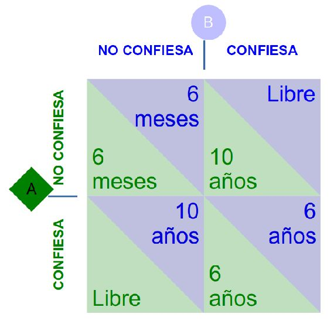
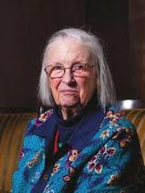

---
title:  'Acción Pública y Cambio Social'
author:
- name: Juan Muñoz
  affiliation: Universitat Autònoma de Barcelona
tema: "Los bienes comunes"
url: "http://psicologiasocial.uab.es/juan"
...

#Índice

* La tragedia de los comunes
* Los bienes comunes
* Bienes comunes culturales

#

##La tragedia de los comunes {.mitit}

#

>Pero, ¿qué significa libertad? Cuando los hombres mutuamente acordaron instaurar leyes contra los robos, la humanidad se volvió más libre, no menos. Los individuos encerrados en la lógica de los recursos comunes son libres únicamente para traer la ruina universal; una vez que ven la necesidad de la coerción mutua, quedan libres para perseguir nuevas metas.\
`Hardin, 1968`{.autor}

#

La Tragedia de los Comunes es el agotamiento  de un recurso compartido por las personas, actuando de forma independiente y racional de acuerdo con el propio interés, a pesar de su conocimiento de que agotar el recurso común es contrario al interés a largo plazo del grupo.

#Egoísmo

>El sistema propuesto ofrece todavía otro inconveniente, que es el poco interés que se tiene por la propiedad común, porque cada uno piensa en sus intereses privados y se cuida poco de los públicos, sino es en cuanto le toca personalmente, pues en todos los demás descansa de buen grado en los cuidados que otros se toman por ellos, sucediendo lo que en una casa servida por muchos criados, que unos por otros resulta mal hecho el servicio.\
`Aristóteles, La Política, libro 1, capítulo 1`{.autor}

#Egoísmo

>Las personas dedican una mínima fracción de su tiempo para la consideración de cualquier objeto público, la mayor parte a la persecución de sus propios objetivos. Mientras tanto, fantasean que su negligencia no les causará ningún daño, que es asunto de otros el cuidar de esto o aquello para él; y así, siendo compartida esta misma idea por todos por separado, la causa común decae imperceptiblemente.\
`Tucidides, Historia de las guerras del Peloponeso`{.autor}

#Dilemas sociales

>Definimos los dilemas sociales como situaciones en las que una forma no cooperativa de actuación es (en ocasiones) tentadora para cada individuo porque produce mejores resultados para ella misma (a menudo a corto plazo), y si todos siguen esta forma no cooperativa de actuación, todos obtendrán (a menudo a largo plazo) peores resultados que si hubieran cooperado.\
`Lange, Balliet, Parks, & Vugt, 2014, p. 8`{.autor}

#El dilema del prisionero

#¿Egoísmo?

>Afirmamos que la sociabilidad es la ventaja más grande en la lucha por la existencia en todas las circunstancias naturales, sean cuales fueran. Las especies que voluntaria o involuntariamente reniegan de ella, están condenadas a la extinción, mientras que los animales que saben unirse del mejor modo, tienen mayores oportunidades para subsistir y para un desarrollo máximo (…)  Los vertebrados superiores, y en especial el género humano, sirven como la mejor demostración de esta afirmación.\
`Kropotkin, El apoyo mútuo`{.autor}

#

##Los bienes comunes {.mitit}

#Características de los recursos

|              |    Excluible    |               No Excluible               |
|--------------|:---------------:|:----------------------------------------:|
| Rivalidad    | Bienes privados | Recursos comunes (Common-Pool Resources) |
| No rivalidad |      Clubs      |              Bienes públicos             |

#

##Bienes comunes culturales {.mitit}

#{data-background="imagenes/Compartir.jpg" data-background-transition=fade data-state=fondo}

>Si la naturaleza ha creado alguna cosa menos susceptible que todas las demás  de ser objeto de propiedad exclusiva, ésa es la acción del poder del pensamiento que llamamos idea, la cual sólo puede poseer un individuo si la guarda para sí; pero en el momento en que se divulga, se fuerza a sí misma a estar en posesión de todos, y su receptor no puede desposeerse de ella. Además, su peculiar carácter es tal que nadie posee menos de ella porque otros la posean íntegramente. Aquél que recibe una idea de mí, recibe instrucción para sí sin reducir la mía, del mismo modo que aquél que enciende su cirio con el mío, recibe luz sin dejarme a oscuras. El hecho de que las ideas puedan difundirse libremente de unos a otros por todo el globo, para moral y mutua instrucción de las personas y mejora de su condición, parece haber sido diseñado de forma peculiar y benevolente por la naturaleza, cuando las hizo como el fuego, susceptibles de expandirse por todo el espacio sin que disminuya su densidad en ningún punto, y como el aire que respiramos, en que nos movemos y tenemos nuestro ser físico, incapaces de ser confinadas o poseídas de forma exclusiva. Así pues, las invenciones no pueden, por naturaleza, estar sujetas a propiedad.\
`Thomas Jefferson, 1813`{.autor}

#

>Cada descubrimiento, cada progreso, cada aumento de la riqueza de la humanidad, tiene su origen en el conjunto del trabajo manual y cerebral, pasado y presente. Entonces, ¿qué derecho asiste a nadie para apropiarse la menor partícula de ese inmenso todo y decir: «Esto es mío y no vuestro»?.\
`Piotr Kropotkin (1892). La conquista del pan`{.autor}

# Diferentes paradigmas

:Producción de conocimiento

| Paradigma con ánimo de lucro                                                                  | Paradigma de los comunes                                                                      |
|---------------------------------------------------------------------------------------------- |-------------------------------------------------------------------------------------------    |
| Ideología y valores corporativos integrados en la educación y la producción de conocimiento.  | Peer-to-peer, el trabajo en red y la colaboración permiten diversidad de puntos de vista.     |
| Conocimiento considerado como bien escaso que se compra y se vende.                           | Conocimiento considerado como recurso abundante para el bien común de la sociedad.            |
| Tecnologías “propietarias”                                                                    | Tecnologías libres                                                                            |

`Silke Helfrich (2014). The Logic of the Commons`{.figcaption}

#

