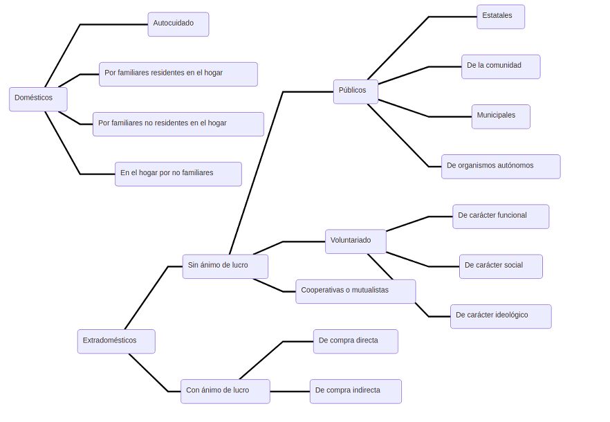

---
title:  'El concepto del cuidado'
subtitle: 'debates, dicotomías, niveles y aspectos destacables en su definición'
author:
- name: Luz Mª Martínez
  affiliation: Departament de Psicologia Social
  email: Universitat Autònoma de Barcelona
tema: "marzo 2018"
lateral-menu: true
imagen-fondo: 'imagenes/columnas-4.jpg'
...

## Conferencia anterior: crisis de cuidados

- Delimitación de la crisis de cuidados como problema psicosocial en el contexto de los estados del bienestar, con elementos de cambio y elementos que se mantienen.
- Concepto problematizado en la actualidad (ej.: foro de vida independiente, con reivindicación de una noción diferente a la de dependencia para su vida).

## El concepto del cuidado

- Debates que han llevado a sus definiciones de hoy (mirada de comprensión sociohistórica, revisión de raíces temporales recientes).
- Algunas definiciones y niveles -públicos, privados o mixtos, con o sin remuneración- en que se está reestructurando el cuidado en la actualidad.
- Un modelo de análisis multidimensional.

# Debates alrededor del concepto {.center}

## Contexto sociohistórico

- Debates sobre el trabajo no remunerado en los hogares (teóricos y aplicados, años 70).
- Trabajo doméstico en el [marco de producción capitalista]{.resaltar}.
- Lógica del capital/lógica del patriarcado (reproducción de la fuerza de trabajo/conflictos de género)
- Lógica del capital desde una visión marxista del trabajo doméstico:
  - Tiempo y energía (coste).
  - División del trabajo (aportaciones distintas de hombres y mujeres con beneficios para unos) .
Producción de bienes y servicios (alimentos, limpieza, educación…) separables de la persona que los produce.

## Efectos positivos

[Efectos positivos de la identificación del trabajo doméstico con el trabajo mercantil (C. Carrasco)]{.subtitulo}

- Visualizar las actividades realizadas en el hogar.
- Percibir la escasa participación laboral de las mujeres como no causada por preferencias personales.
- Reconocer la participación del trabajo doméstico en la reproducción de la fuerza de trabajo.
- Identificar las discriminaciones por sexo en la división del trabajo

## Nueva lógica

- Nueva lógica: reconocer la importancia específica del trabajo doméstico en sí mismo y los valores sociales fundamentales que conlleva.
- Aspectos del nuevo enfoque:
  - Destacar características de la actividad realizada en el hogar no comparables con las del mercado.
  - Distinguir cualificaciones y capacidades específicas de las mujeres desarrolladas dentro del hogar y no reconocidas oficialmente.
  - Distinguir formas de organizar y estructurar la vida y el trabajo que otorgan a las mujeres una identidad (en orientación y expectativas) diferente a la masculina.

##

- [Esquema de producción/reproducción]{.resaltar}: dos trabajos con características propias, con grado equiparable de importancia en la reproducción del sistema social global (en teoría).
- Crítica al nuevo enfoque: se mantiene el problema de una [sociedad dicotómica]{.resaltar} (división público/privado, economía clásica), no se escapa de la dimensión enfrentada mercantil-capitalista/patriarcal.

##

- Nuevo enfoque de ruptura dicotómica: entender los procesos de producción y trabajo como un único proceso más complejo, cuyo objetivo es satisfacer las necesidades humanas y mejorar los estándares de vida.
- De múltiples maneras, los diversos trabajos y actividades sociales participan en los procesos de mantenimiento de la vida humana.

##

<iframe width="728" height="409" src="https://www.youtube.com/embed/ikSgAqw9rmI" frameborder="0" allow="autoplay; encrypted-media" allowfullscreen></iframe>

###### Breve comentario sobre el cambio de paradigma, la sostenibilidad de la vida y el entorno
###### Cristina Carrasco

###### https://www.youtube.com/watch?v=ikSgAqw9rmI

##

- Giro subjetivo: mirada al contenido de las actividades, a los [aspectos subjetivos de las necesidades]{.resaltar}.
- Emergencia del [cuidado]{.resaltar} como [aspecto central]{.resaltar} de esas actividades, su [dimensión diferencial]{.resaltar}.
- Cambio conceptual sobre el trabajo doméstico: de “tareas catalogables” a “necesidades que satisfacer”.

<iframe width="420" height="236" src="https://www.youtube.com/embed/Cf1YZnMv4i8?rel=0" frameborder="0" allow="autoplay; encrypted-media" allowfullscreen></iframe>

###### Sugerencia sobre la actualidad del debate (Amaia Pérez Orozco):

###### http://www.youtube.com/watch?v=Cf1YZnMv4i8

###### http://www.youtube.com/watch?v=kiX7Y__rhTs

## Debate terminológico (legitimaciones de lo simbólico)

- [Trabajo doméstico]{.resaltar} (actividades tradicionales y con componente de producción material)
- [Trabajo de reproducción]{.resaltar} o  trabajo reproductivo (esquema producción/reproducción)
- [Trabajo familiar doméstico]{.resaltar} (incorpora el trabajo de mediación ejecutado fuera del espacio familiar, entre las nuevas necesidades familiares y los servicios ofertados por el estado del bienestar)
- [Trabajo no remunerado]{.resaltar} (término poco preciso, incluye cualquier trabajo sin contrapartida monetaria)
- [Trabajo de cuidado o  “cuidado”]{.resaltar} (incorporar los aspectos más subjetivos y menos tangibles de la actividad)

# El concepto y sus encrucijadas {.center}

## Concepto transfronterizo

Concepto transfronterizo, encabalgamientos en las dicotomías de la provisión social:

- Asalariado/no asalariado
- Público/privado
- Formal/informal
- Familia/estado/mercado/voluntariado
- Ayudas monetarias/servicios
- Persona cuidadora/persona cuidada/familia

## Tipos de cuidado

<!-- ## Tipos de cuidado

Tipos de cuidado según el sistema en que se integran:

### Sistema doméstico

  - Autocuidado.
  - Por familiares residentes en el hogar.
  - Por familiares no residentes en el hogar.
  - En el hogar por no familiares.

##

Tipos de cuidado según el sistema en que se integran:

#### Sistema extradoméstico

- Servicios sin ánimo de lucro
  - Servicios públicos
    - Servicios estatales.
    - Servicios de la comunidad.
    - Servicios municipales.
    - Servicios de organismos autónomos.
  - Servicios de voluntariado:
    - De carácter funcional.
    - De carácter social.
    - De carácter ideológico.
  - Servicios cooperativos o mutualistas.

##

Tipos de cuidado según el sistema en que se integran:

### Sistema extradoméstico

- Servicios para la venta (con ánimo de lucro):
  - De compra directa en el mercado.
  - De compra indirecta a través de aseguradores. -->

## Dimensiones del cuidado (C. Thomas)

- La identidad social de [quien cuida]{.resaltar} (género)
- La identidad social de la [persona cuidada]{.resaltar} (dependencia)
- La [relación interpersonal]{.resaltar} entre cuidador/a y cuidado/a (vínculo)
- La [naturaleza del cuidado]{.resaltar} (contenido, estado/actividad)
- El [ámbito]{.resaltar} social en el que se ubica la relación (público/privado)
- El [carácter económico]{.resaltar} de la relación de cuidado (asalariado/no, obligación normativa)
- El [contexto institucional]{.resaltar} en el que se ejerce

## {data-background-image="imagenes/logo.png" }

[[Proyecto investigación](InvestigacionLuzma.html)]{.peque}
