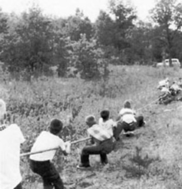
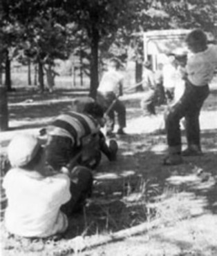
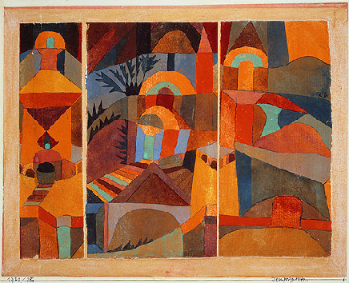
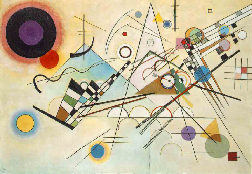
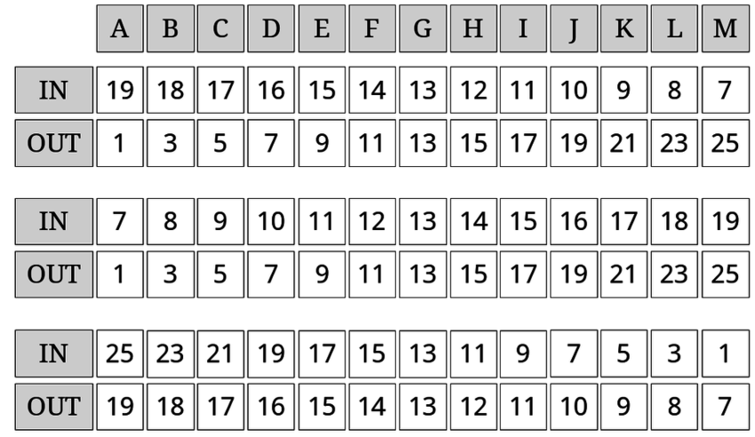

---
title:  'Influencia Social y Grupos'
author:
- name: Juan Muñoz
  affiliation: Universitat Autònoma de Barcelona
tags: [Dinámicas, Conflicto, Identidad]
tema: "Conflicto"
url: "http:/juan.psicologiasocial.eu"
bibliography: diapos.bib
csl: apa.csl
lateral-menu: 'True'
...

##¿Qué es un conflicto?

>Divergencia percibida de intereses o creencias que hace que las aspiraciones corrientes de las partes no puedan lograrse simultáneamente..\
`Suares, 1996` {.autor}

##Teoría realista del conflicto

* El conflicto se basa en una situación objetiva.
* El conflicto aparece cuando dos grupos tienen intereses y metas mutuamente incompatibles: cuando un grupo alcanza su meta, el otro no puede alcanzarla.

##Robber's Cave

<!--
##Tyerman y Spencer (1983)
-->

##Teoría de la identidad Social

>...la identidad social de un individuo va ligada al conocimiento de su pertenencia a ciertos grupos sociales y al significado emocional y valorativo resultante de esta pertenencia..\
`Tajfel, 1972` {.autor}

##

>El proceso de comparación social transforma las simples discriminaciones perceptivas o cognitivas en actitudes y acciones diferenciales que favorecen al propio grupo sobre los otros grupos. Motiva el aumento competitivo de criterios de diferenciación entre los grupos y otras estrategias aparte de la discriminación directa para conseguir la distintividad positiva"\
`Turner, 1981, p. 82`{.autor}

##

#### El conflicto aparece cuando se categoriza a las partes como representantes de diferentes grupos o identidades sociales.

##Klee Kandisnly

##Grupo mínimo

##Efectos de la categorización

La categorización genera...

Favoritismo endogrupal

:   Asumimos que los argumentos de nuestro propio grupo son mejores. Argumentamos de acuerdo con la identidad endogrupal.

Hostilidad exogrupal

:   Asumimos que los argumentos del otro grupo son peores.  Interpretamos su significado de acuerdo a la identidad exogrupal.

##Reducción del conflicto

* Decategorización
* Recategorización
* Diferenciación intergrupal mútua

## Strangers

<iframe width="560" height="315" src="https://www.youtube.com/embed/RZLmxxz8VAU" frameborder="0" allowfullscreen></iframe>

`Strangers: http://www.youtube.com/watch?v=RZLmxxz8VAU`{.figcaption}
