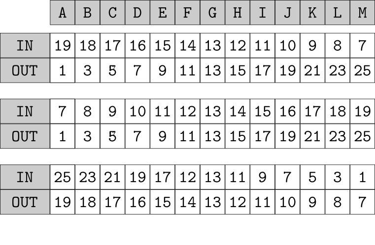
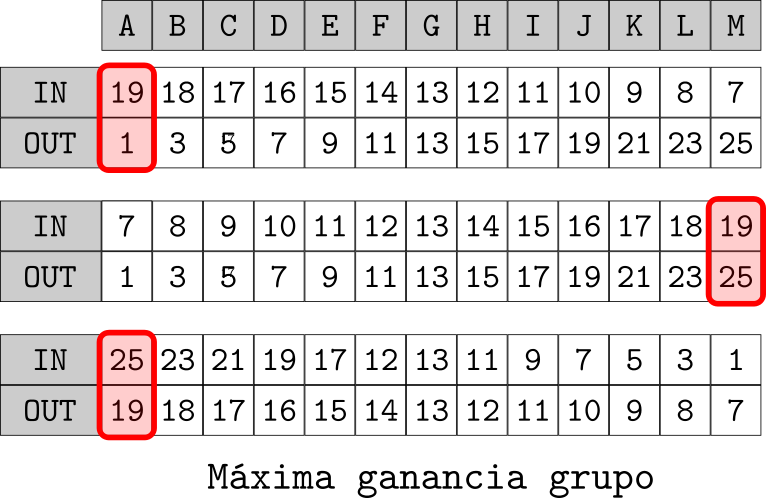
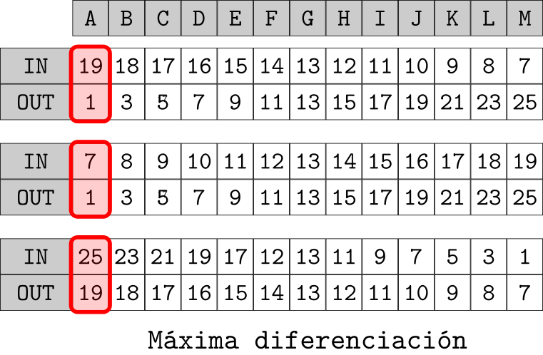

---
title:  'Conflicto'
author:
- name: Juan Muñoz
  affiliation: Universitat Autònoma de Barcelona
tags: [Dinámicas, Conflicto, Identidad]
tema: "Influencia Social y Grupos"
url: "http:/juan.psicologiasocial.eu"
bibliography: diapos.bib
csl: apa.csl
lateral-menu: 'True'
...

## ¿Qué es un conflicto? {#que-es data-background="imagenes-conflicto/conflicto.jpg" data-background-transition=zoom data-state=fondo}

>Se calificará de "conflicto" una relación social en la medida en que la acción dentro de ella esté orientada intencionalmente a llevar a cabo la voluntad del actor contra la resistencia de la otra parte o partes.\
@weber_economy_1978 [p. 38]

# La lucha por los recursos  {.center}

## Teoría realista del conflicto

* El conflicto se basa en una situación objetiva.
* El conflicto aparece cuando dos grupos tienen intereses y metas mutuamente incompatibles: cuando un grupo alcanza su meta, el otro no puede alcanzarla.

## Robber's Cave {data-background="imagenes-conflicto/RobbersCave.jpg" data-background-transition=zoom data-state="transparencia" }

. . .

{.border-strong .fondo}

{.border-strong .fondo}

#### @sherif_experiments_1956 {.peque}

<!--
## Tyerman y Spencer (1983)

-->

# La lucha por la identidad  {.center}

##Teoría de la identidad Social {data-background="imagenes-conflicto/SocialIdentity.jpg" data-background-transition=zoom}

>.(...) la 'identidad social' de un individuo se halla relacionada con el conocimiento de su pertenencia a ciertos grupos sociales y con la significación emocional y valorativa que resulta de esa pertenencia.\
@tajfel_categorizacion_1975 [p. 376]

##

>El proceso de comparación social transforma las simples discriminaciones perceptivas o cognitivas en actitudes y acciones diferenciales que favorecen al propio grupo sobre el grupo externo. Motiva el aumento competitivo de criterios de diferenciación entre los grupos y otras estrategias además de la discriminación directa para conseguir una distintividad positiva"\
@turner_experimental_1981 [p. 82]

## Categorización - conflicto {#categorizacion-conflicto data-background="imagenes-conflicto/categorizacion.jpg" data-background-transition=zoom}

#### El conflicto aparece cuando se categoriza a las partes como representantes de diferentes grupos o identidades sociales. {.fondoblanco}

## Efectos de la categorización {#efectos-categorizacion}

La categorización genera...

Favoritismo endogrupal
:   Asumimos que los argumentos de nuestro propio grupo son mejores. Argumentamos de acuerdo con la identidad endogrupal.
Hostilidad exogrupal
:   Asumimos que los argumentos del otro grupo son peores.  Interpretamos su significado de acuerdo a la identidad exogrupal.

## Klee - Kandisnly

## Grupo mínimo {#grupo-minimo}

  
  
  
  
  

## Reducción del conflicto {#reduccion-conflicto}

:::nonincremental
* Decategorización
* Recategorización
* Diferenciación intergrupal mutua
:::

#### @turner_mutual_2010 {.peque}

## Strangers

<iframe width="560" height="315" src="https://www.youtube.com/embed/RZLmxxz8VAU" frameborder="0" allowfullscreen></iframe>

#### @tadmor_strangers_2003 {.autor}

[http://www.youtube.com/watch?v=RZLmxxz8VAU](http://www.youtube.com/watch?v=RZLmxxz8VAU)

# Referencias {.center}

##  {.scrollable}
