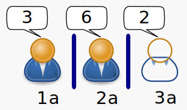
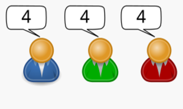
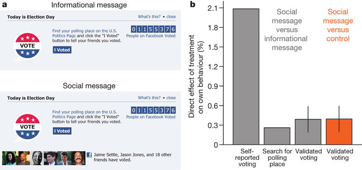
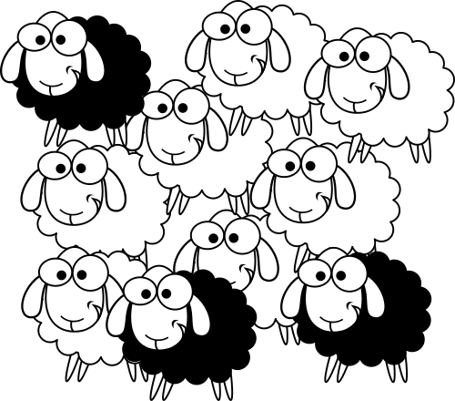

<section data-background-video="ISG.mp4" data-background-video-loop >
</section>

##Índice

>* Introducción
>* Normalización
>     * Influencia informacional
>* Conformismo
>     * Influencia normativa
* Influencia informacional referente  

“The opposite of courage in our society is not cowardice, it is… **conformity**”

[InsideInfo - Conformity](https://soundcloud.com/insideinfo/conformity)\
`https://soundcloud.com/insideinfo/conformity`{.peque}

#Introducción { .center}

##Influencia
> Proceso a través del cual las personas o los grupos cambian los pensamientos, sentimientos, y conductas de otros.\
@stangor_social_2004 [p. 75]

##Tipos de influencia

Normalización

:   Proceso de evitación del conflicto dentro del grupo mediante compromisos mutuos y convergencia gradual hacia los puntos de vista de los demás

Conformismo

:   Resolución del conflicto mediante el movimiento de los desviados hacia las posiciones de la mayoría

Innovación

:   Creación de conflicto dentro del grupo por una minoría de sus miembros y resolución mediante el movimiento de la mayoría hacia la minoría

###### @moscovici_social_1985

#Normalización { .center}

##Normalización {data-background="imagenes-isg/cebras.jpg" data-background-transition=zoom data-state=fondo}

. . .

>Procés de creació de les normes que regulen la conducta, la percepció, el pensament o els desitjos de les persones en una situació concreta.\
@feliu_influencia_2003 [p. 260]

##El _efecto autocinético_ {data-background="imagenes-isg/autokinetic.jpg" data-background-transition=zoom data-state=fondo}

. . .

. . .

. . .

##Normalización

<object id="svg1"  data="imagenes-isg/Normalizacion.svg" type="image/svg+xml"></object>

######Desplazamiento en dirección de una posición intermedia

##Influencia informacional

>Una influencia social informacional puede definirse como una influencia para aceptar la información obtenida de otros como evidencia sobre la realidad.\
@deutsch_study_1955 [p. 629]

##Dificultad y relevancia de la tarea

##Baron et al. (1996)

##Esquema influencia informacional

<!--

  
  
  
  

-->

##Teorías relacionadas: Comparación social

. . .

\
@bond_61-million-person_2012

##Teorías relacionadas: Ignorancia pluralista

. . .

>en ocasiones, la mayoría de los miembros de un grupo no están de acuerdo con una norma, creencia o modo de actuar del grupo, en su interior o de forma privada, pero cada uno de los sujetos cree –incorrectamente–, que todos o la mayoría de los miembros del grupo sí que están de acuerdo con esa norma, creencia o modo de actuar.\
`Katz y Allport, 1931`{.autor}

##Ignorancia Pluralista

<video width="860" class="stretch" controls>
  <source src="multimedia/TheSmokeFilledRoomStudy.mp4" type="video/mp4">
</video>

`The smoke filled room`{.figcaption}
<https://www.youtube.com/watch?v=vLZrBTqWLv8>

#Conformismo { .center}

##Conformismo

>La conformidad ocurre cuando una persona cambia su comportamiento o actitud para que sea más similar al comportamiento o actitud de un grupo. (...) la conformidad puede ocurrir sin que el grupo desee ejercer influencia sobre, o monitorear al individuo, siempre y cuando la persona conozca la posición del grupo y quiera estar de acuerdo con ella..\
@levine_conformity_2007 [p. 168]

<!--
<video width="400"  class="stretch" controls>
  <source src="multimedia/classic-candid.mp4" type="video/mp4">
</video>
`Candid Camera: Elevator`{.figcaption}

###### <https://www.youtube.com/watch?v=BgRoiTWkBHU>
-->

. . .

##El experimento de Asch {data-background="imagenes-isg/asch-conformity.jpg" data-background-transition=zoom data-state=fondo}

. . .

##El experimento de Asch {data-background="imagenes-isg/asch-conformity.jpg" data-background-transition=zoom data-state=fondo}

##Resultados

>- Respuestas incorrectas: 36.8%
- Personas que nunca ceden: 24%
- Personas que siempre ceden: 5%
- Personas que ceden entre 8 y 12 veces: 27%

##Conformismo

<object id="svg1"  data="imagenes-isg/Conformismo.svg" type="image/svg+xml"></object>

######Desplazamiento en la dirección de la posición mayoritaria

##Diferencias de sexo
\
@mori_no_2010

##Sexo y edad
\
@mori_boys_2014

##Unanimidad

##Anonimato

<!--
##Tamaño de la mayoría

. . .

##Tamaño de la mayoría

<video width="420"  class="stretch" controls><source src="multimedia/Stanley Milgram - Conformity and Independence.mp4"></video>

###### <https://www.youtube.com/watch?v=P0e6zG8IbE8>

######@milgram_note_1969
-->

<!--

##Tamaño de la mayoría

<object id="svg1"  data="imagenes-isg/TamañoMayoria.svg" type="image/svg+xml"></object>

<!--

  
  

-->

##Influencia normativa

>[Deutsh y Gerard] Entienden por influencia normativa la que se observa cuando el individuo se conforma con las expectativas positivas del otro (individuo o grupo), a fin de ganar de él una serie de refuerzos y sentimientos positivos, de establecer una solidaridad con él, y en definitiva no verse marginado y ridiculizado por él.\
@perez_influencia_1999 [p. 261]

##Influencia normativa

<!--

  
  
  

-->

<!--

##

>Es una forma de influencia en la que se ejerce presión para hacer que alguien se conforme a las expectativas y preferencias de los demás. Las expectativas y preferencias de los otros funcionan como norma de grupo de referencia que expresa cómo deben comportarse o qué decisión deben tomar las personas.\
@kaplan_normative_2010 [p. 606]

-->

<!--
##Conformismo: Factores

* Contexto histórico y cultural
* Unanimidad
* Anonimato
-->

<!--
##Normas en el "Bennington College" {data-background="imagenes-isg/Bennington.jpg" data-background-transition=zoom data-state=fondo}

-->

##"Miedo" a hablar

Pensamiento grupal

. . .

Espiral del silencio

<!--
##Relevancia de la tarea (Kundu)

> Los soldados enemigos se han apoderado de tu aldea. Tienen órdenes de matar a todos los civiles que quedan. Usted y algunos de sus conciudadanos han buscado refugio en el sótano de una gran casa. En el exterior se oyen las voces de los soldados que han llegado para registrarla en busca de objetos de valor.\
Tu bebé empieza a llorar a gritos. Le cubres la boca para amortiguar el sonido. Si quitas la mano de su boca, su llanto llamará la atención de los soldados que matarán a todas las personas escondidas en la bodega (incluyendo a tu hijo). La única solución para salvaros es asfixiarlo hasta la muerte.\
¿Es correcto matar a tu hijo para salvarte a ti mismo y al resto del pueblo?\
@kundu_morality_2013
##

-->

#Influencia informativa referente {.center}

## La importancia de los grupos

##Influencia informativa referente

>Consideramos que tanto las comparaciones sociales para reducir la incertidumbre como la existencia de una presión normativa para conformarse dependen de percibir que la fuente de influencia pertenece a la propia categoría.\
@abrams_knowing_1990 [p. 97]

<!--
"We argue that both social comparisons to reduce uncertainty and the existence of normative pressure to comply depend on perceiving the source of influence as belonging to one's own category" (Abrams et al 1990:97)
-->

<!--
>La teoría de la influencia informativa referente es la teoría de la identidad social de la influencia social en grupos. Considera la influencia normativa e informativa -conceptos separados según el planteamiento de otros científicos sociales- como parte de un único proceso de influencia ligado a la pertenencia e identidad social.\
@smith_referent_2010 [p. 687]

>Referent informational influence theory is the social identity theory of social influence in groups. It considers normative influence and informational influence—separate concepts in the thinking of other social scientists—as part of a single influence process linked to group membership and social identity.\
@smith_referent_2010 [p. 687]
-->

## Categorización e influencia

\
@abrams_knowing_1990

## Categorización, anonimato e influencia

\
@abrams_knowing_1990

<!--
# Discusión {.center}

##

##Independencia

> No es justificable asumir de antemano que una teoría de la influencia social deba ser una teoría de la sumisión a la presión social. No es necesario dudar de la gran potencia de las fuerzas sociales para darse cuenta de que la conformidad no es el único efecto que producen. La lucha por la independencia y la resistencia a la invasión son tan característicos de las personas como lo es la conformidad. En consecuencia, es una reducción exagerada destacar la sumisión, olvidándose de los nada despreciables poderes que muestran en ocasiones las personas para actuar de acuerdo con sus convicciones y elevarse por encima de la pasión del grupo.\
@asch_studies_1956 [p. 3]
-->

#Referencias {.center}

## {.scrollable}
