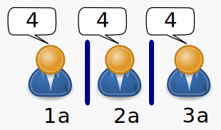

---
title:  'Influencia Social y Grupos'
author:
- name: Juan Muñoz
  affiliation: Universitat Autònoma de Barcelona
tags: [nothing, nothingness]
tema: "Uniformidad y Conformismo"
url: "http://psicologiasocial.uab.es/juan"
bibliography: diapos.bib
csl: apa.csl
...

##Índice

>* Introducción
* Normalización
* Conformismo
* Influencia informativa e influencia normativa

<!--
#Conformismo

¿Ponerla como imagen de fondo?

-->

#Introducción {.mitit .center}

##Influencia
> Proceso a través del cual las personas o los grupos cambian los pensamientos, sentimientos, y conductas de otros.\
@stangor_social_2004 [p. 75]

##Tipos de influencia

Normalización

:   Proceso de evitación del conflicto dentro del grupo mediante compromisos mutuos y convergencia gradual hacia los puntos de vista de los demás

Conformismo

:   Resolución del conflicto mediante el movimiento de los desviados hacia las posiciones de la mayoría

Innovación

:   Creación de conflicto dentro del grupo por una minoría de sus miembros y resolución mediante el movimiento de la mayoría hacia la minoría

. . .

###### @moscovici_social_1985

#Normalización {.mitit .center}

##Normalización {data-background="imagenes-isg/cebras.jpg" data-background-transition=zoom data-state=fondo}

. . .

>Procés de creació de les normes que regulen la conducta, la percepció, el pensament o els desitjos de les persones en una situació concreta.\
@feliu_influencia_2003 [p. 260]

##El _efecto autocinético_ {data-background="imagenes-isg/autokinetic.jpg" data-background-transition=zoom data-state=fondo}

##Normalización

<object id="svg1"  data="imagenes-isg/Normalizacion.svg" type="image/svg+xml"></object>

######Desplazamiento en dirección de una posición intermedia

#Conformismo {.mitit .center}

##Conformismo

<video width="420"  class="stretch" controls>
	<source src="multimedia/classic-candid.mp4" type="video/mp4">
	<source src="https://www.youtube.com/embed/nPobACr9oL4" type="video/mp4">"
</video>

###### <https://www.youtube.com/embed/nPobACr9oL4>

. . .

<!--
#Conformismo

>>Movimiento por parte de la(s) persona(s) discrepante(s) hacia la norma del grupo como una función de la presión social explícita o implícita de los miembros del grupo.
@Allen

-->

##El experimento de Asch {data-background="imagenes-isg/asch-conformity.jpg" data-background-transition=zoom data-state=fondo}

##El experimento de Asch {data-background="imagenes-isg/asch-conformity.jpg" data-background-transition=zoom data-state=fondo}

##Resultados {data-background="imagenes-isg/asch-conformity.jpg" data-background-transition=zoom data-state=fondo}

>- Respuestas incorrectas: 36.8%
- Personas que nunca ceden: 24%
- Personas que siempre ceden: 5%
- Personas que ceden entre 8 y 12 veces: 27%

##Conformismo

<object id="svg1"  data="imagenes-isg/Conformismo.svg" type="image/svg+xml"></object>

######Desplazamiento en la dirección de la posición mayoritaria

##Conformismo: Factores

* Tamaño de la mayoría
* Contexto histórico y cultural
* Unanimidad
* Anonimato
* Relevancia de la tarea

##Tamaño de la mayoría

##Tamaño de la mayoría

<video width="420"  class="stretch" controls><source src="multimedia/Stanley Milgram - Conformity and Independence.mp4"></video>

###### <https://www.youtube.com/watch?v=P0e6zG8IbE8>

######@milgram_note_1969

##Tamaño de la mayoría

<object id="svg1"  data="imagenes-isg/TamañoMayoria.svg" type="image/svg+xml"></object>

<!--

  
  

-->
##Relevancia de la tarea

##Relevancia de la tarea

#Influencias informativa y normativa {.mitit .center}

<!--
##

Deutsch, M., & Gerard, H. B. (1973). Estudio de las influencias sociales normativa e informativas sobre el criterio individual. In H. Proshansky & B. Seidenberg (Eds.), Estudios básicos de psicología social (pp. 490–502). Madrid: Tecnos.

###### @deutsch_estudio_1973
-->

##Influencia informativa

<!--

  
  
  
  

-->

##Teorías relacionadas

####Comparación Social

. . .

####Ignorancia Pluralista\
\

##Influencia normativa

>[Deutsh y Gerard] Entienden por influencia normativa la que se observa cuando el individuo se conforma con las expectativas positivas del otro (individuo o grupo), a fin de ganar de él una serie de refuerzos y sentimientos positivos, de establecer una solidaridad con él, y en definitiva no verse marginado y ridiculizado por él.\
@perez_influencia_1999 [p. 261]

##Influencia normativa

<!--

  
  
  

-->

##Normas en el "Bennington College" {data-background="imagenes-isg/Bennington.jpg" data-background-transition=zoom data-state=fondo}

##Referencias
