---
title:  'Toma de decisiones'
author:
- name: Juan Muñoz
  affiliation: Universitat Autònoma de Barcelona
tags: [decisiones, groupthink]
tema: "Influencia Social y Grupos"
url: "http:/juan.psicologiasocial.eu"
bibliography: diapos.bib
csl: apa.csl
...

## Toma de decisiones  {#toma-decisiones data-background="imagenes-decisiones/Conference.jpg" data-background-transition=zoom, data-state=fondo,  .listapeque .transparencia}

#### ¿Son las decisiones grupales mejores que las que se toman de manera individual? {.fondoblanco }

#### Los grupos tienen mejor desempeño... {.fondoblanco .transparencia .fragment}

* Aparecen ideas y estrategias que difícilmente podrían haberse dado a nivel individual.
* Facilitan la generación de ideas y alternativas y la posibilidad de detectar errores o incorrecciones, así como de recordar más cantidad de información.
* Propician un contexto cooperativo de trabajo que hace aumentar la cohesión, la motivación y la implicación..

## ...pero {#pero}
>(…) en tal caso, se supone que cada uno  de los participantes es un individuo  racional y moral. Juntos no hacen sino sopesar las ventajas e inconvenientes de cada solución. Para elegir, en definitiva, la que presente las mayores ventajas y los menores inconvenientes.\
`Doise y Moscovici, 1984`{.autor}

<!-- ## El efecto Ringelmann {#efecto-ringelman data-background="imagenes-decisiones/Ringelmann.jpg" data-background-transition=zoom}

. . .

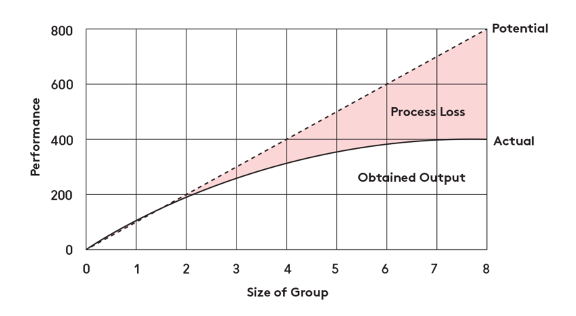 -->

## Desplazamiento hacia el riesgo {#desplazamiento-riesgo data-background="imagenes-decisiones/Riesgo.jpg" data-background-transition=zoom }

. . .

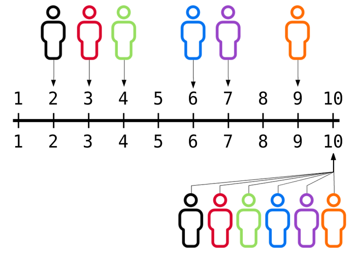{.noborder .noshadow}

## Desplazamiento: Explicaciones {#desplazamiento-explicaciones}

* Difusión de responsabilidad
* Riesgo como valor cultural
* Las personas arriesgadas son más influyentes

## Polarización {#polarizacion data-background="imagenes-decisiones/Polarizacion.jpg" data-background-transition=zoom}

. . .

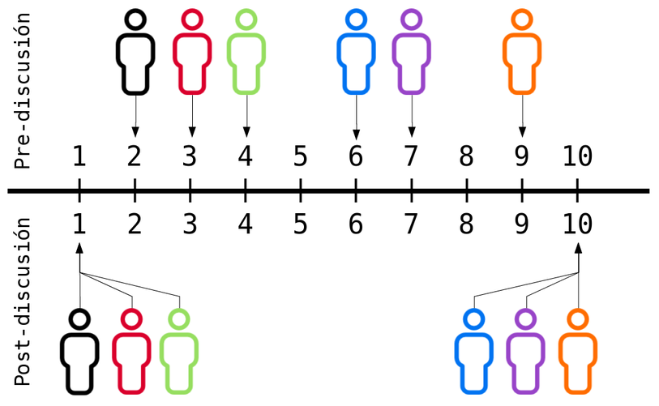{.noborder .noshadow}

## Polarización: Explicaciones {#polarizacion-explicaciones}

* Influencia normativa
* Influencia informativa
* Autocategorización

<!--
## Proceso ¿ideal? de toma de decisiones

* Identificar la decisión a tomar
* Analizar el tema
* Establecer criterios
* Brainstorming de posibles soluciones
-->

# Dinámica de la toma de decisiones en grupo{#dinamica-toma-decisiones .center .medio }

## {data-transition="fade"}

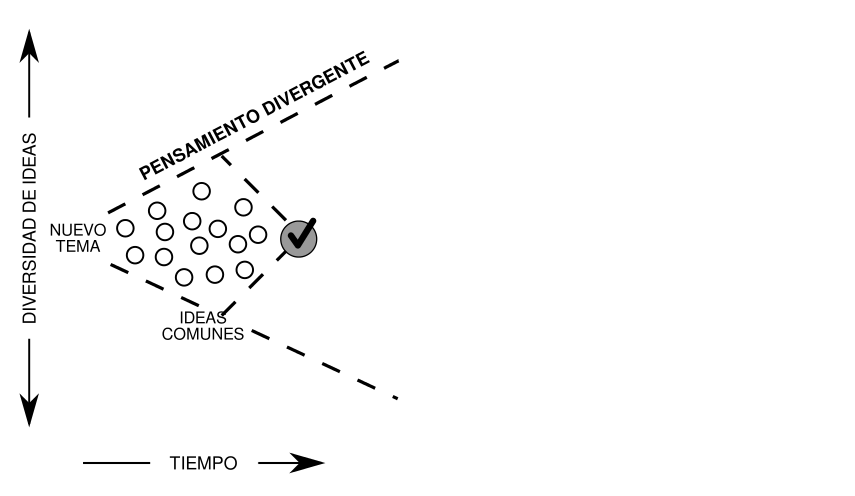

[Kaner, S. (2014). *Facilitator’s guide to participatory decision-making*]{.autor .peque}

## {data-transition="fade"}

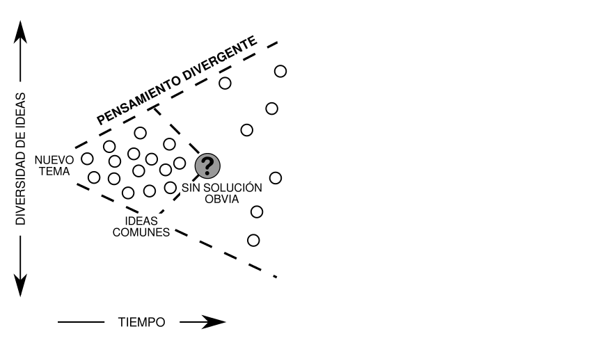

## {data-transition="fade"}

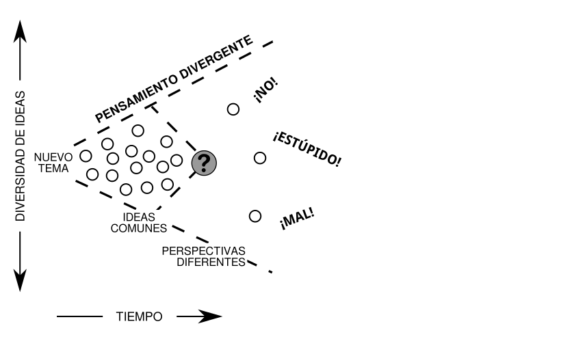

## {data-transition="fade"}

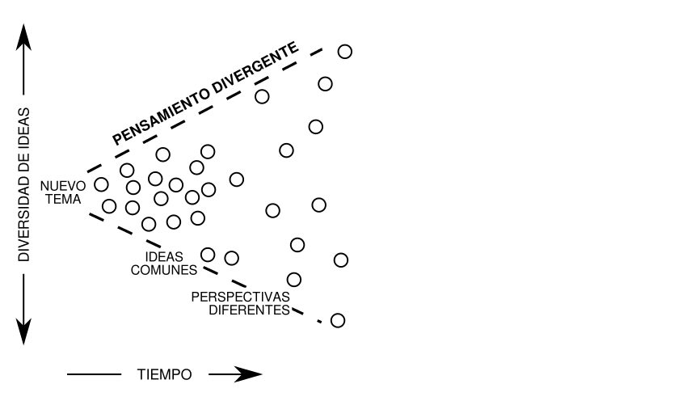

## {data-transition="fade"}

## {data-transition="fade"}

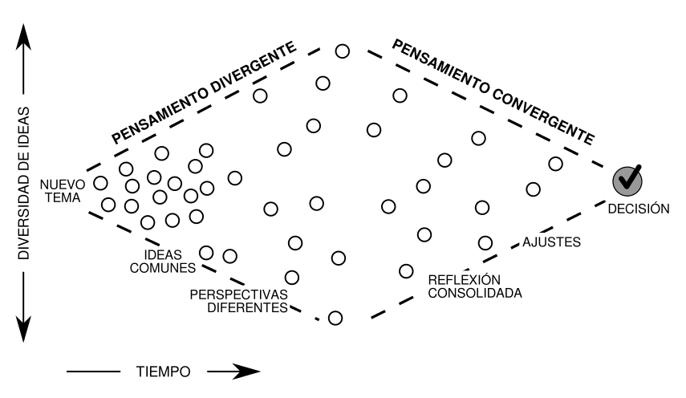

## {data-transition="fade"}

## {data-transition="fade"}

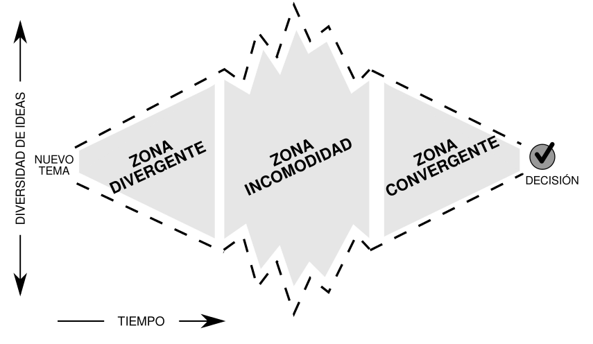

## Mejorar las decisiones{.medio}

* Las diferencias de opinión son naturales y previsibles. Debemos buscarlas y provocarlas fomentando la participación en el trabajo de discusión y decisión.
* Los desacuerdos ayudan al grupo a tomar su decisión, ya que al intervenir una mayor gama de juicios y opiniones, aumentan las probabilidades de encontrar argumentos nuevos y soluciones válidas en las que no se pensaba en un principio.
* Evitar hacer concesiones únicamente para evitar el conflicto y lograr el acuerdo y la armonía.
* Deben abolirse las técnicas que reducen el conflicto. <!--, como promedios, votos mayoritarios, reglas de procedimiento, tiempos impuestos, etc. -->
* Hacer todo lo posible para que toda persona defienda su punto de vista con firmeza.
<!-- * Cuando se llegue a un acuerdo con demasiada rapidez o facilidad, hay que estar alerta. -->
<!-- * No recurrir a estereotipos, prejuicios o soluciones prefabricadas al tomar una decisión y no utilizar argumentos de autoridad. -->

<!-- ## Proceso ¿ideal? de toma de decisiones {#proceso-ideal}

>* Identificar la decisión a tomar
* Analizar el tema
* Establecer criterios
* Brainstorming de posibles soluciones

* Evaluación de las opciones – selección
* Implementación
* Monitorización de resultados -->

<!-- #Malas decisiones: Pensamiento grupal { .center}

## Pensamiento grupal

>La tendencia de un grupo de toma de decisiones a buscar el consenso y evitar el examen crítico de las alternativas.

. . .

. . .

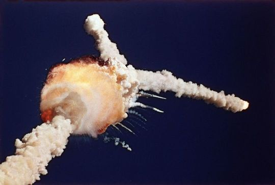

## Proceso

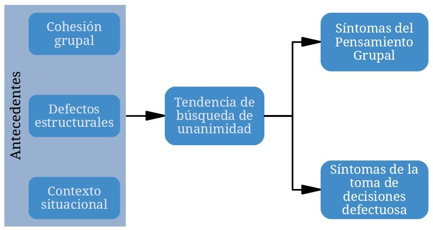

## La crisis de los misiles

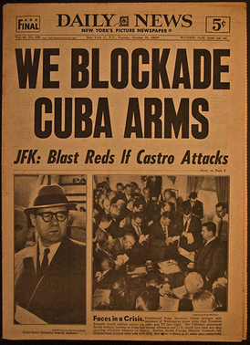

##Evitar el pensamiento grupal {.listapeque}

* El líder debe ser imparcial y no asumir ninguna posición a priori.
* Animar a una evaluación crítica de las alternativas.
* Asignar a algún miembro el papel de “abogado del diablo”.
* Trabajar en subgrupos para poder examinar diferencias entre ellos.
* Evitar técnicas que reduzcan el conflicto.

##

* Invitar a expertos ajenos al grupo para que cuestionen y desafíen los puntos de vista del grupo.
* Buscar, atender y fomentar la aparición de diferencias de opinión y desacuerdos en el grupo.
* No recurrir a estereotipos, soluciones prefabricadas, no utilizar argumentos de autoridad.
* Permitir que cada miembro del grupo exponga sus puntos de vista. -->

<!-- ## Conclusiones

* Generalmente, las decisiones grupales suelen aportar mejores resultados que las tomadas de forma individual.
* Algunos aspectos de la dinámica grupal nos pueden llevar a tomar malas decisiones. Eso no significa que las decisiones individuales sean mejores, pero alerta de los riesgos que implica la toma de decisiones grupal.
* Hay que hacer todo lo posible para dar a cada individuo la posibilidad de defender su punto de vista con firmeza.
* Hay que evitar hacer concesiones únicamente para evitar el conflicto y lograr el acuerdo y la armonía.
* Cuando se llegue a un acuerdo con demasiada rapidez o facilidad, hay que estar alerta. Sólo debemos ceder ante posiciones que hayan sido objeto de una discusión y un examen críticos.
* No debemos recurrir a los estereotipos, a las soluciones prefabricadas y no debemos utilizar argumentos de autoridad.
* Debemos escuchar y observar las reacciones de los otros miembros del grupo, considerándolas atentamente antes de formular nuestra opinión de forma personal. -->
