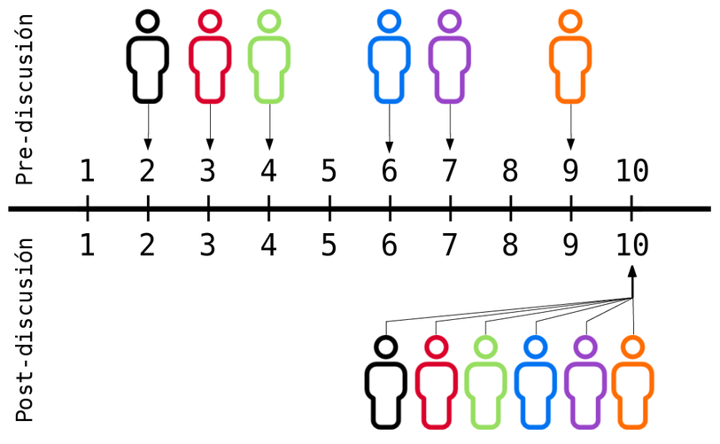

---
title:  'Toma de decisiones'
author:
- name: Juan Muñoz
  affiliation: Universitat Autònoma de Barcelona
tags: [decisiones, groupthink]
tema: "Influencia Social y Grupos"
url: "http:/juan.psicologiasocial.eu"
bibliography: diapos.bib
csl: apa.csl
...

## Toma de decisiones  {#toma-decisiones data-background="imagenes-decisiones/Conference.jpg" data-background-transition=zoom, data-state=fondo,  .listapeque .transparencia}

#### ¿Son las decisiones grupales mejores que las que se toman de manera individual? {.fondoblanco }

#### Los grupos tienen mejor desempeño... {.fondoblanco .transparencia .fragment}

* Aparecen ideas y estrategias que difícilmente podrían haberse dado a nivel individual.
* Facilitan la generación de ideas y alternativas y la posibilidad de detectar errores o incorrecciones, así como de recordar más cantidad de información.
* Propician un contexto cooperativo de trabajo que hace aumentar la cohesión, la motivación y la implicación..

## Ventajas y desventajas {#ventajas-desventajas .medio}

Ventajas
: Mayor concentración de conocimientos, ideas, experiencias e información.
: Variedad de puntos de vista, más estrategias y alternativas.
: Decisiones más complejas.
: Propicia un contexto que aumenta cohesión, motivación e implicación

Desventajas
: Mayor dedicación de tiempo.
: Minorías vs mayorías y presiones a la uniformidad
: Manipulación del compromiso para llegar a una decisión más rápidamente.
: Propósitos ocultos (!) que influyen en la opinión

## ...pero {#pero}
>(…) en tal caso, se supone que cada uno  de los participantes es un individuo  racional y moral. Juntos no hacen sino sopesar las ventajas e inconvenientes de cada solución. Para elegir, en definitiva, la que presente las mayores ventajas y los menores inconvenientes.\
`Doise y Moscovici, 1984`{.autor}

<!-- ## El efecto Ringelmann {#efecto-ringelman data-background="imagenes-decisiones/Ringelmann.jpg" data-background-transition=zoom}

. . .

 -->

## Desplazamiento hacia el riesgo {#desplazamiento-riesgo data-background="imagenes-decisiones/Riesgo.jpg" data-background-transition=zoom }

. . .

{.noborder .noshadow}

## Desplazamiento: Explicaciones {#desplazamiento-explicaciones}

* Difusión de responsabilidad
* Riesgo como valor cultural
* Las personas arriesgadas son más influyentes

## Polarización {#polarizacion data-background="imagenes-decisiones/Polarizacion.jpg" data-background-transition=zoom}

. . .

{.noborder .noshadow}

## Polarización: Explicaciones {#polarizacion-explicaciones}

* Influencia normativa
* Influencia informativa
* Autocategorización

<!--
## Proceso ¿ideal? de toma de decisiones

* Identificar la decisión a tomar
* Analizar el tema
* Establecer criterios
* Brainstorming de posibles soluciones
-->

# Dinámica de la toma de decisiones en grupo{#dinamica-toma-decisiones .center .medio }

## {data-transition="fade"}

[Kaner, S. (2014). *Facilitator’s guide to participatory decision-making*]{.autor .peque}

## {data-transition="fade"}

## {data-transition="fade"}

## {data-transition="fade"}

## {data-transition="fade"}

## {data-transition="fade"}

## {data-transition="fade"}

## {data-transition="fade"}

## Mejorar las decisiones{#mejorar-decisiones .medio}

* Las diferencias de opinión son naturales y previsibles. Debemos buscarlas y provocarlas fomentando la participación en el trabajo de discusión y decisión.
* Los desacuerdos ayudan al grupo a tomar su decisión, ya que al intervenir una mayor gama de juicios y opiniones, aumentan las probabilidades de encontrar argumentos nuevos y soluciones válidas en las que no se pensaba en un principio.
* Evitar hacer concesiones únicamente para evitar el conflicto y lograr el acuerdo y la armonía.
* Deben abolirse las técnicas que reducen el conflicto. <!--, como promedios, votos mayoritarios, reglas de procedimiento, tiempos impuestos, etc. -->
* Hacer todo lo posible para que toda persona defienda su punto de vista con firmeza.

<!-- * Cuando se llegue a un acuerdo con demasiada rapidez o facilidad, hay que estar alerta. -->
<!-- * No recurrir a estereotipos, prejuicios o soluciones prefabricadas al tomar una decisión y no utilizar argumentos de autoridad. -->

<!-- ## Proceso ¿ideal? de toma de decisiones {#proceso-ideal}

>* Identificar la decisión a tomar
* Analizar el tema
* Establecer criterios
* Brainstorming de posibles soluciones

* Evaluación de las opciones – selección
* Implementación
* Monitorización de resultados -->

<!-- #Malas decisiones: Pensamiento grupal { .center}

## Pensamiento grupal

>La tendencia de un grupo de toma de decisiones a buscar el consenso y evitar el examen crítico de las alternativas.

. . .

. . .

## Proceso

## La crisis de los misiles

##Evitar el pensamiento grupal {.listapeque}

* El líder debe ser imparcial y no asumir ninguna posición a priori.
* Animar a una evaluación crítica de las alternativas.
* Asignar a algún miembro el papel de “abogado del diablo”.
* Trabajar en subgrupos para poder examinar diferencias entre ellos.
* Evitar técnicas que reduzcan el conflicto.

##

* Invitar a expertos ajenos al grupo para que cuestionen y desafíen los puntos de vista del grupo.
* Buscar, atender y fomentar la aparición de diferencias de opinión y desacuerdos en el grupo.
* No recurrir a estereotipos, soluciones prefabricadas, no utilizar argumentos de autoridad.
* Permitir que cada miembro del grupo exponga sus puntos de vista. -->

<!-- ## Conclusiones

* Generalmente, las decisiones grupales suelen aportar mejores resultados que las tomadas de forma individual.
* Algunos aspectos de la dinámica grupal nos pueden llevar a tomar malas decisiones. Eso no significa que las decisiones individuales sean mejores, pero alerta de los riesgos que implica la toma de decisiones grupal.
* Hay que hacer todo lo posible para dar a cada individuo la posibilidad de defender su punto de vista con firmeza.
* Hay que evitar hacer concesiones únicamente para evitar el conflicto y lograr el acuerdo y la armonía.
* Cuando se llegue a un acuerdo con demasiada rapidez o facilidad, hay que estar alerta. Sólo debemos ceder ante posiciones que hayan sido objeto de una discusión y un examen críticos.
* No debemos recurrir a los estereotipos, a las soluciones prefabricadas y no debemos utilizar argumentos de autoridad.
* Debemos escuchar y observar las reacciones de los otros miembros del grupo, considerándolas atentamente antes de formular nuestra opinión de forma personal. -->

##  {#avion data-background="imagenes-decisiones/avion.jpg" data-background-transition=zoom, data-state=fondo .transparencia}

## {#perdidos-desierto .scrollable}
##### Son aproximadamente las 10 de la mañana de un día de agosto. El avión en el que viajas acaba de estrellarse en el desierto de Sonora, Arizona, en el suroeste de Estados Unidos. Tanto el piloto como el copiloto han muerto y el avión se ha incendiado. Sólo queda la estructura metálica. Ninguno de vosotros ha sufrido ningún daño. El piloto no pudo informar a nadie de vuestra posición antes del accidente. Sin embargo, antes del impacto os había indicado que estábais a 250 Kms. al suroeste del lugar habitado más próximo, y a unos 90 Kms. fuera de la ruta que debía seguir el avión. Los alrededores son bastante llanos, excepto por los cactus "sahuaro" de aspecto bastante peliculero. El último informe meteorológico decía que se alcanzarían los 45º C ese día, lo que significa que a nivel del suelo llegará a 50º C. Lleváis ropa ligera (camisa de manga corta, pantalones, calcetines y zapatos de calle).

##### Antes del incendio del avión habéis podido rescatar una serie de objetos. Tu tarea consiste en ordenarlos en función de su importancia para vuestra supervivencia. Da una puntuación de 1 al más importante, una puntuación de 2 al segundo más importante, y así sucesivamente hasta el número 15, el de menor importancia.

## {#sahuaro data-background="imagenes-decisiones/sahuaro.jpg"}

##  {#avion-nieve data-background="imagenes-decisiones/avion-nieve.jpg" data-background-transition=zoom, data-state=fondo .transparencia}

## {#perdidos-nieve .scrollable}

##### Acabas de aterrizar de emergencia en los bosques del norte de Minnesota y el sur de Manitoba. Son las 11:32 de una mañana de mediados de enero. El pequeño avión en el que viajabas ha quedado completamente destruido, excepto el fuselaje. El piloto y el copiloto han muerto, pero nadie más ha resultado herido de gravedad.

##### El accidente se produjo repentinamente, antes de que el piloto tuviera tiempo de llamar por radio para pedir ayuda o informar a alguien de su posición. Dado que el piloto intentaba evitar una tormenta, el avión estaba bastante fuera de rumbo. El piloto anunció poco antes del accidente que estaban a 40 kilómetros al noroeste de un pequeño pueblo que es la zona habitada más cercana.

##### Te encuentras en una zona salvaje formada por espesos bosques salpicados por muchos lagos y ríos. El último informe meteorológico indicaba que la temperatura alcanzaría los veinticinco grados bajo cero durante el día y los cuarenta bajo cero por la noche. Estás vestido con ropa de invierno apropiada para usar en la ciudad: trajes, pantalones, zapatos de calle y abrigos.

##### Mientras escapabais del avión, tu grupo, que ha acordado mantenerse unido, rescató los quince artículos listados a continuación. Tu tarea es clasificar estos elementos de acuerdo a su importancia para la supervivencia (puntúa con un 1 el más importante y 15 el menos importante).

##  {#yate data-background="imagenes-decisiones/yate.jpg" data-background-transition=zoom, data-state=fondo .transparencia}

## {#perdidos-mar .scrollable}

##### Imagina que estás a la deriva en un yate particular en medio del Océano Pacífico. A causa de un incendio de origen desconocido, ha sido destruido gran parte del yate y su contenido. En estos momentos el yate se está hundiendo lentamente. No está clara la localización del yate, puesto que ha sido destruido el equipo de navegación y tanto la tripulación como tú mismo estabais ocupados intentando apagar el incendio. Tu mejor cálculo es que estás a mil kilómetros al sudoeste de la tierra más próxima.

##### A continuación encontrarás una lista de quince elementos que han quedado intactos tras el incendio. Además de esos artículos, también ha quedado disponible un bote salvavidas con remos. El bote es lo suficientemente grande para que quepas tú mismo, la tripulación, y todos los elementos de la lista. El contenido total de los bolsillos de todos los supervivientes son un paquete de cigarrillos, algunas cajas de cerillas, y cinco billetes de cinco euros.

##### Tu tarea consiste en ordenar los quince artículos en función de su importancia para vuestra supervivencia. Da una puntuación de 1 al más importante, una puntuación de 2 al segundo más importante, y así sucesivamente hasta el número 15, el de menor importancia.

## {#nave-espacial data-background="imagenes-decisiones/nave-espacial.jpg" data-background-transition=zoom, data-state=fondo .transparencia}

## {#perdidos-luna .scrollable}

##### Imagina que eres miembro de la tripulación de una nave espacial que va a reunirse con la nave nodriza en la cara iluminada de la luna. Debido a problemas mecánicos tienen que alunizar en un lugar que queda a unos 300 Km. del lugar de encuentro.

##### Durante el alunizaje gran parte del equipo de la nave quedó dañado y, puesto que la supervivencia de la tripulación depende de que podáis llegar a la nave nodriza, debéis escoger los artículos más importantes para llevar.

##### La tarea consiste en ordenar todos estos artículos de acuerdo con su importancia y utilidad para ayudaros a llegar al punto de encuentro con la nave nodriza. Hay que poner un 1 para el artículo más importante, un 2 para el que sigue en importancia, etc . Así hasta llegar a ordenar todos los artículos.

## {#luna data-background="imagenes-decisiones/astronauta.jpg" data-background-transition=zoom, data-state=fondo .transparencia}
