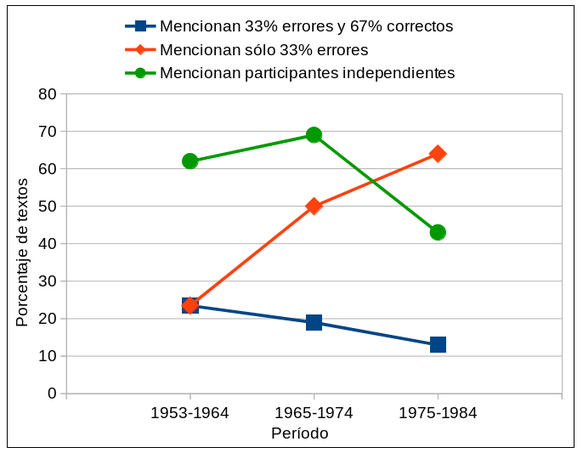
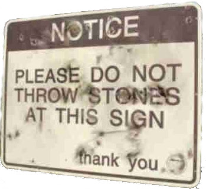

---
title:  'Influencia Social y Grupos'
author:
- name: Juan Muñoz
  affiliation: Universitat Autònoma de Barcelona
tags: [Obediencia, Milgram]
tema: "Resistencia"
url: "http:/juan.psicologiasocial.eu"
csl: apa.csl
lateral-menu: 'True'
...

## Índice

>* Sesgo de conformismo
* Reactancia
* Identidad Social y Cambio social
* Desobediencia

[Bongo Kanny - Civil Disobedience](https://youtu.be/qScsUOsh6qA?t=43)\
`https://youtu.be/qScsUOsh6qA?t=43`{.peque}

# Sesgo de conformismo { .center}

## Sesgo de conformismo

\
@friend_puzzling_1990

## Independencia y resistencia

>La lucha por la independencia y la resistencia a la usurpación son aspectos tan reales de las personas como la conformidad. Por lo tanto, es indebidamente limitado enfatizar la sumisión, el descuido de los poderes no despreciables que las personas demuestran en ocasiones para actuar de acuerdo a la convicción y elevándose por encima de la pasión del grupo.\
@asch_studies_1956 [, p. 3]

# Reactancia {data-background="imagenes-isg/AdanyEva.jpg"   data-background-transition=zoom data-state=fondo .center}

<!-- Adan y Eva, Rubens -->

<!--  -->

# Identidad Social y Cambio Social { .center}

##

>Esto no es negar que vivimos en un mundo donde estos fenómenos [conformismo y obediencia] son muy frecuentes. Pero donde se producen, no son el producto de la irreflexión y de la sumisión zombie, sino de la identificación y el compromiso activo de los individuos con los grupos de los que forman parte.\
@haslam_beyond_2011 [, pp. 338-339]

## El papel del liderazgo

>"En estos términos, la resistencia tendrá éxito en la medida en que los participantes se identifiquen más con la causa de su grupo que sus oponentes con la suya. Si bien esto debería ser cierto en general, cuando se trata de resistencia, este análisis descuida el papel de liderazgo activo que desempeñan los miembros individuales del grupo, tanto en el cultivo de un sentido compartido de identidad social como en la movilización de los miembros del grupo en torno a un conjunto específico de alternativas cognitivas.\
@haslam_beyond_2011 [, p. 337]

# Desobediencia {data-background="imagenes-isg/Desobediencia.png"   data-background-transition=zoom data-state=fondo .center}

## La banalidad del bien

. . .

## Desobediencia civil

. . .

>Creo que antes que súbditos tenemos que ser hombres. No es deseable cultivar respeto por la ley más de por lo que es correcto. La única obligación a la que tengo derecho de asumir es a la de hacer siempre lo que creo correcto.\
@thoreau_civil_1849

<!--
. . .

-->

## Legitimidad

<!--

>* Legitimidad del sistema en que reside la autoridad
* Legitimidad de la autoridad
* Legitimidad de las demandas

###### @passini_authority_2009

-->

. . .

OBEDIENCIA DESTRUCTIVA\
vs.\
DESOBEDIENCIA CONSTRUCTIVA

. . .

>Debemos temer más a la persona que obedece la ley que al que lo rompe.\
`Dwight Macdonald (1945)`{.autor}

# Referencias {.center}

## Referencias {.scrollable}
