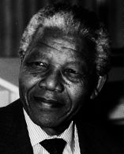

---
title:  'Influencia Social y Grupos'
author:
- name: Juan Muñoz
  affiliation: Universitat Autònoma de Barcelona
tags: [Resistencia, Desobediencia]
tema: "Resistencia"
url: "http:/juan.psicologiasocial.eu"
bibliography: diapos.bib
nocite: |
  @laboetie_discurso_2008
csl: apa.csl
lateral-menu: 'True'
...

##  <!-- Índice -->

<!-- >* Sesgo de conformismo
* Reactancia
* Identidad Social y Cambio social
* Desobediencia -->

[Bongo Kanny - Civil Disobedience](https://www.youtube.com/embed/qScsUOsh6qA?start=43;autoplay=1){target="_blank"}\
`https://youtu.be/qScsUOsh6qA?t=43`{.peque }

<!-- # Sesgo de conformismo { .center} -->

<!-- ## Sesgo de conformismo

\
@friend_puzzling_1990 -->

## Independencia y resistencia{#independencia-resistencia data-background="imagenes-obediencia/BrokenChain.jpg"   data-background-transition=zoom data-state=fondo .center}
>La lucha por la independencia y la resistencia a la usurpación son aspectos tan reales de las personas como la conformidad. Por lo tanto, es indebidamente limitado enfatizar la sumisión, el descuido de los poderes no despreciables que las personas demuestran en ocasiones para actuar de acuerdo a la convicción y elevándose por encima de la pasión del grupo.\
@asch_studies_1956 [, p. 3]

<!-- # Reactancia {data-background="imagenes-obediencia/AdanyEva.jpg"   data-background-transition=zoom data-state=fondo .center}

<!-- Adan y Eva, Rubens -->

<!-- ## -->
<!--  -->

<!-- # Identidad Social y Cambio Social { .center}

##

>"La resistencia es vista principalmente como un proceso de movilización de la identidad social que proporciona a los miembros del grupo una base para trabajar juntos para desafiar las fallas percibidas de un sistema social dado".\
@haslam_conformity_2011 [, p. 327] -->

<!-- ## El papel del liderazgo

>"En estos términos, la resistencia tendrá éxito en la medida en que los participantes se identifiquen más con la causa de su grupo que sus oponentes con la suya. Si bien esto debería ser cierto en general, cuando se trata de resistencia, este análisis descuida el papel de liderazgo activo que desempeñan los miembros individuales del grupo, tanto en el cultivo de un sentido compartido de identidad social como en la movilización de los miembros del grupo en torno a un conjunto específico de alternativas cognitivas.\
@haslam_conformity_2011 [, p. 337] -->

<!-- # Desobediencia {data-background="imagenes-obediencia/Desobediencia.png"   data-background-transition=zoom data-state=fondo .center} -->

## La banalidad del bien

. . .

{ height=200px }

{ height=200px }

{ height=200px }

{ height=200px }

## Desobediencia civil

. . .

>Creo que antes que súbditos tenemos que ser hombres. No es deseable cultivar respeto por la ley más de por lo que es correcto. La única obligación a la que tengo derecho de asumir es a la de hacer siempre lo que creo correcto.\
@thoreau_civil_2012

<!--
. . .

-->

## Desobediencia Civil

>(La desobediencia constituye un) acto público, no violento, consciente y político, contrario a la ley, cometido con el propósito de ocasionar un cambio en la ley o en los programas de gobierno.\
@rawls_theory_2005 [p. 364]

<!-- ##

  { height=350px }

  { height=350px }

::: notes
Parks being fingerprinted by Lieutenant D.H. Lackey on February 22, 1956, when she was arrested again, along with 73 other people, after a grand jury indicted 113 African Americans for organizing the Montgomery bus boycott

In 1963, President John F. Kennedy's administration ordered the U.S. Army's 2nd Infantry Division from Ft. Benning, Georgia to be prepared to enforce the racial integration of the University of Alabama in Tuscaloosa. In a vain attempt to halt the enrollment of black students Vivian Malone and James Hood, Governor Wallace stood in front of Foster Auditorium at the University of Alabama on June 11, 1963. This became known as the "Stand in the Schoolhouse Door" (Wikipedia: https://en.wikipedia.org/wiki/George_Wallace)
::: -->

## Legitimidad

<!--

>* Legitimidad del sistema en que reside la autoridad
* Legitimidad de la autoridad
* Legitimidad de las demandas

###### @passini_authority_2009

-->

. . .

OBEDIENCIA DESTRUCTIVA\
vs.\
DESOBEDIENCIA CONSTRUCTIVA

. . .

>Debemos temer más a la persona que obedece la ley que al que lo rompe.\
`Dwight Macdonald (1945)`{.autor}

## Desobediencia civil digital{#desobediencia-civil-digital}

  { height=225px }

  { height=225px }

  { height=225px }

# Referencias {.center}

## Referencias {.scrollable}
