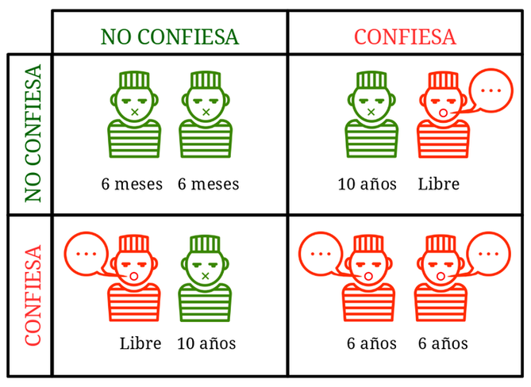

---
title:  'Influencia Social y Grupos'
author:
- name: Juan Muñoz
  affiliation: Universitat Autònoma de Barcelona
tags: [intercambio, dilema del prisionero, dilemas sociales]
tema: "Dilemas sociales
url: "http:/juan.psicologiasocial.eu"
bibliography: diapos.bib
csl: apa.csl
lateral-menu: 'True'
...

## Dilemas sociales

>Definimos los dilemas sociales como situaciones en las que una forma no cooperativa de actuación es (en ocasiones) tentadora para cada individuo porque produce mejores resultados para ella misma (a menudo a corto plazo), y si todos siguen esta forma no cooperativa de actuación, todos obtendrán (a menudo a largo plazo) peores resultados que si hubieran cooperado.\
`Lange, Balliet, Parks, & Vugt, 2014, p. 8`{.autor}

## Dilema del prisionero
>Dada la enorme recompensa ofrecida y el pleno perdón que se concede por toda declaración probatoria, no cabe imaginar un solo instante que algún miembro de una pandilla de miserables criminales —o de cualquier pandilla— no haya traicionado hace rato a sus cómplices. En una pandilla colocada en esa situación, cada uno de sus miembros no está tan ansioso de recompensa o de impunidad, como temeroso de ser traicionado. Se apresura a delatar lo antes posible, a fin de no ser delatado a su turno. \
`Edgard Allan Poe, El misterio de Marie Rogêt`{.autor}

## Dilema del prisionero {data-background="imagenes-prisionero/prision.jpg" data-background-transition=zoom}

## {data-background="imagenes-prisionero/kropotkin.jpg" data-background-transition=zoom}

>“Si preguntamos a la naturaleza, ¿Quiénes son los más aptos?, ¿son aquellos que se encuentran continuamente enzarzados en guerra mutua, o son aquellos que se sostienen mutuamente?, de inmediato vemos que aquellos animales que adquieren hábitos de ayuda mutua son indudablemente los más aptos. Tienen más probabilidades de sobrevivir y alcanzar, en sus clases respectivas, el mayor desarrollo de la inteligencia y organización corporal”.\
`Piotr Kropotkin (1842-1921), Apoyo Mutuo (1907)` {.autor}

## Graduated and Reciprocated Initiatives in Tension Reduction

un planteamiento de las relaciones internacionales desarrollado por Charles Osgood que tiene por finalidad reducir las tensiones mediante la reducción gradual de las tensiones mediante pequeños pasos y el fomento de la confianza

# Referencias

## {.scrollable}
