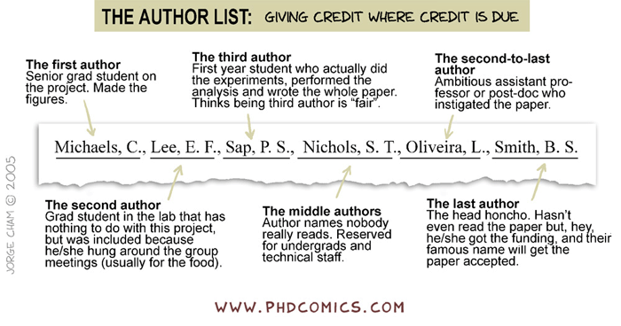
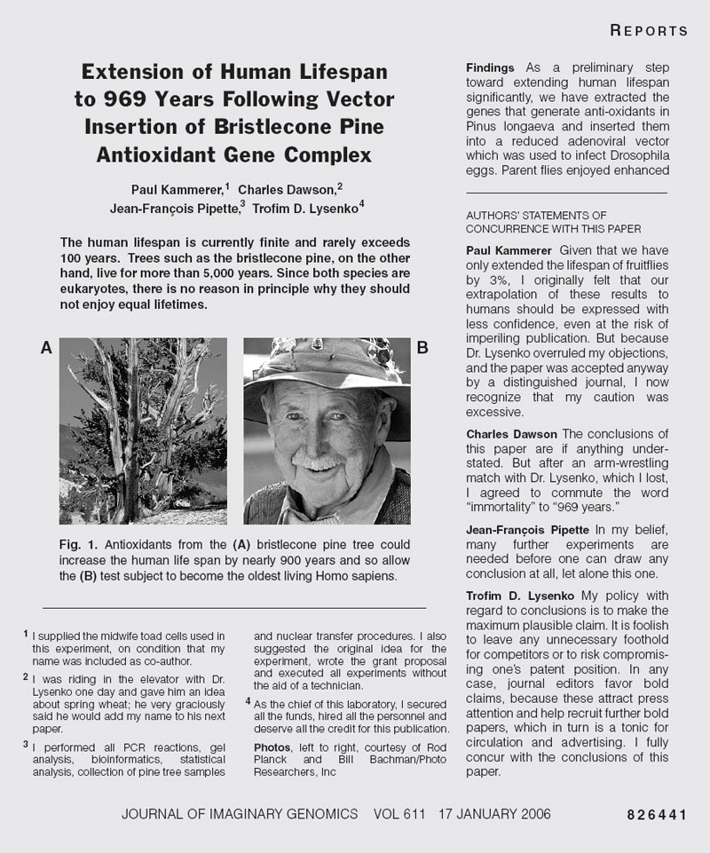

---
title:  'El Fraude científico'
author:
- name: Juan Muñoz
  affiliation: Universitat Autònoma de Barcelona
tags: [fraude, malas prácticas]
tema: ""
url: "http:/juan.psicologiasocial.eu"
bibliography: biblio-fraude.bib
csl: apa.csl
lateral-menu: 'True'
...

##

>La gran tragedia de la Ciencia es el asesinato de una bella hipótesis por un feo dato experimental.\
[Thomas Henry Huxley]{.autor}

::: notes
Thomas Henry Huxley PC, F.R.S. (Ealing, Londres, 4 de mayo de 1825 – Eastbourne, Inglaterra, 29 de junio de 1895) fue un biólogo británico, conocido como el Bulldog de Darwin por su defensa de la teoría de la evolución de Charles Darwin.
:::

## ¿Miente la ciencia? {#miente-la-ciencia data-background="imagenes-fraude/TribuKrippendorf.jpg" data-background-transition=fade data-state=fondo}

- Manuel Elizalde
- Paul Kammerer
- Charles Dawson
- Cyril Burt
- Hwang Woo-suk
- Diederik Stapel
- Carlos Lopez-Otín

##

>Los científicos  intrigan con fines políticos como cualquier Jesuita, y pueden ser tan arrogantes como cualquier médico controlando a sus subalternos. Pueden engañar a sus mujeres, mentir en sus declaraciones de renta, conducir borrachos, vivir por encima de sus posibilidades, pegar a sus hijos, y otras formas de comportamiento antisocial como cualquier otra persona cuando lo demanda la ocasión.\
[John Ziman, 1970 _Presidential Address to the British Association of Science_, en]{.autor} @sovacool-ExploringScientific-2008[,p .276]

<!-- >Scientists will intrigue for political ends like any Jesuit, and can be as lordly as any consultant physician in the control of their juniors. They can deceive their wives, fiddle their tax returns, drive drunkenly, live beyond their means, feed parking meters, beat their children, and other wise behave as antisocially as anyone else when the occasion demands.\
[John Ziman, 1970 Presidential Address to the British Association of Science]{.autor} -->

## Pequeñas desviaciones {#pequenas-desviaciones}

- Omitir citas bibliográficas
- Extensa lista bibliográfica
- Citas a colegas
- Citas a revista donde se quiere publicar
- Falsas co-autorías
- Explotación intelectual

##

<!-- http://phdcomics.com/comics/archive.php?comicid=562 -->
<!-- Honcho= jefe, mandamás -->

## Pequeñas desviaciones {#pequenas-desviaciones-2}

- Informes parciales respecto al método
- Manipulación estadística
- Eliminación de resultados negativos o dudosos
- Exageración relevancia

##

>Una de las tergiversaciones más comunes en el trabajo científico es el propio artículo científico. Presenta una reconstrucción mítica de lo que realmente sucedió. Todo lo que en retrospectiva son ideas erróneas, experimentos mal diseñados y cálculos incorrectos son omitidos. El artículo presenta la investigación como si hubiera sido cuidadosamente pensada, planificada y ejecutada de acuerdo a un proceso ordenado y riguroso, por ejemplo, que involucra la prueba de una hipótesis.\
@martin-Scientificfraud-1992[, p. 72]

<!-- Traducción realizada con el traductor www.DeepL.com/Translator
>One of the most common misrepresentations in scientific work is the scientific paper itself. It presents a mythical reconstruction of what actually happened. All of what are in retrospect mistaken ideas, badly designed experiments and incorrect calculations are omitted. The paper presents the research as if it had been carefully thought out, planned and executed according to a neat, rigorous process, for example involving testing of a hypothesis.\
@martin-Scientificfraud-1992[, p. 72]
 -->

## {.scrollable}

<!-- Nick Wade, New York Times, january 16, 2006
https://archive.nytimes.com/www.nytimes.com/imagepages/2006/01/16/science/20060117_FRAD_GRAPHIC.html -->

##

>En la actualidad, la ciencia se ve frenada principalmente por el número de puestos de investigación y la cantidad de fondos disponibles para la investigación. Lo que había sido una competición puramente intelectual se ha convertido en una intensa lucha por recursos escasos. A largo plazo, este cambio, que es permanente e irreversible, tendrá probablemente un efecto indeseable en el comportamiento ético de los científicos. Los casos de fraude científico serán casi con toda seguridad cada vez más frecuentes, al igual que otras formas de mala conducta científica.\
@goodstein-ScientificMisconduct-2002

<!-- >Science is now held back mainly by the number of research posts and the amount of research funds available. What had been a purely intellectual competition has become an intense struggle for scarce resources. In the long run, this change, which is permanent and irreversible, will probably have an undesirable effect on ethical behavior among scientists. Instances of scientific fraud will almost surely become more common, as will other forms of scientific misbehavior.\
@goodstein-ScientificMisconduct-2002 -->

# Referencias {.center}

## {.scrollable .peque}
