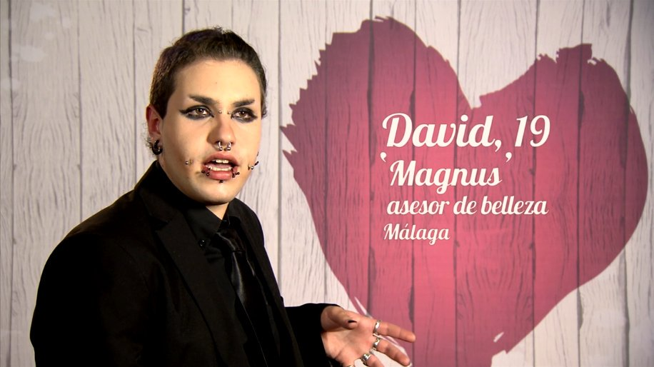

---
title:  'Gestión de impresiones'
author:
- name: Juan Muñoz
  affiliation: Universitat Autònoma de Barcelona
tags: [nothing, nothingness]
tema: "Influencia Social y Grupos"
url: "http:/juan.psicologiasocial.eu"
bibliography: diapos.bib
csl: apa.csl
lateral-menu: 'True'
...

##La perspectiva dramatúrgica
<video width="860" class="stretch" controls>
<source src="multimedia/ErvingGoffmanAndThePerformedSelf-sub.mp4" type="video/mp4">
</video>

## {data-background="imagenes-isg/Mascaras.jpg" data-background-transition=zoom data-state=fondo}

. . .

#### Autopresentación es cualquier conducta que intenta crear, modificar o mantener una imagen o impresión de nosotros mismos en los demás, que intenta hacer que los demás piensen sobre nosotros de una forma determinada. {.fondoblanco .transparencia}

#### Organizamos estratégicamente nuestra propia actuación, los escenarios en los que la orquestamos, y los equipamientos que nos apoyan  para crear una impresión de nosotros mismos para presentar a un público. {.fondoblanco .transparencia}

## {data-background="imagenes-isg/Mascaras.jpg" data-background-transition=zoom data-state=fondo}

## {data-background="imagenes-isg/Mascaras.jpg" data-background-transition=zoom data-state=fondo}

## Aprendiendo a actuar
<video width="860" class="stretch" controls>
<source src="multimedia/GranTorinoThaoPeluqueria.mp4" type="video/mp4">
</video>
`Gran Torino: Tao en la peluquería` {.autor}\
`http://www.dailymotion.com/video/x9i6tt`{.peque}

##El escenario {data-background="imagenes-isg/Backstage.jpg" data-background-transition=zoom data-state=fondo}

. . .

### El frente o la región visible para el público (fachada, imagen) tiene la función de ofrecer esta actuación al público {.fondoblanco .transparencia}

###El fondo o la región invisible para el público se utiliza para preparar la actuación de una rutina (rol) {.fondoblanco .transparencia}

##Cibereespacio {data-background="imagenes-isg/social-media-fakery.jpg" data-background-transition=zoom data-state=fondo}

## {data-background="imagenes-isg/face-save.jpg" data-background-transition=zoom data-state=fondo}

. . .

>En conjunto, las prácticas defensivas y protectivas comprenden las técnicas empleadas para salvaguardar la impresión fomentada por un individuo durante su presencia ante otros. (...) pocas impresiones sobrevivirían si aquellos que las reciben no lo hicieran con tacto.\
`Goffman, 1977, p. 22`{.autor}

<!--
>En conjunto, las prácticas defensivas y protectivas comprenden las técnicas empleadas para salvaguardar la impresión fomentada por un individuo durante su presencia ante otros. Se debería agregar que si bien podemos mostrarnos dispuestos a aceptar que ninguna impresión fomentada sobreviviría si no se empleasen las prácticas defensivas, estamos quizás menos dispuestos a ver cuán pocas impresiones sobrevivirían si aquellos que las reciben no lo hicieran con tacto\
`Goffman, 1977, p. 22`{.autor}
-->

## Actuaciones fallidas: "salvar la cara"

<video width="860" class="stretch" controls>
<source src="multimedia/PlayItAgainSamBlindDate.mp4" type="video/mp4">
</video>

`Sueños de un seductor - Allan intenta seducir a una mujer` {.autor}\
`https://www.youtube.com/watch?v=BTOqNc1AaIA` {.peque}

##El "auténtico" yo {data-background="imagenes-isg/NoFaceBehindMask.jpg" data-background-transition=zoom data-state=fondo}
