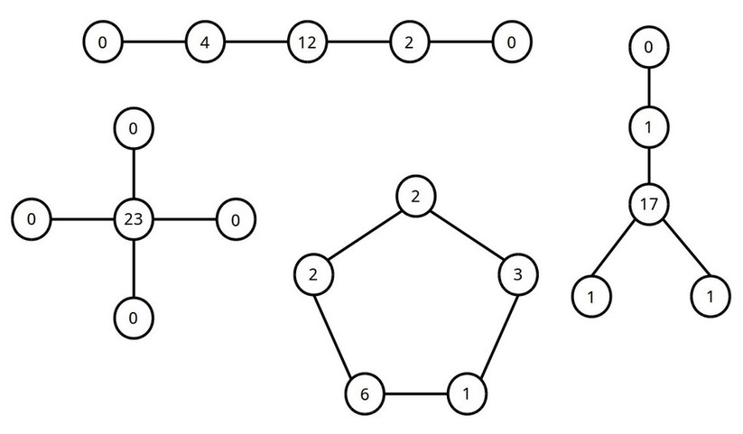
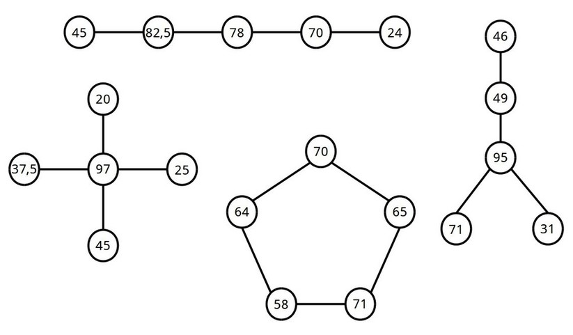
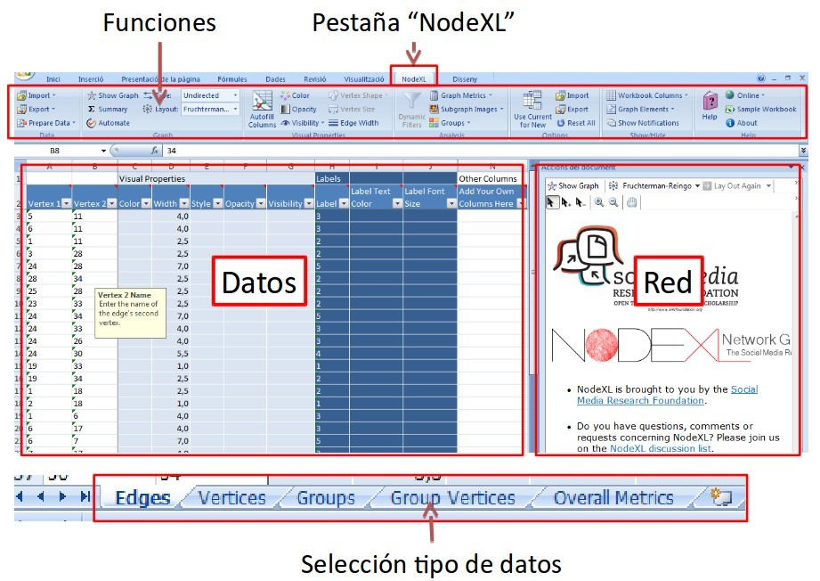
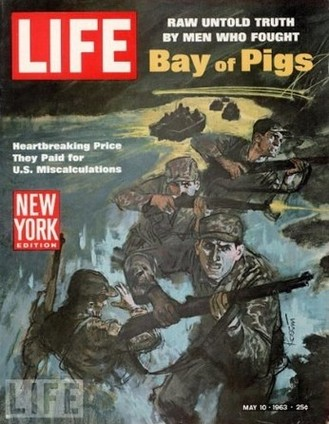
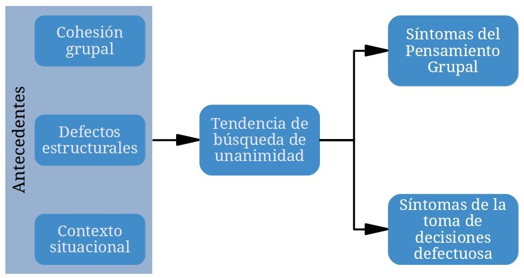

---
title:  'Los grupos en Psicología Social'
author:
- name: Juan Muñoz
  affiliation: Universitat Autònoma de Barcelona
tags: [nothing, nothingness]
tema: "Máster de Gestión de los Recursos Humanos en las Organizaciones"
url: "http:/juan.psicologiasocial.eu"
bibliography: diapos.bib
csl: apa.csl
...

# Concepto {.mitit .center}

##Elementos de definición

>* Satisfacción de motivos y necesidades
* Metas comunes
* Estructura
* Interacción
* Interdependencia
* Autocategorización
* Identidad Social

## Dos orientaciones: Individualista

>La mayor pesadilla de la psicología social es el injustificado énfasis puesto sobre el grupo. Nos hemos ocupado tanto hablando de tipos de grupos, intereses de grupo, conciencia de grupo y grado de solidaridad grupal que hemos olvidado que el locus de toda psicología, individual o social es el sistema neuromotor del individuo.\
`Floyd Allport, 1919`{.figcaption}

## Dos orientaciones: Grupal
* El todo, el grupo, es algo distinto de la suma de sus partes.
* El grupo posee sus propias metas y objetivos, su propia estructura, dinámica y fuerzas y define sus propias relaciones con otros grupos.
* Es un todo dinámico e interdependiente.
<!--
 de forma que una modificación en cualquiera de sus subpartes hace cambiar el estado y la situación de las otras.
-->

`Kurt Lewin`{.figcaption}

# Redes de comunicación {.mitit .center}

## Comunicación
>La comunicación es la base de toda interacción humana y del funcionamiento de todo grupo (…) La misma existencia del grupo depende de la comunicación, del intercambio de información y de la transmisión de significados (…)\
`Johnson y Johnson, 1997, p. 140`{.figcaption}

## {.references}

. . .

Bavelas, A. (1950-1951). Patrones de comunicación en grupos orientados a la tarea. En A.D.Cartwright. y A.Zander (Eds.). (1968). *Dinámica de grupos. Investigación y teoría*  (Pp. 548-557). México: Trillas.

Leavitt, H.J. (1951). Some effects of certain communication patterns on group performance. *Journal of Abnormal and Social Psychology*, 46: 38-50.

## Comunicación: Redes
>¿Podría ocurrir que entre varios patrones de comunicación —todos lógicamente adecuados a completar con éxito una tarea especificada— uno permitiera mejor ejecución que otro? ¿Qué efectos tendrá el patrón, como tal, sobre el surgimiento del liderazgo, el desarrollo de la organización y el grado de resistencia a la ruptura del grupo?\
`Bavelas, 1950`{.figcaption}

## Eficacia

## liderazgo

## Satisfacción con la tarea

## Efecto del tipo de tarea

|                  | Tareas simples  | Tareas complejas |
|:-----------------|:----------------|:-----------------|
| Menos mensajes   | Centralizada    | Centralizada     |
| Menos tiempo     | Centralizada    | Descentralizada  |
| Menos errores    | Centralizada    | Descentralizada  |
| Más satisfacción | Descentralizada | Descentralizada  |

## Conceptos explicativos

* Saturación
* Independencia

. . .

>En resumen, entonces, consideramos que la centralidad determina el comportamiento al limitar la independencia de acción, lo que produce diferencias en la actividad, la precisión, la satisfacción, el liderazgo y otras características de comportamiento.\
`Leavitt, 1951, p. 49`{.figcaption}

## Redes sociales

. . .

>La idea de red reside en el hecho de que cada individuo mantiene ligamenes con otros individuos, cada uno de los cuales está a su vez ligado a otros, y así sucesivamente.  La estructura relacional de un grupo (...) consiste en las pautas de relaciones entre los actores.\
`Rodríguez, 1995, p. 11`{.figcaption}

## Nodos y relaciones

**Nodos**

Personas

Ordenadores

Empresas

**Relaciones**

 Amistad

 Parentesco

 Colaboración

 Reconocimiento

 Intercambio

## Ejemplos

##

## Centralidad

Grado (Degree)

  : Número de nodos de los cuales un determinado nodo es adyacente, con los que está en contacto directo.

Cercanía (Closeness)

  : Suma de las distancias entre el nodo y cada uno de los otros nodos.

Intermediación (Betwenness)

  : Frecuencia con la que un punto está en el camino más corto entre otros pares de puntos.

Eigenvector

  : Grado en que un nodo está conectado con otros nodos con alto grado (bien conectados).

## Centralidad

## La fuerza de los lazos débiles

>Los lazos débiles proporcionan acceso a información y recursos que están más allá de los disponibles en los propios círculos sociales; pero los lazos fuertes tienen más motivación para proporcionar ayuda y normalmente están disponibles con más facilidad.\
`Granovetter, 1982/2003, p. 205`{.figcaption}

##

## El mundo es un pañuelo

[El oráculo de Bacon](http://www.oracleofbacon.org/)

# NodeXL {.mitit .center}

##
>* Descargar NodeXL (http://nodexl.codeplex.com/)
* Instalar
* Abrir el programa\
   a\) Inicio > Programas > NodeXL Excel Template\
   b\) “Doble clic” sobre un archivo de datos NodeXL
* Una vez abierto el programa, clicar sobre la pestaña (superior) NodeXL

##

#Pensamiento grupal {.mitit .center}

##Pensamiento grupal

>La tendencia de un grupo de toma de decisiones a buscar el consenso y evitar el examen crítico de las alternativas.

##Proceso

##La crisis de los misiles

##Evitar el pensamiento grupal

* El líder debe ser imparcial y no asumir ninguna posición a priori.
* Animar a una evaluación crítica de las alternativas.
* Asignar a algún miembro el papel de “abogado del diablo”.
* Trabajar en subgrupos para poder examinar diferencias entre ellos.
* Evitar técnicas que reduzcan el conflicto.

##

* Invitar a expertos ajenos al grupo para que cuestionen y desafíen los puntos de vista del grupo.
* Buscar, atender y fomentar la aparición de diferencias de opinión y desacuerdos en el grupo.
* No recurrir a estereotipos, soluciones prefabricadas, no utilizar argumentos de autoridad.
* Permitir que cada miembro del grupo exponga sus puntos de vista.
