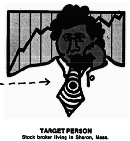

---
title:  'Los grupos en Psicología Social'
author:
- name: Juan Muñoz
  affiliation: Universitat Autònoma de Barcelona
tags: [Grupos, Influencia social, Redes sociales]
tema: "Máster de Gestión de los Recursos Humanos en las Organizaciones"
url: "http:/juan.psicologiasocial.eu"
bibliography: diapos.bib
csl: apa.csl
lateral-menu: 'True'
...

##Contenidos

>* Concepto
* Influencias
>     * Influencia informacional
>     * Influencia normativa
* Redes de comunicación
>     * ~~NodeXL~~

# Concepto { .center}

## Dos orientaciones: Individualista

>La mayor pesadilla de la psicología social es el injustificado énfasis puesto sobre el grupo. Nos hemos ocupado tanto hablando de tipos de grupos, intereses de grupo, conciencia de grupo y grado de solidaridad grupal que hemos olvidado que el locus de toda psicología, individual o social es el sistema neuromotor del individuo.\
@allport_behavior_1919 [298]

## Dos orientaciones: Grupal
* El todo, el grupo, es algo distinto de la suma de sus partes.
* El grupo posee sus propias metas y objetivos, su propia estructura, dinámica y fuerzas y define sus propias relaciones con otros grupos.
* Es un todo dinámico e interdependiente.

@lewin_field_1951

<!--
 de forma que una modificación en cualquiera de sus subpartes hace cambiar el estado y la situación de las otras.
-->

## ¿Qué es un grupo?##

. . .

##Elementos de definición

* Satisfacción de motivos y necesidades individuales
* Metas comunes
* Estructura
* Interacción
* Interdependencia
* Autocategorización e Identidad Social

<!--
## Definiciones
>La definición que parece más esencial es aquella según la cual un grupo es un conjunto de organismos en que la existencia de todos (...) es necesaria para la satisfacción de ciertas **necesidades individuales** de cada uno de ellos.\
`Cattell, 1951`{.figcaption}

>... son unidades compuestas por dos o más personas que entran en contacto para lograr un **objetivo**, y que consideran que dicho contacto es significativo.\
`Mills, 1967`{.figcaption}

##
>Un grupo es una unidad social que consiste en un número de individuos que tienen un  **estatus** (más o menos) definido y relaciones de **rol** entre ellos y que poseen un conjunto de valores o **normas** propias que regulan la conducta de los miembros individuales, al menos en temas que tengan consecuencias para el grupo.\
`Sherif & Sherif, 1956`{.figcaption}

>Un grupo es un número de personas en **interacción** entre ellas, y es este proceso de interacción que distingue el grupo de un agregado.\
`Bonner, 1959`{.figcaption}

##
>Por este término [grupo] generalmente entendemos un conjunto de individuos que comparten un destino común, es decir, que son **interdependientes** en el sentido de que un acontecimiento que afecta a un miembro es probable que afecte a todos.\ `Fiedler, 1967`{.figcaption}

>Un criterio es que las personas que interactúan se **definan** a sí mismas como miembros.\
`Merton, 1957`{.figcaption}

-->

## Definiciones: Identidad social
>Descriptivamente hablando, un grupo psicológico se define como uno que es **psicológicamente significativo** para los miembros, con el que se relacionan subjetivamente para la **comparación social** y la adquisición  de normas y valores... Que aceptan privadamente la membrecía, y que influye sobre sus actitudes y conducta.\
@turner_rediscovering_1987 [1]

<!--
##
>Las características de los individuos miembros del grupo contribuyen de modo considerable a la estructura del grupo. (...) la superioridad física, la inteligencia y las aptitudes vinculadas con la tarea correlacionan positivamente con la emergencia del liderazgo. Las personas que están orientadas positivamente hacia los demás contribuyen al desarrollo de la cohesión grupal. El individuo merecedor de confianza contribuye al logro del objetivo y es más probable que emerja como líder. Estas características de los miembros, y sin duda muchos otros aspectos contribuyen considerablemente al desarrollo de la estructura grupal
Shaw, ?, p. 278

>Considerar que la organización del grupo primario se debe fundamentalmente a la interacción entre sus miembros (como hace, p.ej. Homans 1963, 1974) constituye una forma de abstraerlo de su realidad histórica y social, negando así las fuerzas macrosociales que condicionan y determinan en buena medida su existencia y funcionamiento.
Martín-Baró, 1989, p.278

>Entitativity [is] the feeling of perception that a collection of indiviuals is a social group. (…) Therefore, we will define a social group as a collection of three or more individuals who are perceived, by themselves or others, to be a group.\
@stangor_social_2004 [24]

## Identidad social
>Aquella parte de nuestro autoconcepto que deriva de la pertenencia a grupos y del significado valorativo y emocional que ello conlleva.\
`Henry Tajfel`{.figcaption}

#Cohesión de grupo

-->

# Influencias { .center}

## Influencia
> Proceso a través del cual las personas o los grupos cambian los pensamientos, sentimientos, y conductas de otros.\
@stangor_social_2004 [p. 75]

* Influencia informativa
* Influencia normativa

##Influencia informativa

<!--
## El _efecto autocinético_ {data-background="imagenes-isg/autokinetic.jpg" data-background-transition=zoom data-state=fondo}

. . .

. . .

. . .

##Normalización

<object id="svg1"  data="imagenes-isg/Normalizacion.svg" type="image/svg+xml"></object>

######Desplazamiento en dirección de una posición intermedia

-->

##Teorías relacionadas: Comparación social

. . .

\
@bond_61-million-person_2012

##Teorías relacionadas: Ignorancia pluralista

. . .

>en ocasiones, la mayoría de los miembros de un grupo no están de acuerdo con una norma, creencia o modo de actuar del grupo, en su interior o de forma privada, pero cada uno de los sujetos cree –incorrectamente–, que todos o la mayoría de los miembros del grupo sí que están de acuerdo con esa norma, creencia o modo de actuar.\
@katz_students_1931

## {.peque}

<!--

>Yo formaba parte de un equipo técnico que se suponía iba a ofrecer soporte de producto en un nuevo producto. Cuando se definieron las funciones de todo el mundo, el grupo del proyecto se mostró muy firme sobre mantener el control del producto, a pesar de que no eran los que desarrollaron el concepto y lo demostró viable.\
Se negaron a ceder y lo más estúpido fue que tuvo que intervenir el director de ingeniería. Era como un montón de niños luchando.

En CHAPTER 9: Normative  Influences  in  Organizations Robert  B.  Cialdini; J.  Bator; Rosanna  E.
-->

>Estaba en una reunión Que se celebraba en la sala de conferencias principal cuando un compañero llegó tarde. Al sentarse en la silla más cercana a la entrada, fue informado por el gerente de que era la silla del vicepresidente (el respaldo era más alto que el de las demás sillas de la habitación).\
Ese hombre se sorprendió de lo absurdo de este comentario ya que el vicepresidente no estaba ni siquiera en la reunión, hasta que el director del departamento le dijo que encontrara otro asiento.

>Estábamos reunidos en un grupo para probar circuitos electrónicos. En la discusión fueron compartidas las ideas de todos, incluyendo la mía. A pesar de que yo era nuevo, querían saber lo que pensaba.

##Influencia normativa

>[Deutsh y Gerard] Entienden por influencia normativa la que se observa cuando el individuo se conforma con las expectativas positivas del otro (individuo o grupo), a fin de ganar de él una serie de refuerzos y sentimientos positivos, de establecer una solidaridad con él, y en definitiva no verse marginado y ridiculizado por él.\
@perez_influencia_1999 [p. 261]

##Influencia normativa

##Conformismo

<video width="400"  class="stretch" controls>
<source src="multimedia/classic-candid.mp4">
</video>
`Candid Camera: Elevator`{.figcaption}

###### <https://www.youtube.com/watch?v=BgRoiTWkBHU>

. . .

<!--
#Conformismo

>>Movimiento por parte de la(s) persona(s) discrepante(s) hacia la norma del grupo como una función de la presión social explícita o implícita de los miembros del grupo.
@Allen

##El experimento de Asch {data-background="imagenes-isg/asch-conformity.jpg" data-background-transition=zoom data-state=fondo}

. . .

##El experimento de Asch {data-background="imagenes-isg/asch-conformity.jpg" data-background-transition=zoom data-state=fondo}

##Resultados {data-background="imagenes-isg/asch-conformity.jpg" data-background-transition=zoom data-state=fondo}

>- Respuestas incorrectas: 36.8%
- Personas que nunca ceden: 24%
- Personas que siempre ceden: 5%
- Personas que ceden entre 8 y 12 veces: 27%

##Conformismo

<object id="svg1"  data="imagenes-isg/Conformismo.svg" type="image/svg+xml"></object>

######Desplazamiento en la dirección de la posición mayoritaria

##Conformismo: Factores

* Tamaño de la mayoría
* Contexto histórico y cultural
* Unanimidad
* Anonimato
* Relevancia de la tarea

##Tamaño de la mayoría

##Tamaño de la mayoría

<video width="420"  class="stretch" controls><source src="multimedia/Stanley Milgram - Conformity and Independence.mp4"></video>

###### <https://www.youtube.com/watch?v=P0e6zG8IbE8>

######@milgram_note_1969

##Tamaño de la mayoría

<object id="svg1"  data="imagenes-isg/TamañoMayoria.svg" type="image/svg+xml"></object>

  
  

##Relevancia de la tarea

##

##Relevancia de la tarea

> Los soldados enemigos se han apoderado de tu aldea. Tienen órdenes de matar a todos los civiles que quedan. Usted y algunos de sus conciudadanos han buscado refugio en el sótano de una gran casa. En el exterior se oyen las voces de los soldados que han llegado para registrarla en busca de objetos de valor.\
Tu bebé empieza a llorar a gritos. Le cubres la boca para amortiguar el sonido. Si quitas la mano de su boca, su llanto llamará la atención de los soldados que matarán a todas las personas escondidas en la bodega (incluyendo a tu hijo). La única solución para salvaros es asfixiarlo hasta la muerte.\
¿Es correcto matar a tu hijo para salvarte a ti mismo y al resto del pueblo?\
@kundu_morality_2013

##

##Normas en el "Bennington College" {data-background="imagenes-isg/Bennington.jpg" data-background-transition=zoom data-state=fondo}

-->

##"Miedo" a hablar

Pensamiento grupal

Espiral del silencio

##Pensamiento grupal

>La tendencia de un grupo de toma de decisiones a buscar el consenso y evitar el examen crítico de las alternativas.

. . .

. . .

##Bosque petrificado {.references}

Cialdini, R. B., Demaine, L. J., Sagarin, B. J., Barrett, D. W., Rhoads, K. v. L., & Winter, P. L. (2006). Managing social norms for persuasive impact. *Social Influence*, 1, 3–15.

##

##

<!--
##Proceso

##La crisis de los misiles

##Evitar el pensamiento grupal

* Comentar al grupo la existencia del pensamiento grupal.
* El líder debe ser imparcial y no asumir ninguna posición a priori.
* Animar a una evaluación crítica de las alternativas.
* Asignar a algún miembro el papel de “abogado del diablo”.
* Trabajar en subgrupos para poder examinar diferencias entre ellos.

##

* Invitar a expertos ajenos al grupo para que cuestionen y desafíen los puntos de vista del grupo.
* Buscar, atender y fomentar la aparición de diferencias de opinión y desacuerdos en el grupo.
* Evitar técnicas que reducen el conflicto.
* No recurrir a estereotipos, soluciones prefabricadas, utilizar argumentos de autoridad.
* Permitir que cada miembro del grupo exponga sus puntos de vista, escucharlos y recogerlos.

##

[Vaccination against the Groupthink 'Virus'](http://www.psysr.org/about/pubs_resources/groupthinkwelcome.htm)

-->
##

##Independencia

> La lucha por la independencia y la resistencia a la invasión son tan característicos de las personas como lo es la conformidad. En consecuencia, es una reducción exagerada destacar la sumisión, olvidándose de los nada despreciables poderes que muestran en ocasiones las personas para actuar de acuerdo con sus convicciones y elevarse por encima de la pasión del grupo.\
@asch_studies_1956 [p. 3]

`“The opposite of courage in our society is not cowardice, it is… conformity” `{.peque}

<audio controls>
<source src="multimedia/Insideinfo-Conformity.mp3#t=50" type="audio/mp3">
</audio>
`InsideInfo - Conformity`{.peque}

# Redes de comunicación { .center}

## Comunicación

>La comunicación es la base de toda interacción humana y del funcionamiento del grupo. Nuestra vida cotidiana está llena de una experiencia de comunicación tras otra. Es a través de la comunicación que interactúan los miembros del grupo, y una comunicación eficaz es un requisito previo para todos los aspectos de funcionamiento del grupo.
@johnson_joining_2014 [116]

##Ejercicio {.references}

. . .

Bavelas, A. (1950-1951). Patrones de comunicación en grupos orientados a la tarea. En A.D.Cartwright. y A.Zander (Eds.). (1968). *Dinámica de grupos. Investigación y teoría*  (Pp. 548-557). México: Trillas.

Leavitt, H.J. (1951). Some effects of certain communication patterns on group performance. *Journal of Abnormal and Social Psychology*, 46: 38-50.

## Comunicación: Redes
>¿Podría ocurrir que entre varios patrones de comunicación —todos lógicamente adecuados a completar con éxito una tarea especificada— uno permitiera mejor ejecución que otro? ¿Qué efectos tendrá el patrón, como tal, sobre el surgimiento del liderazgo, el desarrollo de la organización y el grado de resistencia a la ruptura del grupo?\
@bavelas_communication_1950 [726]

## Eficacia

## liderazgo

## Satisfacción con la tarea

## Efecto del tipo de tarea

|                  | Tareas simples  | Tareas complejas |
|:-----------------|:----------------|:-----------------|
| Menos mensajes   | Centralizada    | Centralizada     |
| Menos tiempo     | Centralizada    | Descentralizada  |
| Menos errores    | Centralizada    | Descentralizada  |
| Más satisfacción | Descentralizada | Descentralizada  |

## Conceptos explicativos

. . .

>En resumen, entonces, consideramos que la centralidad determina el comportamiento al limitar la independencia de acción, lo que produce diferencias en la actividad, la precisión, la satisfacción, el liderazgo y otras características de comportamiento.\
@leavitt_effects_1951 [49]

## Redes sociales

. . .

>La idea de red reside en el hecho de que cada individuo mantiene ligamenes con otros individuos, cada uno de los cuales está a su vez ligado a otros, y así sucesivamente.  La estructura relacional de un grupo (...) consiste en las pautas de relaciones entre los actores.\
@rodriguez_alisis_1995 [11]

## Nodos y relaciones

**Nodos**

Personas

Ordenadores

Empresas

**Relaciones**

 Amistad

 Parentesco

 Colaboración

 Reconocimiento

 Intercambio

## Ejemplo:

![@roethlisberger_management_1939 [507]](imagenes-grupos/ManagementAndTheWorkerNetwork.jpg)

## Ejemplo: Relaciones románticas
![@bearman_chains_2002 [58]](imagenes-grupos/RomanticRelationships.jpg)

## Centralidad

Grado (Degree)

  : Número de nodos de los cuales un determinado nodo es adyacente, con los que está en contacto directo.

Cercanía (Closeness)

  : Suma de las distancias entre el nodo y cada uno de los otros nodos.

Intermediación (Betwenness)

  : Frecuencia con la que un punto está en el camino más corto entre otros pares de puntos.

Eigenvector

  : Grado en que un nodo está conectado con otros nodos con alto grado (bien conectados).

## Centralidad
![@krackhardt_assessing_1990 [351]](imagenes-grupos/Red-centralidad.jpg)

<!--
##

Co-authorship network map of 8,500 doctors and scientists publishing on hepatitis C between 2008 and 2012 and the almost 60,000 co-authorship relationships between them. Photo via Andy Lamb: https://www.flickr.com/photos/speedoflife/8273922515/
-->

<!--
##Ejercicio
Crear carpeta en el escritorio: “Western Electric”
Copiar archivo: WESTERN-RDGAM
Abrir UCINET
File → Change Default Folder
Data → Display
Netdraw
Network → Centrality & power → Degree
Network → Centrality & power → Freeman...
Network → Subgroups → Cliques
-->

## La fuerza de los lazos débiles

. . .

>Los lazos débiles proporcionan acceso a información y recursos que están más allá de los disponibles en los propios círculos sociales; pero los lazos fuertes tienen más motivación para proporcionar ayuda y normalmente están disponibles con más facilidad.\
@granovetter_fuerza_2003 [205]

##

<!--
##Mundo pequeño
Gráfico Milgram
-->

## El mundo es un pañuelo

. . .

](imagenes-grupos/SixDegrees.jpg)

<!--
##

-->

<!--
# NodeXL { .center}

##
>* Descargar NodeXL
>     * (http://nodexl.codeplex.com/)
* Instalar
* Abrir el programa
>     * Inicio > Programas > NodeXL Excel Template\
>     * o “Doble clic” sobre un archivo de datos NodeXL
* Una vez abierto el programa, clicar sobre la pestaña (superior) NodeXL

##

-->

#Referencias

## {.scrollable}
