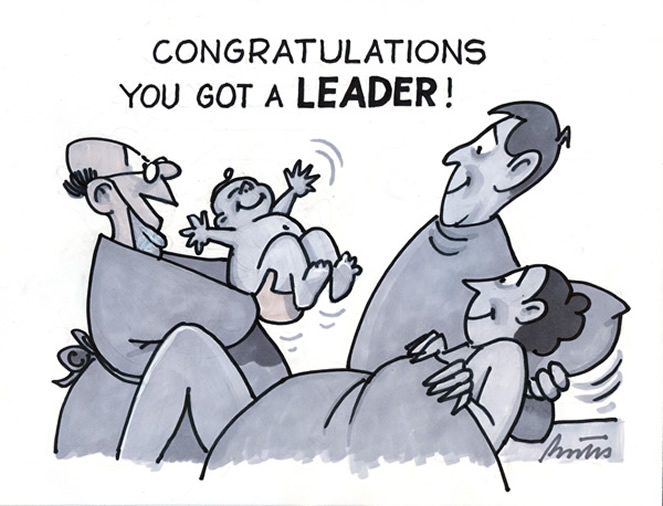
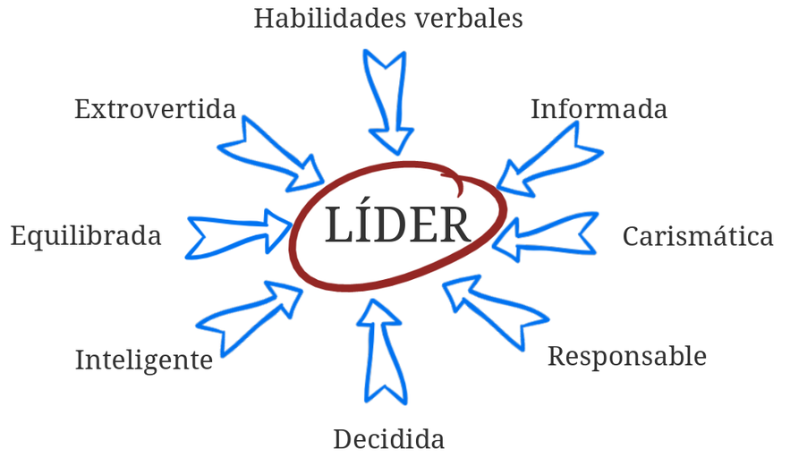
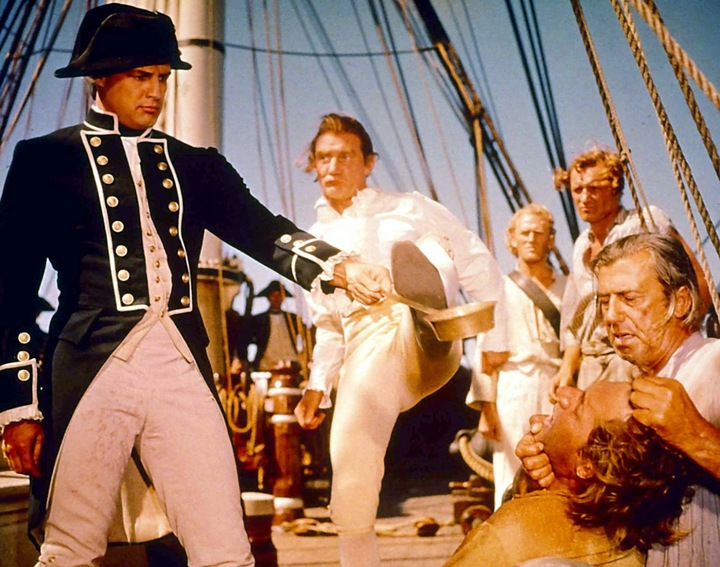
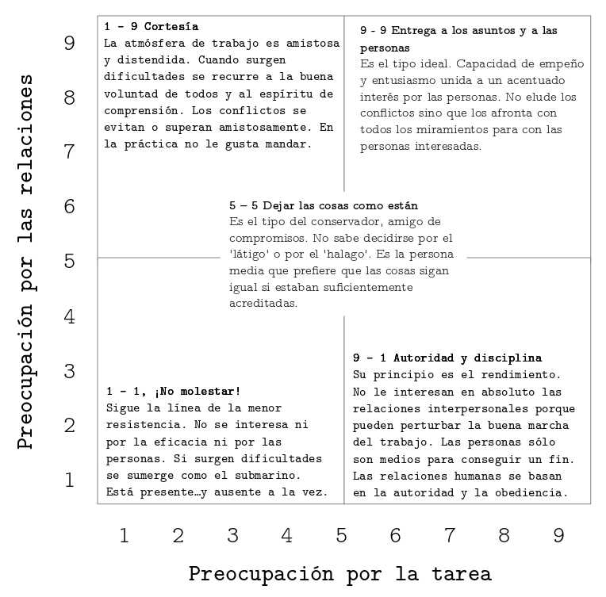

---
title:  'Liderazgo'
author:
- name: Juan Muñoz
  affiliation: Universitat Autònoma de Barcelona
tags: [nothing, nothingness]
tema: "Influencia Social y Grupos"
url: "http:/juan.psicologiasocial.eu"
bibliography: diapos.bib
csl: apa.csl
lateral-menu: 'True'
...

## Liderazgo {data-background="imagenes-liderazgo/MovePeopleToAction.jpg" data-background-transition=zoom data-state=fondo}

>Un proceso de influencia social mediante el que las personas consiguen y movilizan la ayuda de otras para la consecución de metas colectivas.\
`Chemers, 2001`{.autor}

<!-- ## ¿Quién puede ser líder? {#quien-puede-ser-lider data-background="imagenes-liderazgo/Lider-nacimiento.jpg" data-background-transition=zoom data-state=fondo}

>Desde el momento de su nacimiento algunas personas están marcadas para la servidumbre y otras para el mando.\
`Aristóteles`{.autor} -->

## Teoría rasgos

>[Desde el momento de su nacimiento algunas personas están marcadas para la servidumbre y otras para el mando.]{.peque}
`Aristóteles`{.autor}

{ width=45%}

## Rasgos Liderazgo

## Teorías implícitas {data-background="imagenes-liderazgo/Puzzle.jpg" data-background-transition=zoom data-state=fondo}
> Muchos miembros creen que sus líderes deben ser inteligentes, extrovertidos, masculinos, sensibles, dominantes, conservadores y equilibrados, de forma que esas serán las características que poseerán los líderes\
`Lord et al. 1986`{.autor}

## Teoría de la categorización del líder {data-background="imagenes-liderazgo/Lider.jpg" data-background-transition=zoom data-state=fondo}

> El líder es el miembro del grupo que es considerado como más prototípico del mismo (en términos de la teoría de la autocategorización)

## Estilos de liderazgo

<video width="860" class="stretch" controls>
  <source src="imagenes-liderazgo/EstilosDeLiderazgo.mp4" type="video/mp4">
</video>

[https://www.youtube.com/watch?v=xiUX7tuCUBI]{.figcaption}

<!-- ## Lewin, Lippit y White{.peque}

| Autoritatio                                                          | Democrático                                                                                        | _Laissez Faire_                                                                                   |
|:---------------------------------------------------------------------|:---------------------------------------------------------------------------------------------------|:--------------------------------------------------------------------------------------------------|
| Determina toda política                                              | Toda política es un tema de discusión y de decisión del grupo                                      | El grupo tiene completa libertad para decidir, con una mínima participación del líder             |
| Dicta las técnicas y los pasos de la actividad                       | Sugiere técnicas y estrategias que se discuten en el grupo                                         | El líder proporciona diferentes materiales, y aclara que dará información cuando se le pida       |
| Dicta el trabajo que se ha de hacer y designa el compañero           | Los miembros son libres de trabajar con quien quieran y se deja al grupo la división de las tareas | El líder no participa en absoluto                                                                 |
| Personalizar las alabanzas y las críticas al trabajo de cada miembro | Al elogiar o criticar, el líder es objetivo y se basa en los hechos                                | Pocas veces hace comentarios, refuerza o critica                                            | --> |

## Estilos de liderazgo: Efectos

* El líder [autoritario]{.fosforito} genera apatía y agresividad entre los miembros del grupo. Se produce un clima socioafectivo negativo y muy poca cohesión. En cuanto al trabajo o el rendimiento es bueno cuando el líder esta presente, pero decrece rápidamente en su ausencia.
* El liderazgo [democrático]{.fosforito} provoca en el grupo que el rendimiento sea elevado y estable, incluso cuando el líder esta ausente. Los miembros del grupo se sienten más satisfechos.
* El peor rendimiento lo tienen los grupos con un líder [liberal]{.fosforito}. Son grupos que se pueden calificar de activos improductivos y tienen un clima socioafectivo negativo.

## Tarea vs. relaciones

{width=600}

## Rejilla de liderazgo (Blake y Mouton)

{.noshadow width=550}

## Modelos interaccionistas {data-background="imagenes-liderazgo/Contingencia.png" data-background-transition=zoom data-state=fondo}

>El éxito de un líder no depende de sus características, ni del estilo que domine, sino de la interacción entre sus características y las de la situación.

## Visión romántica {#vision-romantica data-background="imagenes-liderazgo/wooden-mannequin.jpg" data-background-transition=zoom }

> Los "grandes líderes" son simplemente marionetas de fuerzas sociales que dan forma a los eventos y la historia, independientemente de quién ocupe puestos de liderazgo.
