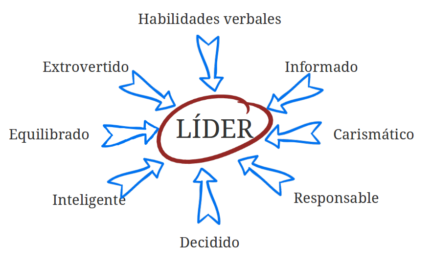
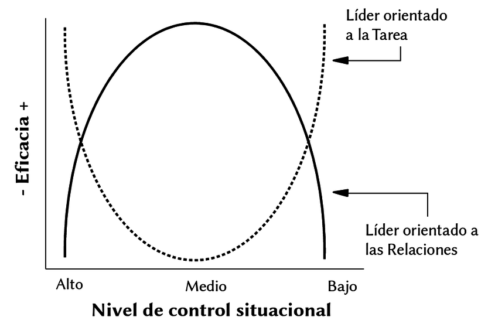

---
title:  'Influencia Social y Grupos'
author:
- name: Juan Muñoz
  affiliation: Universitat Autònoma de Barcelona
tags: [nothing, nothingness]
tema: "Liderazgo"
url: "http:/juan.psicologiasocial.eu"
bibliography: diapos.bib
csl: apa.csl
lateral-menu: 'True'
...

##Liderazgo {data-background="imagenes-isg/move-people-to-action.jpg" data-background-transition=zoom data-state=fondo}

>Un proceso de influencia social mediante el que las personas consiguen y movilizan la ayuda de otras para la consecución de metas colectivas.\
`Chemers, 2001` {.autor}

##¿Quién puede ser líder? {data-background="imagenes-isg/Lider-nacimiento.jpg" data-background-transition=zoom data-state=fondo}
>Desde el momento de su nacimiento algunas personas están marcadas para la servidumbre y otras para el mando.\
`Aristóteles` {.autor}

## Teoría rasgos

## Rasgos Liderazgo

## Teorías implícitas {data-background="imagenes-isg/Puzzle.jpg" data-background-transition=zoom data-state=fondo}
> Muchos miembros creen que sus líderes deben ser inteligentes, extrovertidos, masculinos, sensibles, dominantes, conservadores y equilibrados, de forma que esas serán las características que poseerán los líderes\
`Lord et al. 1986` {.autor}

## Teoría de la categorización del líder {data-background="imagenes-isg/lider.jpg" data-background-transition=zoom data-state=fondo}

> El líder es el miembro del grupo que es considerado como más prototípico del mismo (en términos de la teoría de la autocategorización)

## Estilos de liderazgo

<video width="860" class="stretch" controls>
  <source src="multimedia/EstilosDeLiderazgo.mp4" type="video/mp4">
</video>

## Tarea vs. relaciones

## Teoría de la contingencia: Fiedler

