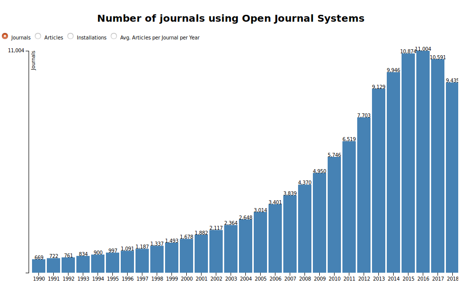
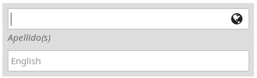
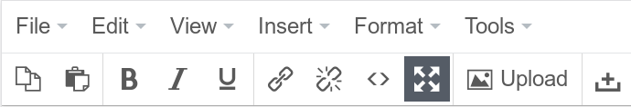
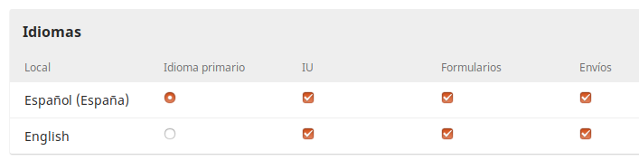
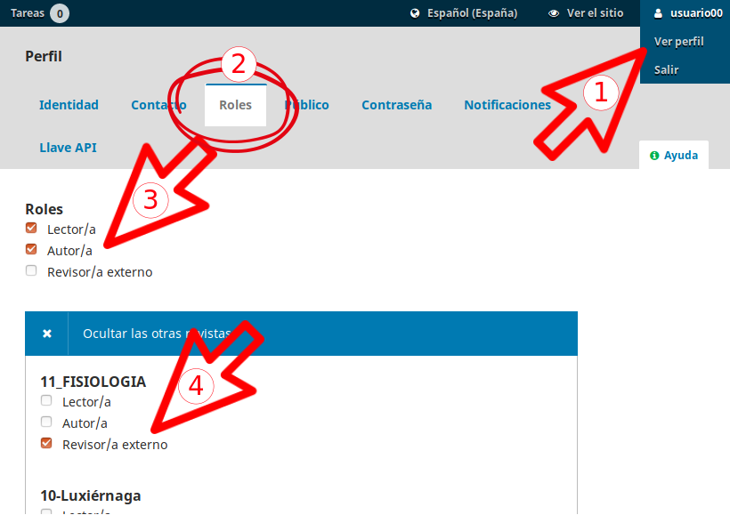

---
title:  'OJS-3'
author:
- name: Juan Muñoz y Marc Bria
  affiliation: Universitat Autònoma de Barcelona
tags: [OJS]
tema: ""
url: "http:/presentaciones.psicologiasocial.eu/OJS3.html"
bibliography: .bib
csl: apa.csl
lateral-menu: 'false'
...

#   {.center data-background="imagenes-ojs3/ojs-logo.png" }

## Sistemas de gestión de revistas electrónicas

:::nonincremental
- Gestionar un sitio web de una o varias revistas electrónicas.
- Permitir el registro y gestión de usuarios con distintos roles.
- Enviar y recibir originales para su publicación.
- Gestionar el proceso de revisión de originales.
- Llevar a cabo el proceso de edición y corrección de galeradas
- Publicar los artículos (en distintos formatos).
- Permitir la interoperabilidad con otros sistemas y estándares.
:::

##


##




## Mejoras en OJS 3

:::nonincremental
- Interfaz
- Flujo de trabajo
- Roles flexibles
- Acceso a funciones y tareas
- Discusiones editoriales
- Editor multilingüe
- Múltiples archivos por envío
:::

:::notes
- Interfaz personalizable y temas: ahora es posible separar el modo de visualización de la interfaz de lectura y la de administración de modo que, mientras la primera es perfectamente personalizable a través de plantillas y temas, la segunda permanece invariable, de manera que cualquier usuario de OJS 3 sabrá cómo manejarse independientemente de la revista en la que se encuentre. Además, gracias al uso de estos temas es posible que la interfaz se adapte al uso de distintos dispositivos y tamaños de pantalla.
- Flujo de trabajo: en esta nueva versión se compone de cuatro fases (propuesta, revisión, editorial y producción) y es posible saltar de uno a otro sin necesidad de completar todos los pasos. Del mismo modo, también hay flexibilidad respecto de la participación de personas y roles en las distintas fases.
- Roles: también pasan a ser más flexibles, pudiendo renombrar los títulos de estos, eliminar aquellos que no se van a usar, añadir otros nuevos que se adapten mejor a las necesidades de la revista u otorgar permisos adicionales a los ya existentes.
- Acceso flexible a funciones y tareas: sin necesidad de tener que cambiar de rol dentro de la interfaz de administración para atender tareas de diferentes roles. Así, en función de los roles y permisos, todas las opciones de trabajo aparecen disponibles y se puede cambiar de unas a otras de manera transparente.
- Registro simplificado: de modo que cualquier usuario puede participar en la revista, como lector, autor, revisor, etc. haciendo un registro simple, con unos pocos datos, que habrá de completarse solo si así se desea o si es solicitado por los editores.
- Discusiones editoriales: dentro de cada una de las fases del workflow se incrustan hilos de discusión en los que se mantiene comunicación con los implicados en cada una de ella y van quedando archivadas todas estas informaciones para su consulta.
- Editor de contenido enriquecido y edición multilingüe: OJS incluye un editor de contenido (para formularios, módulos, páginas, etc.) visual bajo la filosofía WYSIWYG que permite una edición de textos muy completa y enriquecida, permitiendo además la inserción de imágenes, enlaces, etc.). Como complemento además incorpora la opción de poder trabajar directamente con HTML, de manera que se puede insertar código para, por ejemplo, incrustar contenido de otros sitios web, o bien transformar el aspecto con el que se muestra el contenido incluido en cada apartado. Además es posible la edición multilingüe sin necesidad de cambiar de idioma.
:::

## Errores web de las revistas académicas

:::nonincremental
- Dar a los lectores una pobre experiencia de lectura
- No dar a los lectores una forma de seguir nuestro contenido en línea
- Navegación amigable en dispositivos móviles
:::

:::notes
- Navegar sólo a partir del índice de la revista. No disponer de forma de navegar por categorías ni de realizar búsquedas (por palabras clave)
- rss y lista de correo para informar de novedades
:::

<br>

[https://blog.scholasticahq.com/post/does-your-academic-journal-website-make-these-mistakes/](https://blog.scholasticahq.com/post/does-your-academic-journal-website-make-these-mistakes/){target="_blank"}

# OJS3: Interfaz {.center data-background="imagenes-ojs3/Interfaz.jpg" data-background-transition=zoom data-state=opacidad}

## {data-background="imagenes-ojs3/PantallaPrincipal.png" }

## {data-background="imagenes-ojs3/PanelControl.png" }

<!-- ##


##

 -->

# Configuración {.center data-background="imagenes-ojs3/configuracion.jpg" data-background-transition=fade data-state=opacidad}

## Revistas UAA


[http://ojs3.uaa.mx](http://ojs3.uaa.mx){.big target="_blank"}


## Edición multilingüe



<script src="https://code.iconify.design/1/1.0.3/iconify.min.js"></script>
:::::: {.columns}
::: {.column width="33%"}
<span class="iconify" data-icon="fa-solid:globe-americas" data-inline="false" data-width="128" data-height="128" style="color: #00b24e;"></span>

Información completa
:::
::: {.column width="33%"}
<span class="iconify" data-icon="fa-solid:globe-americas" data-inline="false" data-width="128" data-height="128" style="color: #d00a6c;"></span>

Falta traducción
:::
::: {.column width="33%"}
<span class="iconify" data-icon="fa-solid:globe-americas" data-inline="false" data-width="128" data-height="128" style="color: #222;"></span>

Sin información
:::
::::::

<!-- ##


##


##


##


##


##


##


##


##

 -->

## Ajustes


## Editor


## Editor



## Roles editoriales {#roles-editoriales}

[Roles en OJS3](imagenes-ojs3/OJS3-roles.pdf){.medium target="_blank"}

<hr />

Algunas ideas

[www.mdpi.com/editors](http://www.mdpi.com/editors){.medium target="_blank"}

[elsevier.com/es-mx/editors](http://elsevier.com/es-mx/editors){.medium target="_blank"}


<!--
##

```
<a href="#EditoresSeccion">Editores Sección</a>
...
...
<a name="EditoresSeccion">Editores Sección</a>
``` -->

<!-- ##

```
<ul>
<li><a href="#editores">Editores</a></li>
<li><a href="#EditoresSeccion">Editores Sección</a></li>
<li><a href="#ConsejoEditorial">Consejo  editorial</a></li>
</ul>
<h1><a name="editores"></a>Editores</h1>
<p>Nombre editor 1 <a href="mailto:direccion.correo@nomail.mx">direccion.correo@nomail.mx</a></p>
<p>Nombre editor 2 <a href="mailto:direccion.correo@nomail.mx">direccion.correo@nomail.mx</a></p>
<h1><a name="EditoresSeccion"></a>Editores Sección</h1>
<p>Nombre editor sección 1</p>
<p>Nombre editor sección 2</p>
<p>Nombre editor sección 3</p>
<h1><a name="ConsejoEditorial"></a>Consejo editorial</h1>
<p>Nombre consejo editorial 1</p>
<p>Nombre consejo editorial 2</p>
<p>Nombre consejo editorial 3</p>
<p>Nombre consejo editorial 4</p>
``` -->

## Idiomas



## Formularios de revisión {#formularios-revision}

[Cómo crear un formulario de revisión efectivo](https://blog.scholasticahq.com/post/how-to-create-effective-peer-review-feedback-form/){.medium target="_blank"}

## Usuarios y roles {#usuarios-roles}


## Crear Usuarios

>- Editor##
- EditorSeccionArt##
- CorrectorMaquetador##

En todos, correo electrónico editor##@nomail.mx

## Crear nuevos roles

::: nonincremental
- "Usuario" > Salir
- http://ojs.uaa.mx
- Seleccionar revista##
- Registrarse como usuario##
  - Utilizar correo real no utilizado hasta el momento
- "Usuario" > Ver perfil
  - Roles
  - Seleccionar "Autor"
- "Registrarse en otra revista"
  - Como revisor externo en revista##
:::

##




##


:::::: {.columns}
::: {.column width="20%"}
{target="_blank"}](imagenes-ojs3/logo-pkp-vert.png)

:::
::: {.column width="80%"}

{target="_blank"}](imagenes-ojs3/logo-pkp-school.png)

<br>

{target="_blank"}](imagenes-ojs3/logo-pkp-docs.png)

<br>

{target="_blank"}](imagenes-ojs3/logo-pkp-forum.png)
:::
::::::

##

 https://pkp.sfu.ca/ojs/

 https://pkpschool.sfu.ca/

 https://docs.pkp.sfu.ca/#appojs3

 https://forum.pkp.sfu.ca/

# Indexación {#indexacion .center data-background="imagenes-ojs3/indexing.jpg" data-background-transition=fade data-state=opacidad}


## Diferentes métricas {#diferentes-metricas}

[Metrics toolkit](https://www.metrics-toolkit.org){target="_blank"}

https://www.metrics-toolkit.org/

## Conceptos

:::nonincremental
Portales
: Plataformas de acceso a un conjunto de revistas (p.ej. portal revistas aguascalientes)
Bases de datos
: Contienen registros bibliográficos: referencias bibliográficas, resúmenes, palabras clave, etc. Pueden incluir el texto completo de los contenidos o enlaces al texto completo.
Índices
: Base de datos que contiene registros bibliográficos con algún valor agregado (por ejemplo, el cumplimiento de cierto tipo de requisitos y criterios). P.ej. Latindex.
:::

## Pasos (1)

:::nonincremental
- Motores de búsqueda primarios
  - Google [https://www.google.com/webmasters/](https://www.google.com/webmasters/){target="_blank"}
- Motores de búsqueda académicos
  - Google Scholar [https://scholar.google.com/intl/en/scholar/inclusion.html](https://scholar.google.com/intl/en/scholar/inclusion.html){target="_blank"}
  - Microsoft Academic [https://academic.microsoft.com/FAQ](https://academic.microsoft.com/FAQ){target="_blank"}
:::

## Pasos (y 2)

:::nonincremental
- Índices académicos generales
  - DOAJ
  - EBSCO - Fuente Académica
  - Dialnet
  - Latindex
  - Redalyc
  - Scielo
  - Scopus
  - Web of Science
- Específicos de disciplina

[https://en.wikipedia.org/wiki/List_of_academic_databases_and_search_engines](https://en.wikipedia.org/wiki/List_of_academic_databases_and_search_engines){target="_blank"}

:::

## Cómo tener éxito {#como-tener-exito}

>"The success of a journal is based on adherence to publication ethics, reputation of editorial board, transparent editorial policies, quality of peer review and the number of citations"\
[https://twitter.com/fake_journals/status/1155146590174269441?s=09](https://twitter.com/fake_journals/status/1155146590174269441?s=09){.autor target="_blank"}

## Las claves

{.noshadow .noborder}

##

[Pla d'indexació. Revistes científiques de la UAB ](https://ddd.uab.cat/record/165798?ln=ca){.medium target="_blank"}

##

¡Hasta luego!
