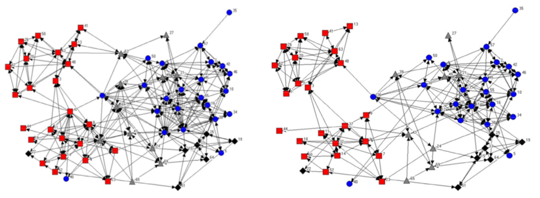
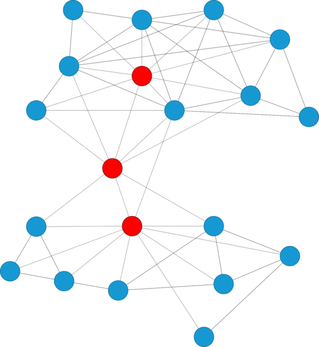

---
title:  'Organizational Network Analysis'
author:
- name: Juan Muñoz
  affiliation: Universitat Autònoma de Barcelona
tags: [Comunicación, Redes sociales]
tema: "Aspectos Psicosociales..."
url: "http:/juan.psicologiasocial.eu"
bibliography: biblio-ONA.bib
csl: apa.csl
lateral-menu: 'True'
...

## El Análisis de Redes Sociales {#comunicacion-redes data-background="imagenes-ONA/red-comunicacion.jpg" data-background-transition=zoom data-state=fondo}

>La idea de red reside en el hecho de que cada individuo mantiene ligamenes con otros individuos, cada uno de los cuales está a su vez ligado a otros, y así sucesivamente.  La estructura relacional de un grupo (...) consiste en las pautas de relaciones entre los actores.\
@rodriguez_alisis_1995 [11]

##

>La estructura de relaciones entre actores y la ubicación en la red de actores individuales tiene importantes consecuencias conductuales, perceptivas y actitudinales tanto para las unidades individuales como para el sistema en su conjunto.\
@knoke_network_1982 [13]

## Orígenes: J.L. Moreno

![ @moreno_who_1934 [p, 36]](imagenes-ONA/Moreno-01.png)

::: notes
¿Con quién quieres sentarte?
Estructura de la clase de 2º grado.
Triángulos chicos, círculos chicas.
:::

## Redes de comunicación

## El mundo es un pañuelo

## Western Electric

![ @roethlisberger_management_1939 [p. 507]](imagenes-ONA/ManagementAndTheWorkerNetwork.png)

::: notes
I = Inspector
W = Wiremen
S = Soldier

De mayor a menor jerarquía
:::

## Nodos y relaciones {data-background="imagenes-ONA/red.png" data-background-transition=zoom }

::: nonincremental

- **Nodos**
  - Personas
  - Ordenadores
  - Empresas
  - Aeropuertos

:::

::: nonincremental

- **Relaciones**
  - Amistad
  - Parentesco
  - Colaboración
  - Reconocimiento
  - Intercambio

:::

::: notes
* Relaciones entre personas
** Parentesco: madre de, esposo de
** Roles: jefa de, profesor de, amigo de
** Cognitivo-perceptual: conoce...
** Afectivo: le gusta, confía
** Interacción: da consejo, habla con, compite con, tiene relaciones sexuales con
** Afiliación: pertenece a mismo club, está cerca físicamente

* Relaciones entre organizaciones
** Como entidades corporativas: compra, vende, alquila subcontrata, posee acciones, filial de, alianza con, acuerdo comercial con...
** A través de sus miembros: amistad personal, consejo de administración...
:::

##  {#relaciones-romanticas data-background="imagenes-ONA/RomanticRelationships.jpg" data-transition=fade}

<!-- ![Relaciones románticas @bearman_chains_2002 [58]](imagenes-redes-com/RomanticRelationships-2.png){width=90%} -->

## {#coautorias data-background="imagenes-ONA/Coautorias.jpg"}

<!--  -->

::: notes
Co-authorship network map of 8,500 doctors and scientists publishing on hepatitis C between 2008 and 2012 and the almost 60,000 co-authorship relationships between them. Photo via Andy Lamb:
https://www.flickr.com/photos/speedoflife/8273922515/
:::

##  {data-background="imagenes-ONA/airports-world-network.png" data-background-transition=zoom}

#### @grandjean_connected_2016{.peque}

<!-- http://www.martingrandjean.ch/wp-content/uploads/2016/05/airports-map.png -->

## ¿Qué es?

>ONA consiste en el uso del análisis de redes sociales (SNA) para comprender e intervenir en los fenómenos organizativos. Se diferencia de las otras herramientas existentes en que se centra y analiza las interacciones entre los actores, los recursos que transitan dentro de estas interacciones y la estructura social formada por estas interacciones".\
@ribeiro_social_2017 [243-244]

## Descubrir la estructura oculta

>Si la organización formal es el esqueleto de una empresa, la informal es el sistema nervioso central que impulsa los procesos de pensamiento colectivo, las acciones y las reacciones de sus unidades de negocio.\
@krackhardt_informal_1993[104]

## Capital social

## Centralidad {.medio}

Grado (Degree)
:   Número de nodos de los cuales un determinado nodo es adyacente, con los que está en contacto directo.
Cercanía (Closeness)
:   Suma de las distancias entre el nodo y cada uno de los otros nodos.
Intermediación (Betwenness)
: Frecuencia con la que un punto está en el camino más corto entre otros pares de puntos.
Vector propio (Eigenvector)
: Grado en que un nodo está conectado con otros nodos con alto grado (bien conectados).

## Centralidad

#### @krackhardt_assessing_1990 [351]{.peque}

## Roles

##

##

## Escuelas secundaria holandesas

## La fuerza de los lazos débiles

<!-- 

>Los lazos débiles proporcionan acceso a información y recursos que están más allá de los disponibles en los propios círculos sociales; pero los lazos fuertes tienen más motivación para proporcionar ayuda y normalmente están disponibles con más facilidad.\
@granovetter_fuerza_2003 [205]

 -->

## Desvinculación

##

##

## Inclusividad

##

##

<!-- ##

##
 -->

<!-- ## Ramco

##

##

##

##

##

 -->

## Ética {#etica}

::: nonincremental
- Anonimato
- Datos perdidos
- Participación voluntaria
- Tipo de preguntas relacionales
:::

 

###### @borgatti_ethical_2003 {.figcaption}

##

  
  
  

<!-- ##

 -->

# Referencias {.center}

## {.scrollable .peque}
