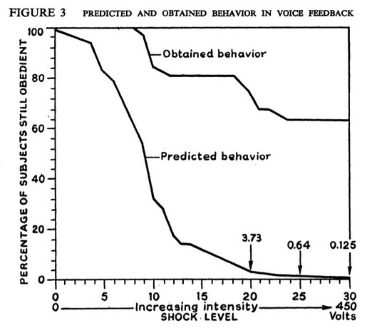
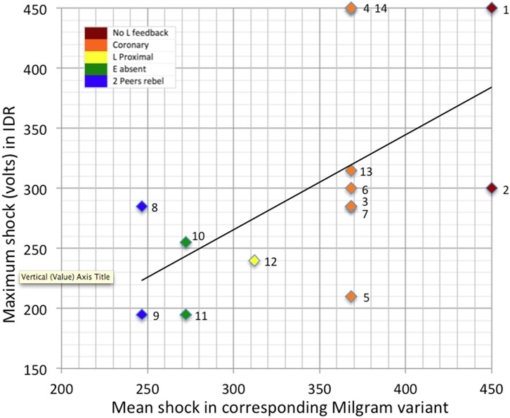

---
title:  'Influencia Social y Grupos'
author:
- name: Juan Muñoz
  affiliation: Universitat Autònoma de Barcelona
tags: [Obediencia, Milgram]
tema: "Obediencia a la autoridad"
url: "http:/juan.psicologiasocial.eu"
csl: apa.csl
lateral-menu: 'True'
...


## El "inspector" Milgram {#inspector-milgram}

<video class="stretch" controls><source src="multimedia/LeyYOrden.mp4"></video>

`Authority - Law & Order: Special Victims Unit (Temporada 9, episodio 17)`{.figcaption}

##### [https://en.wikipedia.org/wiki/Authority_(Law_%26_Order:_Special_Victims_Unit)](https://en.wikipedia.org/wiki/Authority_(Law_%26_Order:_Special_Victims_Unit)) {.peque}

## Índice

>* Introducción
* La banalidad del mal
* Milgram
* Críticas
* Milgram en el S. XXI

<hr>

[The obedience song](https://www.youtube.com/watch?v=KKMSg_8aMoo)\
`https://www.youtube.com/watch?v=KKMSg_8aMoo`{.peque}

# Introducción { .center}

## Obediencia {data-background="imagenes-isg/abraham-sacrifice-caravaggio.jpg" data-background-transition=zoom data-state=fondo}

. . .

> (...) deberíamos saber que el instinto de sumisión, un ardiente deseo de obedecer y de ser dominado por un hombre fuerte, es por lo menos tan prominente en la psicología humana como el deseo de poder, y, políticamente, resulta quizá más relevante.\
@arendt_sobre_1969 [p. 54]

## Holocausto{data-background="imagenes-isg/abraham-sacrifice-caravaggio.jpg"   data-background-transition=zoom data-state=fondo}

<div id="column1" style="float:left; margin:0; width:50%;">


</div>

<div id="column1" style="float:left; margin:0; width:50%;">


</div>

## Otras matanzas{data-background="imagenes-isg/abraham-sacrifice-caravaggio.jpg"   data-background-transition=zoom data-state=fondo}

<div id="column1" style="float:left; margin:0; width:50%;">


</div>

<div id="column1" style="float:left; margin:0; width:50%;">


</div>

<div id="column1" style="float:left; margin:0; width:50%;">


</div>

<div id="column1" style="float:left; margin:0; width:50%;">

</div>

## Abu Ghraib (Irak, 2004) {data-background="imagenes-isg/abraham-sacrifice-caravaggio.jpg"   data-background-transition=zoom data-state=fondo}

<div id="column1" style="float:left; margin:0; width:50%;">


</div>

<div id="column1" style="float:left; margin:0; width:50%;">


</div>

<div id="column1" style="float:left; margin:0; width:50%;">


</div>

<div id="column1" style="float:left; margin:0; width:50%;">


</div>

# La banalidad del mal { .center}

## Disposicional vs. situacional

> No pocas veces no es tanto el tipo de persona que es un hombre en concreto, cuanto más bien el tipo de situación en la que se encuentra, el que determina cómo va a actuar.\
@milgram_obediencia_1974 [p. 194]


## La prisión de Stanford


<div id="column1" style="float:left; margin:0; width:33%;">


</div>

<div id="column2" style="float:left; margin:0; width:67%;">

>Las malas acciones rara vez son el producto de gente malvada que actúan por motivos malvados, sino que son el producto de buenos burócratas simplemente haciendo su trabajo\
@zimbardo_obedience_1974 [p. 566]


[https://www.youtube.com/watch?v=ilzeRaO2TUw](https://www.youtube.com/watch?v=ilzeRaO2TUw)
`Redes 54: La pendiente resbaladiza de la maldad`{.figcaption}
</div>


## Batallón 101 {data-background="imagenes-isg/Batallon101.jpg"   data-background-transition=zoom data-state=fondo}

. . .

<div id="column2" style="float:left; margin-top:150px; width:50%;">


</div>

. . .

<div id="column1" style="float:left; margin-top:150px; width:50%;">


##### @arendt_eichmann_1963 {.fondo}


</div>

# Stanley Milgram { .center}

## El experimento {data-background="imagenes-isg/Milgram-maquina.jpg"   data-background-transition=zoom data-state=fondo}

<div id="column1" style="float:left; margin:0; width:50%;">


</div>

<div id="column2" style="float:left; margin:0; width:50%;">


</div>

<!-- ## "Réplica" Derren Brown

<video width="800"  class="stretch" controls>
<source src="multimedia/Milgram-Experiment-Brown.mp4">
</video>

`Derren Brown: The Heist, 2006`{.figcaption}

###### <http://www.youtube.com/watch?v=iUFN1eX2s6Q> -->

<!--

## Reacciones del cómplice

|   Nivel | Reacción                                                                                                                |
|--------:|:------------------------------------------------------------------------------------------------------------------------|
|      75 | Pequeño quejido                                                                                                         |
|  90-120 | Verbaliza que están siendo dolorosas                                                                                    |
|     135 | Gemidos dolorosos                                                                                                       |
| **150** | **“Experimentador, ¡sáqueme de aquí!, ¡no quiero seguir ni un instante más en el experimento!”**                        |
|     270 | Grito muy doloroso                                                                                                      |
| **300** | **Grita desesperadamente que no dará más respuestas**                                                                   |
|     315 | Alarido violento e insistencia en que no quiere continuar. No responde, pero se queja “agónicamente” tras cada descarga |
| **330** | **Ausencia total de reacciones**                                                                                        |

-->
<!--
##Predicciones de psiquiatras

\
@milgram_conditions_1965 [, p. 73]

-->


## Resultados: Niveles de obediencia {#resultados}


<!-- # La explicación de Milgram { .center} -->

## Explicación: El _Estado Agéntico_ {#explicacion}

>“[el estado agéntico es] la condición en que se encuentra una persona cuando se considera a sí misma como un [agente]{.fosforito} que ejecuta los deseos de otra persona. Este término será empleado en oposición al de [autonomía]{.fosforito}, es decir, cuando una persona se considera a sí misma como actuando por propia iniciativa."\
@milgram_obediencia_1974 [p. 127]

<!-- ## El proceso de la obediencia


## Legitimidad de la autoridad

\
@hofling_experimental_1966 -->

## El proceso de la obediencia


<!-- ## Consecuencias


```{.left}
O = Obediencia
D = Desobediencia
B = Factores mantenedores
s = tensión
r = resolución de la tensión
``` -->

# Críticas { .center}

## Tipos de críticas {#tipos-criticas}

::: nonincremental
* Ética
   * Daño participantes
   * Engaño - Consentimiento informado
   * Derecho a retirarse
   * Debriefing
* Metodológica
  - Validez interna
  - Validez externa
* Teórica
:::

<!-- ## Críticas: Ética {#critica-etica}

>* Daño a los participantes [>>>](#mal-participantes)
* Engaño - Consentimiento informado
* Derecho a retirarse
* Debriefing -->

## Daño a los participantes {#mal-participantes}


>[Un observador relató:] Observé un hombre de negocios maduro e inicialmente equilibrado entrar en el laboratorio sonriente y confiado. [A los 20 minutos se vio reducido a una ruina tartamudeante, que se acercaba rápidamente a un punto de colapso nervioso]{.fosforito}. Constantemente se estiraba el lóbulo de la oreja, y se retorcía las manos. En un momento, puso su puño en la frente y murmuró: "Oh, Dios, vamos a parar". Y sin embargo, siguió respondiendo a cada palabra del experimentador, y obedeció hasta el final.\
@milgram_obediencia_1974  [p. 377]


<!-- >Por desgracia, el sujeto no siempre es tratado con el respeto que se merece. Se ha convertido en algo común en los estudios de laboratorio sociopsicológicos manipular, avergonzar e incomodar a los sujetos. A veces, el insulto a la sensibilidad de los sujetos se extiende al lector de la revista cuando se presentan los resultados. El estudio de Milgram (1963) es un ejemplo de ello.\
@baumrind_thoughts_1964 [p. 422] -->

## Engaño {#enganyo}

>El observador usó un prisma periscópico incrustado en una pila de libros tirados en el suelo del retrete. Un espacio de 11 pulgadas (28 cm.) entre el suelo  y la pared del retrete proporcionó una vista, a través del periscopio, de la parte inferior del torso del usuario y posibilitó observaciones visuales directas del chorro de orina. (p. 544)\

#### Middlemist, R. D., Knowles, E. S., & Matter, C. F. (1976). Personal space invasions in the lavatory: Suggestive evidence for arousal. _Journal of Personality and Social Psychology_, _33_(5), 541-546.{.autor}

## Debriefing

Sujeto 711: “El experimento me produjo tal efecto que pasé toda la noche con sudores fríos y pesadillas por el miedo de haber podido matar al hombre allí sentado.”

Sujeto 829: “Estuve considerablemente afectado durante unos días después del experimento. Me habría ayudado si me hubieran dicho la verdad justo después.”

Sujeto 623: "Cuestiono seriamente la sensatez y la ética de no desengañar a cada sujeto inmediatamente después de la sesión..... Permitir que los sujetos permanezcan engañados no está justificado, en mi opinión, incluso si se considerara necesario continuar el engaño' para evitar la contaminación'"

<!-- (Perry, 2013). -->

<!--

## Otras posibles citas de crítica a la ética

>Lo detesto, como detesto los experimentos de Zimbardo. Estos experimentos son tan viles, la intención con la que se han planificado es tan vil, que nada en ellos presenta ningún valor. . . Están en la línea de los experimentos con humanos de los nazis .. . . Habiendo sido una de las personas con las que experimentaron, no puedo ver ningún mérito en estos experimentos. Milgram y Zimbardo los realizaron para promover su propio progreso profesional.

Bettelheim, 1978

>El mismo Milgram fue involuntariamente la víctima moral de la “autoridad de la ciencia”, al igual que lo era su temática. Siriviendo la autoridad de la ciencia bajo la bandera de la “objetividad”, él mismo, infligió dolor a otros en busca del mayor bienestar social. . . Milgram fracasó en tratar a sus participantes como personas (…) al igual que la mayoría de sus sujetos fracasaron en tratar a la víctima como una persona

Kohlberg, 1974, p. 607

-->

## Metodológica {#metodologica}

Validez externa [>>](#generalizacion)
:    Posibilidad de que los resultados de la investigación sean generalizables más allá de la investigación en la que se han realizado (entorno, muestra...)

Validez interna
:    Los resultados obtenidos son debidos única y exclusivamente a las manipulaciones experimentales realizadas


## Generalización {#generalizacion}

>Yo diría, sobre la base de haber observado un millar de personas en el experimento y de mi propia intuición formada e informada por estos experimentos, que si se instalara en los Estados Unidos un sistema de campos de exterminio, del tipo de los que hemos visto en la Alemania Nazi, seriamos capaces de encontrar suficiente personal para esos campos en cualquier ciudad Americana de tamaño medio.\
[Milgram, 1979, citado por @blass_milgram_1999, pp. 955-956]

[<<](#resultados)

## Críticas: Teórica {#critica-teorica}

* Obediencia a la autoridad legítima\
vs.\ Confianza en un experto.
* Identificación con experimentador\
vs. identificación con alumno.

## Inicio de la desobediencia

<div id="column1" style="float:left; margin:0; width:50%;">


</div>

<div id="column1" style="float:left; margin:0; width:50%;">


</div>


# ¿Obediencia en el siglo XXI? { .center}

## Réplicas recientes: Jerry Burger {#burger}

. . .

| Condición                 | Hombres | Mujeres |
|:--------------------------|--------:|--------:|
| Nueva condición Base (5)  |    66,7 |    72,7 |
| Modelo no obediente (~17) |    54,5 |    68,4 |

`Porcentaje de personas que continúan hasta 150v.`{.figcaption}

. . .

>Mi réplica parcial del procedimiento de Milgram sugiere que el Americano medio reacciona hoy en día a esta situación de laboratorio de forma muy parecida a la que lo hacía hace 45 años... los mismos factores situacionales que afectaban a la obediencia en los participantes de Milgram, todavía operan hoy en día.\
@burger_replicating_2009 [p. 8]

<!--

##
<video class="stretch" controls><source src="multimedia/LeJeuDeLaMort.mp4"></video>

`Le Jeu de la Mort, 2009`{.figcaption}

###### <https://www.youtube.com/watch?v=Bzk3INSQFGU>

-->

## Réplicas recientes: Beauvois {#beauvois}

. . .

\
@beauvois_prescriptive_2012

## Beauvios: ¿El final de la autoridad? {#beauvois-fin-autoridad}

>Lo que encontramos aquí en el estudio de televisión es que la obediencia sigue siendo una realidad, en un momento en que muchos autores consideran que nuestras sociedades están evolucionando hacia una mayor permisividad, hacia más poderes "negociados", e incluso hacia el final de la autoridad por completo (…) Nuestras observaciones, como las de Burger, justifican por lo menos un cierto escepticismo sobre  tesis como la del final de la autoridad.\
@beauvois_prescriptive_2012 [p. 119]


## Réplicas recientes: Immersive Digital Realism

\
@haslam_shock_2015

# Referencias {.center}

## Referencias {.scrollable .peque}
