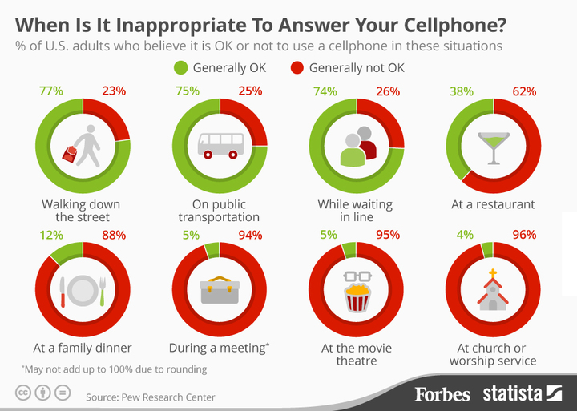

---
title:  'Influencia Social y Grupos'
tema: 'Caso práctico 1: Rompiendo normas'
author:
- name: Juan Muñoz
  affiliation: Universitat Autònoma de Barcelona
url: "http:/juan.psicologiasocial.eu"
...

##Contenido sesiones

>* El diario de campo
* Las normas sociales

. . .

>* Elección y descripción norma
* Elaboración guión
* Escenificación
* Informe

##El informe

* **Fecha de entrega: 26 de octubre**
* Parte grupal: 70% calificación
* Parte individual: 30% calificación
* Total: 10% asignatura

##El diario de campo

> Un diario de campo consiste en un relato en primera persona en que, por escrito y mediante entradas regulares y sinceras, se consignan la evolución y desarrollo (avances y retrocesos) que el/la investigador/a advierte durante el proceso de investigación.

##La problematización

> La problematitzación consiste en no aceptar, por mucho que nos resulte indudable, como obvios,  previsibles  y evidentes los modos de hacer y los acontecimientos que observamos. (...) es necesario convertir lo que resulta conocido en desconocido e interrogarlo como si fuese la primera vez que lo contemplamos.

<!--
> La problematitzación consiste en no aceptar, por mucho que nos resulte indudable, como obvios,  previsibles  y evidentes los modos de hacer y los acontecimientos que observamos. Se trata de que, ante cualquier cosa circunstancia o evento que se observe, adoptemos una actitud de sorpresa, como si no lo hubiésemos presenciado o percibido nunca. Para decirlo sintéticamente, es necesario convertir lo que resulta conocido en desconocido e interrogarlo como si fuese la primera vez que lo contemplamos.
-->

##Las normas sociales

> Les normes socials es poden considerar les obligacions que tenen les persones en una situació, però també les expectatives que aquestes persones tenen sobre quin serà el comportament de les altres persones i sobre el seu mateix comportament.\
(Feliu 2003, p. 263)

. . .

[The urinal game](http://gamescene.com/The_Urinal_Game.html)

##

##

## Interiorización

> Aunque en algunos casos las personas pueden obedecerlas simplemente para evitar sanciones o para parecer agradables, cuando interiorizan una norma se convierte en una parte de su sistema de valores; por lo tanto, a menudo las personas siguen las normas, no debido a la presión externa, sino porque la acción normativa es personalmente satisfactoria. (...) Las personas que violan las normas que aceptan se condenan a sí mismos, y experimentan una serie de consecuencias emocionales negativas tales como vergüenza, culpa y remordimiento (Elster, 1989).\
(Manstead, 1995, p. 413)

##

<video width="420"  class="stretch" controls><source src="cp1/The.Big.Bang.Reciprocity.mp4"></video>

The Big Bang Theory (5x24)

##

## ¿Rupturas de normas sociales?

<video width="420"  class="stretch" controls><source src="cp1/01-ShoppingCart.mp4"></video>

<video width="420"  class="stretch" controls><source src="cp1/04-ViolatingPersonalSpace.mp4"></video>

<video width="420"  class="stretch" controls><source src="cp1/02-Twister.mp4"></video>

<video width="420"  class="stretch" controls><source src="cp1/03-Piropos.mp4"></video>

##Referencias {.references}

Crum, M. (2014, julio 3). ASU professor encourages students to defy body hair norms. Recuperado a partir de https://asunews.asu.edu/20140703-body-shaving

Feliu, J. (2003). Influència, conformitat i obediència. Les paradoxes de l’individu social. In T. Ibáñez Gracia (Ed.), _Introducció a la psicologia social._ (1a. ed. en llengua catalana, pp. 251–366). Barcelona: UOC.

Forsyth, Donelson R., D. R. (1995). Norms. En A. Manstead (Ed.), _The Blackwell encyclopedia of social psychology_ (pp. 412-417). Cambridge,  Mass.: Blackwell.

Rainie, L., & Zickuhr, K. (2014). Americans’ Views on Mobile Etiquette. Pew Research Center. Recuperado a partir de http://www.pewinternet.org/2015/08/26/americans-views-on-mobile-etiquette/
