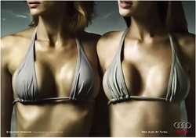

---
title:  'Influencia Social y Grupos'
tema: 'Caso práctico 2: Publicidad sexista'
author:
- name: Juan Muñoz
  affiliation: Universitat Autònoma de Barcelona
url: "http:/juan.psicologiasocial.eu"
index: false
...

##D&G 2007

##Cervezas

<video width="420"  class="stretch" controls><source src="cp2/CervezaBrahma.mp4"></video>

<video width="420"  class="stretch" controls><source src="cp2/CervezaGuinness.mp4"></video>

##Perfumes

<video class="stretch" controls><source src="cp2/1Million-PacoRabanne.mp4"></video>
`1Million-PacoRabanne` {.figcaption}

##Axe: Excite

<video width="420"  class="stretch" controls><source src="cp2/03-Axe-Excite.mp4"></video>

`Premio a la efectividad creativa 2012 (Cannes)`{.figcaption}

##El sistema sexo-género

<video class="stretch" controls><source src="cp2/AlwaysLikeAGirl.mp4"></video>

##

##The codes of gender

<video width="420"  class="stretch" controls><source src="cp2/TheCodesOfGender-sub-l.mp4"></video>

##Cosificación: Muestra únicamente partes del cuerpo

[Caroline Heldman](http://carolineheldman.me/2012/07/02/sexual-objectification-part-1-what-is-it/)

##

##Cosificación: Soporte para objetos

##Cosificación: Persona sexualizada intercambiable

##Cosificación: Persona vejada y humillada

[http://www.stopfemaledeathinadvertising.com/](http://www.stopfemaledeathinadvertising.com/)

##Cosificación: Disponibilidad sexual como característica

##Cosificación: Cuerpo como lienzo

##Qué hay que hacer

* Definir un **emisor**
* Determinar **qué**
* Decidir **a quién**
* Crear un **eslogan**
* Elaborar **mensaje**

##

##

<!--
##

-->

##

##¿Ridículo?

<video width="420"  class="stretch" controls><source src="cp2/RolesIntercambiados.mp4"></video>

##

##El informe

* **Fecha de entrega: 21 de noviembre**
* Parte grupal: 70% calificación
* Parte individual: 30% calificación
* Total: 10% asignatura
