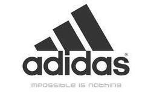

---
title:  'Influencia Social y Grupos'
tema: 'Caso práctico 2: Publicidad sexista'
author:
- name: Juan Muñoz
  affiliation: Universitat Autònoma de Barcelona
url: "http:/juan.psicologiasocial.eu"
index: false
...

## Objetivo {#objetivo}

  

### Diseñar un anuncio publicitario que desacredite la publicidad sexista. {.center}

## El informe {#informe}

>* **Fecha de entrega: 19 de noviembre**
* Parte grupal: 70% calificación
* Parte individual: 30% calificación
* Total: 12.5% asignatura

##

## D&G 2007

<!-- ## Cervezas

<video width="420"  class="stretch" controls><source src="imagenes-cp2/CervezaBrahma.mp4"></video>

<video width="420"  class="stretch" controls><source src="imagenes-cp2/CervezaGuinness.mp4"></video>

 -->

## Perfumes

<video class="stretch" controls><source src="imagenes-cp2/1Million-PacoRabanne.mp4"></video>
`1Million-PacoRabanne`{.figcaption}

<!-- ## Axe: Excite

<video width="420"  class="stretch" controls><source src="imagenes-cp2/03-Axe-Excite.mp4"></video>

`Premio a la efectividad creativa 2012 (Cannes)`{.figcaption} -->

<!-- ## El sistema sexo-género {#sistema-sexo-genero}

<video class="stretch" controls><source src="imagenes-cp2/AlwaysLikeAGirl.mp4"></video> -->

## The codes of gender

<video width="420"  class="stretch" controls><source src="imagenes-cp2/TheCodesOfGender-sub-l.mp4"></video>

## Cosificación: Muestra únicamente partes del cuerpo {#cosificacion-partes-cuerpo}

[Caroline Heldman](http://carolineheldman.me/2012/07/02/sexual-objectification-part-1-what-is-it/)

<!-- ##

<!--
 -->

## Cosificación: Soporte para objetos {#cosificacion-soporte}

<!-- 

 -->
<video width="600"  class="stretch" controls><source src="imagenes-cp2/CervezaGuinness.mp4"></video>

## Cosificación: Persona sexualizada intercambiable {#cosificacion-intercambiable}

## Cosificación: Persona vejada y humillada {#cosificacion-vejada}

[http://www.stopfemaledeathinadvertising.com/](http://www.stopfemaledeathinadvertising.com/)

## Cosificación: Disponibilidad sexual {#cosificacion-disponibilidad}

## Cosificación: Cuerpo como lienzo {#cosificacion-lienzo}

## Qué hay que hacer {#que-hacer}

>* Definir un **emisor**
* Determinar **qué**
* Decidir **a quién**
* Crear un **eslogan**
* Elaborar **mensaje**

. . .

<!-- ## Eslogan

 -->

<!--
##

-->

## Eslogan

{.noshadow .noborder}

## ¿Ridículo? {#ridiculo}

<video width="420"  class="stretch" controls><source src="imagenes-cp2/RolesIntercambiados.mp4"></video>

## Contrapublicidad

##

