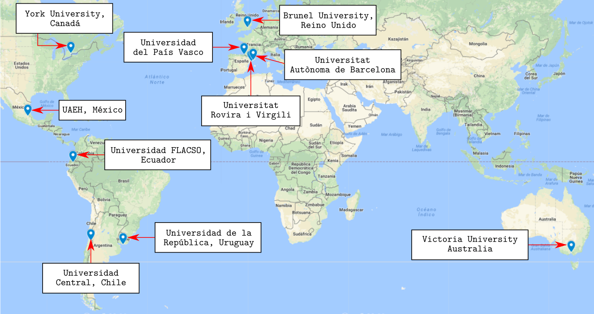

---
title:  'Proyecto de Investigación'
subtitle: 'Políticas, culturas y prácticas de cuidados de la población joven: una exploración cualitativa en espacios urbanos de los estados de Chile, México, España y Uruguay. '
author:
- name: Luz Mª Martínez
  affiliation: Departament de Psicologia Social
  email: Universitat Autònoma de Barcelona
tema: "marzo 2018"
lateral-menu: true
imagen-fondo: 'imagenes/columnas-4.jpg'
...

# Metainvestigación de contexto {#metainvestigacion .center}

##

Proyecto marco
: Integración de las perspectivas feministas en los procesos de investigación: una colaboración internacional para repensar e innovar los aspectos metodológicos en las ciencias sociales.
: Propuesta internacional para promover perspectivas feministas y de interseccionalidad de género en los procesos de investigación.

##

Objetivos principales (entre otros)
: Fortalecimiento de redes de intercambio de conocimiento, tanto nacionales como internacionales,
: Consolidación de un marco sistematizado de conocimientos transdisciplinarios y centrados en el género, que supongan, desde la diversidad de vinculaciones en que se generan, calidad y excelencia en la investigación internacional.

<!-- ”Integrating feminist criticalities throughout research process: an international collaboration to enhance methodological rigour in the social sciences” -->

## Mediante

- Foros de debate y talleres para la colaboración y consolidación de conocimientos entre la academia y la sociedad civil.
- Red de colaboración que busca la heterogeneidad de sus miembros y la diversidad disciplinaria sobre algunas preocupaciones metodológicas centrales sensibles al género.
- Producción de recursos educativos, compartir los conocimientos producidos de forma libre y amplia.

## Perspectivas de enfoque {#perspectivas}

- Interseccionalidad de género.
- Conocimiento dialógico y relacional, de horizontalidad, respeto al individuo y sus experiencias vitales.
- Conocimiento situado.
- Sensibilidad al contexto y sus necesidades en la redefinición de procesos de investigación.
- Producción de prácticas de refracción y de reflexión, en tres tipologías de actividad:
  - Investigación.
  - Aprendizaje mutuo.
  - Intercambio y divulgación de materiales.

::: notes
- Interseccionalidad de género.
- Conocimiento dialógico y relacional, de horizontalidad, respeto al individuo y sus experiencias vitales.
- Conocimiento situado (conexiones parciales, conversaciones compartidas en la epistemología y conexiones –solidaridad- en la política, Haraway, 2004).
- Sensibilidad al contexto y sus necesidades en la redefinición de procesos de investigación.
- Producción de prácticas de refracción (interacciones, interferencias, refuerzos, diferencias) y de reflexión, en 3 tipologías de actividad:
  - Investigación,
  - Aprendizaje mutuo
  - Intercambio y divulgación de materiales.
:::

## Participantes

<!--
## Participantes

- Red de diez centros universitarios:
  - Tres universidades del estado español (URV, UPV/EHU y UAB, integrantes del seminario SIMReF),
  - Universidad de Brunel, Reino Unido,
  - Universidad Central, Chile,
  - Universidad de Victoria, Australia,
  - Universidad FLACSO, Ecuador,
  - Universidad de York, Canadá,
  - UAEH, México
  - Universidad de la República, Uruguay. -->

##

Déficit de publicaciones en lengua castellana.

La posibilidad de trabajar con asociaciones u organizaciones no gubernamentales es una de las orientaciones para el desarrollo de la red.

## Áreas temáticas de trabajo {#areas-trabajo}

- Violencia.
- Política y política cotidiana.
- Pedagogía crítica.
- Embodiment o materializaciones.

::: notes
- Violencia (violencia relacionada con el género, conflictos sociales, violencia simbólica)
- Política y política cotidiana (movimientos sociales, análisis crítico de políticas públicas, articulaciones sociales, prácticas de cuidados, etc…)
- Pedagogía crítica (educación informal, pedagogía feminista, teatro de los oprimidos, arte),
- Embodiment o materializaciones (cuerpo, materialidad, condiciones físicas, transgresión, monstruosidades, ciborgs…)
:::

## Antecedentes y planteamiento del problema de la investigación {#antecedentes}

- Problemática encuadrada en la temática de políticas cotidianas.
- Atraviesa la realidad de distintos países.
- Cambios, reorganizaciones, tensiones.
- Crisis de cuidados, relevancia social.
- Necesidad de revisar los modelos genéricos de relación (en crisis).
- Resultados de nuestra investigación anterior (entrevistas grupales).

##
- Jóvenes de 18 a 25 años (universitarias/os, ambos sexos):
  - Gestión de lo doméstico centrada en figuras de madre y femeninas.
  - Sofisticación analítica y descriptiva para su poca participación en el trabajo de cuidados.
  - Si cuestionamiento de la ausencia de la figura paterna en la ejecución de tareas.
  - Argumentos individualizadores: preferir, gustar, saber.

##

- Jóvenes de 25 a 35 años:
  - Imposivilidad mutua de definirse fuera de la co-participación (y las evidencias lo contradicen)
- Colectivo de personas socializadas en la igualdad y contemporáneo de muchas investigadoras.
- Se decidió indagar, en las localizaciones de un equipo en diáspora.

## Contextos e idiosincrasias locales

- Cuatro países de la red, de tradición familiar en el cuidado.
- Diferencias en políticas publicas formales e informales.
  - México
  - Chile
  - Uruguay
  - España

::: notes
- Cuatro países de la red, de tradición familiar en el cuidado.
- Diferencias en políticas publicas formales e informales.
  - México: inciativas políticas de corte asistencial, aunque flutúantes; modelo familiar con estreotipos y presiones de mercado, pero con normalización de rupturas (Hernández, 2015).
  - Chile: políticas neoliberales, reducción de la intervención estatal, acceso a servicios por mercado, altas tasas de desigualdad y pobreza, con aumento de la brecha sexual.
  - Uruguay: modelo de protección más avanzado, régimen de bienestar intermedio, cuidados incorporados a la agenda pública en 2015, SNIC, implica extender la protección y ver el cuidado como problema social con necesidad de respuestas colectivas.
  - España: Iniciativas legislativas (Dependencia, Conciliación) desvirtuadas por las respuestas políticas a la situación de crisis económica, externalización, etnificación, sobrecarga femenina; algunas corporaciones locales trabajan hacia el cambio de paradigma (política de cuidados de ciudad, cambios de espacios y tiempos).
:::

## Pregunta de investigación y enfoque del estudio {#pregunta}

>**Pregunta guía**: ¿qué aspectos de las formas de comprender, gestionar  y ejecutar el cuidado (circunscribiendo su  acepción a las prácticas domésticas y de atención de personas vinculadas al hogar) permiten experiencias satisfactorias o, por el contrario, producen malestar y reducción de equidad y calidad de vida en las personas jóvenes que lo realizan y/o lo disfrutan?

## Pregunta de investigación y enfoque del estudio {#enfoque}
- Enfoque psicosocial, centralidad de la dimensión simbólica.
- Comprensión interseccional de género, construcción y reconstrucción en las prácticas cotidianas.
- Relación del cuidado doméstico y la tecnología: revisión de estudios feministas.
- Pregunta metodológica acerca de la fase del proceso de producción de datos.
- Registro del modo de implementación de la técnica utilizada, valorar su coherencia.
- Valoración de la coherencia de la producción de datos con las teorizaciones feministas.

::: notes
- Enfoque psicosocial, centralidad de la dimensión simbólica; prácticas y significados como explicación de la interacción, el orden y la transformación social (contexto sociohistórico, discursos legitimadores).
- Comprensión interseccional de género, construcción y reconstrucción en las prácticas cotidianas.
- Relación del cuidado doméstico y la tecnología: revisión de estudios feministas (Bittman, Rice y Wajcman, 2004; Warre, 2010).
- Pregunta metodológica acerca de la fase del proceso de producción de datos.
- Registro del modo de implementación de la técnica utilizada (entrevista grupal: interacciones, distribución de palabras, desacuerdos, negociaciones, relaciones con la entrevistadora…), valorar su coherencia.
- Valoración de la coherencia de la producción de datos con las teorizaciones feministas (no reproducir marcas jerárquicas o situaciones de subalternidad).
:::

## Objetivo general

>Identificar y conocer cómo se construyen y qué prácticas sustentan los discursos sobre labores domésticas y de cuidado entre jóvenes de localizaciones geográficas distintas y experiencias sociohistóricas diferentes, a fin de comprender los efectos de las culturas, las políticas y los sentidos del cuidado que manejan y, simultáneamente, examinar de forma difractiva el dispositivo metodológico de producción de los datos del estudio.

## Objetivos específicos {#objetivos-especificos}

- Identificar y comparar los elementos centrales que definen las necesidades en el ámbito doméstico y las narraciones de distribución de las responsabilidades del hogar que se producen.
- Detectar las valoraciones y las desvalorizaciones con las que se significan las prácticas domésticas y/o las prácticas de cuidado.
- Determinar los roles a los que son atribuidas las distintas responsabilidades del cuidado y trabajo doméstico.
- Distinguir elementos contextuales, psicosociales o individuales que aparecen implicados en las transformaciones percibidas de estas labores y valorar la satisfacción sentida respecto a dichas transformaciones.

##

- Identificar los elementos sociotécnicos presentes en las narraciones y valorar su repercusión en la modificación de prácticas y significados del ámbito doméstico
- Comprobar similitudes y diferencias en cuanto a la necesidad de apoyo y reconocimiento de la labor doméstica que manifiestan distintas posiciones.
- Mapear las políticas de cuidado, en cuanto a programas y servicios gubernamentales públicos, privados, comunitarios o de voluntariado presentes en los contextos locales de la investigación.
- Identificar las principales directrices del cuidado social en los contextos locales de investigación.
- Analizar, desde una perspectiva interseccional de género, las principales directrices del cuidado en los contextos locales de la investigación y sus efectos.

##

- Examinar los vínculos y efectos de las políticas sociales de cuidados de los contextos de la investigación en las percepciones y construcciones discursivas de las/los jóvenes.
- Aplicar, experimentar y examinar la técnica cualitativa de entrevista grupal como modo de recogida de datos coherente con planteamientos feministas.
- Detectar y describir de manera densa y detallada el curso de interacciones y comunicaciones (verbales y no verbales) desarrollado por las/los participantes (jóvenes e investigadora) en el transcurso del trabajo de campo.
- Producir un análisis autorreflexivo y experiencial de la conducción y dinamización grupal.
Analizar los datos etnográficos del proceso de investigación de campo de manera colaborativa, a fin de producir formas no discriminatorias de conocimiento.

## Diseño metodológico {#diseno}

- Diseño cualitativo coherente con la perspectiva teórica.
- Información y significados vinculados a sus contextos de producción específicos.
- Técnicas de recolección de datos: entrevistas grupales y anotaciones etnográficas.
- Técnica de entrevista grupal acorde con las perspectivas feministas.

::: notes
- Técnica de entrevista grupal acorde con las perspectivas feministas (grupos de concienciación y empoderamiento, colectivización de experiencias, desindividualización de problemáticas, oportunidades para relacionarse colectivamente, distribución del poder en el grupo, calidad de los datos por elaboración de preguntas en interpelacción, sensibilidad a los sublenguajes culturales)
:::

##

- Guión conversacional, bloques temáticos:
  - Necesidades del ámbito doméstico de acuerdo con el rol que se desarrolla.
  - Organización del tiempo.
  - Procesos de transformación y cambio percibidos.
  - Identidad de rol.
- Registro etnográfico del proceso grupal.
  - Diario de campo de la observadora y anotaciones vivenciales posteriores de la conductora de la entrevista grupal.

::: notes
- Guión conversacional, bloques temáticos:
  - Necesidades del ámbito doméstico de acuerdo con el rol que se desarrolla: tareas, competencias, vivencias, valoraciones y otras cuestiones que hacen específico cada rol,
  - Organización del tiempo,
  - Procesos de transformación y cambio percibidos (de hábitos, tecnológicos, ideológicos, etc.)
  - Identidad de rol.
- Registro etnográfico del proceso grupal (roles diferenciados de conducción y registro).
  - Diario de campo de la observadora y anotaciones vivenciales posteriores de la conductora de la entrevista grupal; reflexiones dialogadas.
:::

<!--
## Composición de los grupos de entrevista {#composicion-grupos}

Procesos de muestreo en Ciudad de México, Santiago de Chile, Barcelona y Montevideo.

- Cinco  grupos por localidad.
  - Grupo 1: mujeres de 18 a 25 años con educación universitaria que no se consideran las principales responsables del trabajo doméstico en casa.
  - Grupo 2: hombres de 18 a 25 años con educación universitaria que no se consideran los principales responsables del trabajo doméstico en casa.
  - Grupo 3: mujeres de 18 a 25 años sin educación universitaria que no se consideran las principales responsables del trabajo doméstico en casa.
  - Grupo 4: hombres de 18 a 25 años sin educación universitaria que no se consideran los principales responsables del trabajo doméstico en casa.
  - Grupo 5: personas activas en el mercado de trabajo de 25 a 35 años que se consideran las principales responsables del trabajo doméstico en casa -->

## Composición de los grupos {#composicion-grupos}

  --------------------------------------------------------------------------------
  Formación                    Trabajo                       Hombres              Mujeres
                              Doméstico
  --------------        -------------------------------    ---------  --------  ----------
  Con educación           No se consideran                   18-25                18-25      
  universitaria           responsables principales                         

  Sin educación           No se consideran                    18-25               18-25      
  universitaria           responsables principales                         

  Activas en el           Sí se consideran                              25-35
  mercado de trabajo      responsables principales
  ------------------------------------------------------------------------------

: Procesos de muestreo en Ciudad de México, Santiago de Chile, Barcelona y Montevideo.

- Criterios de heterogeneidad.
- Ficha previa de información sobre las/los participantes
- Cuadro de descripción de las personas con las que convive.

::: notes
- Criterios de heterogeneidad: tipo de convivencia (familiar clásica, en pareja, con amigos/as o compañeros/as), con/sin personas dependientes o de autonomía restringida en el hogar y diversidad en la experiencia laboral.
- Ficha previa de información sobre las/los participantes:
  - Sexo (mujer, hombre u otro).
  - Edad.
  - Ciudad y barrio o colonia de residencia.
  - Estudios cursados y en qué disciplina.
  - Si trabaja o no y, en el primer caso, el número de horas.
  - Si trabaja en aquello para que lo que se formó/estudió y, en caso negativo, el porqué.
- Cuadro de descripción de las personas con las que convive (rol vincular –madre, padre, hermano, amiga…-, edad, sexo, con/sin trabajo remunerado fuera del hogar, persona dependiente por edad o salud).
:::

## Procedimiento de Análisis {#procedimiento-analisis}

- Análisis cualitativo de contenido categorial.
- Descripción densa.
- Incluye niveles descriptivos y argumentales y explicativos.

::: notes
- Análisis cualitativo de contenido categorial (descomposición de unidades, recomposición por categorías, regularidades).
- Descripción densa: visibilizar estructuras de significación que a menudo parecen irregulares, no explícitas o inconexas; localizar estructuras de significación recurrentes en las formas concretas en que los y las participantes en los grupos de entrevista grupal dan sentido y viven sus prácticas domésticas y de cuidado, así como a ellas/ellos mismos y a las personas, situaciones y escenarios en que se desarrollan estas prácticas.
- Incluye niveles descriptivos y argumentales y explicativos.
:::

## {data-background-image="imagenes/logo.png" }
